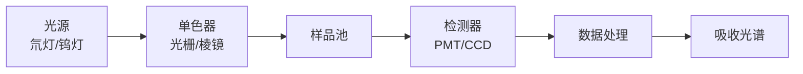
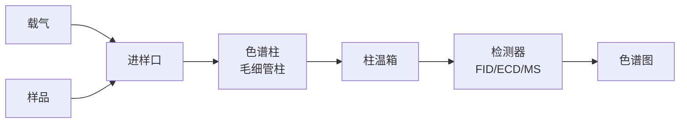

---
aliases:
  - 仪器分析
  - Instrumental Analysis
  - 光谱分析
  - 色谱分析
  - 质谱分析
  - 电化学分析
  - 波谱分析
tags:
  - chemistry/analytical-chemistry
  - instrumentation
  - spectroscopy
  - chromatography
  - mass-spectrometry
  - electrochemistry
  - spectrochemical-analysis
---

# 仪器分析 (Instrumental Analysis)

仪器分析是利用精密仪器测量物质的物理或化学性质，实现定性（qualitative）和定量（quantitative）分析的学科分支。与经典化学分析相比，仪器分析具有灵敏度高、选择性好、分析速度快、可自动化等显著优势。

## 光谱分析 (Spectroscopy)

光谱分析基于物质与电磁辐射的相互作用，包括吸收、发射、散射和荧光等现象。

### 电磁波谱与分子跃迁

| 波谱区域 | 波长范围 | 跃迁类型 | 获取信息 |
|----------|----------|----------|----------|
| γ 射线 | < 0.1 Å | 核跃迁 | 核结构 |
| X 射线 | 0.1–100 Å | 内层电子跃迁 | 元素组成、晶体结构 |
| 紫外-可见 (UV-Vis) | 200–800 nm | 价电子跃迁 ($\pi \rightarrow \pi^*$, $n \rightarrow \pi^*$) | 共轭体系、浓度 |
| 红外 (IR) | 2.5–25 μm | 分子振动 (伸缩、弯曲) | 官能团鉴定 |
| 微波 | 0.1–100 cm | 分子转动 | 转动常数、键长 |
| 射频 (NMR) | 1–100 m | 核自旋翻转 | 分子结构、动态 |

### 紫外-可见分光光度法 (UV-Vis Spectrophotometry)

基于 Lambert-Beer 定律（Beer-Lambert law）：

$$
A = \log\frac{I_0}{I} = \varepsilon \cdot b \cdot c
$$

其中 $A$ 为吸光度（absorbance），$\varepsilon$ 为摩尔吸光系数（molar absorptivity, L·mol⁻¹·cm⁻¹），$b$ 为光程（cm），$c$ 为浓度（mol/L）。

#### UV-Vis 仪器结构

### 红外光谱 (Infrared Spectroscopy, IR)

分子振动频率由 Hooke 定律近似：

$$
\bar{\nu} = \frac{1}{2\pi c} \sqrt{\frac{k}{\mu}}
$$

其中 $k$ 为力常数（force constant），$\mu$ 为折合质量（reduced mass）：

$$
\mu = \frac{m_1 m_2}{m_1 + m_2}
$$

特征官能团吸收区（4000–1300 cm⁻¹）和指纹区（1300–400 cm⁻¹）提供结构信息。

### 核磁共振波谱 (NMR Spectroscopy)

核自旋在静磁场 $B_0$ 中的 Larmor 进动频率：

$$
\nu = \frac{\gamma B_0}{2\pi}
$$

化学位移（chemical shift, $\delta$）反映核的电子环境：

$$
\delta = \frac{\nu_{sample} - \nu_{ref}}{\nu_{ref}} \times 10^6
$$

$^1$H NMR 提供氢原子数目、化学环境和邻接关系等信息；$^{13}$C NMR 提供碳骨架信息。

## 色谱分析 (Chromatography)

色谱法利用样品组分在固定相（stationary phase）和流动相（mobile phase）间分配系数的差异实现分离。

### 色谱分离原理

保留因子（retention factor, $k'$）和分离度（resolution, $R_s$）：

$$
k' = \frac{t_R - t_M}{t_M}
$$

$$
R_s = \frac{2(t_{R2} - t_{R1})}{W_1 + W_2} = \frac{\sqrt{N}}{4} \cdot \frac{\alpha - 1}{\alpha} \cdot \frac{k'_2}{1 + k'_2}
$$

其中 $N$ 为理论塔板数（theoretical plate number），$\alpha$ 为选择性因子。

### 色谱类型对比

| 色谱类型 | 固定相 | 流动相 | 适用对象 |
|----------|--------|--------|----------|
| 气相色谱 (GC) | 液体/固体涂渍 | 载气 (He, N₂) | 挥发性热稳定样品 |
| 高效液相色谱 (HPLC) | C18/SiO₂ 微粒 | 有机溶剂/缓冲液 | 非挥发性/热不稳定样品 |
| 离子色谱 (IC) | 离子交换树脂 | 电解质溶液 | 阴阳离子 |
| 薄层色谱 (TLC) | 硅胶/氧化铝薄层 | 有机溶剂 | 快速分离鉴定 |
| 尺寸排阻色谱 (SEC) | 多孔凝胶 | 缓冲液 | 高分子/蛋白质 |

### 气相色谱示意图

## 质谱分析 (Mass Spectrometry, MS)

质谱测量气态离子的质荷比（mass-to-charge ratio, $m/z$），提供分子量和结构信息。

### 离子源技术

| 离子源 | 电离方式 | 应用 |
|--------|----------|------|
| 电子轰击 (EI) | 70 eV 电子束 | 挥发性小分子 |
| 电喷雾 (ESI) | 电喷雾去溶剂化 | 蛋白质、多肽 |
| 基质辅助激光解吸 (MALDI) | 激光脉冲 | 生物大分子 |
| 化学电离 (CI) | 反应气电离 | 软电离，分子离子峰强 |

### 质量分析器

$$
m/z = \frac{B^2 r^2}{2V} \quad\text{(磁扇形)}
$$

$$
m/z = \frac{2V}{E^2 d^2} \cdot t^2 \quad\text{(飞行时间 TOF)}
$$

### 串联质谱 (MS/MS)

$$\text{前体离子} \xrightarrow{\text{CID/HCD}} \text{产物离子}_1 + \text{产物离子}_2 + \dots$$

## 电化学分析 (Electrochemical Methods)

电化学分析基于电化学池中电流、电位、电荷等电学量与待测物浓度之间的关系。

### 电位分析法 (Potentiometry)

Nernst 方程描述电极电位与离子活度关系：

$$
E = E^0 + \frac{RT}{nF} \ln a_i
$$

pH 玻璃电极、离子选择性电极（ion-selective electrode, ISE）是典型应用。

### 伏安法 (Voltammetry)

循环伏安法（cyclic voltammetry, CV）中峰值电流由 Randles-Sevcik 方程描述：

$$
i_p = 0.4463 \cdot nF A C \sqrt{\frac{nF v D}{RT}}
$$

其中 $v$ 为扫描速率，$D$ 为扩散系数，$A$ 为电极面积。

## 专业名词对照表

| 中文 | English | 缩写 |
|------|---------|------|
| 检出限 | Limit of Detection | LOD |
| 定量限 | Limit of Quantitation | LOQ |
| 信噪比 | Signal-to-Noise Ratio | S/N |
| 分辨率 | Resolution | R |
| 灵敏度 | Sensitivity | — |
| 选择性 | Selectivity | — |
| 线性范围 | Linear Range | — |
| 质谱图 | Mass Spectrum | MS |

## 参考与延伸阅读

- Skoog, D. A. et al. *Principles of Instrumental Analysis*. 7th ed., Cengage.
- Harris, D. C. *Quantitative Chemical Analysis*. 10th ed., W. H. Freeman.
- Willard, H. H. et al. *Instrumental Methods of Analysis*. 7th ed., Wadsworth.
- Gross, J. H. *Mass Spectrometry: A Textbook*. 3rd ed., Springer.
