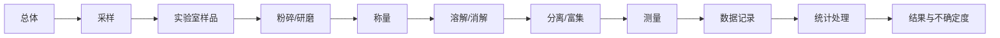

---
aliases:
  - 定量分析基础
  - 定量化学分析
  - Fundamentals of Quantitative Analysis
  - 重量分析
  - 容量分析
  - 校准方法
  - 误差分析
tags:
  - chemistry/analytical-chemistry
  - quantitative-analysis
  - gravimetric-analysis
  - volumetric-analysis
  - calibration
  - error-analysis
  - statistics
---

# 定量分析基础 (Fundamentals of Quantitative Analysis)

定量分析（quantitative analysis）是确定物质中特定组分含量（含量浓度或质量分数）的分析方法体系。定量分析的结果质量取决于采样（sampling）、样品制备（sample preparation）、测量和数据处理各个阶段的控制水平。

## 分析流程 (Analytical Process)

定量分析的完整流程包括：

$$\text{采样} \longrightarrow \text{样品制备} \longrightarrow \text{测量} \longrightarrow \text{数据处理} \longrightarrow \text{结果报告}$$

## 误差与数据处理 (Error and Data Processing)

### 误差分类

| 误差类型 | 来源 | 特征 | 处理方法 |
|----------|------|------|----------|
| 系统误差 (Systematic) | 仪器、方法、操作 | 单向偏差、可再现 | 校准、空白试验、标准参照 |
| 随机误差 (Random) | 不可控波动 | 正态分布、不可消除 | 统计处理、增加测量次数 |
| 过失误差 (Gross) | 操作失误 | 异常值 | 舍弃（Q 检验、Grubbs 检验） |

### 准确性度量

准确度（accuracy）反映测量值与真值的接近程度，用误差（error, $E$）或回收率（recovery, $R$）衡量：

$$
E = x - \mu
$$

$$
R = \frac{x}{x_{certified}} \times 100\%
$$

精密度（precision）反映平行测量值的离散程度，用标准偏差（standard deviation, $s$）和相对标准偏差（relative standard deviation, RSD）表示：

$$
s = \sqrt{\frac{\sum_{i=1}^n (x_i - \bar{x})^2}{n - 1}}
$$

$$
\text{RSD} = \frac{s}{\bar{x}} \times 100\%
$$

### 不确定度传播

测量结果 $y = f(x_1, x_2, \dots, x_n)$ 的合成标准不确定度 $u_c(y)$：

$$
u_c(y) = \sqrt{\sum_{i=1}^n \left( \frac{\partial f}{\partial x_i} \right)^2 u^2(x_i)}
$$

## 重量分析法 (Gravimetric Analysis)

重量分析通过称量待测组分的质量来计算含量，是最经典的定量方法之一。

### 沉淀重量法

1. 加入沉淀剂（precipitant）形成难溶沉淀
2. 过滤、洗涤、干燥或灼烧
3. 称量恒重

换算因数（gravimetric factor, $F$）：

$$
F = \frac{a \cdot M_{analyte}}{b \cdot M_{weighing}}
$$

含量计算：

$$
w = \frac{m_{ppt} \cdot F}{m_{sample}} \times 100\%
$$

### 沉淀条件优化

| 条件 | 目的 | 措施 |
|------|------|------|
| 低相对过饱和度 | 获得大晶粒沉淀 | 稀溶液、慢加沉淀剂、搅拌 |
| 适当温度 | 减少吸附杂质 | 热溶液沉淀、热水洗涤 |
| pH 控制 | 防止共沉淀 | 缓冲溶液维持 pH |
| 陈化 (Digestion) | 纯化晶体 | 长时间放置或微热 |

### 沉淀形式与称量形式

$$
\text{Ca}^{2+} \xrightarrow{\text{草酸盐}} \text{CaC}_2\text{O}_4 \cdot \text{H}_2\text{O} \xrightarrow{\text{灼烧}} \text{CaO} \text{ (称量形式)}
$$

## 容量分析法 (Volumetric Analysis)

容量分析通过标准溶液（standard solution）与被测物的定量反应，根据消耗的体积计算含量。

### 滴定分析基本公式

$$
n_A = \frac{a}{b} \cdot n_B
$$

$$
c_A \cdot V_A = \frac{a}{b} \cdot c_B \cdot V_B
$$

其中 $a$ 和 $b$ 为反应计量系数。

### 滴定类型

| 滴定类型 | 反应原理 | 指示剂示例 | 应用 |
|----------|----------|-----------|------|
| 酸碱滴定 (Acid-Base) | H⁺ + OH⁻ → H₂O | 酚酞、甲基橙 | 酸/碱含量 |
| 氧化还原滴定 (Redox) | 电子转移 | 淀粉（碘量法） | Fe²⁺, C₂O₄²⁻ |
| 配位滴定 (Complexometric) | 金属-EDTA 络合 | 铬黑 T、钙指示剂 | 金属离子 |
| 沉淀滴定 (Precipitimetry) | 沉淀反应 | K₂CrO₄ (Mohr 法) | Cl⁻, Br⁻, I⁻ |

### 标准溶液制备

直接法：基准物质（primary standard）直接溶解定容。
间接法：先配制近似浓度，再用基准物质标定（standardization）。

基准物质要求：高纯度、稳定、摩尔质量大、无结晶水风化潮解。

## 校准方法 (Calibration Methods)

### 外标法 (External Standard Method)

标准曲线（calibration curve）的线性回归方程：

$$
y = a + bx
$$

回归系数由最小二乘法（least squares）确定：

$$
b = \frac{\sum(x_i - \bar{x})(y_i - \bar{y})}{\sum(x_i - \bar{x})^2}, \quad a = \bar{y} - b\bar{x}
$$

相关系数 $r$ 衡量线性相关性：

$$
r = \frac{\sum(x_i - \bar{x})(y_i - \bar{y})}{\sqrt{\sum(x_i - \bar{x})^2 \sum(y_i - \bar{y})^2}}
$$

### 内标法 (Internal Standard Method)

加入内标物（internal standard）校正进样量和仪器波动：

$$
\frac{A_i}{A_{IS}} = k \cdot \frac{c_i}{c_{IS}}
$$

### 标准加入法 (Standard Addition Method)

适用于基体效应（matrix effect）显著的样品：

$$
\frac{A_x}{A_{x+s}} = \frac{c_x}{c_x + c_s}
$$

多步标准加入法采用线性外推求截距，得到 $c_x$。

## 有效数字与修约 (Significant Figures)

### 有效数字规则

| 操作 | 规则 | 示例 |
|------|------|------|
| 加减法 | 结果保留到小数点位数最少的数 | 12.11 + 1.0 = 13.1 |
| 乘除法 | 结果有效数字位数与最少的相同 | 3.14 × 2.5 = 7.9 |
| 对数 | 小数点后位数 = 真数有效数字位数 | log(4.5 × 10²) = 2.65 |

## 专业名词对照表

| 中文 | English | 缩写 |
|------|---------|------|
| 基准物质 | Primary Standard | — |
| 标准溶液 | Standard Solution | — |
| 滴定终点 | Titration End Point | EP |
| 化学计量点 | Equivalence Point | SP |
| 空白试验 | Blank Test | — |
| 平行测定 | Replicate Determination | — |
| 加标回收 | Spiked Recovery | — |
| 标准不确定度 | Standard Uncertainty | u |

## 参考与延伸阅读

- Harris, D. C. *Quantitative Chemical Analysis*. 10th ed., W. H. Freeman.
- Skoog, D. A. et al. *Fundamentals of Analytical Chemistry*. 9th ed., Cengage.
- Miller, J. N. & Miller, J. C. *Statistics and Chemometrics for Analytical Chemistry*. 6th ed., Pearson.
- IUPAC. Compendium of Analytical Nomenclature (Orange Book).
