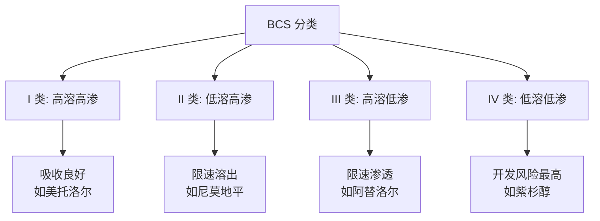
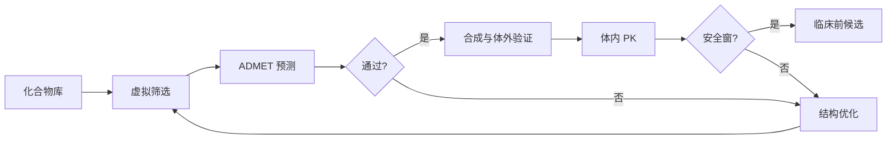

---
aliases:
  - ADMET
  - ADMETox
  - ADME/T
  - 药代动力学
  - 毒理学预测
  - Absorption Distribution Metabolism Excretion Toxicity
tags:
created: 2026-05-17
updated: 2026-05-17
  - chemistry/biochemistry
  - drug-discovery
  - pharmacokinetics
  - toxicology
  - computational-chemistry
  - ADMET
  - DMPK
---

# ADMET/毒理学 (ADMETox)

ADMET（吸收 Absorption、分布 Distribution、代谢 Metabolism、排泄 Excretion、毒性 Toxicity）是药物发现与开发中评估候选化合物成药性（drug-likeness）的核心参数体系。ADMETox（亦称 ADME/T）将药代动力学（pharmacokinetics, PK）与毒理学（toxicology）整合为可计算（computable）的分子属性，是现代计算机辅助药物设计（CADD）不可或缺的组成部分。

## 吸收 (Absorption)

吸收描述药物从给药部位进入体循环（systemic circulation）的过程与程度，直接影响生物利用度（bioavailability）。

### 口服吸收与 Lipinski 规则

口服给药（oral administration）是最常见的给药途径。Lipinski 五规则（Rule of Five, Ro5）是评估口服生物利用度（oral bioavailability）的经验准则：

| 参数 | 阈值 | 说明 |
|------|------|------|
| 分子量 (MW) | ≤ 500 Da | 过大分子难以透过生物膜 |
| 脂水分配系数 (logP) | ≤ 5 | 过高脂溶性导致溶解度差 |
| 氢键供体 (HBD) | ≤ 5 | 过多极性基团降低透膜性 |
| 氢键受体 (HBA) | ≤ 10 | 与 HBD 共同限制渗透 |

Caco-2 细胞模型和 PAMPA（平行人工膜渗透性测定）是评估肠吸收的常用体外方法。

### 生物药剂学分类系统 (BCS)

BCS（Biopharmaceutics Classification System）将药物按溶解度和渗透性分为四类：

## 分布 (Distribution)

分布描述药物从体循环进入各组织器官的过程。

### 表观分布容积 (Vd)

表观分布容积（apparent volume of distribution, $V_d$）将体内药量 $A$ 与血浆浓度 $C_p$ 关联：

$$
V_d = \frac{A}{C_p}
$$

$V_d$ 值反映药物在组织中的分布程度。$V_d > 0.7\ \mathrm{L/kg}$ 提示药物广泛分布于组织；$V_d < 0.1\ \mathrm{L/kg}$ 则提示药物主要滞留于血浆。

### 血浆蛋白结合 (PPB)

药物与血浆蛋白（主要是白蛋白 albumin 和 α₁-酸性糖蛋白 AAG）的结合程度影响游离药物浓度：

$$
f_u = \frac{C_{free}}{C_{total}} = \frac{1}{1 + K_a \cdot [P]}
$$

其中 $f_u$ 为游离分数（fraction unbound），$K_a$ 为结合常数，$[P]$ 为蛋白浓度。高蛋白结合（> 99%）的药物易发生相互作用（drug-drug interaction, DDI）。

## 代谢 (Metabolism)

代谢是药物被酶系统化学转化的过程，主要发生在肝脏，分为 I 相和 II 相反应。

### I 相与 II 相代谢

| 代谢相 | 主要反应 | 关键酶 | 作用 |
|--------|----------|--------|------|
| I 相 (Phase I) | 氧化、还原、水解 | CYP450 家族 | 引入或暴露极性基团 |
| II 相 (Phase II) | 葡萄糖醛酸化、硫酸化、乙酰化 | UGT、SULT、NAT | 结合极性分子，促进排泄 |

CYP450 酶系中 CYP3A4 代谢约 50% 的临床用药。CYP2D6、CYP2C9 和 CYP2C19 也参与大量药物代谢。

### 代谢稳定性与清除率

内在清除率（intrinsic clearance, $CL_{int}$）由 Michaelis-Menten 动力学描述：

$$
CL_{int} = \frac{V_{max}}{K_m}
$$

肝清除率（hepatic clearance, $CL_H$）由 well-stirred 模型给出：

$$
CL_H = \frac{Q_H \cdot f_u \cdot CL_{int}}{Q_H + f_u \cdot CL_{int}}
$$

其中 $Q_H$ 为肝血流量（~ 1.5 L/min）。代谢稳定性可通过肝微粒体（liver microsome）或肝细胞（hepatocyte）实验评估。

## 排泄 (Excretion)

排泄是药物从体内移除的最终过程，决定了药物的暴露时长和给药频率。

### 主要排泄途径

- **肾脏排泄 (renal excretion)**：肾小球滤过（glomerular filtration）和肾小管分泌（tubular secretion）
- **胆汁排泄 (biliary excretion)**：经胆汁进入肠道，部分可发生肠肝循环（enterohepatic circulation）
- **肺排泄 (pulmonary excretion)**：挥发性药物通过呼出气排出

肾清除率 $CL_R$ 表达式：

$$
CL_R = f_u \cdot GFR + \frac{CL_{sec}}{1 + f_u \cdot \frac{GFR}{Q_R}}
$$

其中 $GFR$ 为肾小球滤过率（~ 120 mL/min），$CL_{sec}$ 为分泌清除率，$Q_R$ 为肾血流量。

## 毒性 (Toxicity)

毒性预测是 ADMETox 中最具挑战性的环节，涉及多种体内外试验系统。

### 毒性类型与预测端点

$$
\begin{aligned}
&\text{Ames 试验} \rightarrow \text{遗传毒性 (genotoxicity)} \\
&\text{hERG 抑制} \rightarrow \text{心脏毒性 (cardiotoxicity)} \\
&\text{肝细胞毒性} \rightarrow \text{肝毒性 (hepatotoxicity)} \\
&\text{皮肤致敏} \rightarrow \text{免疫毒性 (immunotoxicity)}
\end{aligned}
$$

### hERG 毒性预测

hERG 钾通道抑制是药物心脏毒性的主要机制，导致 QT 间期延长。分子中疏水性芳香环和碱性氮原子是常见的 hERG 结合特征：

$$
pIC_{50}^{hERG} = 0.6 \cdot \log P + 0.3 \cdot \text{(pKa)} - 0.2 \cdot \text{(PSA)} + \text{const}
$$

### 计算机毒性预测 (in silico tox)

| 方法 | 原理 | 代表软件 |
|------|------|----------|
| QSAR/QSTR | 定量构效关系建模 | DEREK Nexus, Sarah Nexus |
| 专家系统 (Expert Systems) | 基于规则库推理 | DEREK Nexus, Toxtree |
| 机器/深度学习 (ML/DL) | 神经网络、随机森林 | DeepTox, admetSAR |
| 结构警报 (Structural Alerts) | 识别毒性子结构 | ToxAlerts, SureChEMBL |

## ADMET 预测的工作流程

$$\text{化合物结构} \xrightarrow{\text{descriptor calculation}} \text{分子描述符} \xrightarrow{\text{ML model}} \text{属性预测} \xrightarrow{\text{consensus scoring}} \text{综合评估}$$

### 多任务学习模型

现代 ADMET 预测采用多任务神经网络（multi-task neural network），同时预测多个端点：

$$
\hat{y}_i^{(j)} = \sigma\left( \sum_k w_{ik}^{(j)} \cdot h_k(\mathbf{x}) + b_i^{(j)} \right)
$$

其中 $\mathbf{x}$ 为输入分子指纹（molecular fingerprint），$h_k$ 为隐藏层表示，$\sigma$ 为 sigmoid 激活函数。

## 成药性评价的综合框架

Lipinski 规则和 Veber 规则提供了快速过滤的口诀：MW ≤ 500, logP ≤ 5, HBD ≤ 5, HBA ≤ 10, 可旋转键 ≤ 10, 极性表面积 (PSA) ≤ 140 Ų。

## 专业名词对照表

| 中文 | English | 缩写 |
|------|---------|------|
| 药代动力学 | Pharmacokinetics | PK |
| 药效动力学 | Pharmacodynamics | PD |
| 治疗窗 | Therapeutic Window | TW |
| 半数致死量 | Median Lethal Dose | LD₅₀ |
| 半数有效量 | Median Effective Dose | ED₅₀ |
| 生物利用度 | Bioavailability | F |
| 清除半衰期 | Elimination Half-life | t₁/₂ |
| 药时曲线下面积 | Area Under the Curve | AUC |

## 参考与延伸阅读

- Lipinski, C. A. et al. (1997). *Advanced Drug Delivery Reviews*, 23, 3–25.
- Gleeson, M. P. (2008). *Journal of Medicinal Chemistry*, 51, 817–834.
- Cheng, F. et al. (2012). *Journal of Chemical Information and Modeling*, 52, 3099–3105.
- Veber, D. F. et al. (2002). *Journal of Medicinal Chemistry*, 45, 2615–2623.
- Mayr, A. et al. (2016). *Frontiers in Environmental Science*, 4, 2.
