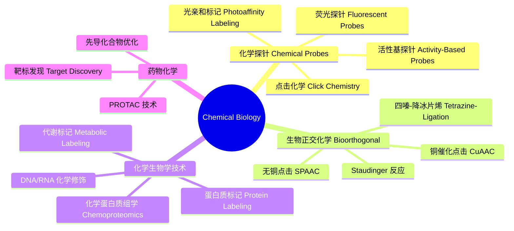
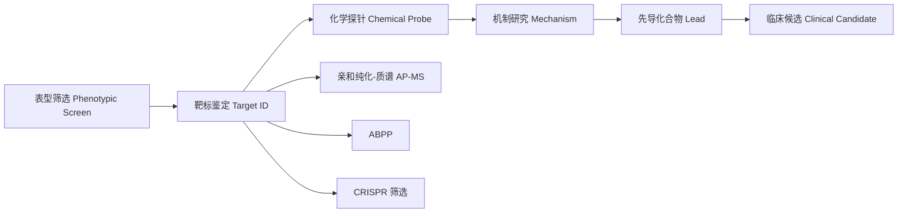

---
aliases: [ChemicalBiology, ChemicalProbes, Bioorthogonal]
tags: ['Chemistry/ChemicalBiology', 'Interdisciplinary', 'Biochemistry']
---

# ChemicalBiology

## 概述 (Overview)

化学生物学 (Chemical Biology) 是利用化学工具和原理来研究和操控生物系统的交叉学科。与传统的生物化学侧重于研究生物分子结构不同，化学生物学更强调通过化学合成的小分子探针来扰动生物系统，从而揭示生命过程的分子机制。这个领域融合了有机化学、分析化学、细胞生物学和分子生物学的方法论。

## 核心方法体系

## 化学探针 (Chemical Probes)

化学探针是化学生物学研究的核心工具。一个理想的化学探针应具有高亲和力 ($K_d < 100\;\text{nM}$) 和高选择性。

### 亲和常数测定

$$K_d = \frac{[P][L]}{[PL]}$$

$$P + L \rightleftharpoons PL$$

### 荧光探针设计

荧光团 (Fluorophore) 的量子产率 (Quantum Yield)：

$$\Phi = \frac{\text{发射光子数}}{\text{吸收光子数}}$$

常见荧光团包括 GFP 衍生物、香豆素 (Coumarin)、荧光素 (Fluorescein)、罗丹明 (Rhodamine)、BODIPY、Cy3/Cy5 等。

### 活性基探针 (Activity-Based Probes, ABPs)

ABPs 通过共价结合到酶的活性位点，实现对特定酶家族的标记和检测。典型结构包含：
- 反应基团 (Warhead)：与靶酶活性位点共价结合
- 连接臂 (Linker)：提供柔性和空间
- 报告基团 (Tag)：如荧光团、生物素

## 生物正交化学 (Bioorthogonal Chemistry)

生物正交反应是在活体细胞或生物体内进行而不干扰天然生化过程的化学反应。

### 施陶丁格连接 (Staudinger Ligation)

偶氮化物 (Azide) 与膦 (Phosphine) 反应生成酰胺键：

$$\text{R-N}_3 + \text{Ar}_3\text{P-CH}_2\text{R}' \rightarrow \text{R-NH-C(=O)-R}' + \text{Ar}_3\text{PO}$$

### 点击化学 (Click Chemistry)

铜催化叠氮-炔基环加成 (CuAAC)：

$$\text{R-N}_3 + \text{R}'\equiv\text{CH} \xrightarrow{\text{Cu(I)}} 1,4\text{-三氮唑}$$

无铜点击反应 (SPAAC) 使用环炔烃（如 DBCO、BCN），适用于活细胞标记。

### 四嗪连接 (Tetrazine Ligation)

$$\text{Tetrazine} + \text{Trans-cyclooctene (TCO)} \rightarrow \text{吡唑啉} + \text{N}_2$$

该反应具有极快的速率常数 $k \sim 10^4\;\text{M}^{-1}\text{s}^{-1}$，是目前最快的生物正交反应之一。

## 化学蛋白质组学 (Chemoproteomics)

化学蛋白质组学利用化学探针在全蛋白质组水平上研究蛋白质功能。

### ABPP (Activity-Based Protein Profiling)

ABPP 利用 ABPs 在高通量平台中分析酶活性。定量 ABPP 可使用同位素标签 (ICAT, TMT) 或荧光标签。

### 亲和纯化-质谱联用 (AP-MS)

小分子-蛋白质相互作用的鉴定流程：
1. 固定化小分子探针
2. 细胞裂解液孵育
3. 洗脱结合蛋白
4. 质谱鉴定 (LC-MS/MS)

## 化学遗传学 (Chemical Genetics)

化学遗传学使用小分子来调控特定蛋白质功能：
- **正向化学生物学 (Forward Chemical Genetics)**：通过表型筛选发现活性分子，再鉴定靶标
- **反向化学生物学 (Reverse Chemical Genetics)**：针对已知靶标筛选化合物，再研究表型效应

### 邻近标记技术 (Proximity Labeling)

APEX 和 BioID 技术利用工程化酶对邻近蛋白质进行共价标记：

$$\text{Biotin-phenol} \xrightarrow{\text{APEX/H}_2\text{O}_2} \text{Biotin-radical} \xrightarrow{\text{标记邻近蛋白}}$$

## PROTAC 技术

PROTACs (Proteolysis-Targeting Chimeras) 是通过泛素-蛋白酶体系统诱导靶蛋白降解的双功能分子：

$$\text{Target-Ligand} - \text{Linker} - \text{E3-Ligand}$$

PROTAC 的催化机制使其能够以亚化学计量实现靶蛋白降解。与传统抑制剂不同，PROTAC 不需要长期占据靶蛋白活性位点，因而可以靶向以前难以成药的靶点。

## 代谢标记 (Metabolic Labeling)

使用含官能团的氨基酸或糖类似物进行代谢整合，再利用生物正交反应连接报告基团：
- 非天然氨基酸掺入：叠氮高丙氨酸 (AHA) 标记新合成蛋白质
- 糖代谢标记：叠氮乙酰甘露糖胺 (Ac₄ManNAz) 标记糖蛋白

## 化学生物学在药物发现中的应用

## 前沿方向 (Frontiers)

- **光化学生物学**：光笼 (Photocage)、光开关 (Photoswitch) 技术
- **相分离化学生物学**：小分子调控液-液相分离
- **RNA 化学生物学**：RNA 小分子探针、RNA 靶向药物
- **单细胞化学生物学**：单细胞水平的化学扰动与组学分析

## 化学探针的选择标准 (Selection Criteria)

理想的化学探针应满足以下标准：亲和力 ($K_d < 100$ nM)、选择性（对其他靶标 > 30 倍）、细胞渗透性（细胞活性实验可行）、稳定性（在实验条件下稳定至少数小时）、可逆性（或可控共价结合）、正交性（不干扰其他生物过程）。化学探针的验证需要：剂量响应曲线、靶标敲除/敲低验证、竞争实验（使用已知抑制剂）和脱靶分析（激酶谱筛选、蛋白质组学分析）。

## 化学蛋白质组学中的定量方法 (Quantitative Chemoproteomics)

SILAC (稳定同位素标记氨基酸培养) 在细胞培养中标记蛋白质。TMT (串联质量标签) 和 iTRAQ (同位素标记相对绝对定量) 使用等压标签进行多重定量。Label-free 定量基于肽段信号强度的直接比较。ABPP 中活性探针标记的定量使用荧光扫描或质谱方法。热蛋白质组分析 (TPP, Thermal Proteome Profiling) 通过蛋白质热稳定性变化鉴定药物靶标。

## 化学生物学中的主要期刊 (Major Journals)

《Nature Chemical Biology》、《Cell Chemical Biology》、《ACS Chemical Biology》、《ChemBioChem》、《Chemical Communications》、《Journal of the American Chemical Society》、《Angewandte Chemie International Edition》和《Analytical Chemistry》是该领域的重要期刊。中文期刊《中国科学：化学》和《化学学报》也发表化学生物学研究成果。

## 化学生物学中的化学蛋白组学应用 (Chemoproteomics Applications)

基于活性的蛋白组学分析 (ABPP) 使用活性导向探针标记酶家族。半胱氨酸组学 (Cysteinomics) 筛选共价配体。赖氨酸反应性分析鉴定配体结合位点。光亲和标记 (Photoaffinity Labeling, PAL) 使用二氮丙啶 (Diazirine) 或叠氮基团捕获瞬时相互作用。热蛋白质组分析 (TPP, Thermal Proteome Profiling) 通过热稳定性变化鉴定药物靶标。化学交联质谱 (Crosslinking-MS) 解析蛋白复合物结构。

## 化学生物学中的核酸化学 (Nucleic Acid Chemical Biology)

核酸化学生物学使用化学探针研究 DNA 和 RNA 的功能。转录组范围的 RNA 修饰图谱通过化学测序方法实现。CLIP-seq 使用 UV 交联鉴定 RNA 结合蛋白的靶标位点。RNA 小分子配体 (Riboswitch 类似物) 调控基因表达。CRISPR-Cas9 系统中化学修饰的 gRNA 提高编辑效率。适体 (Aptamer) 技术使用体外筛选获得特异性核酸配体。

## 化学生物学中的糖生物学 (Chemical Glycobiology)

糖化学生物学使用化学工具研究糖链的结构和功能。代谢糖工程 (Metabolic Glycoengineering) 将非天然糖掺入细胞表面糖缀合物。凝集素芯片 (Lectin Microarray) 高通量分析糖谱。点击化学标记的糖类似物用于糖链成像。糖蛋白组学 (Glycoproteomics) 分析蛋白质糖基化修饰位点和结构。糖链合成酶和糖苷酶的化学探针研究其催化机制。

## 化学生物学中的前沿技术 (Frontier Technologies)

- **邻近标记 (Proximity Labeling)**：APEX、TurboID 标记邻近蛋白组
- **单细胞化学生物学**：单细胞代谢组学、单细胞蛋白组学
- **时空化学**：光控化合物释放、笼锁探针 (Caged Probes)
- **液-液相分离化学**：小分子调控生物分子凝聚体
- **化学遗传学 (Chemical Genetics)**：小分子与条件突变体的组合使用

## 化学生物学中的光化学工具 (Photochemical Tools)

光笼 (Photocage) 技术使用光敏保护基团实现化合物的光控释放。光开关 (Photoswitch) 如偶氮苯 (Azobenzene) 在紫外和可见光照射下发生可逆构象变化。光亲和标记 (Photoaffinity Labeling) 使用紫外光激活二氮丙啶或芳基叠氮形成共价交联。光遗传学 (Optogenetics) 通道视紫红质 (Channelrhodopsin) 使光控制神经元活性成为可能。光动力疗法 (PDT) 使用光敏剂产生单线态氧 ($^1$O$_2$) 杀伤肿瘤细胞。

## 化学生物学中的相分离 (Phase Separation)

液-液相分离 (LLPS) 在细胞中形成无膜细胞器。小分子调控相分离是化学生物学的新前沿。1,6-己二醇 (1,6-Hexanediol) 溶解液液相分离凝聚体。双酚 A (BPA) 等环境化合物可能影响蛋白质相分离。化学生物学工具研究相分离中的分子间相互作用，包括 $\pi$-$\pi$ 堆叠、阳离子-$\pi$ 作用和静电相互作用。

## 化学生物学中的 PROTAC 技术 (PROTAC Technology)

PROTAC (Proteolysis Targeting Chimera) 是双功能分子，一端结合靶蛋白，另一端招募 E3 泛素连接酶，诱导靶蛋白泛素化和蛋白酶体降解。PROTAC 不同于传统抑制剂，它催化降解靶蛋白且不需要高亲和力配体。事件驱动 (Event-Driven) 药理学优势包括克服耐药性和作用时间延长。PROTAC 的三元复合物形成动力学是其活性的关键决定因素。

## 化学生物学中的表型筛选 (Phenotypic Screening)

表型筛选不预设靶标，直接观察细胞或生物体中的表型变化。与靶标筛选相比，表型筛选更容易发现新机制药物。化学生物学工具在表型筛选中起关键作用：荧光探针标记细胞过程、CRISPR 扰动验证靶标和 PROTAC 工具化合物研究蛋白功能。表型筛选的靶标去卷积 (Target Deconvolution) 是其主要挑战，常用方法包括亲和下拉、药物亲和响应靶标稳定性 (DARTS) 和热转变分析 (CETSA)。

## 化学生物学中的代谢组学 (Metabolomics)

代谢组学定量分析生物系统中的小分子代谢物。液相色谱-质谱联用 (LC-MS) 和气相色谱-质谱联用 (GC-MS) 是主要分析平台。靶向代谢组学定量预设代谢物列表，非靶向代谢组学全面扫描代谢物。同位素示踪代谢流分析 (Fluxomics) 追踪稳定同位素标记前体的代谢路径。代谢物鉴定是代谢组学的主要瓶颈，参考数据库如 HMDB 和 METLIN。

## 相关条目

- [[../../Biology/CellBiology/CellBiology|细胞生物学]]
- [[Biochemistry|生物化学]]
- [[MolecularDocking|分子对接]]

## 扩展阅读与参考资料 (Further Reading)

1. **核心教材**：Klymkowsky MW, Begley TP. Chemical Biology: Approaches to Drug Discovery and Development. 2020.
2. **综述文章**：Sletten EM, Bertozzi CR. Bioorthogonal chemistry: fishing for selectivity in a sea of functionality. Angew Chem Int Ed. 2009.
3. **专业参考**：Waldmann H, Janning P. Chemical Biology: A Practical Course. Wiley-VCH.
4. **研究前沿**：Nobeli I, Favia AD, Thornton JM. Protein promiscuity and its implications for biotechnology. Nat Biotechnol. 2009.
5. **化学探针**：Arrowsmith CH et al. The promise and peril of chemical probes. Nat Chem Biol. 2015.

## 参见 (See Also)

- 化学生物学中的有机合成策略和反应开发
- 生物正交化学在活体成像中的应用
- 化学蛋白质组学在药物靶标发现中的标准流程
