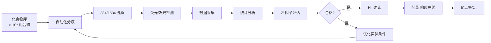
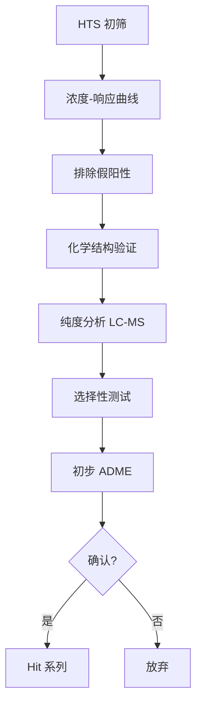
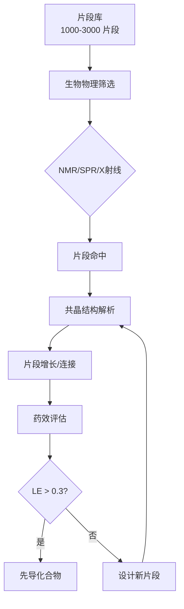
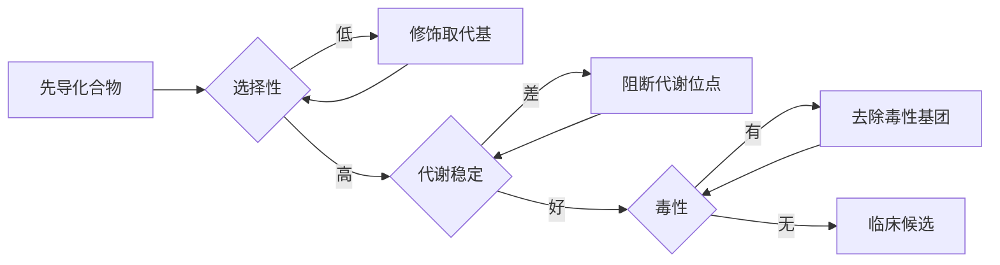

---
aliases:
  - 先导化合物发现
  - Lead Discovery
  - 先导物优化
  - Hit-to-Lead
  - HTS
  - 虚拟筛选
  - 基于片段的药物设计
  - Fragment-Based Drug Design
tags:
  - chemistry/biochemistry
  - drug-discovery
  - medicinal-chemistry
  - screening
  - FBDD
  - SBDD
  - CADD
  - high-throughput-screening
  - virtual-screening
---

# 先导化合物发现 (Lead Discovery)

先导化合物发现（lead discovery）是药物研发的起始阶段，目标是从海量化合物的中识别出具有生物活性（biological activity）和成药潜力（drug potential）的先导化合物（lead compound）。先导化合物经结构优化（lead optimization）后成为临床候选药物（clinical candidate）。

## 先导化合物的来源 (Sources of Lead Compounds)

先导化合物可来源于天然产物、合成化合物库、生物技术产物等多种渠道。

### 天然产物 (Natural Products)

天然产物具有高度化学多样性（chemical diversity）和独特的骨架结构：

| 来源 | 实例 | 靶点 | 适应症 |
|------|------|------|--------|
| 微生物发酵 | 青霉素 (penicillin) | 转肽酶 | 细菌感染 |
| 植物提取 | 紫杉醇 (paclitaxel) | 微管蛋白 | 癌症 |
| 海洋生物 | 曲贝替定 (trabectedin) | DNA 小沟结合 | 软组织肉瘤 |
| 动物毒素 | 卡托普利 (captopril) | ACE | 高血压 |

### 合成化合物库 (Synthetic Libraries)

DNA 编码化合物库（DNA-encoded libraries, DEL）和多样性导向合成（diversity-oriented synthesis, DOS）技术极大扩展了可筛选的化学空间（chemical space）。DEL 技术通过 DNA 标签编码每个化合物，允许在亲和筛选后通过 PCR 测序识别结合分子。

## 高通量筛选 (High-Throughput Screening, HTS)

HTS 利用自动化平台对数十万至数百万化合物进行快速活性测试，是制药工业的核心先导发现技术。

### HTS 流程

### 筛选质量指标

Z' 因子（Z'-factor）是衡量 HTS 实验质量的标准指标：

$$
Z' = 1 - \frac{3(\sigma_p + \sigma_n)}{|\mu_p - \mu_n|}
$$

其中 $\mu_p$ 和 $\mu_n$ 分别为阳性对照和阴性对照的均值，$\sigma_p$ 和 $\sigma_n$ 为标准差。$Z' > 0.5$ 表示实验质量良好，$Z' > 0.8$ 为极优。

### Hit 确认流程

初步筛选得到的命中化合物（hit）需经过以下确认步骤：

假阳性（false positive）的常见原因包括：荧光干扰、聚集效应（aggregation）、反应性共价结合和氧化还原活性。

## 虚拟筛选 (Virtual Screening, VS)

虚拟筛选通过计算化学方法对化合物库进行计算机模拟筛选，大幅降低实验成本和周期。

### 基于配体的虚拟筛选 (LBVS)

LBVS（ligand-based virtual screening）利用已知活性配体的结构信息，无需靶点三维结构：

| 方法 | 原理 | 适用范围 |
|------|------|----------|
| 分子相似性 (Molecular Similarity) | Tanimoto 系数比较分子指纹 | 快速相似性搜索 |
| 药效团模型 (Pharmacophore) | 关键化学特征的空间排列 | 识别不同骨架但相同药效特征 |
| QSAR 模型 | 定量构效关系回归 | 活性预测与排序 |
| 形状匹配 (Shape Matching) | ROCS 体积重叠 | 寻找相似形状分子 |

Tanimoto 系数（Tanimoto coefficient, $T_c$）衡量两个分子的相似度：

$$
T_c(A,B) = \frac{|A \cap B|}{|A \cup B|}
$$

其中 $A$ 和 $B$ 为分子的指纹位点集合（如 Morgan 指纹、MACCS 指纹）。

### 基于结构的虚拟筛选 (SBVS)

SBVS（structure-based virtual screening）利用靶蛋白的三维结构进行分子对接（molecular docking），评估配体与蛋白的结合自由能：

$$
\Delta G_{bind} = \Delta G_{vdW} + \Delta G_{elec} + \Delta G_{desolv} + \Delta G_{conf}
$$

分子对接评分函数（scoring function）评估配体-蛋白结合自由能 $\Delta G_{bind}$，用于排序候选化合物。评分函数分为三类：基于力场（force-field based）、基于经验（empirical）和基于知识（knowledge-based）。

## 基于片段的药物设计 (Fragment-Based Drug Design, FBDD)

FBDD 从低分子量（MW < 300 Da）的小分子片段（fragment）出发，通过结构生物学指导逐步增长（growing）或连接（linking）片段。

### 片段筛选方法

片段库通常仅有数千个化合物，但覆盖更大的化学空间效率：

$$
\text{Ligand Efficiency} = \frac{\Delta G}{N_{heavy}}
$$

$$
\text{Lipophilic Efficiency} = \frac{pIC_{50} - \log P}{N_{heavy}}
$$

其中 $N_{heavy}$ 为非氢重原子数。配体效率（ligand efficiency, LE）是 FBDD 中评估片段结合质量的核心指标。一般要求 LE > 0.3 kcal·mol⁻¹·atom⁻¹。

### 生化与生物物理筛选技术

| 技术 | 原理 | 灵敏度 | 通量 |
|------|------|--------|------|
| 表面等离子共振 (SPR) | 折射率变化 | nM | 中 |
| 核磁共振 (NMR) | 化学位移/NOE | μM–mM | 低 |
| X 射线晶体学 | 电子密度 | 高 mM | 低 |
| 差示扫描荧光 (DSF) | 热稳定性 Tm 位移 | μM–mM | 高 |
| 质谱 (MS) | 非变性 MS | μM | 中 |

### FBDD 的命中-to-先导 (Hit-to-Lead) 流程

## 基于结构的药物设计 (Structure-Based Drug Design, SBDD)

SBDD 利用靶点三维结构指导药物分子的理性设计，是现代药物化学的核心范式。

### 分子对接 (Molecular Docking)

对接算法在靶蛋白的结合位点（binding site）中搜索配体的最佳构象（conformation）和取向（orientation）。经典评分函数包含 Lennard-Jones 势和 Coulomb 静电势：

$$
\text{Score} = \sum_{i,j} \left( \frac{A_{ij}}{r_{ij}^{12}} - \frac{B_{ij}}{r_{ij}^{6}} + \frac{q_i q_j}{\epsilon r_{ij}} \right)
$$

常用对接软件包括 AutoDock Vina、Glide (Schrödinger)、GOLD (CCDC) 和 MOE (Chemical Computing Group)。

### 分子动力学 (Molecular Dynamics, MD)

MD 模拟用于评估对接结果的稳定性、计算结合自由能（MM-PBSA/GBSA）：

$$
\Delta G_{bind} = \langle G_{complex} \rangle - \langle G_{protein} \rangle - \langle G_{ligand} \rangle
$$

## 先导化合物优化 (Lead Optimization)

先导化合物优化旨在提高活性、选择性、药代性质和降低毒性。

## 专业名词对照表

| 中文 | English | 缩写 |
|------|---------|------|
| 先导化合物 | Lead Compound | — |
| 命中化合物 | Hit Compound | — |
| 高通量筛选 | High-Throughput Screening | HTS |
| 虚拟筛选 | Virtual Screening | VS |
| 分子对接 | Molecular Docking | — |
| 片段 | Fragment | — |
| 配体效率 | Ligand Efficiency | LE |
| 选择性指数 | Selectivity Index | SI |
| 构效关系 | Structure-Activity Relationship | SAR |
| 类药性 | Drug-likeness | — |
| 临床候选物 | Clinical Candidate | — |

## 参考与延伸阅读

- Hann, M. M. & Oprea, T. I. (2004). *Current Opinion in Chemical Biology*, 8, 255–263.
- Congreve, M. et al. (2003). *Drug Discovery Today*, 8, 876–877.
- Shoichet, B. K. (2004). *Nature*, 432, 862–865.
- Murray, C. W. & Rees, D. C. (2009). *Nature Chemistry*, 1, 187–192.
- Lipinski, C. A. & Hopkins, A. L. (2004). *Nature*, 432, 855–861.
- Erlanson, D. A. et al. (2016). *Nature Reviews Drug Discovery*, 15, 605–619.
