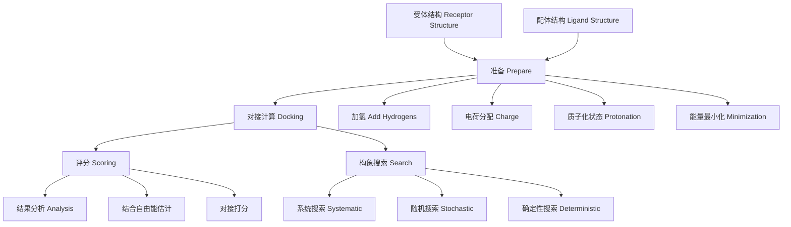

---
aliases: [MolecularDocking, VirtualScreening, ProteinLigandDocking]
tags: ['Chemistry/MolecularDocking', 'ComputationalChemistry', 'DrugDesign']
---

# MolecularDocking

## 概述 (Overview)

分子对接 (Molecular Docking) 是计算化学和药物设计中最重要的方法之一。它预测小分子（配体 Ligand）与生物大分子（受体 Receptor）的结合模式和结合亲和力。分子对接广泛用于虚拟筛选、先导优化和结合机制研究。

## 分子对接基本原理

## 理论基础 (Theoretical Basis)

分子对接的核心是锁钥模型 (Lock and Key) 和诱导契合 (Induced Fit) 理论的结合。结合自由能是判断配体-受体结合强度的关键指标：

$$\Delta G_{\text{bind}} = \Delta G_{\text{gas}} + \Delta G_{\text{solv}}$$

其中 $\Delta G_{\text{gas}}$ 是气相相互作用能，$\Delta G_{\text{solv}}$ 是溶剂化能变化。结合亲和力与结合自由能的关系：

$$K_d = e^{\Delta G_{\text{bind}}/RT}$$

$$\Delta G_{\text{bind}} = RT \ln K_d$$

## 搜索算法 (Search Algorithms)

### 系统搜索 (Systematic Search)

- **穷举搜索 (Exhaustive Search)**：旋转所有可旋转键，计算量大
- **片段生长 (Fragment Growth)**：将配体分为核心和片段，逐步对接

### 随机搜索 (Stochastic Search)

- **蒙特卡洛 (Monte Carlo, MC)**：随机扰动构象，接受准则由 Metropolis 标准决定
- **遗传算法 (Genetic Algorithm, GA)**：模拟进化过程，通过交叉和变异优化构象
- **粒子群优化 (Particle Swarm Optimization, PSO)**

### 确定性搜索 (Deterministic Search)

- **分子动力学 (Molecular Dynamics, MD)**：模拟体系的真实动力学轨迹
- **能量最小化 (Energy Minimization)**：沿能量梯度下降寻找局部极值

## 评分函数 (Scoring Functions)

### 力场基评分函数 (Force Field-Based)

基于分子力学的非键相互作用能：

$$\Delta G = \sum_{i}\sum_{j}\left[\frac{A_{ij}}{r_{ij}^{12}} - \frac{B_{ij}}{r_{ij}^6} + \frac{q_iq_j}{4\pi\varepsilon_0\varepsilon r_{ij}}\right]$$

### 经验评分函数 (Empirical Scoring)

$$\Delta G = \sum_k w_k f_k(\text{ligand},\text{receptor})$$

典型经验项包括：氢键、疏水接触、旋转熵损失、金属配位等。

### 知识基评分函数 (Knowledge-Based)

基于蛋白-配体复合物结构的统计势 (Potentials of Mean Force)：

$$\Delta G(r) = -k_B T \ln\left[\frac{\rho(r)}{\rho^*(r)}\right]$$

### 共识评分 (Consensus Scoring)

结合多个评分函数的结果提高预测可靠性。

## 常用分子对接软件

| 软件 | 算法 | 评分函数 | 特点 |
|------|------|----------|------|
| AutoDock Vina | 遗传算法 | 经验评分 | 开源、快速 |
| Glide (Schrödinger) | 系统搜索 | GlideScore | 高精度 |
| GOLD | 遗传算法 | GoldScore, ChemScore | 柔性对接 |
| Dock (UCSF) | 片段生长 | 力场评分 | 大库筛选 |
| MOE-Dock | 模拟退火 | 多种评分 | 集成环境 |
| rDock | GA + MC | 经验评分 | 开源 |
| HADDOCK | 刚体/柔性 | 经验评分 | 数据驱动 |

## 对接流程 (Docking Protocol)

### 受体准备 (Protein Preparation)

1. 提取配体和结晶水、辅因子
2. 加氢、调整氨基酸质子化状态（pH 依赖）
3. 分配原子电荷（AMBER-BCC, Gasteiger, MMFF94）
4. 能量最小化以消除位阻冲突

### 配体准备 (Ligand Preparation)

1. 生成 3D 构象
2. 枚举互变异构体和质子化状态
3. 分配正确的立体化学
4. 确定可旋转键

### 结合位点定义 (Binding Site Definition)

对接盒 (Docking Box/Grid) 定义配体采样的空间范围：

$$\text{Grid Center} = \frac{1}{N}\sum_{i=1}^N \vec{r}_i(\text{参考配体或关键残基})$$

$$\text{Box Size} \geq (2 \times \text{配体最长维度} + 4\;\text{Å})$$

## 结合模式分析 (Binding Mode Analysis)

对接结果通常生成多个构象，通过聚类分析 (Clustering) 识别最可能的结合模式。RMSD (Root Mean Square Deviation) 评估构象相似性：

$$\text{RMSD} = \sqrt{\frac{1}{N}\sum_{i=1}^N \left(\vec{r}_i - \vec{r}_i^{\text{ref}}\right)^2}$$

## 诱导契合对接 (Induced Fit Docking)

传统刚性对接忽略受体构象变化。诱导契合对接（如 IFD, Schrödinger）允许受体侧链和骨架在对接过程中发生构象变化。

## 对接精度评估 (Docking Validation)

### 对接重现性 (Redocking)

将已知晶体结构的配体从结合位点取出后重新对接，计算 RMSD 评价精度：
- RMSD $< 2\;\text{Å}$：成功对接
- RMSD $< 1\;\text{Å}$：高精度对接

### 交叉对接 (Cross-Docking)

使用不同晶体结构的受体构象进行对接，评估受体柔性的影响。

### ROC 与 AUC

受试者工作特征曲线 (ROC) 和曲线下面积 (AUC) 用于评价虚拟筛选中对活性分子和非活性分子的区分能力。

## 分子对接的局限性与前沿

| 局限性 | 当前进展 |
|--------|----------|
| 评分函数精度不足 | 机器学习评分函数 (NNScore, RF-Score) |
| 受体柔性处理有限 | 增强采样 MD、合取对接 |
| 溶剂效应近似 | 显式溶剂模型 (3D-RISM) |
| 熵效应估计困难 | 结合自由能微扰 (FEP+) |
| 靶蛋白动力学忽视 | 集合对接 (Ensemble Docking) |

## 反向对接 (Reverse Docking)

反向对接是将小分子对接到一个蛋白质数据库（如 PDB 中的所有蛋白）中，寻找可能的药物靶标。用于：药物作用机制研究（已知活性化合物的靶标鉴定）、老药新用 (Drug Repurposing)、毒理学预测（预测脱靶效应）。常用软件：INVDOCK, TarFisDock, PharmMapper。挑战在于计算量大和评分函数的准确度问题。

## 共价对接 (Covalent Docking)

共价抑制剂与靶蛋白形成共价键。共价对接需要处理反应性基团 (Warhead) 与靶标亲核残基（Cys, Ser, Lys, Thr）之间的键形成。常用软件：CovalentDock, AutoDock (扩展模式), GOLD (Covalent), Schrödinger CovDock。优化策略包括：使用约束距离、设置反应类型模板、适当处理原子类型和电荷。共价对接在靶向共价抑制剂 (TCI) 的开发中尤为重要。

## 对接结果的可视化 (Visualization)

可视化工具帮助分析对接结果：PyMOL（分子结构显示和相互作用分析）、Discovery Studio（综合分子建模环境）、Chimera（免费分子可视化）、VMD（适合大分子体系）、LigPlus（二维相互作用图生成）、MOE（综合计算化学环境）。相互作用类型包括氢键、疏水接触、$\pi$-$\pi$ 堆积、静电作用、卤键和金属配位。结合模式聚类 (RMSD 聚类) 筛选代表性构象。

## 分子对接中的评分函数开发 (Scoring Function Development)

评分函数是分子对接准确性的核心。基于力场的评分函数源自分子力学的势能函数。基于经验的评分函数拟合实验结合数据。基于知识的评分函数使用统计势 (Potentials of Mean Force) 从蛋白-配体复合物结构数据库提取。机器学习评分函数使用随机森林、深度神经网络等方法：

$$\Delta G_{\text{ML}} = f_{\text{NN}}(\mathbf{d}, \mathbf{f}, \mathbf{p})$$

一致性评分 (Consensus Scoring) 结合多个评分函数提高命中率。相对结合自由能预测 (RBFE) 使用自由能微扰 (FEP) 或热力学积分 (TI) 精确计算。

## 分子对接中的柔性处理 (Flexibility Treatment)

配体柔性通过构象搜索实现：系统搜索遍历所有可旋转键的组合；随机搜索使用蒙特卡洛或遗传算法；模拟退火从高温逐渐降温寻找低能构象。蛋白质柔性通过以下方法处理：软对接 (Soft Docking) 减少范德华排斥项；诱导契合对接 (Induced Fit Docking) 允许侧链和主链重排；集合对接 (Ensemble Docking) 使用蛋白质的多个构象进行对接。

## 分子对接中的水分子处理 (Water Molecule Treatment)

水分子在蛋白-配体相互作用中起桥梁作用。合水对接 (Conserved Water Docking) 保留保守水分子参与对接打分。WaterMap 使用分子动力学模拟预测水分子热力学性质。水合位点分析 (Hydration Site Analysis) 识别适合被配体取代的"不稳定"水分子。高级水处理策略可显著提高对接精度。

## 分子对接的应用案例 (Application Cases)

HIV-1 蛋白酶抑制剂的设计中 DOCK 程序成功发现先导化合物。EGFR T790M 突变体抑制剂使用 Glide 对接筛选。COVID-19 大流行中分子对接用于筛选 FDA 批准药物的再定位应用。虚拟筛选组合对接和 MD 模拟减少假阳性率。反向对接 (Reverse Docking) 将小分子对接到多个蛋白靶标预测潜在靶点和副作用。

## 分子对接中的共价对接 (Covalent Docking)

共价抑制剂与靶蛋白形成共价键。共价对接处理配体与受体之间新共价键的形成。方法包括：构建反应中间体的药效团模型、两步法（非共价对接后形成共价键）和 QM/MM 方法。弹头 (Warhead) 的选择决定共价反应性：丙烯酰胺 (Acrylamide) 靶向半胱氨酸，硼酸基团靶向丝氨酸蛋白酶，氰基 (Cyano) 用于共价可逆抑制。

## 相关条目

- [[ChemicalBiology|化学生物学]]
- [[Biochemistry|生物化学]]
- [[../../Biology/CellBiology/CellBiology|细胞生物学]]

## 扩展阅读与参考资料 (Further Reading)

1. **核心教材**：Morris GM, Lim-Wilby M. Molecular Docking. Methods Mol Biol. 2008.
2. **综述文章**：Kitchen DB, Decornez H, Furr JR, Bajorath J. Docking and scoring in virtual screening for drug discovery. Nat Rev Drug Discov. 2004.
3. **评分函数**：Wang R, Lu Y, Wang S. Comparative evaluation of 11 scoring functions for molecular docking. J Med Chem. 2003.
4. **机器学习方法**：Ballester PJ, Mitchell JB. A machine learning approach to predicting protein-ligand binding affinity. Bioinformatics. 2010.
5. **AD 应用**：Ferreira LG, Dos Santos RN, Oliva G, Andricopulo AD. Molecular docking and structure-based drug design strategies. Molecules. 2015.

## 参见 (See Also)

- 基于结构的药物设计 (SBDD) 方法论
- 虚拟筛选流程中的 ADMET 预测
- 自由能微扰 (FEP) 在先导优化中的应用
