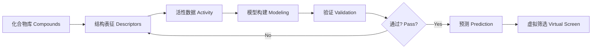

---
aliases: [QSAR]
tags: ['Chemistry/QSAR', 'Chemoinformatics', 'DrugDiscovery']
---

# QSAR

## 概述 (Overview)

定量构效关系 (Quantitative Structure-Activity Relationships, QSAR) 是使用数学模型描述分子结构与其生物活性之间关系的计算方法。QSAR 的核心假设是相似分子具有相似活性。该方法广泛应用于药物先导优化、毒性预测和化合物虚拟筛选。

## QSAR 建模流程

## 分子描述符 (Molecular Descriptors)

### 一维描述符 (1D)

分子式层面的整体性质：分子量 (MW)、脂水分配系数 (log P)、氢键供体/受体数 (HBD/HBA)、可旋转键数、极性表面积 (PSA) 等。

### 二维描述符 (2D)

基于分子图的拓扑描述符：Wiener 指数、Zagreb 指数、连接性指数 ($^m\chi_t$)。举例 - Randić 分支指数：

$$^1\chi = \sum_{\text{edges}} \frac{1}{\sqrt{\delta_i\delta_j}}$$

其中 $\delta_i$ 是原子 $i$ 的价态。

### 三维描述符 (3D)

基于分子构象的描述符：CoMFA (Comparative Molecular Field Analysis) 使用 Lennard-Jones 势和 Coulomb 势描述立体场和静电场：

$$E_{\text{steric}} = \sum_{i,j} \left(\frac{A_{ij}}{r_{ij}^{12}} - \frac{C_{ij}}{r_{ij}^6}\right)$$

$$E_{\text{elec}} = \sum_{i,j} \frac{q_i q_j}{\epsilon r_{ij}}$$

## 经典 QSAR 方法

### Hansch 分析

Hansch 方程将活性与理化参数关联：

$$\log(1/C) = a\log P + b(\log P)^2 + c\sigma + dE_s + e$$

其中 $\log P$ 是疏水性参数，$\sigma$ 是 Hammett 电子效应参数，$E_s$ 是 Taft 位阻参数。

### Free-Wilson 分析

Free-Wilson 方法将活性拆解为母核贡献和取代基贡献：

$$BA = \mu + \sum_i \sum_j a_{ij}G_{ij}$$

其中 $\mu$ 是整体平均值，$G_{ij}$ 是取代基 $j$ 在位置 $i$ 的贡献。

## 现代 QSAR 方法

### 机器学习方法

- 多元线性回归 (MLR)
- 偏最小二乘法 (PLS)
- 支持向量机 (SVM)
- 随机森林 (Random Forest)
- 人工神经网络 (ANN)

### 深度学习

图神经网络 (Graph Neural Networks) 直接在分子图上学习表征。消息传递框架：

$$\mathbf{h}_i^{(t+1)} = \text{UPDATE}\left(\mathbf{h}_i^{(t)}, \sum_{j\in N(i)} \text{MESSAGE}(\mathbf{h}_i^{(t)}, \mathbf{h}_j^{(t)}, \mathbf{e}_{ij})\right)$$

### 分子指纹

分子指纹是分子的位向量表示。常见指纹包括 ECFP (Extended Connectivity Fingerprints)、MACCS 键和 Morgan 指纹。Tanimoto 系数用于指纹相似度比较：

$$T(A,B) = \frac{|A \cap B|}{|A \cup B|}$$

## 模型验证 (Model Validation)

### 内部验证

- 交叉验证 (Cross-Validation): $Q_{LOO}^2 = 1 - \frac{\sum(y_i - \hat{y}_i)^2}{\sum(y_i - \bar{y})^2}$
- Y 随机化 (Y-Randomization): 检测偶然相关性
- 训练集/测试集划分 (Train/Test Split)

### 外部验证

外部测试集的预测性能指标：

$$R_{\text{pred}}^2 = 1 - \frac{\sum(y_i^{\text{test}} - \hat{y}_i^{\text{test}})^2}{\sum(y_i^{\text{test}} - \bar{y}_{\text{train}})^2}$$

RMSE (均方根误差)：

$$RMSE = \sqrt{\frac{1}{n}\sum_{i=1}^n (y_i - \hat{y}_i)^2}$$

### OECD 验证原则

1. 明确的终点相关活性
2. 明确的算法
3. 定义的适用范围 (Applicability Domain)
4. 合适的拟合度、稳健性和预测性
5. 尽可能的机制解释

## 适用域 (Applicability Domain)

### 定义方法

- 距离法：基于欧几里得距离或马氏距离：
  $$D_i = \sqrt{(x_i - \bar{x})^T\Sigma^{-1}(x_i - \bar{x})}$$
- 概率密度方法
- 范围法 (Range-based)
- 杠杆值法 (Leverage)

### 异常值检测

基于标准化残差的异常检测。学生化残差 (Studentized Residual)：

$$t_i = \frac{e_i}{\hat{\sigma}_{(i)}\sqrt{1 - h_{ii}}}$$

其中 $h_{ii}$ 是杠杆值。

## 3D-QSAR 方法

### CoMFA

比较分子场分析 (Comparative Molecular Field Analysis) 使用网格点的探针原子计算空间场和静电场。偏最小二乘法提取与活性相关的场模式。

### CoMSIA

比较分子相似性指数分析 (Comparative Molecular Similarity Indices Analysis) 在 CoMFA 基础上加入疏水场、氢键供体场和氢键受体场。

## QSAR 在 ADMET 预测中的应用

### 吸收预测

Caco-2 细胞渗透性模型、PAMPA 模型。Molecular PSA 与 log P 的组合预测口服吸收。

### 代谢预测

CYP450 亚型抑制预测、代谢位点预测 (Site of Metabolism)。Toxtree 和 Derek Nexus 用于结构警报识别。

## 数据来源与工具

### 公共数据库

| 数据库 | 内容 |
|--------|------|
| ChEMBL | 药物活性数据 |
| PubChem | 化合物与生物活性 |
| DrugBank | 药物靶标信息 |
| Tox21 | 毒性数据 |
| ZINC | 可购买化合物库 |

### QSAR 软件

- DRAGON: 分子描述符计算
- MOE: QSAR 建模平台
- KNIME: 开源工作流工具
- scikit-learn: Python 机器学习
- DeepChem: 深度学习药物发现
- RDKit: 开源化学信息学工具包

## 局限性与挑战 (Limitations & Challenges)

### 活动悬崖 (Activity Cliffs)

结构微小变化导致活性巨变的"活动悬崖"是 QSAR 面临的挑战。解决方案包括使用多描述符分析和机器学习方法。

### 数据不平衡

活性数据中非活性化合物远多于活性化合物。欠采样 (Under-sampling)、过采样 (SMOTE) 和代价敏感学习 (Cost-Sensitive Learning) 用于处理数据不平衡。

### 可解释性

深度学习模型的可解释性差。SHAP 值和 LIME 方法解释预测结果。注意力机制突出关键分子片段。

## QSAR 的监管应用 (Regulatory Applications)

OECD 接受 QSAR 模型用于化学品安全评估。REACH (欧盟化学品注册) 指南中使用 (Q)SAR 替代动物实验。ICH M7 指南使用 QSAR 预测 DNA 活性杂质。FDA 接受 QSAR 用于药物杂质评估。

## QSAR 中的分子描述符选择 (Descriptor Selection)

描述符选择减少过拟合并提高模型可解释性。过滤方法 (Filter) 使用方差阈值、相关性分析和互信息排序。包装方法 (Wrapper) 使用遗传算法、前进选择或后退消除。嵌入方法 (Embedded) 使用 LASSO (L1 正则化) 和决策树特征重要性。岭回归 (Ridge Regression) 使用 L2 正则化处理多重共线性。弹性网络 (Elastic Net) 结合 L1 和 L2 正则化，在特征数远大于样本数时表现优异。

## QSAR 中的多任务学习 (Multi-Task Learning) 

多任务 QSAR 模型同时预测多个活性终点。共享隐藏层表示跨任务的相关性，低数据任务从高数据任务迁移学习。深度神经网络多任务架构优于单任务模型在数据有限时。MTL 在 ADMET 预测面板和高通量筛选面板数据中表现突出。不确定性加权 (Uncertainty Weighting) 平衡多任务损失函数中不同任务的权重。

## QSAR 中的分子生成 (Molecular Generation) 

生成模型在先导优化中产生新颖分子结构。变分自编码器 (VAE) 和生成对抗网络 (GAN) 生成具有期望性质的分子。SMILES 字符串作为分子表示，但 SMILES 语法限制生成有效比例。图生成模型直接在分子图结构上操作。目标导向生成 (Goal-Directed Generation) 结合 QSAR 模型进行多目标优化。强化学习 (RL) 优化生成分子的活性、选择性和 ADMET 性质。

## 相关条目

- [[../../INDEX|当前目录索引]]
