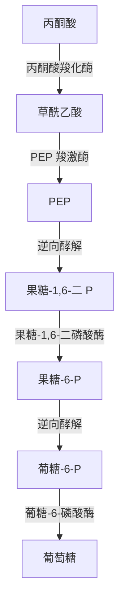
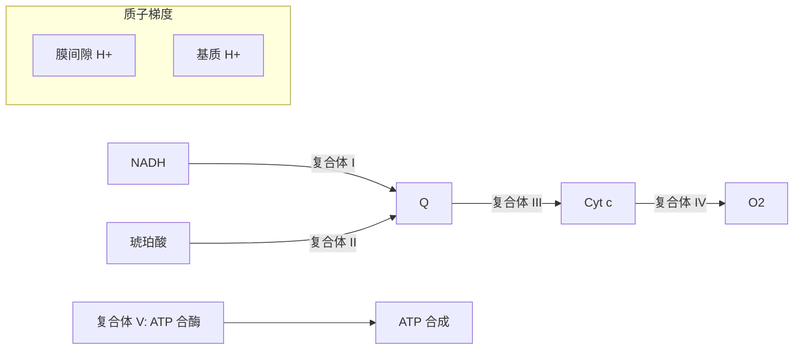

---
aliases:
  - 代谢通路
  - 糖代谢
  - 生物能学
tags:
  - chemistry
  - biochemistry
  - metabolism
  - glycolysis
  - TCA-cycle
  - oxidative-phosphorylation
---

# 代谢途径 (Metabolic Pathways)

## 1 概述 (Overview)

代谢 (Metabolism) 是细胞内维持生命的所有化学反应的总和，分为分解代谢 (Catabolism) 和合成代谢 (Anabolism)。ATP 是细胞能量的通用货币：

$$
\text{ADP} + \text{P}_i + \Delta G_{ATP} \rightleftharpoons \text{ATP} + \text{H}_2\text{O}
$$

标准自由能变化 $\Delta G^{\circ\prime} = -30.5$ kJ/mol。

## 2 糖酵解 (Glycolysis)

### 2.1 反应总览 (Overview)

糖酵解将一分子葡萄糖转化为两分子丙酮酸：

$$
\ce{C6H12O6 + 2 NAD+ + 2 ADP + 2 P_i -> 2 CH3COCOO- + 2 NADH + 2 ATP + 2 H+ + 2 H2O}
$$

### 2.2 关键反应 (Key Reactions)

| 步骤 | 酶 | 反应 | $\Delta G^{\circ\prime}$ (kJ/mol) |
|------|-----|------|----------------------------------|
| 1 | 己糖激酶 | 葡萄糖 $\to$ 葡糖-6-P | -16.7 |
| 3 | 磷酸果糖激酶-1 | 果糖-6-P $\to$ 果糖-1,6-二 P | -14.2 |
| 6 | 磷酸甘油醛脱氢酶 | 3-磷酸甘油醛 $\to$ 1,3-二 P-甘油酸 | +6.3 |
| 7 | 磷酸甘油酸激酶 | 1,3-二 P-甘油酸 $\to$ 3-P-甘油酸 | -18.8 |
| 10 | 丙酮酸激酶 | PEP $\to$ 丙酮酸 | -31.4 |

### 2.3 能量核算 (Energy Accounting)

净收益：2 ATP + 2 NADH（每分子葡萄糖）。

### 2.4 调控 (Regulation)

PFK-1 是糖酵解的关键调控位点，受 ATP 抑制、AMP 和果糖-2,6-二磷酸激活。

## 3 糖异生 (Gluconeogenesis)

### 3.1 绕过不可逆反应 (Bypassing Irreversible Steps)

糖酵解中三个不可逆步骤被糖异生的旁路反应替代：

### 3.2 能量消耗 (Energy Cost)

每生成一分子葡萄糖消耗 4 ATP + 2 GTP + 2 NADH：

$$
2 \text{丙酮酸} + 4\text{ATP} + 2\text{GTP} + 2\text{NADH} + 6\text{H}_2\text{O} \to \text{葡萄糖} + 4\text{ADP} + 2\text{GDP} + 6\text{P}_i + 2\text{NAD}^+
$$

## 4 三羧酸循环 (TCA Cycle / Krebs Cycle)

### 4.1 循环反应 (Cycle Reactions)

乙酰辅酶 A 进入循环完全氧化为 CO$_2$：

$$
\ce{CH3CO-SCoA + 3 NAD+ + FAD + GDP + P_i + 2 H2O -> 2 CO2 + 3 NADH + FADH2 + GTP + CoA-SH + 2 H+}
$$

### 4.2 关键酶及调控 (Key Enzymes & Regulation)

| 酶 | 激活剂 | 抑制剂 |
|-----|-------|-------|
| 柠檬酸合酶 | — | ATP, NADH, 琥珀酰辅酶 A |
| 异柠檬酸脱氢酶 | ADP, Ca$^{2+}$ | ATP, NADH |
| α-酮戊二酸脱氢酶复合体 | Ca$^{2+}$ | ATP, NADH, 琥珀酰辅酶 A |

### 4.3 循环的能量学 (Energetics)

每圈 TCA 循环：3 NADH ($\times$ 2.5 ATP) + 1 FADH$_2$ ($\times$ 1.5 ATP) + 1 GTP ($\approx$ 1 ATP) = 10 ATP/乙酰辅酶 A。

## 5 电子传递链 (Electron Transport Chain, ETC)

### 5.1 复合体 (Complexes)

### 5.2 氧化磷酸化 (Oxidative Phosphorylation)

ATP 合酶利用质子梯度合成 ATP。化学渗透假说 (Chemiosmotic Hypothesis) 由 Peter Mitchell 提出：

$$
\Delta p = \Delta \psi - \frac{2.303RT}{F} \Delta \text{pH}
$$

ATP 合酶的旋转催化机制中，每 120° 旋转合成一个 ATP。每 4 个质子通过产生约 1 个 ATP。

### 5.3 呼吸链的 Q 循环 (Q Cycle)

复合体 III 中的 Q 循环实现了电子从泛醌到细胞色素 c 的传递，同时泵出更多质子：

$$
\begin{aligned}
\text{QH}_2 + 2\text{Cyt } c_{\text{ox}} + 2\text{H}^+_{\text{基质}} &\to \text{Q} + 2\text{Cyt } c_{\text{red}} + 4\text{H}^+_{\text{膜间隙}} \\\\
\text{净: } \text{QH}_2 &\to \text{Q} + 2e^- + 2\text{H}^+
\end{aligned}
$$

## 6 磷酸戊糖途径 (Pentose Phosphate Pathway, PPP)

分为氧化阶段和非氧化阶段。氧化阶段产生 NADPH：

$$
\text{葡萄糖-6-P} + 2\text{NADP}^+ + \text{H}_2\text{O} \to \text{核酮糖-5-P} + 2\text{NADPH} + \text{CO}_2 + 2\text{H}^+
$$

## 7 脂肪酸氧化 (Fatty Acid Oxidation)

β-氧化循环每轮产生 1 FADH$_2$ + 1 NADH + 1 乙酰辅酶 A。以 16 碳棕榈酸为例，总产 ATP：

$$
\text{C}_{16} \to 8\text{乙酰辅酶 A} + 7\text{FADH}_2 + 7\text{NADH}
$$

总 ATP = $8 \times 10 + 7 \times 1.5 + 7 \times 2.5 - 2 = 106$ ATP。

## 8 代谢整合 (Metabolic Integration)

### 8.1 激素调控 (Hormonal Regulation)

胰岛素 (Insulin) 促进合成代谢，胰高血糖素 (Glucagon) 促进分解代谢。胰岛素的信号级联：

$$
\text{胰岛素} \xrightarrow{\text{受体}} \text{IRS-1} \xrightarrow{\text{PI3K}} \text{Akt} \xrightarrow{\text{GLUT4转位}} \text{葡萄糖摄取}
$$

### 8.2 组织代谢差异 (Tissue-Specific Metabolism)

| 组织 | 主要燃料 | 代谢特点 |
|------|---------|---------|
| 大脑 | 葡萄糖 | 依赖糖酵解，需持续供能 |
| 肝脏 | 葡萄糖、脂肪酸 | 糖原合成/分解，糖异生 |
| 肌肉 | 葡萄糖、脂肪酸 | 糖原储存，剧烈运动依赖糖酵解 |
| 脂肪组织 | 脂肪酸 | 甘油三酯储存和释放 |
| 心脏 | 脂肪酸、酮体 | 优先使用脂肪酸氧化 |
| 红细胞 | 葡萄糖 | 无氧糖酵解（无线粒体） |
