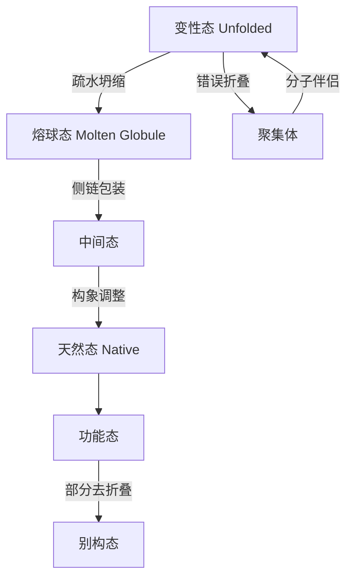

---
aliases:
  - 蛋白质化学
  - 酶学
  - 蛋白质折叠
tags:
  - chemistry
  - biochemistry
  - proteins
  - enzymes
  - catalysis
---

# 蛋白质与酶 (Proteins and Enzymes)

## 1 概述 (Overview)

蛋白质是生命活动的主要执行者，酶则是高效的生物催化剂。本章涵盖蛋白质的结构层次、折叠机制、酶动力学和催化机理。

## 2 蛋白质结构层次 (Protein Structure Hierarchy)

### 2.1 一级结构 (Primary Structure)

氨基酸通过肽键 (Peptide Bond) 连接形成多肽链。肽键具有部分双键性质，限制了旋转自由度：

$$
\ce{R-CH(NH2)-COOH + H2N-CH(R')-COOH -> R-CH(NH2)-CONH-CH(R')-COOH + H2O}
$$

### 2.2 二级结构 (Secondary Structure)

α-螺旋 (α-Helix) 和 β-折叠 (β-Sheet) 由主链氢键稳定：

α-螺旋的参数：每圈 3.6 个残基，螺距 5.4 Å，每个残基上升 1.5 Å。

β-折叠中氢键的能量：

$$
E_{\text{H-bond}} = \frac{q_1 q_2}{4\pi\epsilon_0 \epsilon r_{12}} - \frac{A}{r_{12}^6}
$$

Ramachandran 图由二面角 $\phi$ 和 $\psi$ 定义允许构象区域。

### 2.3 三级结构 (Tertiary Structure)

蛋白质折叠的自由能变化：

$$
\Delta G_{\text{fold}} = \Delta G_{\text{H-bond}} + \Delta G_{\text{hydrophobic}} + \Delta G_{\text{vdW}} + \Delta G_{\text{electrostatic}} - T\Delta S_{\text{conf}}
$$

蛋白质折叠的驱动力主要是疏水效应 (Hydrophobic Effect)。安芬森原则 (Anfinsen's Dogma) 指出蛋白质的一级结构决定其三级结构。

### 2.4 四级结构 (Quaternary Structure)

多亚基组装由亚基间相互作用驱动。血红蛋白 (Hemoglobin) 是经典例子，其氧合协同性由 Hill 方程描述：

$$
Y = \frac{pO_2^n}{pO_2^n + P_{50}^n}
$$

## 3 蛋白质折叠与动力学 (Protein Folding & Dynamics)

### 3.1 折叠能量景观 (Folding Energy Landscape)

### 3.2 莱文塔尔悖论 (Levinthal's Paradox)

假设每个二面角有 3 种可能状态，100 残基的蛋白质将有 $3^{198} \approx 10^{94}$ 种构象。若以 $10^{-13}$ 秒切换一种，折叠时间将远超宇宙年龄。但实际上蛋白质在毫秒到秒内折叠，说明折叠存在偏好路径。

### 3.3 蛋白质折叠速率 (Folding Rate)

两态折叠模型 (Two-State Folding)：

$$
U \underset{k_u}{\stackrel{k_f}{\rightleftharpoons}} N
$$

折叠速率常数与自由能垒的关系 (Transition State Theory)：

$$
k_f = \frac{k_B T}{h} \exp\left(-\frac{\Delta G^\ddagger}{RT}\right)
$$

## 4 酶动力学 (Enzyme Kinetics)

### 4.1 米氏方程 (Michaelis-Menten Equation)

$$
E + S \underset{k_{-1}}{\stackrel{k_1}{\rightleftharpoons}} ES \xrightarrow{k_2} E + P
$$

稳态近似 (Steady-State Assumption) 下：

$$
v = \frac{d[P]}{dt} = \frac{V_{\max} [S]}{K_m + [S]}
$$

其中 $V_{\max} = k_{cat} [E]_t$，$K_m = (k_{-1} + k_2) / k_1$。

### 4.2 双倒数作图 (Lineweaver-Burk Plot)

$$
\frac{1}{v} = \frac{K_m}{V_{\max}} \frac{1}{[S]} + \frac{1}{V_{\max}}
$$

### 4.3 酶抑制 (Enzyme Inhibition)

| 抑制类型 | 表观 $K_m$ | 表观 $V_{\max}$ | Lineweaver-Burk |
|---------|-----------|----------------|-----------------|
| 竞争性 | $K_m(1 + [I]/K_i)$ | 不变 | 交于 y 轴 |
| 非竞争性 | 不变 | $V_{\max}/(1 + [I]/K_i)$ | 交于 x 轴 |
| 反竞争性 | $K_m/(1 + [I]/K_i)$ | $V_{\max}/(1 + [I]/K_i)$ | 平行线 |
| 混合型 | $K_m(1 + [I]/K_i)$ | $V_{\max}/(1 + [I]/K_i')$ | 交于第二象限 |

### 4.4 催化效率 (Catalytic Efficiency)

$$
\frac{k_{cat}}{K_m} = \frac{k_1 k_2}{k_{-1} + k_2}
$$

最大值为扩散控制极限 $10^8$–$10^9$ M$^{-1}$s$^{-1}$。

## 5 酶催化机理 (Enzyme Catalysis Mechanisms)

### 5.1 酸碱催化 (Acid-Base Catalysis)

His 侧链咪唑基的 p$K_a \approx 6.0$，可在生理 pH 下同时作为质子供体和受体：

$$
\ce{His-H+ <=> His + H+}
$$

### 5.2 共价催化 (Covalent Catalysis)

丝氨酸蛋白酶催化三联体 (Catalytic Triad: Ser-His-Asp)：

$$
\ce{Ser-OH + R-CO-R' -> Ser-O-COR + R'-OH}
$$

### 5.3 金属离子催化 (Metal Ion Catalysis)

Zn$^{2+}$ 在碳酸酐酶 (Carbonic Anhydrase) 中的作用：

$$
\ce{Zn-OH + CO2 -> Zn-HCO3- -> Zn-OH + HCO3-}
$$

### 5.4 过渡态稳定化 (Transition State Stabilization)

酶通过结合过渡态降低活化能。过渡态类似物 (Transition-State Analogs) 是强效抑制剂。活化能降低与速率常数的关系：

$$
\Delta \Delta G^\ddagger = -RT \ln \left(\frac{k_{cat}/k_{uncat}}{k_{cat}/K_m}\right)
$$

## 6 蛋白质结构与功能关系 (Structure-Function Relationships)

### 6.1 肌红蛋白与血红蛋白 (Myoglobin & Hemoglobin)

肌红蛋白的氧合曲线为双曲线，血红蛋白为 S 型曲线。波尔效应 (Bohr Effect)：

$$
\ce{HbO2 + H+ + CO2 <=> Hb-H+CO2 + O2}
$$

### 6.2 别构调节 (Allosteric Regulation)

MWC 模型 (Monod-Wyman-Changeux Model)：

$$
\frac{Y}{1 - Y} = \frac{(1 + \alpha)^n}{L(1 + c\alpha)^n}
$$

其中 $\alpha = [S]/K_R$，$L = [T_0]/[R_0]$，$c = K_R/K_T$。

## 7 蛋白质工程 (Protein Engineering)

定点诱变 (Site-Directed Mutagenesis) 用于研究特定残基的功能。定向进化 (Directed Evolution) 通过迭代突变和筛选优化酶性能。

## 8 蛋白质组学方法 (Proteomics Methods)

- X 射线晶体学 (X-ray Crystallography) 提供原子分辨率结构
- 冷冻电镜 (Cryo-EM) 适用于大分子复合物
- NMR 波谱学用于溶液状态下的动态研究
- 质谱 (Mass Spectrometry) 用于鉴定和定量
