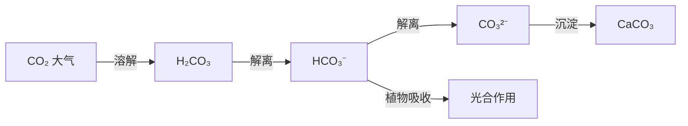
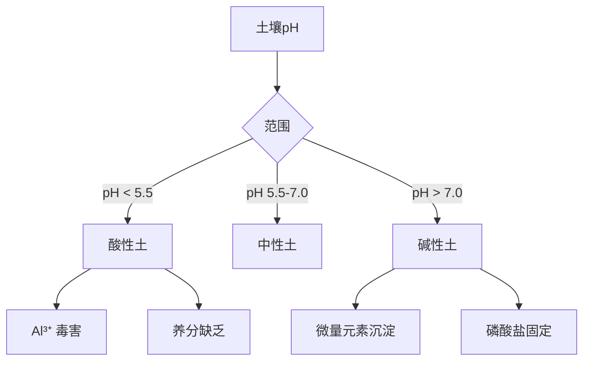
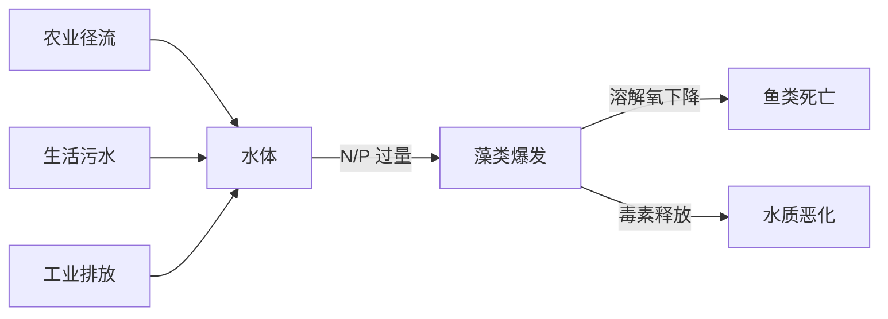

---
aliases:
  - Water and Soil Chemistry
  - 水化学
  - 土壤化学
tags:
  - chemistry
  - environmental
  - water
  - soil
  - pollution
---

# 水体与土壤化学 (Water and Soil Chemistry)

## 1 水体化学基础 (Fundamentals of Water Chemistry)

### 1.1 水的结构与性质 (Structure and Properties of Water)

水分子 ($H_2O$) 具有 bent 结构，键角约为 $104.5^\circ$。氧原子的电负性 (electronegativity) 为 3.44，氢为 2.20，形成强极性 O–H 键。

水的氢键 (hydrogen bonding) 网络使其具有异常高的沸点 ($100^\circ C$) 和比热容 ($4.184\ J\cdot g^{-1}\cdot K^{-1}$)。

### 1.2 水质参数 (Water Quality Parameters)

| 参数 (Parameter) | 单位 (Unit) | 地表水标准 (Standard) |
|---|---|---|
| pH | — | 6.5–8.5 |
| 溶解氧 (DO) | mg/L | $\geq 5$ |
| 化学需氧量 (COD) | mg/L | $\leq 20$ |
| 氨氮 ($NH_3$-$N$) | mg/L | $\leq 1.0$ |

### 1.3 水中的酸碱平衡 (Acid-Base Equilibrium in Water)

碳酸体系是天然水体中最重要的缓冲系统 (buffering system)：

$$CO_2 + H_2O \rightleftharpoons H_2CO_3 \rightleftharpoons HCO_3^- + H^+ \rightleftharpoons CO_3^{2-} + 2H^+$$

水中 alkalinity 主要由 $HCO_3^-$ 和 $CO_3^{2-}$ 贡献。

### 1.4 氧化还原反应 (Redox Reactions)

天然水体中重要的氧化还原对：

- $O_2/H_2O$: $E^\circ = +1.229\ V$
- $NO_3^-/NH_4^+$: $E^\circ = +0.88\ V$
- $Fe^{3+}/Fe^{2+}$: $E^\circ = +0.771\ V$
- $SO_4^{2-}/H_2S$: $E^\circ = -0.22\ V$

氧化还原电位 (Eh) 决定水体中元素的存在形态。

## 2 土壤化学基础 (Fundamentals of Soil Chemistry)

### 2.1 土壤的组成 (Soil Composition)

土壤由固相 (solid phase)、液相 (liquid phase) 和气相 (gaseous phase) 三相组成。固相包括矿物质 (minerals, 45%)、有机质 (organic matter, 5%)，其余为水分 (25%) 和空气 (25%)。

### 2.2 土壤胶体与离子交换 (Soil Colloids and Ion Exchange)

土壤胶体 (soil colloids) 包括：

1. 层状硅酸盐矿物 (layered silicate minerals)
2. 铁铝氧化物 (Fe/Al oxides)
3. 有机胶体 (humus)

阳离子交换量 (CEC, Cation Exchange Capacity) 的计算：

$$CEC = \sum_{i} [M^{n+}]_i \times n_i \times \frac{100}{W}$$

其中 $[M^{n+}]_i$ 为第 $i$ 种阳离子的浓度，$n_i$ 为其电荷数。

### 2.3 土壤pH与缓冲能力 (Soil pH and Buffering Capacity)

### 2.4 土壤有机质 (Soil Organic Matter)

腐殖质 (humus) 是土壤有机质的主要成分，分为：

- 胡敏酸 (humic acid, HA): 溶于碱，不溶于酸
- 富里酸 (fulvic acid, FA): 溶于碱和酸
- 胡敏素 (humin): 不溶于碱和酸

## 3 水-土界面过程 (Water-Soil Interface Processes)

### 3.1 吸附与解吸 (Adsorption and Desorption)

Langmuir 等温吸附方程：

$$\frac{C}{q} = \frac{1}{K_L q_m} + \frac{C}{q_m}$$

其中 $q$ 为吸附量，$C$ 为平衡浓度，$q_m$ 为最大吸附量，$K_L$ 为 Langmuir 常数。

Freundlich 等温吸附方程：

$$q = K_F C^{1/n}$$

### 3.2 沉淀与溶解 (Precipitation and Dissolution)

溶度积 (solubility product) 的计算：

$$K_{sp} = [A^{m+}]^p [B^{n-}]^q$$

对于金属氢氧化物 $M(OH)_n$，溶解度随 pH 变化：

$$S = \frac{K_{sp}}{[OH^-]^n}$$

## 4 水体污染 (Water Pollution)

### 4.1 主要污染物类型 (Major Pollutant Types)

| 类型 (Type) | 代表物 (Representative) | 危害 (Hazard) |
|---|---|---|
| 重金属 | Hg, Pb, Cd, Cr(VI) | 神经毒性、致癌 |
| 有机物 | PAHs, PCBs | 持久性、生物累积 |
| 营养物 | N, P | 富营养化 (eutrophication) |
| 微塑料 | <5mm 塑料颗粒 | 生态风险 |

### 4.2 富营养化 (Eutrophication)

$$N:P = 16:1 \quad (\text{Redfield 比值})$$

当 N:P > 16 时，P 为限制因子；当 N:P < 16 时，N 为限制因子。

## 5 土壤污染 (Soil Pollution)

### 5.1 重金属污染 (Heavy Metal Contamination)

土壤重金属背景值 (background value) 与人为输入 (anthropogenic input) 的区分：

$$I_{geo} = \log_2\left(\frac{C_n}{1.5 \times B_n}\right)$$

其中 $I_{geo}$ 为地累积指数 (geoaccumulation index)。

### 5.2 有机污染物 (Organic Pollutants)

PAHs (多环芳烃) 在土壤中的分配系数：

$$K_d = \frac{C_s}{C_w}$$

$$K_{oc} = \frac{K_d}{f_{oc}}$$

$K_{oc}$ 为有机碳分配系数，$f_{oc}$ 为土壤有机碳含量。

## 6 污染修复技术 (Remediation Technologies)

### 6.1 物理修复 (Physical Remediation)

- 土壤淋洗 (soil washing)
- 电动修复 (electrokinetic remediation)
- 热脱附 (thermal desorption)

### 6.2 化学修复 (Chemical Remediation)

化学氧化 (chemical oxidation) 应用 $H_2O_2$, $KMnO_4$, $Fe^{2+}/H_2O_2$ (Fenton 试剂) 等。

### 6.3 生物修复 (Bioremediation)

- 植物修复 (phytoremediation)
- 微生物修复 (microbial remediation)
- 菌根修复 (mycoremediation)

## 7 水质模型 (Water Quality Models)

### 7.1 Streeter-Phelps 模型

溶解氧 (DO) 的沿程变化：

$$D = D_0 e^{-k_a t} + \frac{k_d L_0}{k_a - k_d}(e^{-k_d t} - e^{-k_a t})$$

其中 $D$ 为氧亏 (oxygen deficit)，$k_a$ 为复氧系数，$k_d$ 为耗氧系数，$L_0$ 为初始 BOD。

### 7.2 土壤溶质迁移模型 (Solute Transport Model)

对流-扩散方程 (advection-dispersion equation)：

$$\frac{\partial C}{\partial t} = D \frac{\partial^2 C}{\partial x^2} - v \frac{\partial C}{\partial x} - \mu C$$

## 8 案例研究 (Case Studies)

### 8.1 太湖富营养化

太湖 (Lake Taihu) 位于江苏省，是我国典型富营养化湖泊。主要污染源包括工业废水、农业面源污染和生活污水。

### 8.2 土壤重金属污染 — 湖南镉污染

湖南某地因采矿活动导致土壤镉 (Cd) 含量超标 5–10 倍。采用石灰调节 pH 和超积累植物 (hyperaccumulator) 联合修复。

## 9 总结与展望 (Summary and Outlook)

水-土系统的化学过程是环境化学的核心。未来研究重点包括：

1. 微塑料的环境行为
2. 新型污染物 (emerging contaminants) 的迁移转化
3. 绿色修复材料的开发
4. 基于 AI 的水质预测模型
