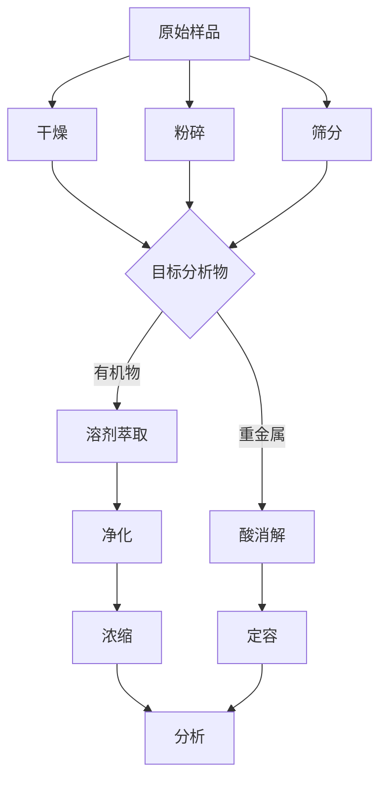
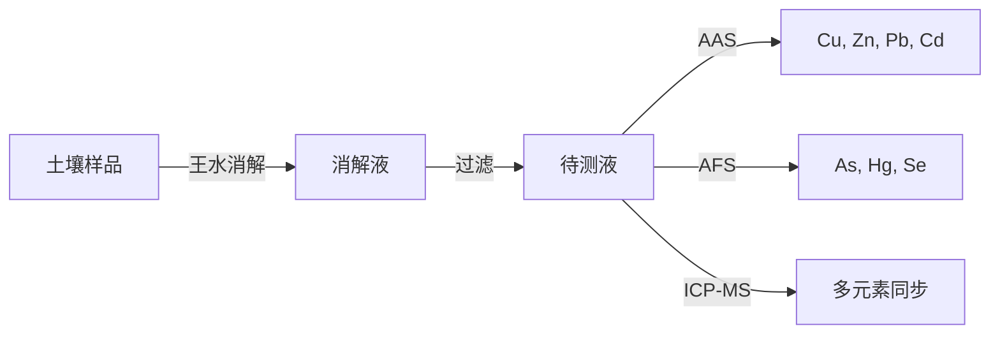
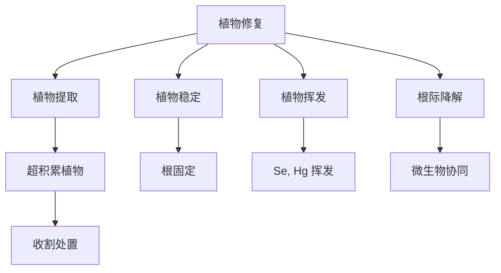

---
aliases:
  - Environmental Monitoring and Remediation
  - 环境监测
  - 环境修复技术
tags:
  - chemistry
  - environmental
  - monitoring
  - remediation
  - green-chemistry
---

# 环境监测与修复 (Environmental Monitoring and Remediation)

## 1 环境监测概论 (Introduction to Environmental Monitoring)

### 1.1 监测目的与分类 (Purpose and Classification)

环境监测 (environmental monitoring) 是对环境质量指标进行连续或定期测定的过程。按介质分类：

| 介质 (Medium) | 监测指标 (Indicators) | 频率 (Frequency) |
|---|---|---|
| 大气 | $PM_{2.5}$, $PM_{10}$, $O_3$, $NO_2$ | 连续 |
| 地表水 | DO, COD, BOD, $NH_3$-$N$ | 每月 |
| 土壤 | 重金属, pH, TOC | 每季 |
| 噪声 | Leq, Lmax | 不定期 |

### 1.2 采样技术 (Sampling Techniques)

采样点布设 (sampling design) 方法：

1. 网格布点法 (grid sampling)
2. 随机布点法 (random sampling)
3. 分层布点法 (stratified sampling)
4. 系统布点法 (systematic sampling)

采样质量控制 (QA/QC) 包括 field blank、trip blank、duplicate samples 和 matrix spike。

### 1.3 样品前处理 (Sample Pretreatment)

## 2 分析方法 (Analytical Methods)

### 2.1 光谱分析 (Spectroscopic Analysis)

原子吸收光谱 (AAS, Atomic Absorption Spectroscopy)：

$$A = \log\frac{I_0}{I} = \varepsilon bc$$

其中 $A$ 为吸光度 (absorbance)，$\varepsilon$ 为摩尔吸光系数，$b$ 为光程长度，$c$ 为浓度。

电感耦合等离子体质谱 (ICP-MS) 检测限可达 ppt 级别。

### 2.2 色谱分析 (Chromatographic Analysis)

气相色谱-质谱联用 (GC-MS) 和液相色谱-质谱联用 (LC-MS/MS) 是有机污染物分析的主力工具。

保留时间 (retention time) 与分配系数 $K$ 的关系：

$$t_R = t_0(1 + K\frac{V_s}{V_m})$$

### 2.3 电化学分析 (Electrochemical Analysis)

离子选择电极 (ISE) 基于 Nernst 方程：

$$E = E^\circ + \frac{RT}{nF}\ln a$$

在 $25^\circ C$ 时简化为：

$$E = E^\circ + \frac{0.05916}{n}\log a$$

## 3 水质监测 (Water Quality Monitoring)

### 3.1 常规指标测定 (Routine Parameter Determination)

化学需氧量 (COD) 的测定采用重铬酸盐法：

$$COD = \frac{(V_0 - V_1) \times C \times 8 \times 1000}{V_{sample}}$$

其中 $V_0$ 和 $V_1$ 为空白和样品消耗的 $Fe^{2+}$ 体积。

### 3.2 生物监测 (Biological Monitoring)

生物指数 (biotic index) 如 Shannon-Wiener 多样性指数：

$$H' = -\sum_{i=1}^S p_i \ln p_i$$

## 4 土壤监测 (Soil Monitoring)

### 4.1 土壤采样与制备

土壤采样深度通常为 0–20 cm (表层) 和 20–40 cm (亚表层)。样品经风干 (air-drying) 后过 2 mm 筛。

### 4.2 土壤重金属测定

原子荧光光谱 (AFS) 检测 As 和 Hg 的灵敏度极高：

$$I = \Phi_f I_0 (1 - e^{-\varepsilon bc})$$

## 5 大气监测 (Air Monitoring)

### 5.1 气体污染物监测

- $SO_2$: 甲醛吸收-副玫瑰苯胺分光光度法
- $NO_2$: Saltzman 比色法
- $O_3$: 紫外光度法
- $CO$: 非色散红外吸收法 (NDIR)

### 5.2 颗粒物监测

$$PM_{2.5} = \frac{W_{filter\ after} - W_{filter\ before}}{V_{air}} \times 10^6$$

## 6 环境修复技术 (Environmental Remediation)

### 6.1 物理修复 (Physical Remediation)

| 技术 (Technique) | 适用介质 | 原理 |
|---|---|---|
| 土壤蒸汽抽提 (SVE) | 土壤 | 真空诱导 VOC 挥发 |
| 空气喷射 (AS) | 地下水 | 曝气促进生物降解 |
| 电动修复 (EKR) | 土壤 | 电迁移去除重金属 |

### 6.2 化学修复 (Chemical Remediation)

Fenton 反应产生羟基自由基 ($\cdot OH$)：

$$Fe^{2+} + H_2O_2 \rightarrow Fe^{3+} + \cdot OH + OH^-$$

$$\cdot OH + \text{有机污染物} \rightarrow \text{氧化产物}$$

### 6.3 生物修复 (Bioremediation)

微生物降解动力学常用 Monod 方程：

$$\mu = \mu_{max}\frac{S}{K_s + S}$$

$$-\frac{dS}{dt} = \frac{\mu_{max} X S}{Y(K_s + S)}$$

其中 $\mu$ 为比生长速率，$S$ 为底物浓度，$K_s$ 为半饱和常数，$X$ 为生物量。

## 7 植物修复 (Phytoremediation)

### 7.1 修复机制 (Mechanisms)

### 7.2 超积累植物 (Hyperaccumulators)

- 蜈蚣草 (Pteris vittata): As 超积累
- 东南景天 (Sedum alfredii): Zn/Cd 超积累
- 龙葵 (Solanum nigrum): Cd 超积累

植物富集因子 (BCF, Bioconcentration Factor)：

$$BCF = \frac{C_{plant}}{C_{soil}}$$

## 8 新兴修复技术 (Emerging Remediation Technologies)

### 8.1 纳米修复 (Nanoremediation)

纳米零价铁 (nZVI) 还原降解有机氯：

$$Fe^0 + RCl + H^+ \rightarrow Fe^{2+} + RH + Cl^-$$

### 8.2 电化学高级氧化

电-Fenton 和光电催化 (photoelectrocatalysis) 利用 $TiO_2$ 等半导体：

$$TiO_2 + h\nu \rightarrow e^- + h^+$$

$$h^+ + H_2O \rightarrow \cdot OH + H^+$$

## 9 监测与修复的整合 (Integration of Monitoring and Remediation)

### 9.1 基于风险的修复目标 (Risk-Based Remediation Goals)

$$Risk = EEC \times PEC \times SF$$

其中 EEC 为估计暴露浓度 (Estimated Exposure Concentration)，PEC 为预测无效应浓度 (Predicted Effect Concentration)，SF 为安全因子。

### 9.2 绿色修复 (Green Remediation)

绿色修复原则包括最小化碳足迹 (carbon footprint)、使用可再生材料和减少二次污染。

## 10 总结 (Summary)

环境监测与修复是相互关联的科学领域。现代趋势向高灵敏度在线监测、绿色修复材料和基于自然的解决方案 (nature-based solutions) 发展。
