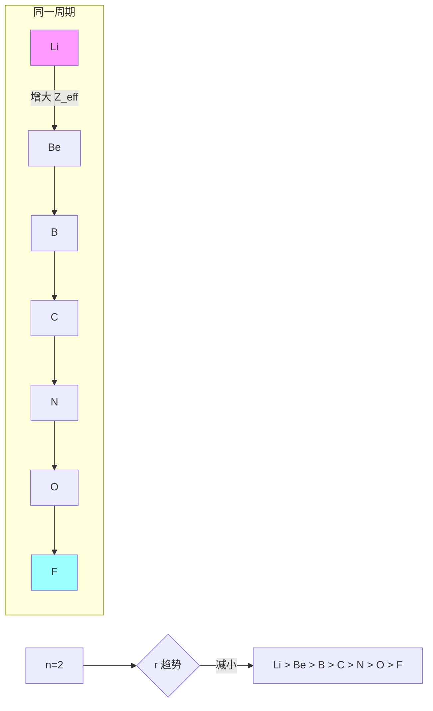
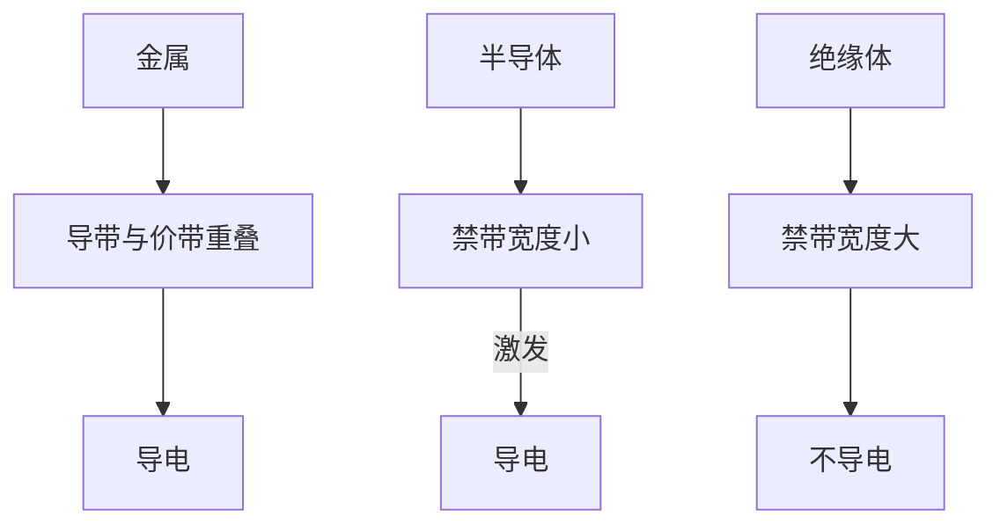

---
aliases:
  - Periodic Law and Chemical Bonding
  - 周期律
  - 化学键理论
tags:
  - chemistry
  - inorganic
  - periodic-table
  - bonding
  - orbitals
---

# 元素周期律与化学键 (Periodic Law and Chemical Bonding)

## 1 元素周期律 (Periodic Law)

### 1.1 周期表结构 (Periodic Table Structure)

元素周期表按原子序数 (atomic number) 递增排列，分为 7 个周期 (periods) 和 18 个族 (groups)。周期 (period) 对应电子层数，族 (group) 对应价电子数。

### 1.2 原子半径 (Atomic Radius)

原子半径在同一周期内从左到右逐渐减小，在同一族内从上到下逐渐增大。

原子半径 $r$ 与有效核电荷 $Z_{eff}$ 的关系：

$$r \propto \frac{n^2}{Z_{eff}}$$

其中 $Z_{eff} = Z - \sigma$，$\sigma$ 为屏蔽常数 (shielding constant)。



### 1.3 电离能 (Ionization Energy)

第一电离能 (first ionization energy, $IE_1$) 是气态原子失去一个电子所需能量：

$$M(g) \rightarrow M^+(g) + e^- \quad \Delta E = IE_1$$

同周期 $IE_1$ 总体呈增大趋势，但 Be 和 Mg 处出现异常 (全满 $s^2$ 构型稳定)，N 和 P 处也偏离 (半满 $p^3$ 稳定)。

| 元素 | $IE_1$ (kJ/mol) | 电子构型 |
|---|---|---|
| Li | 520 | $[He]2s^1$ |
| Be | 899 | $[He]2s^2$ |
| B | 801 | $[He]2s^22p^1$ |
| C | 1086 | $[He]2s^22p^2$ |
| N | 1402 | $[He]2s^22p^3$ |
| O | 1314 | $[He]2s^22p^4$ |
| F | 1681 | $[He]2s^22p^5$ |
| Ne | 2081 | $[He]2s^22p^6$ |

### 1.4 电子亲和能 (Electron Affinity)

电子亲和能 (electron affinity, $EA$) 是气态原子获得一个电子释放的能量：

$$X(g) + e^- \rightarrow X^-(g) \quad \Delta E = EA$$

卤素 (halogens) 具有最大的电子亲和能 ($EA > 0$，放热)。

### 1.5 电负性 (Electronegativity)

Pauling 电负性标度：

$$\chi_A - \chi_B = 0.102 \sqrt{\Delta E_{AB} - \frac{\Delta E_{AA} + \Delta E_{BB}}{2}}$$

Mulliken 电负性：

$$\chi_M = \frac{IE + EA}{2}$$

Allen 电负性基于光谱数据：

$$\chi_{spec} = \frac{0.359 n_p + 0.685 n_s}{r}$$

电负性最大的是 F ($\chi = 3.98$)，最小的是 Cs ($\chi = 0.79$)。

### 1.6 周期性趋势总结 (Summary of Periodic Trends)

| 性质 (Property) | 同周期 (→) | 同族 (↓) |
|---|---|---|
| 原子半径 | 减小 | 增大 |
| 电离能 | 增大 | 减小 |
| 电子亲和能 | 增大 | 减小 |
| 电负性 | 增大 | 减小 |
| 金属性 | 减弱 | 增强 |

## 2 离子键 (Ionic Bonding)

### 2.1 离子键的形成 (Formation of Ionic Bonds)

离子键由电负性差 ($\Delta \chi > 1.7$) 大的原子通过电子转移形成。NaCl 的形成：

$$Na \rightarrow Na^+ + e^- \quad IE_1 = 496\ kJ/mol$$

$$Cl + e^- \rightarrow Cl^- \quad EA = -349\ kJ/mol$$

$$Na^+ + Cl^- \rightarrow NaCl(s) \quad \Delta H_{lattice} = -788\ kJ/mol$$

### 2.2 晶格能 (Lattice Energy)

Born-Landé 方程：

$$U = -\frac{NAZ^+Z^-e^2}{4\pi\varepsilon_0 r_0}\left(1 - \frac{1}{n}\right)$$

其中 $N$ 为 Avogadro 常数，$A$ 为 Madelung 常数，$Z$ 为离子电荷，$r_0$ 为离子间距，$n$ 为 Born 指数。

Kapustinskii 近似式：

$$U = \frac{1201.6 \nu Z^+ Z^-}{r_+ + r_-}\left(1 - \frac{0.345}{r_+ + r_-}\right)$$

其中 $\nu$ 为化学式中的离子总数。

## 3 共价键 (Covalent Bonding)

### 3.1 价键理论 (Valence Bond Theory)

共价键 (covalent bond) 是原子间通过共用电子对形成的化学键。键能 (bond energy) 和键长 (bond length) 是描述共价键强度的主要参数。

### 3.2 杂化轨道理论 (Hybrid Orbital Theory)

| 杂化类型 | 参与轨道 | 几何构型 | 键角 |
|---|---|---|---|
| $sp$ | $s + p$ | 直线形 | $180^\circ$ |
| $sp^2$ | $s + p_x + p_y$ | 平面三角形 | $120^\circ$ |
| $sp^3$ | $s + p_x + p_y + p_z$ | 四面体形 | $109.5^\circ$ |
| $sp^3d$ | $s + 3p + d$ | 三角双锥 | $90^\circ, 120^\circ$ |
| $sp^3d^2$ | $s + 3p + 2d$ | 八面体形 | $90^\circ$ |

### 3.3 分子轨道理论 (Molecular Orbital Theory)

分子轨道 (MO) 由原子轨道线性组合 (LCAO, Linear Combination of Atomic Orbitals) 形成：

$$\psi_{MO} = c_1\psi_{AO1} + c_2\psi_{AO2}$$

同核双原子分子 (homonuclear diatomic molecules) 的轨道能级：

```mermaid
graph TD
  subgraph O₂ F₂
    direction LR
    A1[σ₁s] --> A2[σ*₁s]
    A1 --> B1[σ₂s]
    B1 --> B2[σ*₂s]
    B1 --> C1[σ₂p]
    C1 --> C2[π₂p_x = π₂p_y]
    C2 --> C3[π*₂p_x = π*₂p_y]
    C3 --> C4[σ*₂p]
  end
```

对于 $O_2$ ($\sigma_{2s}^2 \sigma_{2s}^{*2} \sigma_{2p}^2 \pi_{2p}^4 \pi_{2p}^{*2}$)，键级 (bond order) 为 2，有 2 个未成对电子，显顺磁性 (paramagnetic)。

键级计算：

$$\text{Bond Order} = \frac{N_{bonding} - N_{antibonding}}{2}$$

### 3.4 价层电子对互斥理论 (VSEPR Theory)

VSEPR 用于预测分子几何构型：

$$AX_nE_m$$

其中 $A$ 为中心原子，$X$ 为配体，$E$ 为孤对电子 (lone pair)。

| 分子类型 | 电子对构型 | 分子构型 | 示例 |
|---|---|---|---|
| $AX_2$ | 直线形 | 直线形 | $CO_2$ |
| $AX_3$ | 平面三角形 | 平面三角形 | $BF_3$ |
| $AX_2E$ | 平面三角形 | V 形 | $SO_2$ |
| $AX_4$ | 四面体形 | 四面体形 | $CH_4$ |
| $AX_3E$ | 四面体形 | 三角锥形 | $NH_3$ |
| $AX_2E_2$ | 四面体形 | V 形 | $H_2O$ |

## 4 金属键 (Metallic Bonding)

### 4.1 自由电子模型 (Free Electron Model)

金属中价电子 (valence electrons) 在正离子本底中自由移动。金属键强度决定熔点：

$$E_F = \frac{h^2}{8m_e}\left(\frac{3N}{\pi V}\right)^{2/3}$$

### 4.2 能带理论 (Band Theory)



禁带宽度 (band gap) $E_g$：

- 金属: $E_g = 0\ eV$
- 半导体: $E_g \approx 0.1-3.0\ eV$
- 绝缘体: $E_g > 5\ eV$

### 4.3 金属合金 (Metal Alloys)

合金类型：固溶体 (solid solution)、金属间化合物 (intermetallic compound) 和间隙合金 (interstitial alloy)。

## 5 分子间作用力 (Intermolecular Forces)

### 5.1 van der Waals 力

- London 色散力 (dispersion force): 所有分子之间
- 偶极-偶极力 (dipole-dipole): 极性分子之间
- 诱导力 (induction): 极性与非极性分子之间

### 5.2 氢键 (Hydrogen Bond)

氢键发生在 $X-H\cdots Y$ 中 ($X, Y = F, O, N$)。氢键强度约为 $10-40\ kJ/mol$，介于共价键和 van der Waals 力之间。

## 6 总结 (Summary)

元素周期律与化学键理论是理解物质性质的基础。从离子键到共价键再到金属键，形成连续的键型谱系。现代理论深化了对分子结构和反应性的理解。
