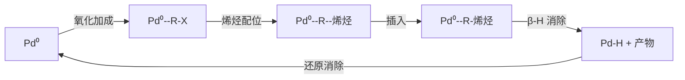

---
aliases:
  - Inorganic Synthesis and Important Compounds
  - 无机合成
  - 配位化合物
  - 金属有机
tags:
  - chemistry
  - inorganic
  - synthesis
  - coordination
  - solid-state
---

# 无机合成与重要化合物 (Inorganic Synthesis and Important Compounds)

## 1 无机合成概论 (Introduction to Inorganic Synthesis)

### 1.1 合成方法分类 (Classification of Synthetic Methods)

| 方法 (Method) | 温度范围 | 典型产物 |
|---|---|---|
| 溶液法 (Solution) | RT–300°C | 配位化合物 |
| 水热/溶剂热 (Hydro/Solvothermal) | 100–400°C | 沸石、MOFs |
| 高温固相 (High-Temp Solid-State) | 500–2000°C | 陶瓷、超导体 |
| 气相法 (Vapor Phase) | 200–1200°C | 薄膜、纳米线 |
| 电化学法 (Electrochemical) | RT–200°C | 金属、合金 |

### 1.2 合成策略 (Synthetic Strategies)

软化学 (soft chemistry) 路线在温和条件下合成亚稳相 (metastable phases)。前驱体法 (precursor method) 通过分子前驱体热解获得目标产物。

## 2 配位化合物 (Coordination Compounds)

### 2.1 配位化学基础 (Fundamentals of Coordination Chemistry)

配位化合物由中心金属离子 (central metal ion) 和配体 (ligands) 通过配位键 (coordinate bond) 构成。

配位数 (coordination number) 与几何构型：

| 配位数 | 几何构型 | 示例 |
|---|---|---|
| 2 | 直线形 | $[Ag(NH_3)_2]^+$ |
| 4 | 四面体形 | $[Zn(NH_3)_4]^{2+}$ |
| 4 | 平面正方形 | $[Pt(NH_3)_4]^{2+}$ |
| 6 | 八面体形 | $[Co(NH_3)_6]^{3+}$ |

### 2.2 配体类型 (Ligand Types)

- 单齿配体 (monodentate): $NH_3$, $H_2O$, $Cl^-$, $CN^-$
- 双齿配体 (bidentate): en ($H_2NCH_2CH_2NH_2$), bipy
- 多齿配体 (polydentate): EDTA (六齿)
- 螯合配体 (chelating ligand): 形成螯合物 (chelate)

### 2.3 晶体场理论 (Crystal Field Theory)

八面体场中 $d$ 轨道分裂：

$$\Delta_{oct} = 10\ Dq$$

```mermaid
graph TD
  subgraph 自由离子
    A[d_xy d_xz d_yz d_{x²-y²} d_{z²}]
  end
  subgraph 八面体场
    B[e_g: d_{x²-y²}, d_{z²}] --- C[t₂g: d_xy, d_xz, d_yz]
  end
  A -->|Δ_oct| B
  A -->|Δ_oct| C
  B -->|能量升高| D[+0.6 Δ_oct]
  C -->|能量降低| E[-0.4 Δ_oct]
```

晶体场稳定化能 (CFSE, Crystal Field Stabilization Energy)：

$$CFSE = (-0.4n_{t_{2g}} + 0.6n_{e_g})\Delta_{oct}$$

### 2.4 配位化合物的颜色与磁性 (Color and Magnetism)

$d$-$d$ 跃迁产生颜色。高自旋 (high-spin) 和低自旋 (low-spin) 取决于 $\Delta_{oct}$ 与配对能 (pairing energy, $P$) 的比较：

- $\Delta_{oct} > P$: 低自旋
- $\Delta_{oct} < P$: 高自旋

## 3 金属有机化合物 (Organometallic Compounds)

### 3.1 18 电子规则 (18-Electron Rule)

稳定的金属有机化合物通常满足 18 电子规则：

$$n_{M} + 2n_L + n_{charge} = 18$$

其中 $n_M$ 为金属价电子数，$n_L$ 为配体提供的电子数。

### 3.2 重要配体

- CO (羰基, carbonyl): 端基或桥式配位
- Cp ($C_5H_5^-$, cyclopentadienyl): $\eta^5$ 配位
- PR$_3$ (膦, phosphine): $\sigma$ 给体
- 烯烃 (alkene): $\pi$ 配位 (Dewar-Chatt-Duncanson 模型)

### 3.3 有机金属反应类型

| 反应 (Reaction) | 描述 |
|---|---|
| 氧化加成 (Oxidative Addition) | $M + A-B \rightarrow M(A)(B)$ |
| 还原消除 (Reductive Elimination) | $M(A)(B) \rightarrow M + A-B$ |
| 插入反应 (Insertion) | $M-R + CO \rightarrow M-C(O)R$ |
| 转金属化 (Transmetalation) | $M-R + M'-X \rightarrow M-X + M'-R$ |
| 配体交换 (Ligand Exchange) | $ML_n + L' \rightarrow ML_{n-1}L' + L$ |

### 3.4 过渡金属催化循环 (Catalytic Cycle)

以 Heck 反应为例：



## 4 固相合成 (Solid-State Synthesis)

### 4.1 高温固相反应 (High-Temperature Solid-State Reactions)

固相反应包括扩散 (diffusion)、成核 (nucleation) 和生长 (growth) 三个阶段。反应动力学由扩散控制。

$$D = D_0\exp\left(-\frac{E_a}{RT}\right)$$

### 4.2 软化学法 (Soft Chemistry)

- 溶胶-凝胶法 (sol-gel): 前驱体水解缩聚
- 插层反应 (intercalation): 层状材料中插入客体
- 离子交换 (ion exchange)
- 前驱体分解 (precursor decomposition)

### 4.3 重要固相材料

沸石 (zeolites) 是微孔铝硅酸盐，具有分子筛效应：

$$M_{x/n}[(AlO_2)_x(SiO_2)_y]\cdot zH_2O$$

MOFs (Metal-Organic Frameworks) 由金属节点和有机连接体构成，比表面积可达 $>7000\ m^2/g$。

## 5 重要无机化合物 (Important Inorganic Compounds)

### 5.1 氧化物 (Oxides)

- 酸性氧化物: $CO_2$, $SO_3$, $P_4O_{10}$
- 碱性氧化物: $Na_2O$, $MgO$, $CaO$
- 两性氧化物: $Al_2O_3$, $ZnO$, $SnO_2$
- 过氧化物: $Na_2O_2$, $H_2O_2$

### 5.2 氢化物 (Hydrides)

- 离子型氢化物 (salt-like): $NaH$, $CaH_2$
- 共价型氢化物 (covalent): $CH_4$, $NH_3$, $H_2O$
- 金属型氢化物 (metallic): $TiH_2$, $PdH_{0.6}$

### 5.3 氮化物与碳化物 (Nitrides and Carbides)

氮化硼 ($BN$) 有多种晶型：六方 $h-BN$ (白色石墨) 和立方 $c-BN$ (硬度仅次于金刚石)。

碳化硅 ($SiC$) 是一种重要的宽带隙半导体。

## 6 纳米无机材料 (Nanostructured Inorganic Materials)

### 6.1 量子点 (Quantum Dots)

量子限域效应 (quantum confinement) 使带隙随尺寸变化：

$$E_g(R) = E_g(\infty) + \frac{h^2}{8\mu R^2} - \frac{1.786e^2}{4\pi\varepsilon\varepsilon_0 R}$$

### 6.2 合成方法

- 共沉淀法 (coprecipitation)
- 热分解法 (thermal decomposition)
- 模板法 (template synthesis)
- 自组装 (self-assembly)

## 7 生物无机化学 (Bioinorganic Chemistry)

### 7.1 金属酶 (Metalloenzymes)

| 酶 (Enzyme) | 金属 | 功能 |
|---|---|---|
| 血红蛋白 (Hemoglobin) | Fe | 氧气运输 |
| 碳酸酐酶 (Carbonic Anhydrase) | Zn | $CO_2$ 水合 |
| 固氮酶 (Nitrogenase) | Mo, Fe | $N_2 \rightarrow NH_3$ |
| 细胞色素 c (Cytochrome c) | Fe | 电子传递 |

### 7.2 金属药物 (Metallodrugs)

顺铂 (cisplatin, $cis-Pt(NH_3)_2Cl_2$) 是经典的抗癌药物，通过与 DNA 交联 (cross-linking) 发挥作用。

## 8 总结 (Summary)

无机合成从传统高温固相反应发展到软化学、纳米合成和绿色化学路线。配位化学和金属有机化学的发展促进了催化、材料和生命科学领域的进步。
