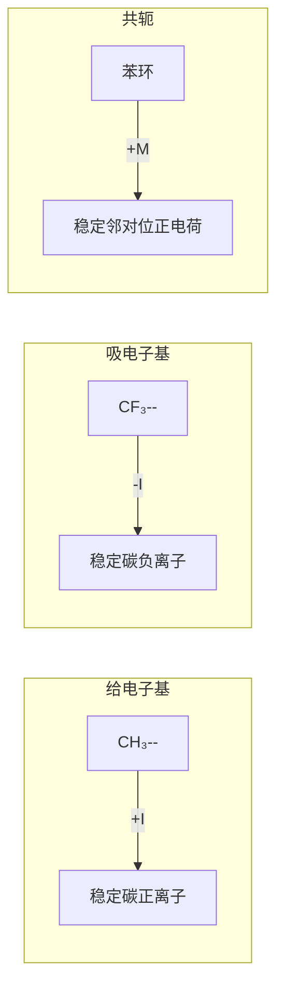
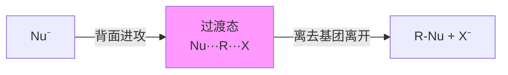
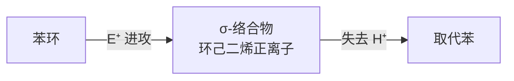

---
aliases:
  - Organic Reaction Mechanisms
  - 反应机理
  - 有机反应
tags:
  - chemistry
  - organic
  - mechanisms
  - kinetics
  - intermediates
---

# 有机反应机理 (Organic Reaction Mechanisms)

## 1 反应机理基础 (Fundamentals of Reaction Mechanisms)

### 1.1 热力学与动力学 (Thermodynamics vs. Kinetics)

反应速率 (reaction rate) 由过渡态 (transition state) 的活化能 (activation energy, $E_a$) 决定：

$$k = A\exp\left(-\frac{E_a}{RT}\right) \quad \text{(Arrhenius 方程)}$$

过渡态理论 (Transition State Theory, Eyring 方程)：

$$k = \frac{k_B T}{h}\exp\left(-\frac{\Delta G^\ddagger}{RT}\right)$$

其中 $\Delta G^\ddagger = \Delta H^\ddagger - T\Delta S^\ddagger$ 为 Gibbs 自由活化能。

Hammond 假说 (Hammond postulate) 指出过渡态的结构与能量相近的物种相似。

### 1.2 电子效应 (Electronic Effects)

诱导效应 (inductive effect, $I$): 电负性差异引起的电子沿 $\sigma$ 键的偏移。

共轭效应 (conjugation/resonance effect, $M$): 电子通过 $\pi$ 体系离域。



Hammett 方程定量描述取代基效应：

$$\log\frac{k_X}{k_H} = \sigma_X \rho$$

其中 $\sigma_X$ 为取代基常数 (substituent constant)，$\rho$ 为反应常数 (reaction constant)。

## 2 脂肪族亲核取代 (Aliphatic Nucleophilic Substitution)

### 2.1 $S_N1$ 机理

$S_N1$ (substitution nucleophilic unimolecular) 是两步反应：

$$R-X \xrightarrow{slow} R^+ + X^-$$

$$R^+ + Nu^- \xrightarrow{fast} R-Nu$$

速率方程：

$$rate = k[R-X]$$

立体化学 (stereochemistry): 外消旋化 (racemization) 为主。

碳正离子重排 (carbocation rearrangement) 可能发生：

$$CH_3CH_2CH_2Br \rightarrow CH_3\overset{+}{C}HCH_3 \rightarrow CH_3CH(Br)CH_3$$

### 2.2 $S_N2$ 机理

$S_N2$ (substitution nucleophilic bimolecular) 是协同过程 (concerted process)，Walden 反转 (inversion of configuration)：

$$Nu^- + R-X \rightarrow [Nu\cdots R\cdots X]^\ddagger \rightarrow R-Nu + X^-$$

速率方程：

$$rate = k[R-X][Nu^-]$$



### 2.3 $S_N1$ 与 $S_N2$ 的比较

| 特征 (Feature) | $S_N1$ | $S_N2$ |
|---|---|---|
| 动力学 | 一级反应 | 二级反应 |
| 立体化学 | 外消旋化 | Walden 反转 |
| 碳骨架 | 可重排 | 不重排 |
| 底物 | 叔卤代烃 > 仲 > 伯 | 伯 > 仲 > 叔 |
| 溶剂效应 | 极性溶剂促进 | 极性非质子溶剂促进 |

## 3 消除反应 (Elimination Reactions)

### 3.1 $E1$ 机理

$$R-X \xrightarrow{slow} R^+ + X^-$$

$$R^+ \xrightarrow{base} \text{烯烃} + H^+$$

遵循 Saytzeff 规则 (Zaitsev's rule): 生成更稳定的取代烯烃 (more substituted alkene)。

### 3.2 $E2$ 机理

协同的反式消除 (anti-periplanar elimination)：

$$B^- + H-C-C-X \rightarrow [B\cdots H\cdots C=C\cdots X]^\ddagger \rightarrow BH + C=C + X^-$$

立体化学要求 H 和 X 处于反式共平面 (anti-coplanar)。

Hofmann 消除 (Hofmann elimination) 使用大体积碱如 $t-BuO^-$，生成较少取代的烯烃。

### 3.3 取代与消除的竞争

| 条件 | $S_N$ | $E$ |
|---|---|---|
| 强亲核试剂 (弱碱) | 主要 | 次要 |
| 强碱 (弱亲核试剂) | 次要 | 主要 |
| 高温 | 减少 | 增加 |
| 位阻大的底物 | 减少 | 增加 |

## 4 加成反应 (Addition Reactions)

### 4.1 亲电加成 (Electrophilic Addition)

烯烃与 $X_2$ ($Br_2$, $Cl_2$) 的亲电加成通过环溴鎓离子 (bromonium ion) 中间体：

$$C=C + Br_2 \rightarrow [环状 Br^+ 中间体] \rightarrow \text{邻二溴化物}$$

产物为反式加成 (anti-addition)。

马氏规则 (Markovnikov's rule): 氢加到含氢更多的碳上，其他部分加到含氢更少的碳上。

过氧化物效应 (peroxide effect) 使 HBr 加成得到反马氏产物 (anti-Markovnikov product)。

### 4.2 亲核加成 (Nucleophilic Addition)

羰基的亲核加成：

$$R_2C=O + Nu^- \rightarrow R_2C(O^-)Nu \xrightarrow{H^+} R_2C(OH)Nu$$

| 亲核试剂 | 产物类型 |
|---|---|
| $H_2O$ | 偕二醇 (gem-diol) |
| $ROH$ | 缩醛 (acetal) |
| $NH_3$/$RNH_2$ | 亚胺 (imine) |
| $CN^-$ | 氰醇 (cyanohydrin) |
| $RMgX$ | 醇 (alcohol) |

### 4.3 环加成 (Cycloaddition)

Diels-Alder 反应是 $[4+2]$ 环加成，协同过程，立体专一：

```mermaid
graph TD
  A[共轭二烯] + B[亲双烯体] --> C[六元环产物]
  A -->|s-cis 构象| A1[反应活性构象]
  B -->|吸电子基| B1[加速反应]
```

## 5 芳族取代 (Aromatic Substitution)

### 5.1 亲电芳族取代 (Electrophilic Aromatic Substitution, $S_EAr$)

$$\text{ArH} + E^+ \rightarrow \text{ArE} + H^+$$

通过 $\sigma$ 络合物 (Wheland 中间体)：



活化基 (activating groups: $-OH$, $-NH_2$, $-OCH_3$) 为邻对位定位基。

钝化基 (deactivating groups: $-NO_2$, $-CN$, $-CHO$) 为间位定位基。

### 5.2 亲核芳族取代 (Nucleophilic Aromatic Substitution, $S_NAr$)

通过加成-消除机理 (addition-elimination)，$Meisenheimer$ 络合物中间体。

$$Ar-X + Nu^- \rightleftharpoons [Ar(Nu)(X)]^- \rightarrow Ar-Nu + X^-$$

吸电子基 ($-NO_2$, $-CN$) 在邻对位时加速反应。

## 6 重排反应 (Rearrangement Reactions)

### 6.1 碳正离子重排 (Carbocation Rearrangements)

1,2-迁移 (1,2-shift):

$$R-C^+H-CH_3 \rightarrow CH_3-C^+H-R$$

氢迁移 (hydride shift) 和烷基迁移 (alkyl shift) 按迁移能力排序：

$$H > CH_3 > C_2H_5 > \cdots$$

### 6.2 重要的重排反应

| 重排 (Rearrangement) | 起始物 | 产物 |
|---|---|---|
| Wagner-Meerwein | 醇 → 碳正离子 | 重排产物 |
| Beckmann | 肟 (oxime) | 酰胺 (amide) |
| Curtius | 酰基叠氮 (acyl azide) | 异氰酸酯 (isocyanate) |
| Claisen | 芳基烯丙基醚 | 烯丙基苯酚 |
| Cope | 1,5-二烯 | 同分异构的二烯 |

## 7 氧化与还原 (Oxidation and Reduction)

### 7.1 常用氧化剂

- $KMnO_4$: 烯烃顺式双羟基化 (syn-dihydroxylation)
- $OsO_4$: 顺式双羟基化
- $CrO_3$/Jones 试剂: 伯醇 → 羧酸，仲醇 → 酮
- $PCC$ (pyridinium chlorochromate): 伯醇 → 醛

### 7.2 常用还原剂

- $LiAlH_4$ (LAH): 强还原剂，可还原酯、羧酸
- $NaBH_4$: 温和还原，选择性还原醛酮
- $H_2/Pd-C$: 催化加氢 (catalytic hydrogenation)
- $Na/NH_3$ (Birch reduction): 芳环还原为 1,4-环己二烯

## 8 自由基反应 (Radical Reactions)

### 8.1 自由基的稳定性

$$CH_3\dot{\phantom{m}} < 1^\circ < 2^\circ < 3^\circ < \text{烯丙基} \approx \text{苄基}$$

### 8.2 自由基链反应 (Radical Chain Reactions)

烷烃的卤化：

$$\text{Initiation: } X_2 \xrightarrow{h\nu} 2X\cdot$$

$$\text{Propagation: } R-H + X\cdot \rightarrow R\cdot + HX$$

$$R\cdot + X_2 \rightarrow R-X + X\cdot$$

$$\text{Termination: } 2R\cdot \rightarrow R-R$$

$$X\cdot + R\cdot \rightarrow R-X$$

$$2X\cdot \rightarrow X_2$$

## 9 总结 (Summary)

有机反应机理是理解有机化学的核心。从 $S_N1/S_N2$ 到周环反应 (pericyclic reactions)，电子效应和立体化学共同决定了反应的路径与产物选择性。
