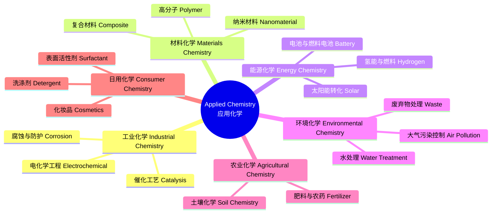

---
aliases: [AppliedChemistry, YingYongHuaXue]
tags: ['Chemistry/PhysicalChemistry/AppliedChemistry', 'IndustrialChemistry']
---

# 应用化学 (Applied Chemistry)

## 概述 (Overview)

应用化学 (Applied Chemistry) 是将化学基本原理和知识应用于解决实际问题的学科方向。它连接化学基础研究与工业、医药、农业、材料、能源等领域的实际需求，是化学从实验室走向社会生产的关键桥梁。应用化学涵盖催化、材料合成、能源转化、环境治理、分析检测和工艺优化等多个方向。

## 应用化学领域体系 (Discipline System)

## 催化化学 (Catalysis)

催化是应用化学的核心领域，涉及化工生产中约 85% 的工艺。催化剂通过降低反应活化能来提高反应速率：

$$\Delta E_a = E_a^{\text{uncat}} - E_a^{\text{cat}}$$

### 均相催化 (Homogeneous Catalysis)

催化剂与反应物处于同一相。典型例子包括过渡金属配合物催化的烯烃聚合和氢甲酰化反应。均相催化的特点是选择性高、反应条件温和，但催化剂分离回收困难。

### 多相催化 (Heterogeneous Catalysis)

催化剂与反应物处于不同相，工业中最为常见。关键概念包括吸附等温式和反应动力学。朗缪尔等温式 (Langmuir Isotherm)：

$$\theta = \frac{KP}{1 + KP}$$

其中 $\theta$ 是表面覆盖率，$K$ 是吸附平衡常数，$P$ 是气体压力。Langmuir-Hinshelwood 动力学模型描述表面双分子反应：

$$r = \frac{k K_A K_B P_A P_B}{(1 + K_A P_A + K_B P_B)^2}$$

### 酶催化 (Enzyme Catalysis)

米氏方程 (Michaelis-Menten Equation)：

$$v = \frac{V_{\max}[S]}{K_m + [S]}$$

其中 $V_{\max}$ 是最大反应速率，$K_m$ 是米氏常数。酶的固定化技术将酶负载于固体载体上实现重复使用。

## 电化学工程 (Electrochemical Engineering)

电化学反应器设计的基础是法拉第定律 (Faraday's Laws)：

$$m = \frac{QM}{Fz}$$

其中 $Q$ 是电荷量，$M$ 是摩尔质量，$F = 96485\;\text{C/mol}$ 是法拉第常数，$z$ 是电子转移数。

### 电解工业 (Electrolysis Industry)

- **氯碱工业 (Chlor-Alkali)**：$2\text{NaCl} + 2\text{H}_2\text{O} \rightarrow \text{Cl}_2 + \text{H}_2 + 2\text{NaOH}$
- **铝电解 (Hall-Héroult Process)**：$2\text{Al}_2\text{O}_3 + 3\text{C} \rightarrow 4\text{Al} + 3\text{CO}_2$
- **电镀 (Electroplating)**：在基材上沉积金属保护层，涉及阴极还原反应
- **电合成 (Electrosynthesis)**：利用电化学方法在温和条件下合成有机化合物，如己二腈的电解合成

## 高分子化学应用 (Polymer Applications)

合成高分子材料包括塑料 (Plastics)、橡胶 (Rubber) 和纤维 (Fibers)。聚合度 (Degree of Polymerization) $DP$ 与分子量的关系：

$$M_n = DP \times M_{\text{monomer}}$$

### 聚合反应类型

| 类型 | 机理 | 实例 |
|------|------|------|
| 自由基聚合 Free Radical | 引发-增长-终止 | 聚乙烯 PE |
| 缩合聚合 Condensation | 逐步缩合释放小分子 | 尼龙 Nylon |
| 开环聚合 Ring-Opening | 环状单体开环 | 聚乳酸 PLA |
| 配位聚合 Coordination | Ziegler-Natta 催化 | 聚丙烯 PP |

高分子材料的玻璃化转变温度 $T_g$ 是决定材料使用温度范围的关键参数。DSC 和 DMA 是测量 $T_g$ 的常用技术。

## 表面与界面化学 (Surface & Interface Chemistry)

接触角 (Contact Angle) 决定润湿性：

$$\gamma_{SG} - \gamma_{SL} = \gamma_{LG}\cos\theta_C \quad \text{(Young's Equation)}$$

临界胶束浓度 (Critical Micelle Concentration, CMC) 是表面活性剂的重要参数。表面活性剂在去污、乳化、润湿和起泡等过程中发挥关键作用。

## 工业分析化学 (Industrial Analytical Chemistry)

常用分析技术包括：色谱法 (HPLC, GC)、光谱法 (AAS, ICP-OES, FTIR)、电化学分析 (pH 计、离子选择电极) 和热分析 (TGA, DSC)。

## 绿色化学 (Green Chemistry)

绿色化学 12 项原则强调：原子经济性 (Atom Economy)、无害溶剂、可再生能源、可降解产品等。原子经济性定义为：

$$\text{Atom Economy} = \frac{\text{产物分子量}}{\sum \text{反应物分子量}} \times 100\%$$

E 因子 (E-Factor) 衡量每千克产品产生的废弃物量：$\text{E-Factor} = \frac{\text{废弃物质量}}{\text{产品质量}}$。化工行业 E 因子差异巨大：石油炼制约 0.1，制药行业可达 25-100。

## 应用化学中的经典工艺 (Classic Processes)

- **哈柏法 (Haber Process)** 合成氨：$\text{N}_2 + 3\text{H}_2 \rightleftharpoons 2\text{NH}_3$，铁催化剂，400-500°C, 150-200 atm
- **接触法制硫酸**：$2\text{SO}_2 + \text{O}_2 \rightarrow 2\text{SO}_3$，V₂O₅ 催化剂
- **费托合成 (Fischer-Tropsch)**：从合成气制烃类燃料，Co 或 Fe 催化剂
- **催化裂化 (FCC)**：将重质油裂解为汽油和轻质烯烃，沸石催化剂
- **加氢裂化 (Hydrocracking)**：生产柴油和航空煤油

## 应用化学中的单元操作 (Unit Operations)

### 传质过程

蒸馏 (Distillation) 利用挥发度差异分离混合物，包括精馏、减压蒸馏、共沸蒸馏。萃取 (Extraction) 利用溶解度差异分离液体混合物。吸收 (Absorption) 将气体组分转移到液体溶剂。吸附 (Adsorption) 利用固体表面吸附气体或溶质分子。膜分离 (Membrane Separation) 包括微滤、超滤、纳滤和反渗透。

### 反应器设计

PFR 的基本设计方程：

$$V = F_{A0}\int_0^{X_A}\frac{dX_A}{(-r_A)}$$

CSTR 的基本设计方程：

$$V = \frac{F_{A0}X_A}{(-r_A)}$$

其中 $V$ 是反应器体积，$F_{A0}$ 是进料摩尔流量，$X_A$ 是转化率，$r_A$ 是反应速率。

## 应用化学中的能源化学 (Energy Chemistry)

| 能源技术 | 关键材料 | 核心挑战 |
|----------|----------|----------|
| 锂离子电池 | LiCoO₂, LiFePO₄, NMC 811 | 能量密度、安全性 |
| 燃料电池 | Pt/C, 质子交换膜 | 催化剂成本、耐久性 |
| 电解水 | IrO₂ (OER), Pt (HER) | 过电位、贵金属用量 |
| 钙钛矿太阳能电池 | CH₃NH₃PbI₃ | 稳定性、大面积制备 |
| 超级电容器 | 活性炭、石墨烯、MXene | 能量密度 |

锂离子电池正极材料中，三元材料 (NMC 811) 能量密度高但热稳定性差。磷酸铁锂安全性好但能量密度较低。固态电解质是全固态电池的关键材料，包括硫化物、氧化物和聚合物电解质。

## 应用化学中的环境化学 (Environmental Chemistry)

水处理技术包括混凝-絮凝、活性炭吸附、膜过滤 (RO/NF) 和高级氧化工艺 (AOP)。AOP 基于羟基自由基 (·OH) 的高氧化电位降解难处理有机物。大气污染物控制包括选择性催化还原 (SCR) 脱硝、湿法脱硫 (FGD) 和 VOCs 催化燃烧。土壤修复技术包括土壤淋洗、生物修复 (Bioremediation) 和热脱附。固废处理从填埋向资源化利用转型，包括焚烧发电、热解气化和厌氧消化。

## 应用化学中的材料制备方法 (Materials Preparation)

- **溶胶-凝胶法 (Sol-Gel)**：从前驱体溶液经水解缩合形成凝胶网络
- **水热法 (Hydrothermal)**：高温高压下在水溶液中进行晶体生长
- **化学气相沉积 (CVD)**：气态前驱体在基底表面反应形成薄膜
- **电化学沉积 (Electrodeposition)**：通过电解在电极表面沉积金属或合金
- **模板法 (Template Method)**：使用介孔模板合成纳米结构材料
- **自组装 (Self-Assembly)**：分子通过非共价作用自发形成有序结构

## 应用化学中的质量与法规 (Quality & Regulations)

良好生产规范 (GMP) 用于药品和食品添加剂的生产管理，涵盖人员、厂房、设备、物料和生产过程等方面。ISO 9001 质量管理体系确保产品质量一致性。ISO 14001 环境管理体系规范企业的环境行为。REACH 法规要求对欧盟市场化学品进行注册、评估、授权和限制。中国相关法规包括《危险化学品安全管理条例》和 GB 食品安全标准系列。职业接触限值 (OEL) 规定工作场所空气中化学物质的允许浓度。

## 应用化学前沿 (Frontiers)

- **点击化学 (Click Chemistry)**：高效、高选择性的模块化合成策略，2022 年诺贝尔化学奖
- **流动化学 (Flow Chemistry)**：连续流反应器实现高效合成和放大
- **人工智能辅助化学**：机器学习预测反应产率和设计分子结构
- **可持续化学 (Sustainable Chemistry)**：生物质转化、CO₂ 捕集与利用
- **电催化转化**：将 CO₂ 电还原为高值化学品和燃料
- **生物制造**：利用工程微生物生产化学品、材料和燃料

## 应用化学中的工业自动化 (Industrial Automation)

过程分析技术 (PAT) 实时监控生产质量。近红外光谱 (NIR) 在线检测成分。拉曼光谱用于反应过程监控。自动取样系统与在线 HPLC 联用。工业机器人实现危险化学品操作自动化。数字孪生 (Digital Twin) 和 AI 优化生产参数。工业 4.0 中的物联网 (IoT) 传感器和数据分析实现智能工厂。过程控制中使用 PID 控制器维持反应条件稳定。

## 应用化学中的安全与伦理 (Safety & Ethics)

化学安全包括实验室安全（MSDS 安全数据表、PPE 个人防护装备）、工艺安全（HAZOP 危险与可操作性分析）和环境安全（EHS 管理体系）。化学废液处理遵循分类收集、合规处置原则。REACH 法规和 GB/T 标准对化学品注册和评估有明确规定。职业接触限值 (OEL) 规定了工作场所空气中化学物质的允许浓度。职业道德要求化学工作者对公众健康和环境负责，遵循 Responsible Care 全球宪章。

## 应用化学中的前沿技术 (Emerging Technologies)

流动化学 (Flow Chemistry) 使用连续流反应器实现高效合成和工艺放大，具有传热传质效率高、安全风险低、易于自动化的优势。微反应器 (Microreactor) 的通道尺寸在微米量级，比表面积大、混合效率高。光电催化 (Photoelectrocatalysis) 结合光催化和电催化的优势，在太阳能燃料合成中展现潜力。点击化学 (Click Chemistry) 的 CuAAC 反应在药物发现和材料科学中广泛应用。生物正交化学 (Bioorthogonal Chemistry) 在活体标记和药物递送中有重要应用。

## 相关条目 (See Also)

- [[../INDEX|物理化学]]
- [[../OrganicChemistry/INDEX|有机化学]]
- [[../../../INDEX|知识库首页]]
