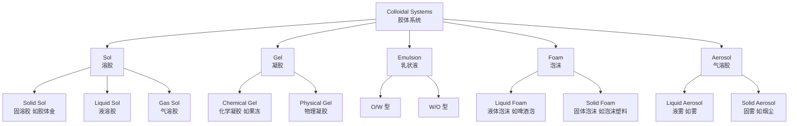

---
aliases: [ColloidChemistry, JiaoTiHuaXue]
tags: ['Chemistry/PhysicalChemistry/ColloidChemistry', 'PhysicalChemistry']
---

# 胶体化学 (Colloid Chemistry)

## 概述 (Overview)

胶体化学 (Colloid Chemistry) 研究分散体系中粒径在 1 nm 至 1 μm 之间的粒子系统。胶体系统在日常生活中无处不在，从牛奶、血液到烟雾、泡沫均属于胶体体系。胶体化学连接了分子科学和宏观材料科学，在材料、医药、食品和环境科学中有广泛应用。其核心问题包括胶体的制备、稳定性、表面性质和流变行为。

## 胶体系统分类 (Classification of Colloidal Systems)

## 胶体系统的热力学基础 (Thermodynamic Fundamentals)

胶体系统的吉布斯自由能 (Gibbs Free Energy) 由界面能主导。系统的总界面能为：

$$G_{\text{interface}} = \gamma \cdot A$$

其中 $\gamma$ 是表面张力 (Surface Tension), $A$ 是总界面面积。由于胶体粒子具有巨大比表面积，界面能的贡献不可忽略。胶体系统是热力学亚稳态，其稳定性来源于动力学障碍而非热力学最低能量。

## 胶体稳定性 (Colloidal Stability)

### DLVO 理论 (DLVO Theory)

Derjaguin-Landau-Verwey-Overbeek (DLVO) 理论是解释胶体稳定性的经典理论。粒子间的总相互作用势能为范德华吸引势和静电排斥势之和：

$$V_{\text{total}} = V_{\text{vdW}} + V_{\text{electrostatic}}$$

范德华吸引势 (van der Waals Attraction):

$$V_{\text{vdW}} = -\frac{A_H}{12\pi h^2}$$

其中 $A_H$ 是哈马克常数 (Hamaker Constant), $h$ 是粒子间距。

静电排斥势 (Electrostatic Repulsion):

$$V_{\text{electrostatic}} = 2\pi\varepsilon_r\varepsilon_0 a \zeta^2 e^{-\kappa h}$$

其中 $\zeta$ 是 Zeta 电位 (Zeta Potential), $\kappa^{-1}$ 是德拜屏蔽长度 (Debye Screening Length):

$$\kappa = \sqrt{\frac{2N_A e^2 I}{\varepsilon_r\varepsilon_0 k_B T}}$$

当总势能曲线出现势垒 (Energy Barrier) 时，胶体系统稳定；势垒消失时发生快速聚集。

### 聚集动力学 (Aggregation Kinetics)

快速聚集由斯莫鲁霍夫斯基方程 (Smoluchowski Equation) 描述：

$$\frac{dn}{dt} = -k_f n^2$$

慢速聚集的反应速率受能量势垒控制：

$$W = \frac{k_{\text{fast}}}{k_{\text{slow}}} = 2a\int_{2a}^{\infty} \frac{\exp(V_{\text{total}}/k_B T)}{r^2}\,dr$$

其中 $W$ 是稳定性比 (Stability Ratio)，衡量能量势垒对聚集速率的减缓程度。

## 表面活性剂 (Surfactants)

表面活性剂是两亲性分子，具有亲水头基和疏水尾链。其自组装行为形成多种聚集体结构。

### 临界胶束浓度 (Critical Micelle Concentration)

表面张力随浓度变化的规律由吉布斯吸附等温式 (Gibbs Adsorption Isotherm) 描述：

$$\Gamma = -\frac{1}{RT}\frac{d\gamma}{d\ln C}$$

胶束化热力学参数：

$$\Delta G_{\text{mic}}^0 = RT\ln(\text{CMC})$$

### 亲水-亲油平衡值 (HLB)

HLB 值用于选择乳化剂：

$$\text{HLB} = 20 \times \frac{M_{\text{hydrophilic}}}{M_{\text{total}}}$$

| HLB 范围 | 应用场景 |
|----------|----------|
| 3-6 | W/O 乳化剂 |
| 7-9 | 润湿剂 |
| 8-18 | O/W 乳化剂 |
| 13-15 | 洗涤剂 |
| 15-18 | 增溶剂 |

### 表面活性剂的自组装结构

除球状胶束外，表面活性剂可形成棒状胶束、层状相、六角相和囊泡等多种有序结构。堆积参数 (Packing Parameter) $P = v/(a_0 l_c)$ 预测自组装形貌：$P < 1/3$ 形成球状胶束，$1/3 < P < 1/2$ 形成棒状胶束，$1/2 < P < 1$ 形成囊泡，$P \approx 1$ 形成层状相。

## 乳状液 (Emulsions)

乳状液是两种不互溶液体的分散体系。乳化剂在油-水界面上形成吸附膜来稳定乳状液。班克罗夫特规则 (Bancroft's Rule) 指出倾向于形成连续相的乳化剂更有利于稳定该类型的乳状液。

### 乳化类型与识别

O/W 和 W/O 类型的识别可通过染料溶解度测试或电导率测量。多重乳状液 (Multiple Emulsions) 如 W/O/W 和 O/W/O 在缓释递送中有重要应用。Pickering 乳液使用固体颗粒代替表面活性剂稳定液滴，利用固体颗粒在界面上的不可逆吸附。

### 乳液失稳机制

乳液的失稳过程包括：分层 (Creaming/Sedimentation)、絮凝 (Flocculation)、聚并 (Coalescence) 和奥斯特瓦尔德熟化 (Ostwald Ripening)。奥斯特瓦尔德熟化速率由 LSW 理论 (Lifshitz-Slyozov-Wagner Theory) 描述：

$$\bar{r}^3 - \bar{r}_0^3 = \frac{8\gamma D C_\infty v_m^2}{9RT}t$$

## 凝胶 (Gels)

凝胶是三维网络结构中含有大量液体的软物质。凝胶的分类包括：

- **化学凝胶 (Chemical Gels)**：通过共价键交联，不可逆，如聚丙烯酰胺凝胶
- **物理凝胶 (Physical Gels)**：通过氢键、离子键或疏水作用交联，可逆，如明胶

凝胶的弹性模量可由橡胶弹性理论描述：

$$G = \frac{\rho RT}{M_c}$$

其中 $\rho$ 是密度，$M_c$ 是交联点间分子量。

### 凝胶的流变特性

凝胶的粘弹性通过储能模量 $G'$ 和损耗模量 $G''$ 表征。当 $G' > G''$ 时表现为类固体行为。凝胶的溶胀行为由 Flory-Rehner 理论描述，平衡溶胀度取决于混合自由能和弹性自由能的平衡。

## 胶体的表征技术 (Characterization Techniques)

| 技术 | 测量参数 | 原理 |
|------|----------|------|
| 动态光散射 DLS | 粒径及分布 | 布朗运动-自相关函数 |
| Zeta 电位仪 | 表面电荷 | 电泳光散射 |
| 小角 X 射线散射 SAXS | 纳米结构 | X 射线散射 |
| 流变仪 Rheometer | 粘度、模量 | 剪切与形变 |
| 透射电镜 TEM | 形貌与结构 | 电子成像 |
| 原子力显微镜 AFM | 表面形貌 | 探针扫描 |

## 胶体化学的应用 (Applications)

- **食品科学**：乳液稳定剂（蛋黄酱、冰淇淋）、泡沫（奶油）
- **制药工业**：药物递送系统（脂质体、纳米乳）、悬浮剂
- **石油工业**：钻井液、三次采油用表面活性剂
- **环境工程**：水处理中的絮凝与凝聚、油污分散剂
- **日化产品**：洗发水、化妆品乳霜、洗涤剂配方

## 胶体晶体 (Colloidal Crystals)

胶体粒子在适当条件下可以自组装形成有序三维结构，称为胶体晶体。胶体晶体的晶格间距与可见光波长相当，会产生布拉格衍射，呈现结构色。蛋白石 (Opal) 是自然界中胶体晶体的典型例子。人造胶体晶体可用于光子晶体、传感器和显示器件。胶体晶体的组装机制包括熵驱动结晶 (Entropy-Driven Crystallization) 和静电相互作用调控。

## 微乳液与纳米乳液 (Microemulsions & Nanoemulsions)

微乳液是热力学稳定的各向同性透明分散体系，液滴尺寸在 5-100 nm 范围。纳米乳液液滴尺寸 20-200 nm，呈动力学稳定而非热力学稳定。微乳液在纳米材料合成（作为纳米反应器）、三次采油和药物递送中有重要应用。自微乳化药物递送系统 (SMEDDS) 可提高疏水性药物的口服生物利用度。微乳液的结构类型包括 O/W 型、W/O 型和双连续型 (Bicontinuous)，由 Winsor 相图描述。

## 脂质体与药物递送 (Liposomes & Drug Delivery)

脂质体是由磷脂双分子层构成的球形囊泡，可包裹亲水性和疏水性药物。脂质体分类：多层脂质体 (MLV, 0.1-5 μm)、大单层脂质体 (LUV, >100 nm) 和小单层脂质体 (SUV, 20-100 nm)。PEG 化脂质体 (Stealth Liposomes) 通过空间稳定作用延长体内循环时间。靶向脂质体表面连接配体实现主动靶向递送。阳离子脂质体用于基因递送（非病毒载体）。脂质体的药物释放速率由膜组成和制备方法决定。

## 胶体化学中的著名现象 (Famous Phenomena)

- **丁达尔效应 (Tyndall Effect)**：光通过胶体时被散射形成可见光路，用于区分胶体与真溶液
- **布朗运动 (Brownian Motion)**：胶体粒子的随机运动，1905 年由爱因斯坦和斯莫卢霍夫斯基给出理论解释
- **电泳 (Electrophoresis)**：带电胶体粒子在电场中的定向迁移，用于分离和表征
- **电渗 (Electroosmosis)**：电场作用下液体相对于固定带电表面的流动
- **沉降电位 (Sedimentation Potential)**：带电粒子沉降时产生的电势
- **流动电位 (Streaming Potential)**：液体流过固定带电表面时产生的电势

## 胶体化学在生物系统中的应用 (Colloids in Biology)

细胞质是复杂的生物胶体系统。细胞膜的脂质双分子层构成液晶态结构。血液是细胞和蛋白质胶体的分散体系。蛋白质的胶体稳定性影响其生物功能。生物大分子（DNA、蛋白质、多糖）的胶体特性决定了其在溶液中的行为。乳状液在消化过程中起重要作用。粘液 (Mucus) 是典型的生物凝胶。生物膜中的脂质筏 (Lipid Rafts) 可视为膜内纳米尺度的相分离现象。

## 胶体化学的重要理论与方程 (Key Equations)

斯托克斯-爱因斯坦方程（扩散系数与粒径关系）：

$$D = \frac{k_B T}{6\pi\eta r}$$

斯托克斯定律（粒子沉降速率）：

$$v = \frac{2}{9}\frac{(\rho_p - \rho_f)gr^2}{\eta}$$

爱因斯坦-斯莫卢霍夫斯基方程（布朗运动均方位移）：

$$\langle x^2 \rangle = 2Dt$$

## 胶体化学中的纳米颗粒合成 (Nanoparticle Synthesis)

纳米颗粒合成方法分为自上而下 (Top-Down) 和自下而上 (Bottom-Up) 两类。LaMer 模型描述单体浓度随时间的变化：成核爆发后进入生长阶段。Ostwald 熟化导致小颗粒溶解、大颗粒长大。Seeded Growth 方法制备核壳结构纳米颗粒。Brus 公式计算半导体纳米晶的尺寸依赖带隙：

$$E_g(R) = E_g(\infty) + \frac{\hbar^2\pi^2}{2\mu R^2} - \frac{1.8e^2}{4\pi\epsilon_0\epsilon R}$$

## 相关条目 (See Also)

- [[../PhysicalChemistry|物理化学]]
- [[../../../INDEX|知识库首页]]
