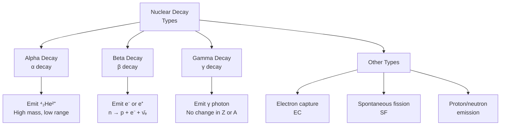
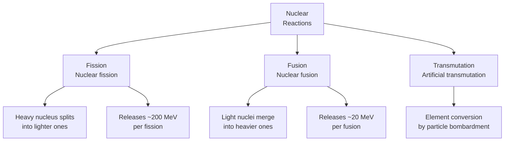
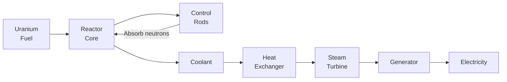

# 核化学 (Nuclear Chemistry)

## 一、概述 (Overview)

**核化学 (Nuclear Chemistry)** 研究原子核的变化及其伴随的物理化学过程，涵盖**放射性 (Radioactivity)**、**核反应 (Nuclear Reactions)**、**核能 (Nuclear Energy)** 以及**辐射化学 (Radiation Chemistry)**。

### 1.1 核化学 vs 普通化学

| 特征 | 普通化学 | 核化学 |
|------|--------|--------|
| 涉及区域 | 电子层 | 原子核 |
| 能量变化 | eV 级别 | MeV 级别 |
| 元素变化 | 不变 | 核转变 |
| 反应速率 | 温控 | 不受温控 |
| 链式反应 | 罕见 | 核裂变特征 |

### 1.2 核力 (Nuclear Force)

原子核由**强相互作用 (Strong Nuclear Force)** 维持，是已知四种基本力中最强的：

$$ E = mc^2 \quad \text{(质能等价，爱因斯坦方程)} $$

其中 $E$ 为能量，$m$ 为质量亏损，$c$ 为光速。

$$ \Delta E = \Delta m \cdot c^2 $$

核结合能 (Nuclear Binding Energy) 的发现解释了稳定的元素组成。

## 二、放射性衰变 (Radioactive Decay)

### 2.1 衰变类型

### 2.2 Alpha 衰变

**α 衰变 (Alpha Decay)**：发射一个 α 粒子（⁴₂He 核）：

$$ ^A_Z\text{X} \to ^{A-4}_{Z-2}\text{Y} + ^4_2\alpha $$

**示例**：$$ ^{238}_{92}\text{U} \to ^{234}_{90}\text{Th} + ^4_2\alpha $$

**特点**：
- 质量数减少 4，原子序数减少 2
- α 粒子穿透力弱但电离能力强
- 常见于重元素 (Z > 82)

### 2.3 Beta 衰变

**β⁻ 衰变**：中子转化为质子：

$$ ^A_Z\text{X} \to ^A_{Z+1}\text{Y} + e^- + \bar{\nu}_e $$

**β⁺ 衰变**：质子转化为中子：

$$ ^A_Z\text{X} \to ^A_{Z-1}\text{Y} + e^+ + \nu_e $$

**电子捕获 (Electron Capture, EC)**：

$$ ^A_Z\text{X} + e^- \to ^A_{Z-1}\text{Y} + \nu_e $$

### 2.4 Gamma 衰变

γ 衰变发射高能光子，通常伴随 α 或 β 衰变：

$$ ^A_Z\text{X}^* \to ^A_Z\text{X} + \gamma $$

**特点**：
- 原子序数和质量数不变
- 穿透力最强
- 需要厚铅或混凝土屏蔽

### 2.5 衰变定律

放射性衰变遵循**一级动力学 (First-order Kinetics)**：

$$ \frac{dN}{dt} = -\lambda N $$

积分得：

$$ N(t) = N_0 e^{-\lambda t} $$

其中 $\lambda$ 为衰变常数 (Decay Constant)。

| 概念 | 公式 | 含义 |
|------|------|------|
| 半衰期 | $t_{1/2} = \frac{\ln 2}{\lambda} = \frac{0.693}{\lambda}$ | 半数原子衰变所需时间 |
| 平均寿命 | $\tau = \frac{1}{\lambda} = \frac{t_{1/2}}{\ln 2}$ | 原子平均存活时间 |
| 活度 | $A = \lambda N = A_0 e^{-\lambda t}$ | 单位时间衰变数 |

### 2.6 放射系 (Radioactive Series)

自然界存在三个主要放射系：

| 系列 | 起始核素 | 最终核素 | 半衰期 (起始) |
|------|---------|---------|-------------|
| 铀系 | ²³⁸U | ²⁰⁶Pb | 4.47 × 10⁹ 年 |
| 钍系 | ²³²Th | ²⁰⁸Pb | 1.41 × 10¹⁰ 年 |
| 锕铀系 | ²³⁵U | ²⁰⁷Pb | 7.04 × 10⁸ 年 |

## 三、核反应 (Nuclear Reactions)

### 3.1 反应类型

### 3.2 核裂变 (Nuclear Fission)

$$ ^{235}_{92}\text{U} + n \to ^{141}_{56}\text{Ba} + ^{92}_{36}\text{Kr} + 3n + \text{能量} $$

**链式反应 (Chain Reaction)**：

$$ \text{一个中子} \to \text{裂变} \to 2\text{-}3\text{个中子} \to \text{更多裂变} \to \text{能量释放} $$

**临界质量 (Critical Mass)**：维持自持链式反应所需的最小裂变材料质量。

$$ \text{Subcritical} < \text{Critical} = \text{Supercritical} $$

### 3.3 核聚变 (Nuclear Fusion)

$$ ^2_1\text{H} + ^3_1\text{H} \to ^4_2\text{He} + n + 17.6\ \text{MeV} $$

**太阳中的质子-质子链 (pp-chain)**：

$$ ^1_1\text{H} + ^1_1\text{H} \to ^2_1\text{H} + e^+ + \nu_e + 0.42\ \text{MeV} $$
$$ ^2_1\text{H} + ^1_1\text{H} \to ^3_2\text{He} + \gamma + 5.49\ \text{MeV} $$
$$ ^3_2\text{He} + ^3_2\text{He} \to ^4_2\text{He} + 2^1_1\text{H} + 12.86\ \text{MeV} $$

| 特征 | 裂变 | 聚变 |
|------|------|------|
| 原料 | 铀/钚 | 氘/氚 |
| 原料储量 | 有限 | 几乎无限（海水中） |
| 放射性废物 | 高放 | 低放 |
| 温度要求 | 常温 | 数千万度 |
| 技术现状 | 成熟 | 实验阶段 |

## 四、核反应堆 (Nuclear Reactors)

### 4.1 基本原理

### 4.2 反应堆类型

| 类型 | 冷却剂 | 慢化剂 | 特点 |
|------|--------|--------|------|
| PWR (压水堆) | 水 | 水 | 最广泛 |
| BWR (沸水堆) | 水 | 水 | 直接产汽 |
| CANDU | 重水 | 重水 | 可用天然铀 |
| FBR (快堆) | 钠 | 无 | 增殖燃料 |
| HTGR | 氦 | 石墨 | 高温高效 |

## 五、辐射与防护 (Radiation & Protection)

### 5.1 辐射单位

| 量 | 单位 (SI) | 定义 |
|---|-----------|------|
| 活度 | Becquerel (Bq) | 每秒一次衰变 |
| 吸收剂量 | Gray (Gy) | 每千克吸收 1 J |
| 当量剂量 | Sievert (Sv) | Gy × 辐射权重因子 |
| 有效剂量 | Sv | 各器官当量剂量 × 组织权重因子 |

### 5.2 辐射防护三原则

$$ \text{时间} + \text{距离} + \text{屏蔽} = \text{防护} $$

1. **Time (时间)**：减少暴露时间
2. **Distance (距离)**：距离增加一倍，剂量率降至 1/4 (平方反比定律)
3. **Shielding (屏蔽)**：α-纸张，β-塑料/铝，γ-铅/混凝土

$$ I = \frac{I_0}{r^2} $$

### 5.3 生物效应

| 剂量 (Sv) | 效应 |
|-----------|------|
| < 0.1 | 无临床可见症状 |
| 0.1 — 0.5 | 血液指标变化 |
| 0.5 — 2 | 恶心、疲劳 |
| 2 — 6 | 急性辐射综合征 |
| > 6 | 致死率高 |

## 六、核化学应用 (Applications)

### 6.1 放射性定年

**碳-14 定年法 (Radiocarbon Dating)**：

$$ ^{14}_6\text{C} \to ^{14}_7\text{N} + e^- + \bar{\nu}_e $$

$$ t = \frac{1}{\lambda} \ln \left( \frac{N_0}{N} \right) $$

### 6.2 医学应用

| 应用 | 同位素 | 用途 |
|------|--------|------|
| PET 扫描 | ¹⁸F | 肿瘤成像 |
| SPECT | ⁹⁹ᵐTc | 器官功能成像 |
| 放疗 | ⁶⁰Co | 肿瘤治疗 |
| 碘治疗 | ¹³¹I | 甲状腺疾病 |

### 6.3 工业应用

- 射线照相 (Radiography)：检测焊接缺陷
- 辐照灭菌 (Sterilization)：医疗用品消毒
- 核能发电：全球约 10% 电力
- 中子活化分析：痕量元素检测

## 七、安全与废物 (Safety & Waste)

### 7.1 核废料分类

| 分类 | 放射性水平 | 半衰期 | 处理方式 |
|------|-----------|--------|---------|
| 低放 (LLW) | 低 | 短 | 浅地处置 |
| 中放 (ILW) | 中 | 中 | 深层处置 |
| 高放 (HLW) | 高 | 极长 | 地质处置库 |

### 7.2 三个里程碑事故

1. **切尔诺贝利 (1986)**：设计缺陷 + 操作错误
2. **三哩岛 (1979)**：冷却系统故障
3. **福岛第一核电站 (2011)**：海啸导致全厂断电

## 八、关键公式速查 (Key Formulas)

$$ N = N_0 e^{-\lambda t}, \quad t_{1/2} = \frac{\ln 2}{\lambda} $$

$$ E = mc^2, \quad Q = (m_{\text{反应前}} - m_{\text{反应后}})c^2 $$

$$ A = \lambda N = A_0 e^{-\lambda t} $$

---

[[02_NaturalSciences/Chemistry/PhysicalChemistry/INDEX|当前目录索引]]
