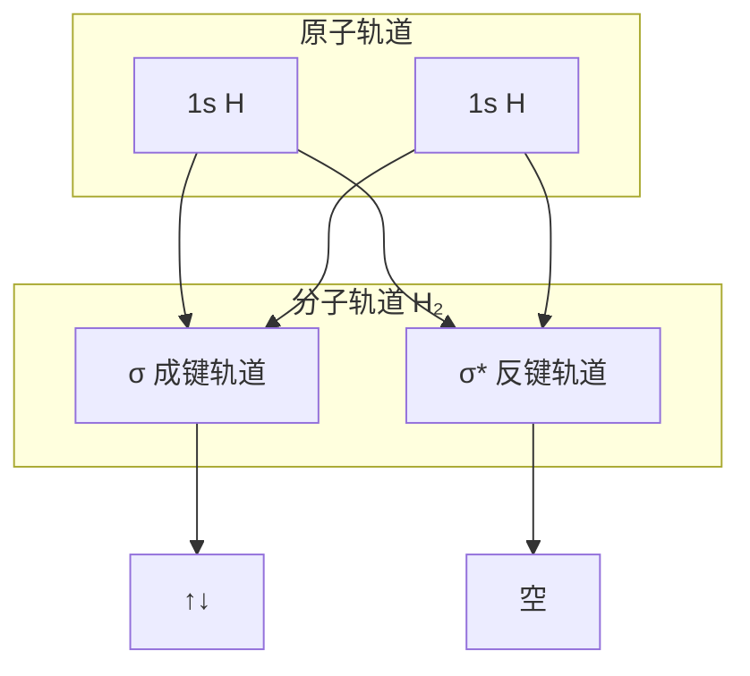

---
aliases:
  - 量子化学
  - Quantum Chemistry
  - 薛定谔方程
  - 分子轨道理论
  - DFT
  - 从头算方法
  - Hartree-Fock
tags:
  - chemistry/physical-chemistry
  - quantum-chemistry
  - computational-chemistry
  - DFT
  - ab-initio
  - molecular-orbital
  - Schrödinger-equation
---

# 量子化学 (Quantum Chemistry)

量子化学是运用量子力学（quantum mechanics）基本原理研究化学体系的结构、性质与反应行为的学科。1926 年 Schrödinger 方程的提出标志着量子化学的诞生，如今已发展成为化学研究的核心理论工具之一。

## 薛定谔方程 (Schrödinger Equation)

量子化学的根基是薛定谔方程，描述微观粒子的波函数（wavefunction）随时间的演化。

### 含时与定态 Schrödinger 方程

含时 Schrödinger 方程（time-dependent Schrödinger equation, TDSE）：

$$
i\hbar \frac{\partial}{\partial t} \Psi(\mathbf{r}, t) = \hat{H} \Psi(\mathbf{r}, t)
$$

定态（time-independent）Schrödinger 方程（TISE）：

$$
\hat{H} \Psi(\mathbf{r}) = E \Psi(\mathbf{r})
$$

其中哈密顿算符（Hamiltonian operator）$\hat{H}$ 包含动能和势能项：

$$
\hat{H} = -\frac{\hbar^2}{2m} \nabla^2 + V(\mathbf{r})
$$

### 波函数的物理意义

波函数 $\Psi$ 本身不可观测，其模平方 $|\Psi|^2$ 表示概率密度（probability density）：

$$
\int |\Psi(\mathbf{r}, t)|^2 d^3\mathbf{r} = 1
$$

## 分子轨道理论 (Molecular Orbital Theory)

分子轨道（molecular orbital, MO）是描述电子在分子中分布的波函数，由原子轨道（atomic orbital, AO）线性组合而成。

### 原子轨道线性组合 (LCAO)

分子轨道 $\psi_i$ 表示为原子轨道 $\phi_\mu$ 的线性组合：

$$
\psi_i = \sum_{\mu} c_{\mu i} \phi_\mu
$$

结合成键轨道（bonding orbital）和反键轨道（antibonding orbital）的能级分裂取决于重叠积分 $S_{\mu\nu}$：

$$
S_{\mu\nu} = \int \phi_\mu^* \phi_\nu d\tau
$$

### 键级与电子排布

键级（bond order, BO）衡量化学键强度：

$$
\text{BO} = \frac{N_{bonding} - N_{antibonding}}{2}
$$

### 分子轨道能级图示例

## Hartree-Fock 方法 (Hartree-Fock Method)

HF 方法将多电子波函数近似为单个 Slater 行列式（Slater determinant），通过自洽场（self-consistent field, SCF）迭代求解。

### Fock 方程

HF 中每个电子在平均场中运动，其 Fock 算符 $\hat{f}$ 为：

$$
\hat{f}(i) = -\frac{1}{2} \nabla_i^2 - \sum_A \frac{Z_A}{r_{iA}} + \sum_{j \neq i} \left[ \hat{J}_j(i) - \hat{K}_j(i) \right]
$$

其中 $\hat{J}_j$ 为 Coulomb 算符（电子-电子库仑斥力），$\hat{K}_j$ 为交换算符（exchange operator，起源于 Pauli 不相容原理）。

### HF 方法的局限性

HF 完全忽略电子相关（electron correlation）效应：

$$
E_{corr} = E_{exact} - E_{HF}
$$

## 后 Hartree-Fock 方法 (Post-HF Methods)

| 方法 | 原理 | 相关能恢复 | 计算复杂度 |
|------|------|-----------|-----------|
| MP2 (Møller-Plesset) | 微扰理论 | ~ 80% | O(N⁵) |
| CCSD(T) | 耦合簇理论 | ~ 99% | O(N⁷) |
| CI (组态相互作用) | 线性展开激发行列式 | ~ 100% | O(N!) |
| CASSCF | 多组态 SCF | 活性空间内全 CI | O(N!) |

## 密度泛函理论 (Density Functional Theory, DFT)

DFT 以电子密度 $\rho(\mathbf{r})$ 为基本变量，替代复杂的多电子波函数。

### Hohenberg-Kohn 定理

第一定理：基态电子密度 $\rho_0(\mathbf{r})$ 唯一确定外势 $V_{ext}$ 和所有基态性质。

第二定理：存在能量泛函 $E[\rho]$，基态密度使能量最小化：

$$
E[\rho] = T[\rho] + V_{ee}[\rho] + \int \rho(\mathbf{r}) v_{ext}(\mathbf{r}) d\mathbf{r}
$$

### Kohn-Sham 方程

KS 引入参考的非相互作用体系，将能量分解为：

$$
E[\rho] = T_s[\rho] + E_H[\rho] + E_{xc}[\rho] + \int \rho(\mathbf{r}) v_{ext}(\mathbf{r}) d\mathbf{r}
$$

交换相关泛函 $E_{xc}[\rho]$ 包含交换能和相关能校正。KS 轨道方程：

$$
\left[ -\frac{1}{2} \nabla^2 + v_{eff}(\mathbf{r}) \right] \phi_i^{KS}(\mathbf{r}) = \epsilon_i \phi_i^{KS}(\mathbf{r})
$$

### 泛函的 Jacob 阶梯

常见泛函：B3LYP（杂化）、PBE（GGA）、M06-2X（meta-GGA）、ωB97X-D（长程校正）。

## 势能面与振动频率

势能面（potential energy surface, PES）描述分子能量随核坐标的变化：

$$
E = f(\mathbf{R}_1, \mathbf{R}_2, \dots, \mathbf{R}_N)
$$

谐振频率由 Hessian 矩阵（力常数矩阵）的本征值给出：

$$
\omega_i = \frac{1}{2\pi c} \sqrt{\frac{k_i}{\mu_i}}
$$

## 溶剂效应模型

| 模型 | 分类 | 原理 |
|------|------|------|
| PCM | 隐式 | 连续介质极化电荷 |
| SMD | 隐式 | 基于溶剂描述符的线性拟合 |
| COSMO | 隐式 | 导体屏蔽导体 |
| QM/MM | 显式-隐式混合 | 量子力学区 + 分子力学区 |

## 专业名词对照表

| 中文 | English | 缩写 |
|------|---------|------|
| 波函数 | Wavefunction | Ψ |
| 电子密度 | Electron Density | ρ |
| 交换相关泛函 | Exchange-Correlation Functional | XC |
| 基组 | Basis Set | — |
| 自洽场 | Self-Consistent Field | SCF |
| 势能面 | Potential Energy Surface | PES |
| 过渡态 | Transition State | TS |
| 内禀反应坐标 | Intrinsic Reaction Coordinate | IRC |

## 参考与延伸阅读

- Schrödinger, E. (1926). *Annalen der Physik*, 384, 361–376.
- Hartree, D. R. (1928). *Mathematical Proceedings of the Cambridge Philosophical Society*, 24, 89–110.
- Kohn, W. & Sham, L. J. (1965). *Physical Review*, 140, A1133.
- Hohenberg, P. & Kohn, W. (1964). *Physical Review*, 136, B864.
- Parr, R. G. & Yang, W. *Density-Functional Theory of Atoms and Molecules*. Oxford, 1989.
