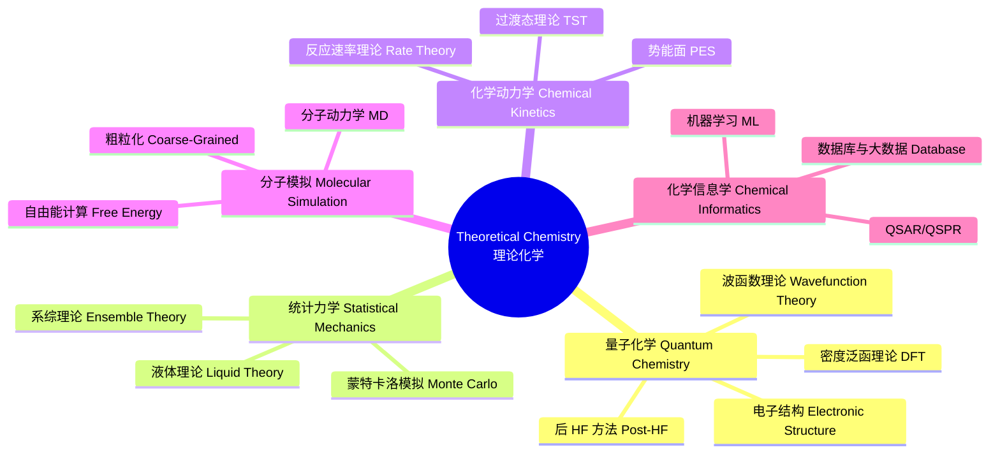

---
aliases: [TheoreticalChemistry, LiLunHuaXue]
tags: ['Chemistry/PhysicalChemistry/TheoreticalChemistry', 'PhysicalChemistry']
---

# 理论化学 (Theoretical Chemistry)

## 概述 (Overview)

理论化学 (Theoretical Chemistry) 使用数学和物理学原理来解释和预测化学现象。与实验化学互补，理论化学通过建立模型和计算方法揭示分子层次的结构与反应规律。理论化学包括量子化学、统计力学、化学动力学、分子模拟和化学信息学等多个子领域。随着计算机性能的提升，理论化学在大分子体系、材料科学和药物设计中发挥越来越重要的作用。

## 理论化学体系 (Discipline System)

## 量子化学 (Quantum Chemistry)

### 薛定谔方程 (Schrödinger Equation)

定态薛定谔方程：

$$\hat{H}\Psi = E\Psi$$

含时薛定谔方程：

$$i\hbar\frac{\partial\Psi}{\partial t} = \hat{H}\Psi$$

### 玻恩-奥本海默近似 (Born-Oppenheimer Approximation)

将核运动与电子运动分离，电子波函数在固定核构型下求解。系统总哈密顿量：

$$\hat{H} = \hat{T}_e + \hat{T}_N + \hat{V}_{ee} + \hat{V}_{eN} + \hat{V}_{NN}$$

BO 近似下，电子波函数 $\psi_e(\mathbf{r};\mathbf{R})$ 参数依赖于核坐标 $\mathbf{R}$。

### 哈特里-福克方法 (Hartree-Fock Method)

HF 方程将多电子波函数表示为 Slater 行列式，通过自洽场迭代求解。Fock 算符：

$$\hat{F}_i = \hat{h}_i + \sum_j (\hat{J}_j - \hat{K}_j)$$

其中 $\hat{J}_j$ 是库伦算符，$\hat{K}_j$ 是交换算符。HF 方法的电子相关能缺失由后 HF 方法补偿。

## 密度泛函理论 (Density Functional Theory)

DFT 以电子密度 $\rho(\mathbf{r})$ 为基本变量代替多电子波函数。Kohn-Sham 方程：

$$\left[-\frac{\hbar^2}{2m}\nabla^2 + V_{\text{eff}}(\mathbf{r})\right]\phi_i(\mathbf{r}) = \varepsilon_i\phi_i(\mathbf{r})$$

交换相关泛函 $E_{\text{xc}}[\rho]$ 是 DFT 精度关键。Jacob 阶梯分类：

| 泛函层级 | 示例 | 描述 |
|----------|------|------|
| LDA | SVWN | 局域密度近似 |
| GGA | PBE, BLYP | 广义梯度近似 |
| Meta-GGA | TPSS, M06-L | 含动能密度 |
| Hybrid | B3LYP, PBE0 | 混合 HF 交换 |
| Double Hybrid | B2PLYP | 含 MP2 相关 |

## 后 HF 方法 (Post-HF Methods)

组态相互作用 (Configuration Interaction)：

$$|\Psi_{\text{CI}}\rangle = c_0|\Phi_0\rangle + \sum_i\sum_a c_i^a|\Phi_i^a\rangle + \sum_{i<j}\sum_{a<b} c_{ij}^{ab}|\Phi_{ij}^{ab}\rangle + \cdots$$

耦合簇方法 (Coupled Cluster) 是高精度计算的黄金标准：

$$|\Psi_{\text{CC}}\rangle = e^{\hat{T}}|\Phi_0\rangle,\quad \hat{T} = \hat{T}_1 + \hat{T}_2 + \hat{T}_3 + \cdots$$

CCSD(T) 即包含单、双激发及微扰三激发，被称为量子化学的"金标准"。

## 统计热力学 (Statistical Thermodynamics)

### 正则系综 (Canonical Ensemble)

正则配分函数：

$$Q(N,V,T) = \sum_i e^{-\beta E_i}$$

其中 $\beta = 1/k_B T$。亥姆霍兹自由能与配分函数的关系：

$$A = -k_B T \ln Q$$

分子配分函数可分解为平动、转动、振动和电子贡献：

$$q = q_{\text{trans}} \cdot q_{\text{rot}} \cdot q_{\text{vib}} \cdot q_{\text{elec}}$$

平动配分函数：

$$q_{\text{trans}} = \left(\frac{2\pi mk_B T}{h^2}\right)^{3/2}V$$

转动配分函数（双原子分子）：

$$q_{\text{rot}} = \frac{T}{\sigma\Theta_{\text{rot}}},\quad \Theta_{\text{rot}} = \frac{h^2}{8\pi^2 Ik_B}$$

振动配分函数：

$$q_{\text{vib}} = \frac{e^{-\beta h\nu/2}}{1 - e^{-\beta h\nu}}$$

### 化学平衡常数

从配分函数计算平衡常数：

$$K_{\text{eq}} = \frac{q_{\text{products}}}{q_{\text{reactants}}} e^{-\Delta E_0/k_B T}$$

## 反应速率理论 (Reaction Rate Theory)

### 过渡态理论 (Transition State Theory)

艾林方程 (Eyring Equation)：

$$k = \frac{k_B T}{h} e^{-\Delta G^\ddagger/RT}$$

其中 $\Delta G^\ddagger$ 是活化吉布斯自由能 (Gibbs Free Energy of Activation)：

$$\Delta G^\ddagger = \Delta H^\ddagger - T\Delta S^\ddagger$$

### RRKM 理论 (Rice-Ramsperger-Kassel-Marcus Theory)

描述单分子反应的微正则速率常数：

$$k(E) = \frac{W^\ddagger(E - E_0)}{h\rho(E)}$$

其中 $W^\ddagger$ 是过渡态的态数，$\rho(E)$ 是反应物的态密度。

### 马库斯理论 (Marcus Theory)

马库斯电子转移理论描述外层电子转移反应速率：

$$k_{\text{ET}} = \frac{2\pi}{\hbar}|H_{AB}|^2 \frac{1}{\sqrt{4\pi\lambda k_B T}} \exp\left[-\frac{(\Delta G^\circ + \lambda)^2}{4\lambda k_B T}\right]$$

其中 $\lambda$ 是重组能 (Reorganization Energy)，$H_{AB}$ 是电子耦合矩阵元。

## 分子力学与力场 (Molecular Mechanics & Force Fields)

分子力学使用力场计算分子能量：

$$E = \sum_{\text{bonds}} k_r(r - r_0)^2 + \sum_{\text{angles}} k_\theta(\theta - \theta_0)^2 + \sum_{\text{dihedrals}} V_n[1 + \cos(n\phi - \gamma)] + \sum_{i<j} \left(\frac{A_{ij}}{r_{ij}^{12}} - \frac{B_{ij}}{r_{ij}^6} + \frac{q_iq_j}{4\pi\varepsilon_0 r_{ij}}\right)$$

常用力场：AMBER（适用于生物大分子）、CHARMM（适用于蛋白质和脂质）、OPLS（适用于有机小分子和蛋白质）、GROMOS（适用于溶液体系）。

## 分子动力学模拟 (Molecular Dynamics)

牛顿运动方程的数值积分。Verlet 积分算法：

$$\mathbf{r}_i(t + \Delta t) = 2\mathbf{r}_i(t) - \mathbf{r}_i(t - \Delta t) + \frac{\mathbf{F}_i(t)}{m_i}\Delta t^2 + O(\Delta t^4)$$

| 系综 | 控制量 | 应用场景 |
|------|--------|----------|
| NVE | 微正则 | 能量守恒模拟 |
| NVT | 正则（恒温） | 平衡性质计算 |
| NPT | 等温等压 | 凝聚相模拟 |
| NpH | 等焓等压 | 特殊条件适用 |

### 自由能计算方法

$$\Delta G = -k_B T \ln\left\langle \exp\left(-\frac{\Delta E}{k_B T}\right)\right\rangle_0$$

常用方法：热力学积分 (TI)、自由能微扰 (FEP)、伞形采样 (Umbrella Sampling)、Metadynamics、WHAM 分析方法。

## 激发态计算方法 (Excited State Methods)

- **CIS**：组态相互作用单重态，简单但精度有限
- **TD-DFT**：时变密度泛函理论，中小分子激发态首选，计算成本低
- **EOM-CCSD**：高精度激发能和振子强度计算
- **CASPT2 / NEVPT2**：多参考方法，处理近简并态电子结构
- **MCSCF**：多组态自洽场方法

溶剂效应对激发态的影响通过 PCM/TD-DFT 或 QM/MM 方法处理。

## 溶剂化模型 (Solvation Models)

隐式溶剂模型将溶剂视为连续介质。PCM (Polarizable Continuum Model)：

$$\Delta G_{\text{solv}} = \Delta G_{\text{electrostatic}} + \Delta G_{\text{cavity}} + \Delta G_{\text{dispersion}}$$

显式溶剂模型使用大量溶剂分子模拟，计算精度高但成本大。QM/MM 方法将活性区用量子力学处理，周围环境用分子力学处理。

## 化学反应性指标 (Reactivity Descriptors)

基于概念 DFT 的反应性指标：

- **电负性 (Electronegativity)**：$\chi = -\left(\frac{\partial E}{\partial N}\right)_{v(\vec{r})}$
- **化学硬度 (Chemical Hardness)**：$\eta = \frac{1}{2}\left(\frac{\partial^2 E}{\partial N^2}\right)_{v(\vec{r})}$
- **亲电指数 (Electrophilicity Index)**：$\omega = \frac{\mu^2}{2\eta}$

## 理论化学软件 (Software Packages)

| 软件 | 主要方法 | 适用领域 |
|------|----------|----------|
| Gaussian | HF, DFT, MP2, CCSD(T) | 小分子气液相化学 |
| ORCA | HF, DFT, CASSCF, CCSD(T) | 过渡金属配合物 |
| VASP | 平面波 DFT | 固体、表面催化 |
| CP2K | GPW DFT, AIMD | 大体系、溶液 |
| GROMACS | MD, FEP | 蛋白质模拟 |
| LAMMPS | MD, CG | 材料、粗粒化 |
| AMBER | MD, FEP | 生物分子模拟 |

## 理论化学中的机器学习 (Machine Learning in Theoretical Chemistry)

机器学习力场 (ML-FFs) 以量子化学精度模拟大体系。代表性方法包括高维神经网络势 (HDNNP)、高斯近似势 (GAP)、SchNet、DimeNet 和 NequIP 等消息传递神经网络。DeepMD 将 DFT 精度扩展到百万原子模拟。主动学习 (Active Learning) 自动扩展训练数据的化学空间覆盖。

## 相关条目 (See Also)

- [[../INDEX|物理化学]]
- [[../../../INDEX|知识库首页]]
