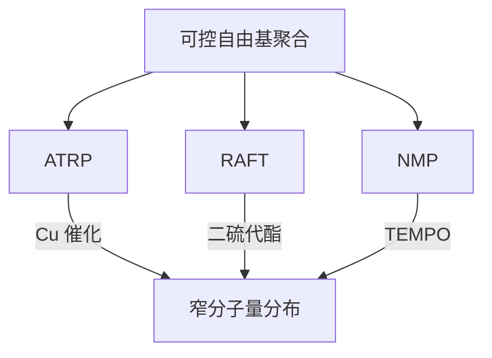
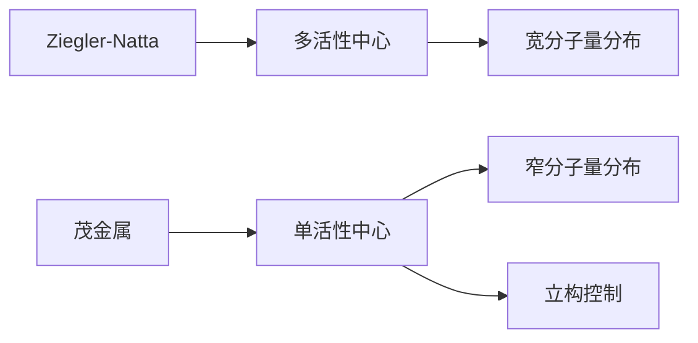
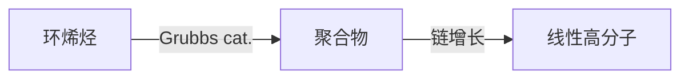

---
aliases:
  - Principles of Polymerization
  - 聚合反应
  - 高分子化学
  - 聚合动力学
tags:
  - chemistry
  - polymer
  - polymerization
  - kinetics
  - materials
---

# 聚合反应原理 (Principles of Polymerization)

## 1 高分子化学概论 (Introduction to Polymer Chemistry)

### 1.1 基本概念 (Basic Concepts)

高分子 (polymer, macromolecule) 是由重复单元 (repeat unit) 通过共价键连接而成的长链分子。聚合度 (degree of polymerization, $DP$) 是聚合物链中重复单元的数目。

分子量 (molecular weight) 的统计平均值：

数均分子量 (number-average molecular weight, $\bar{M}_n$):

$$\bar{M}_n = \frac{\sum N_i M_i}{\sum N_i}$$

重均分子量 (weight-average molecular weight, $\bar{M}_w$):

$$\bar{M}_w = \frac{\sum N_i M_i^2}{\sum N_i M_i}$$

分子量分布 (PDI, Polydispersity Index):

$$PDI = \frac{\bar{M}_w}{\bar{M}_n}$$

### 1.2 聚合反应分类 (Classification of Polymerization)

| 类型 (Type) | 特征 | 示例 |
|---|---|---|
| 链增长聚合 (Chain-Growth) | 含活性中心 | 自由基、离子、配位 |
| 逐步增长聚合 (Step-Growth) | 官能团反应 | 聚酯、聚酰胺 |
| 开环聚合 (Ring-Opening) | 环状单体 | 聚己内酰胺 |
| 缩合聚合 (Condensation) | 有小分子脱除 | 聚对苯二甲酸乙二醇酯 |

## 2 自由基聚合 (Free Radical Polymerization)

### 2.1 聚合机理 (Mechanism)

自由基聚合包括引发 (initiation)、增长 (propagation)、终止 (termination) 和链转移 (chain transfer) 步骤。

引发：

$$I \xrightarrow{k_d} 2R\cdot$$

$$R\cdot + M \xrightarrow{k_i} M_1\cdot$$

增长：

$$M_n\cdot + M \xrightarrow{k_p} M_{n+1}\cdot$$

终止：

$$M_n\cdot + M_m\cdot \xrightarrow{k_{tc}} P_{n+m} \quad \text{(偶合终止, combination)}$$

$$M_n\cdot + M_m\cdot \xrightarrow{k_{td}} P_n + P_m \quad \text{(歧化终止, disproportionation)}$$

### 2.2 聚合动力学 (Kinetics)

稳态近似 (steady-state approximation, $d[R\cdot]/dt = 0$)：

$$R_p = k_p[M]\left(\frac{fk_d[I]}{k_t}\right)^{1/2}$$

其中 $R_p$ 为聚合速率，$f$ 为引发效率 (initiator efficiency)。

聚合度 (degree of polymerization)：

$$\bar{DP}_n = \frac{k_p[M]}{2(fk_d k_t[I])^{1/2}}$$

### 2.3 链转移 (Chain Transfer)

链转移常数 $C$：

$$C_S = \frac{k_{tr,S}}{k_p}$$

DP 的修正：

$$\frac{1}{\bar{DP}_n} = \frac{1}{\bar{DP}_{n0}} + C_M + C_S\frac{[S]}{[M]} + C_I\frac{[I]}{[M]}$$

### 2.4 可控自由基聚合 (Controlled Radical Polymerization)

ATRP (Atom Transfer Radical Polymerization):

$$P_n-X + Cu(I)/L \rightleftharpoons P_n\cdot + Cu(II)X/L$$

RAFT (Reversible Addition-Fragmentation chain Transfer):

$$P_n\cdot + S=C(Z)S-P_m \rightleftharpoons P_n-S-C(Z)S-P_m \rightarrow P_n-S-C(Z)=S + P_m\cdot$$

## 3 离子聚合 (Ionic Polymerization)

### 3.1 阳离子聚合 (Cationic Polymerization)

适用于给电子单体 (electron-donating monomers): 异丁烯 (isobutylene), 苯乙烯, 乙烯基醚。

引发剂: Lewis 酸 ($BF_3$, $AlCl_3$) + 共引发剂 (水、醇)。

增长通过碳正离子活性中心：

$$M_n^+ + M \rightarrow M_{n+1}^+$$

### 3.2 阴离子聚合 (Anionic Polymerization)

适用于吸电子单体 (electron-withdrawing monomers): 苯乙烯, 丁二烯, 甲基丙烯酸甲酯。

引发剂: 有机锂 (n-BuLi), 萘钠 (sodium naphthalenide)。

活性聚合 (living polymerization) — 无终止，可精确控制分子量：

$$\bar{DP}_n = \frac{[M]_0 - [M]}{[I]_0}$$

## 4 逐步增长聚合 (Step-Growth Polymerization)

### 4.1 线型逐步聚合 (Linear Step-Growth)

反应程度 (extent of reaction, $p$)：

$$p = \frac{N_0 - N}{N_0}$$

Carothers 方程：

$$\bar{DP}_n = \frac{1}{1 - p}$$

分子量随 $p$ 急剧增长：

| $p$ | $\bar{DP}_n$ | $\bar{M}_n$ (假设 $M_0=100$) |
|---|---|---|
| 0.90 | 10 | 1000 |
| 0.99 | 100 | 10000 |
| 0.999 | 1000 | 100000 |

### 4.2 重要逐步聚合反应

| 聚合物 | 单体 | 反应 |
|---|---|---|
| 聚酯 (Polyester, PET) | 对苯二甲酸 + 乙二醇 | 酯化 |
| 聚酰胺 (Polyamide, Nylon-66) | 己二酸 + 己二胺 | 酰胺化 |
| 聚碳酸酯 (Polycarbonate) | 双酚 A + 光气 | 界面缩聚 |
| 聚酰亚胺 (Polyimide) | 二酐 + 二胺 | 两步法 |

### 4.3 凝胶点预测 (Gel Point Prediction)

Flory 凝胶点 (gel point) 理论：

$$p_c = \frac{1}{r + r\rho(f-2)}$$

其中 $r$ 为官能团摩尔比，$\rho$ 为多官能团单体比例，$f$ 为官能度 (functionality)。

## 5 配位聚合 (Coordination Polymerization)

### 5.1 Ziegler-Natta 催化剂

Ziegler-Natta 催化剂 ($TiCl_4/AlEt_3$) 实现丙烯的等规聚合 (isotactic polymerization)。

### 5.2 茂金属催化剂 (Metallocene Catalysts)

茂金属催化剂 $Cp_2ZrCl_2/MAO$ 可实现立构规整性 (stereoregularity) 的精确控制。

### 5.3 开环易位聚合 (ROMP, Ring-Opening Metathesis Polymerization)

Grubbs 催化剂 ($Ru$ 卡宾) 催化降冰片烯 (norbornene) 等的 ROMP：

## 6 共聚合 (Copolymerization)

### 6.1 共聚物类型 (Types of Copolymers)

| 类型 (Type) | 序列 (Sequence) |
|---|---|
| 无规共聚物 (Random) | $AABABBABAA$ |
| 交替共聚物 (Alternating) | $ABABABABAB$ |
| 嵌段共聚物 (Block) | $AAAA-BBBB-AAAA$ |
| 接枝共聚物 (Graft) | 主链 A, 支链 B |

### 6.2 共聚物组成方程 (Copolymer Composition Equation)

Mayo-Lewis 方程：

$$\frac{d[A]}{d[B]} = \frac{[A]}{[B]} \cdot \frac{r_A[A] + [B]}{r_B[B] + [A]}$$

其中 $r_A = k_{AA}/k_{AB}$, $r_B = k_{BB}/k_{BA}$ 为竞聚率 (reactivity ratios)。

### 6.3 竞聚率与共聚行为

| 条件 | 共聚类型 |
|---|---|
| $r_A \approx r_B \approx 1$ | 理想共聚 (random) |
| $r_A \approx r_B \approx 0$ | 交替共聚 (alternating) |
| $r_A \gg 1, r_B \ll 1$ | $A$ 优先均聚 |
| $r_A \cdot r_B = 1$ | 理想共聚 |

## 7 聚合反应工程 (Polymerization Reaction Engineering)

### 7.1 聚合方法 (Polymerization Methods)

- 本体聚合 (bulk polymerization)
- 溶液聚合 (solution polymerization)
- 悬浮聚合 (suspension polymerization)
- 乳液聚合 (emulsion polymerization)

### 7.2 乳液聚合动力学 (Emulsion Polymerization Kinetics)

Smith-Ewart 理论：

$$R_p = k_p[M]_p \frac{\bar{n}N_p}{N_A}$$

其中 $\bar{n}$ 为每个粒子中自由基平均数，$N_p$ 为粒子数。

## 8 聚合物的表征 (Polymer Characterization)

### 8.1 分子量测定方法

| 方法 | 测定对象 | 范围 |
|---|---|---|
| 凝胶渗透色谱 (GPC/SEC) | $\bar{M}_n, \bar{M}_w$ | $10^3-10^7$ |
| 光散射 (LS) | $\bar{M}_w$ | $10^4-10^7$ |
| 渗透压法 (Osmometry) | $\bar{M}_n$ | $10^4-10^6$ |
| 粘度法 (Viscometry) | $\bar{M}_v$ | $10^4-10^7$ |

### 8.2 热分析 (Thermal Analysis)

玻璃化转变温度 ($T_g$) 和熔点 ($T_m$) 由 DSC (Differential Scanning Calorimetry) 测定。

Fox 方程预测无规共聚物 $T_g$：

$$\frac{1}{T_g} = \frac{w_A}{T_{g,A}} + \frac{w_B}{T_{g,B}}$$

## 9 总结 (Summary)

聚合反应原理涵盖从自由基聚合到配位聚合的多种机理。分子量及其分布的控制、共聚物组成和序列分布、以及聚合方法的选择是高分子材料设计的关键。
