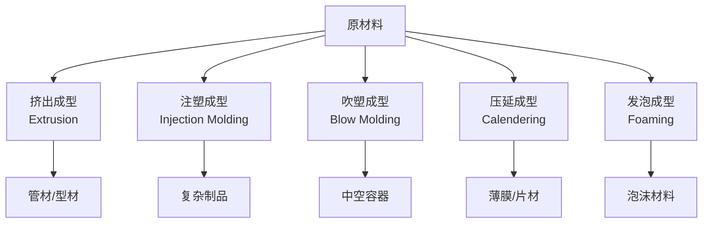

---
aliases:
  - 高分子材料
  - 聚合物工程
  - 塑料工程
  - 高分子应用
tags:
  - chemistry
  - polymer-chemistry
  - materials-science
  - plastics
  - composites
  - elastomers
---

# 高分子材料与应用 (Polymer Materials and Applications)

## 1 概述 (Overview)

高分子材料按用途和性能可分为塑料 (Plastics)、橡胶 (Rubber / Elastomers)、纤维 (Fibers)、涂料 (Coatings)、胶黏剂 (Adhesives) 和复合材料 (Composites)。全球年产量超过 4 亿吨，是现代工业的支柱材料之一。

### 1.1 高分子基本概念

高分子由重复单元 (Repeat Unit) 通过共价键连接而成：

$$ \text{聚合物: } [M]_n $$

其中 $M$ 为重复单元，$n$ 为聚合度 (Degree of Polymerization, DP)。数均分子量 $M_n$ 和重均分子量 $M_w$：

$$ M_n = \frac{\sum N_i M_i}{\sum N_i}, \quad M_w = \frac{\sum N_i M_i^2}{\sum N_i M_i} $$

分子量分布 (PDI)：

$$ \text{PDI} = \frac{M_w}{M_n} $$

## 2 塑料 (Plastics)

### 2.1 分类 (Classification)

| 类型 | 特征 | 代表材料 | 实例 |
|------|------|---------|------|
| 热塑性 (Thermoplastic) | 可反复熔融加工 | PE, PP, PVC, PET, PS | 瓶、管、膜 |
| 热固性 (Thermoset) | 交联不可逆 | 酚醛树脂, 环氧树脂 | 电路板、胶水 |
| 通用塑料 | 产量大、价格低 | PE, PP, PVC, PS | 包装、建筑 |
| 工程塑料 | 力学性能优异 | PC, PA, POM, PBT | 汽车、电子 |
| 特种塑料 | 耐高温、耐腐蚀 | PTFE, PEEK, PI | 航空、医疗 |

### 2.2 结晶性聚合物 (Crystalline Polymers)

结晶度 (Crystallinity, $X_c$) 对性能的影响：

$$ X_c = \frac{\Delta H_m}{\Delta H_m^0} \times 100\% $$

结晶度越高，材料越硬、越耐热，但越脆、透明度越低。

玻璃化转变温度 $T_g$ 和熔点 $T_m$ 是聚合物最重要的热转变温度：

$$ T_g < T_m \quad \text{(无定形区 vs 结晶区)} $$

### 2.3 加工方法 (Processing Methods)

## 3 橡胶与弹性体 (Rubber & Elastomers)

### 3.1 硫化 (Vulcanization)

古特异 (Charles Goodyear) 发明的硫化过程使天然橡胶从热塑性变为高弹性。硫化使分子链间形成交联 (Crosslinks)：

$$ \text{聚异戊二烯} + S_8 \xrightarrow{\Delta} \text{交联网状结构} $$

交联密度 $\nu$ 与弹性模量的关系 (Flory-Rehner 方程)：

$$ G = \nu k_B T $$

### 3.2 主要弹性体 (Major Elastomers)

| 名称 | 单体 | 特点 | 应用 |
|------|------|------|------|
| 天然橡胶 (NR) | 异戊二烯 | 高弹性、耐磨 | 轮胎、鞋底 |
| 丁苯橡胶 (SBR) | 丁二烯+苯乙烯 | 耐磨、耐老化 | 汽车轮胎 |
| 氯丁橡胶 (CR) | 氯丁二烯 | 耐油、耐候 | 密封条 |
| 硅橡胶 (VMQ) | 硅氧烷 | 耐高低温 | 医用导管 |
| 氟橡胶 (FKM) | 含氟单体 | 耐化学品 | 密封件 |
| 聚氨酯 (PU) | 异氰酸酯+多元醇 | 高耐磨、高弹性 | 滚轮、涂料 |

## 4 纤维 (Fibers)

### 4.1 合成纤维 (Synthetic Fibers)

| 纤维 | 单体 | 特点 | 用途 |
|------|------|------|------|
| 聚酯纤维 (PET) | 对苯二甲酸+乙二醇 | 强度高、抗皱 | 服装、瓶 |
| 尼龙 (PA) | 己二胺+己二酸 | 耐磨、弹性 | 袜子、绳索 |
| 聚丙烯腈纤维 (PAN) | 丙烯腈 | 柔软、保暖 | 毛衣、地毯 |
| 聚丙烯纤维 (PP) | 丙烯 | 质轻、耐水 | 无纺布 |
| 芳纶 (Kevlar) | 对苯二胺+对苯二甲酰氯 | 高强度、耐热 | 防弹衣 |

### 4.2 纤维力学 (Fiber Mechanics)

纤维的强度由分子取向度和结晶度决定。拉伸过程中分子链沿轴向取向，使杨氏模量显著增加。Kevlar 的比强度是钢的 5 倍：

$$ \frac{E_{\text{Kevlar}}}{\rho_{\text{Kevlar}}} \approx \frac{130\text{ GPa}}{1.44\text{ g/cm}^3} \gg \frac{E_{\text{steel}}}{\rho_{\text{steel}}} $$

## 5 复合材料 (Composites)

### 5.1 基体与增强体 (Matrix & Reinforcement)

复合材料由基体 (Matrix) 和增强体 (Reinforcement) 组成。混合定则 (Rule of Mixtures)：

$$ E_c = V_f E_f + (1 - V_f) E_m $$

### 5.2 主要类型 (Major Types)

| 类型 | 基体 | 增强体 | 应用 |
|------|------|-------|------|
| 玻璃钢 (GFRP) | 聚酯/环氧 | 玻璃纤维 | 船体、风叶 |
| 碳纤维复合材料 (CFRP) | 环氧 | 碳纤维 | 航空、赛车 |
| 木塑复合材料 (WPC) | 塑料 | 木粉 | 地板、护栏 |
| 层压板 | 酚醛/三聚氰胺 | 纸/布 | 台面、装饰板 |

## 6 高分子降解与老化 (Degradation & Aging)

### 6.1 降解类型 (Degradation Types)

- 热降解 (Thermal Degradation)：链断裂、解聚
- 光降解 (Photodegradation)：紫外线引发自由基
- 氧化降解 (Oxidative Degradation)：自动氧化循环
- 水解降解 (Hydrolytic Degradation)：酯键/酰胺键断裂
- 生物降解 (Biodegradation)：微生物酶催化

热降解的活化能由 Arrhenius 方程决定：

$$ t_f = A \exp\left(\frac{E_a}{RT}\right) $$

### 6.2 稳定剂 (Stabilizers)

- 抗氧剂 (Antioxidants)：受阻酚、亚磷酸酯
- 紫外线吸收剂 (UV Absorbers)：苯并三唑
- 光稳定剂 (HALS)：受阻胺
- 热稳定剂 (Thermal Stabilizers)：有机锡、金属皂
- 阻燃剂 (Flame Retardants)：卤系、磷系

## 7 高分子回收 (Polymer Recycling)

### 7.1 回收方法 (Recycling Methods)

| 方法 | 原理 | 适用材料 | 回收品质 |
|------|------|---------|---------|
| 机械回收 | 分选、清洗、再熔融 | PE, PP, PET | 降级 |
| 化学回收 | 解聚为单体 | PET, PA, PMMA | 等同 |
| 热解 | 热裂解为油/气 | 混合废塑料 | 燃料 |
| 能量回收 | 焚烧发电 | 不可回收塑料 | 能量 |

### 7.2 生物可降解高分子 (Biodegradable Polymers)

| 名称 | 来源 | 降解条件 | 应用 |
|------|------|---------|------|
| PLA (聚乳酸) | 玉米淀粉 | 工业堆肥 | 包装、3D 打印 |
| PHA (聚羟基脂肪酸酯) | 微生物发酵 | 土壤/海水 | 包装、医疗 |
| PBAT | 石油基 | 工业堆肥 | 可降解膜 |
| 淀粉基塑料 | 天然淀粉 | 堆肥 | 一次性餐具 |

## 8 功能高分子 (Functional Polymers)

- 导电高分子 (Conductive Polymers)：PEDOT:PSS, PANI
- 形状记忆高分子 (Shape Memory Polymers)：PU、交联 PE
- 水凝胶 (Hydrogels)：PVA、聚丙烯酰胺
- 高分子药物递送 (Polymeric Drug Delivery)：PLGA 纳米粒子
- 自修复高分子 (Self-Healing Polymers)：基于 Diels-Alder 反应

## 9 聚合反应方法 (Polymerization Methods)

### 9.1 逐步聚合与链式聚合

| 特征 | 逐步聚合 | 链式聚合 |
|------|---------|---------|
| 单体消耗 | 缓慢 | 快速 |
| 分子量增长 | 逐步 | 瞬间 |
| 代表 | 聚酯、聚酰胺 | 聚乙烯、聚苯乙烯 |

### 9.2 活性聚合 (Living Polymerization)

$$ M_n = \frac{[M]_0}{[I]_0} \times \text{转化率} \times M_0 $$

活性聚合可精确控制分子量和分子量分布 (PDI → 1)。

## 10 高分子流变学 (Polymer Rheology)

表观粘度 $\eta$ 与剪切速率 $\dot{\gamma}$ 的关系：

$$ \eta(\dot{\gamma}) = K \dot{\gamma}^{n-1} $$

其中 $n$ 为非牛顿指数，$n < 1$ 为剪切变稀，$n > 1$ 为剪切变稠。

---

[[02_NaturalSciences/Chemistry/PolymerChemistry/INDEX|当前目录索引]]
