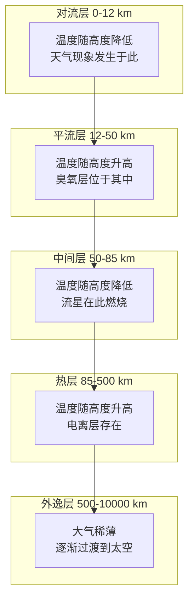

---
aliases:
  - 大气结构
  - 天气系统
  - 大气科学
  - Atmospheric Structure
  - Weather Systems
tags:
  - earth-sciences
  - atmospheric-science
  - meteorology
  - weather
  - climate
created: 2024-01-20
updated: 2024-07-10
---

# 大气结构与天气

## 大气的垂直分层

地球大气根据温度随高度的变化可分为五个基本层次：

### 对流层

对流层（troposphere）是大气最低层，从地面延伸至约 8-16 km 高度。对流层的特点包括：

- **温度递减率（lapse rate）**：平均每上升 100 m，温度下降约 $0.65^\circ\text{C}$
- **对流运动**：暖空气上升、冷空气下沉，形成垂直环流
- **天气现象**：所有云、降水、风暴均发生在对流层

对流层顶（tropopause）是对流层与平流层的分界面，其高度随纬度和季节变化。

### 平流层

平流层（stratosphere）位于对流层之上，约 12 km 至 50 km 高度：

- **温度逆增（temperature inversion）**：臭氧吸收紫外线导致温度随高度升高
- **臭氧层（ozone layer）**：集中在 15-35 km，吸收 95% 以上的 UV-B
- **平流**：气流以水平运动为主，垂直混合微弱

平流层顶（stratopause）是平流层与中间层的边界。

### 中间层

中间层（mesosphere）位于 50-85 km 高度：

- 温度随高度降低，中间层顶可达 $-90^\circ\text{C}$
- 流星进入大气层时在此层燃烧发光
- **夜光云（noctilucent clouds）**：出现在中间层顶附近

### 热层

热层（thermosphere）位于 85-500 km 高度：

- 温度可达 $1500^\circ\text{C}$ 以上（但空气稀薄，体感温度不高）
- **电离层（ionosphere）**：太阳辐射电离大气分子，影响无线电传播
- **极光（aurora）**：太阳风粒子与大气分子碰撞发光

### 外逸层

外逸层（exosphere）是大气的最外层，从 500 km 向上延伸至约 10000 km：

- 空气极为稀薄，分子可逃逸至太空
- 逐渐过渡到行星际空间

## 大气的成分

| 成分 | 化学式 | 体积占比 | 作用 |
|------|--------|----------|------|
| 氮气 | $N_2$ | 78.08% | 稀释氧气，维持大气压 |
| 氧气 | $O_2$ | 20.95% | 呼吸作用，燃烧 |
| 氩气 | $Ar$ | 0.93% | 惰性气体 |
| 二氧化碳 | $CO_2$ | 0.0415% | 温室效应，光合作用 |
| 水汽 | $H_2O$ | 0-4% | 降水，温室效应 |

### 臭氧

臭氧（ozone, $O_3$）主要分布在平流层，形成臭氧层。臭氧生成与分解的平衡：

$$
O_2 + h\nu \rightarrow 2O \quad (\lambda < 242\ \text{nm})
$$
$$
O + O_2 + M \rightarrow O_3 + M
$$
$$
O_3 + h\nu \rightarrow O + O_2 \quad (\lambda < 320\ \text{nm})
$$

臭氧层空洞（ozone hole）主要出现在南极上空，由氯氟烃（CFCs）催化分解臭氧所致：

$$
Cl + O_3 \rightarrow ClO + O_2
$$
$$
ClO + O \rightarrow Cl + O_2
$$

## 天气系统

### 气团

气团（air mass）是温度、湿度均匀的大块空气，根据源区性质分类：

| 气团类型 | 符号 | 性质 | 形成区域 |
|----------|------|------|----------|
| 极地大陆气团 | cP | 冷干 | 西伯利亚、加拿大 |
| 极地海洋气团 | mP | 冷湿 | 北大西洋、北太平洋 |
| 热带大陆气团 | cT | 热干 | 撒哈拉沙漠、阿拉伯 |
| 热带海洋气团 | mT | 热湿 | 副热带大洋 |

### 锋面

锋面（front）是不同性质气团的交界面：

- **冷锋（cold front）**：冷气团主动推进，天气剧烈
- **暖锋（warm front）**：暖气团主动推进，降水范围广
- **静止锋（stationary front）**：两侧气团势均力敌
- **锢囚锋（occluded front）**：冷锋追上暖锋，暖气团被抬升

冷锋过境时的气象要素变化：

$$
\frac{\partial T}{\partial t} < 0, \quad \frac{\partial P}{\partial t} > 0, \quad \frac{\partial RH}{\partial t} \rightarrow 100\%
$$

### 气旋

气旋（cyclone）是中心气压低于四周的天气系统：

#### 热带气旋

热带气旋（tropical cyclone）形成于温暖洋面（水温 $> 26.5^\circ\text{C}$），需具备以下条件：

1. 海面温度足够高
2. 科里奥利力足够强（纬度 $> 5^\circ$）
3. 垂直风切变小
4. 对流层中层湿度高

热带气旋的强度分类：

| 等级 | 最大风速 | 风暴潮高度 |
|------|----------|------------|
| 热带低压 | $< 63\ \text{km/h}$ | $< 1\ \text{m}$ |
| 热带风暴 | $63-118\ \text{km/h}$ | $1-2\ \text{m}$ |
| 台风/飓风 | $> 118\ \text{km/h}$ | $> 3\ \text{m}$ |

#### 温带气旋

温带气旋（extratropical cyclone）形成于极锋两侧，沿锋面波动发展：

### 反气旋

反气旋（anticyclone）是中心气压高于四周的系统，天气晴朗干燥。在反气旋中：

- 北半球：顺时针辐散气流
- 南半球：逆时针辐散气流
- 低层下沉运动，抑制云和降水

## 降水的形成

### 云微物理过程

降水的形成涉及两种主要机制：

**冷云过程（Bergeron process）**：

在 $0^\circ\text{C}$ 以下的云中，冰晶和过冷水滴共存时，由于饱和水汽压差异：

$$
e_{ice} < e_{water}
$$

水汽从过冷水滴向冰晶转移，冰晶长大形成雪花。

**暖云过程（collision-coalescence）**：

在 $0^\circ\text{C}$ 以上的云中，不同大小的水滴以不同速度下落并碰撞合并：

$$
\frac{dm}{dt} \propto E \cdot r^2 \cdot v_{rel}
$$

### 降水类型

| 降水类型 | 形成机制 | 特征 |
|----------|----------|------|
| 对流雨 | 强烈上升气流冷却 | 强度大、历时短 |
| 地形雨 | 气流遇山地抬升 | 迎风坡多雨 |
| 锋面雨 | 暖湿空气沿锋面抬升 | 范围广、历时较长 |
| 台风雨 | 热带气旋带来的降水 | 强度极大 |

## 大气环流

### 三圈环流

全球大气环流由赤道与极地间的温度差异和地球自转共同驱动：

- **哈德莱环流（Hadley cell）**：赤道上升，副热带下沉
- **费雷尔环流（Ferrel cell）**：中纬度间接环流
- **极地环流（polar cell）**：极地下沉，副极地上升

### 行星风带

| 纬度带 | 风带名称 | 风向（北半球） |
|--------|----------|----------------|
| $0^\circ-30^\circ$ | 信风带 | 东北信风 |
| $30^\circ-60^\circ$ | 西风带 | 西南风 |
| $60^\circ-90^\circ$ | 极地东风带 | 东北风 |

## 天气分析

天气分析（weather analysis）通过气象观测数据绘制天气图，识别天气系统。现代天气预报结合数值天气预报模型（NWP）：

$$
\frac{\partial \mathbf{v}}{\partial t} = -(\mathbf{v} \cdot \nabla)\mathbf{v} - \frac{1}{\rho}\nabla P + \mathbf{g} + \mathbf{F} - 2\boldsymbol{\Omega} \times \mathbf{v}
$$

其中各项分别代表平流加速度、气压梯度力、重力、摩擦力和科里奥利力。

### 常用气象图

- **地面天气图（surface weather chart）**：海平面气压、锋面、降水区
- **高空天气图（upper-air chart）**：等压面高度、温度、湿度
- **卫星云图（satellite imagery）**：红外、可见光、水汽通道
- **雷达回波图（radar reflectivity）**：降水强度和运动方向

## 极端天气

### 雷暴

雷暴（thunderstorm）是对流旺盛的天气系统，需要三个条件：

- 不稳定层结：$\frac{\partial \theta_e}{\partial z} < 0$
- 充足水汽
- 抬升触发机制

### 龙卷风

龙卷风（tornado）是最剧烈的对流风暴，其强度用藤田等级（Fujita scale）评估：

| 等级 | 风速 | 破坏程度 |
|------|------|----------|
| F0 | $< 118\ \text{km/h}$ | 轻度 |
| F1 | $118-181\ \text{km/h}$ | 中度 |
| F2 | $182-253\ \text{km/h}$ | 显著 |
| F3 | $254-332\ \text{km/h}$ | 严重 |
| F4 | $333-418\ \text{km/h}$ | 毁灭性 |
| F5 | $> 418\ \text{km/h}$ | 难以置信 |

## 数值天气预报

数值天气预报（Numerical Weather Prediction, NWP）基于大气动力学方程，利用高性能计算机进行未来天气的模拟预报：

### 预报方程系统

大气运动的基本方程组包括：

**运动方程：**
$$
\frac{d\mathbf{v}}{dt} = -\frac{1}{\rho}\nabla p - 2\boldsymbol{\Omega} \times \mathbf{v} + \mathbf{g} + \mathbf{F}
$$

**连续方程：**
$$
\frac{d\rho}{dt} + \rho \nabla \cdot \mathbf{v} = 0
$$

**热力学方程：**
$$
c_p \frac{dT}{dt} - \frac{1}{\rho} \frac{dp}{dt} = Q
$$

**水汽方程：**
$$
\frac{dq}{dt} = E - C
$$

### 资料同化

资料同化（data assimilation）将观测数据与模式背景场融合，提供最优初始条件：

$$
\mathbf{x}_a = \mathbf{x}_b + \mathbf{K}(\mathbf{y} - H(\mathbf{x}_b))
$$

其中 $\mathbf{x}_a$ 为分析场，$\mathbf{x}_b$ 为背景场，$\mathbf{y}$ 为观测值，$H$ 为观测算子，$\mathbf{K}$ 为卡尔曼增益矩阵。

### 集合预报

集合预报（ensemble forecasting）通过略微扰动初始条件，生成多个预报成员，估计预报的不确定性：

$$
\text{Ensemble Spread} = \sqrt{\frac{1}{N-1} \sum_{i=1}^N (x_i - \bar{x})^2}
$$

如果集合离散度大，表示预报不确定性高。

## 气象观测系统

### 地面观测

地面气象观测站（surface weather station）测量：

- 温度、湿度、气压、风向风速
- 降水量、蒸发量
- 日照时数、辐射强度
- 能见度、天气现象

### 高空观测

高空观测（upper-air observation）通过探空气球（radiosonde）获取高空温、压、湿、风数据。全球约 800 个站点每日进行两次（00Z 和 12Z）探空观测。

### 卫星遥感

气象卫星（weather satellite）包括：

| 卫星类型 | 轨道 | 主要功能 |
|----------|------|----------|
| 极轨卫星 | 约 830 km 高度 | 全球覆盖 |
| 静止卫星 | 35800 km 高度 | 连续监测同一区域 |

主要遥感通道：

- **可见光（VIS）**：0.5-0.7 $\mu$m，反映云和地表的反照率
- **红外（IR）**：10-12 $\mu$m，反映云顶和地表温度
- **水汽（WV）**：6-7 $\mu$m，反映对流层中上层水汽分布

### 天气雷达

天气雷达（weather radar）利用多普勒效应探测降水：

$$
\text{Reflectivity Factor: } Z = \sum D^6 \quad \text{(mm}^6/\text{m}^3\text{)}
$$

雷达回波强度（dBZ）与降水强度的关系：

$$
Z = aR^b
$$

其中 $R$ 为降水率，$a$ 和 $b$ 为经验参数。

## 总结

大气结构从对流层到外逸层形成了复杂的垂直分层体系，每个层次都有独特的温度、成分和物理过程。天气系统（气团、锋面、气旋、反气旋）在对流层中相互作用，产生各种天气现象。现代气象学结合了观测、数值预报和卫星遥感技术，能够对天气进行越来越准确的监测和预报。理解大气结构和天气系统的形成机制，是天气预报、气候研究和灾害防御的基础。
