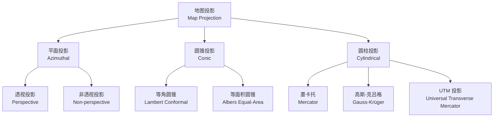
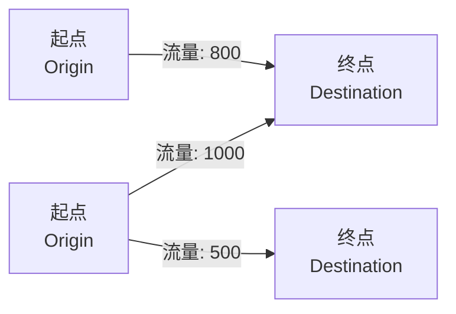

---
aliases:
  - 地图学
  - 制图学
  - Cartography
  - Map Making
tags:
  - earth-sciences
  - cartography
  - map-design
  - visualization
  - GIS
created: 2024-01-18
updated: 2024-08-05
---

# 地图学

**地图学（Cartography）** 是研究地图的设计、制作和使用的科学。它既是科学也是艺术，涉及空间信息的抽象、概括和可视化表达。地图作为空间信息传递的媒介，在导航、规划、科研和教育中发挥着不可替代的作用。

## 地图的定义与要素

地图（map）是按一定数学法则，运用符号系统将地球表面的自然和社会现象缩小、概括后表现在平面上的图形。地图的基本要素包括：

- **数学要素**：比例尺、地图投影、坐标网
- **地理要素**：自然、人文地理现象
- **辅助要素**：图名、图例、指北针、图廓

### 地图的数学基础

地图的数学基础确保空间位置的准确性：

$$
\text{Scale} = \frac{\text{Map Distance}}{\text{Ground Distance}} = \frac{1}{S}
$$

其中 $S$ 为比例尺分母，数值越大表示比例尺越小。

## 地图投影

地图投影（map projection）是将地球椭球面展开到平面上的数学方法。

### 投影变形

任何投影都无法完全保持所有属性不变，投影变形包括：

| 变形类型 | 描述 | 公式 |
|----------|------|------|
| 长度变形 | 距离比例不一致 | $\mu = \frac{dl'}{dl}$ |
| 面积变形 | 面积比例不一致 | $\sigma = \frac{dA'}{dA}$ |
| 角度变形 | 角度失真 | $\omega = \max|\alpha' - \alpha|$ |

### 投影分类

#### 按变形性质

- **等角投影（conformal projection）**：保持局部角度不变，如墨卡托投影
- **等面积投影（equal-area projection）**：保持面积比例不变，如摩尔威德投影
- **等距投影（equidistant projection）**：沿特定方向保持距离不变
- **折衷投影（compromise projection）**：各项变形均不大，如罗宾逊投影

#### 按投影面形状

### 常用投影详解

#### 墨卡托投影

墨卡托投影（Mercator projection）是等角圆柱投影，广泛用于航海图：

$$
x = R \cdot \lambda
$$
$$
y = R \cdot \ln\left[\tan\left(\frac{\pi}{4} + \frac{\phi}{2}\right)\right]
$$

其中 $R$ 为地球半径，$\lambda$ 为经度，$\phi$ 为纬度。该投影在高纬度地区面积变形巨大。

#### 高斯-克吕格投影

高斯-克吕格投影（Gauss-Krüger projection）为横轴等角切圆柱投影，我国基本比例尺地形图均采用此投影。按 $3^\circ$ 或 $6^\circ$ 分带：

$$
\text{中央经线} = 6n - 3 \quad (\text{6度带})
$$

其中 $n$ 为带号。

## 比例尺

### 比例尺表示方式

| 类型 | 示例 | 特点 |
|------|------|------|
| 数字式 | 1:50000 | 精确，通用性强 |
| 文字式 | 图上1厘米代表实地0.5公里 | 直观 |
| 图解式 | 直线比例尺 | 便于量算 |

### 比例尺分类

- **大比例尺（large scale）**：$\geq 1:10000$，详细表示小范围
- **中比例尺（medium scale）**：$1:10000 - 1:100000$
- **小比例尺（small scale）**：$\leq 1:100000$，简略表示大范围

## 地图概括

地图概括（cartographic generalization）是在比例尺缩小时对地图内容进行简化和抽象的过程。概括的五种基本操作：

1. **选取（selection）**：选择重要要素，舍弃次要要素
2. **简化（simplification）**：减少细节的复杂度
3. **合并（aggregation）**：将多个小要素合并为一个大要素
4. **位移（displacement）**：调整要素位置以解决冲突
5. **强调（enhancement）**：突出重要特征

### 选取原则

选取的数学模型描述了信息量随比例尺变化的规律：

$$
N = N_0 \cdot \left(\frac{S}{S_0}\right)^k
$$

其中 $N$ 为选取数量，$S$ 为比例尺，$k$ 为选取指数（通常 $0.5 \leq k \leq 1$）。

## 符号化与地图设计

### 视觉变量

地图符号由视觉变量（visual variables）构成：

| 变量 | 视觉感受 | 适用数据类型 |
|------|----------|--------------|
| 大小（size） | 等级感 | 定量数据 |
| 形状（shape） | 差异感 | 定性数据 |
| 颜色（color） | 分类感 | 定性/定量 |
| 纹理（texture） | 质感 | 面状要素 |
| 方向（orientation） | 动态感 | 线性要素 |
| 亮度（value） | 层次感 | 等级数据 |

### 色彩设计

地图色彩设计遵循以下原则：

- 定性数据使用色相（hue）差异
- 定序数据使用亮度（lightness）渐变
- 定量数据使用色相-亮度组合

$$
L^* = 116 \cdot f\left(\frac{Y}{Y_n}\right) - 16
$$

其中 $L^*$ 为 CIE Lab 颜色空间的亮度坐标。

### 图例设计

图例（legend）是地图符号的说明，设计时应注意：

- 完整性：所有符号应在图例中出现
- 一致性：符号与图例一一对应
- 层次性：按分类层级组织排列
- 自明性：符号设计应直观易懂

## 专题地图

专题地图（thematic map）突出表现一种或几种专题要素，类型包括：

### 质底法

质底法（qualitative base method）用不同颜色或晕线表示不同类别区域，如地质图、土壤图。

### 等值线法

等值线法（isoline method）用等值线表示连续分布现象，如等高线、等温线：

$$
\text{Contour Interval} = \frac{\text{Max} - \text{Min}}{\text{Number of Intervals}}
$$

### 点值法

点值法（dot method）用点表示数量分布，每个点代表一定数量。

### 分级统计图法

分级统计图法（choropleth method）按统计单元分级设色：

| 分级方法 | 原理 | 特点 |
|----------|------|------|
| 等距分级 | 等间距划分 | 简单但可能不均衡 |
| 分位数分级 | 相同数量落入各级 | 各级数目相等 |
| 自然断点 | 数据自然分界 | 类内差异最小 |
| 标准差分级 | 以均值为中心 | 适合正态分布 |

### 统计图法

统计图法（diagram method）用柱状图、饼图等叠加在地图上表示统计数据。

## GIS 制图

GIS 环境下的数字制图（digital cartography）为地图生产带来了自动化能力：

- **制图模板（map template）**：标准化图面配置
- **自动标注（auto-labeling）**：基于规则的注记放置
- **动态符号化（dynamic symbology）**：数据驱动符号渲染
- **地图综合（automated generalization）**：算法实现要素简化

## 地图与地理信息可视化

### 三维地图

三维地图（3D map）通过数字高程模型（DEM）构建地形表面，叠加遥感影像和矢量要素，提供沉浸式的空间认知。

### 网络地图

网络地图（web map）基于 Web 技术发布交互式地图，核心技术包括：

- **瓦片地图（tile map）**：预渲染地图切片
- **矢量瓦片（vector tile）**：实时渲染矢量数据
- **WebGL 渲染**：浏览器端高性能图形绘制

### 动态地图

动态地图（animated map）通过时间维度展示地理现象的演变过程，如气候变化动画、人口迁移轨迹、城市扩张时序。

## 地图评价

地图质量评价包括：

- **数学精度（mathematical accuracy）**：位置偏差在允许范围内
- **地理适应性（geographic fidelity）**：要素表达符合地理规律
- **视觉质量（visual quality）**：符号清晰、色彩协调、图面均衡
- **信息有效性（information effectiveness）**：准确传递设计意图

## 专题制图方法详解

### 分级统计图法

分级统计图法（choropleth mapping）是应用最广泛的专题制图方法：

#### 分级方法比较

| 分级方法 | 优势 | 劣势 |
|----------|------|------|
| 等间距（Equal Interval） | 计算简单，易于对比 | 数据分布偏斜时效果差 |
| 分位数（Quantile） | 各类数量相等 | 同级数值可能差异大 |
| 自然断点（Jenks） | 类内方差最小 | 不便于不同地图对比 |
| 标准差（Standard Deviation） | 反映与平均值的偏差 | 对非正态分布不适用 |
| 自定义（Custom） | 灵活适应专题需求 | 需要专业知识 |

#### 颜色方案选择

颜色方案（color scheme）的选择取决于数据类型：

- **单色渐变（sequential）**：低值到高值的亮度渐变
- **两极色（diverging）**：从中间向两端的不同色相
- **定性色（qualitative）**：不同色相表示不同类别

### 比例符号图

比例符号图（proportional symbol map）的符号大小与数据值成正比：

$$
r = k \cdot \sqrt{\frac{V}{\pi}}
$$

其中 $r$ 为符号半径，$V$ 为数据值，$k$ 为比例系数。

### 流图

流图（flow map）表示空间中的流量和方向：

流线的宽度与流量成正比，颜色可表示流向或流量等级。

### 等值区域图

等值区域图（dasymetric mapping）改进 choropleth 图，利用辅助数据（如土地利用）将数据分配到更均匀的区域：

$$
D_i = \frac{V \cdot w_i}{\sum_{j} w_j \cdot A_j} \cdot A_i
$$

其中 $D_i$ 为目标区域 $i$ 的估计值，$w_i$ 为权重。

## 地图投影选择指南

不同用途的地图推荐使用的投影：

| 用途 | 推荐投影 | 变形控制 |
|------|----------|----------|
| 世界导航 | Mercator | 等角 |
| 极地航线 | 极方位立体投影 | 等角 |
| 世界人口分布 | Mollweide 或 Hammer | 等面积 |
| 中纬度国家 | Lambert 等角圆锥 | 等角 |
| 赤道地区 | Mercator 或圆柱等积 | 根据需求 |
| 大洲图 | Robinson 或 Winkel Tripel | 折衷 |
| 地质图 | 等面积投影 | 等面积 |
| 气象图 | Lambert 等角圆锥 | 等角 |

## 地图色彩与视觉感知

### 色彩模型

地图制图中使用的色彩模型：

- **RGB 模型**：用于屏幕显示（加色法）
- **CMYK 模型**：用于印刷制图（减色法）
- **HSV 模型**：色相、饱和度、亮度
- **CIE Lab 模型**：人眼感知均匀

### 视觉感知规律

- **格式塔原则（Gestalt principles）**：接近律、相似律、闭合律、连续律
- **视觉层次（visual hierarchy）**：通过符号的大小、颜色、位置建立层次
- **图底关系（figure-ground relationship）**：突出主体要素

## 地图生产流程

数字制图的生产流程包括：

1. **需求分析**：确定地图用途、受众和输出格式
2. **数据准备**：收集、检查和预处理数据
3. **地图设计**：选择投影、比例尺、符号和配色方案
4. **符号化与标注**：配置图层符号和注记
5. **图面整饰**：添加图名、图例、比例尺、指北针
6. **质量控制**：检查空间精度和表达正确性
7. **输出发布**：打印或发布为 PDF、图片、Web 地图

## 总结

地图学作为空间信息表达的核心学科，经历了从传统手绘制图到数字制图再到网络交互制图的发展历程。地图投影、比例尺、概括和符号化构成了制图学的理论基石。在现代 GIS 环境下，地图不仅是一种信息表达工具，更是空间分析和决策支持的重要平台。地图设计涉及色彩感知、视觉层次、数据分类等多个方面的专业知识。理解地图学的原理与方法是正确使用和解读地图的前提。
