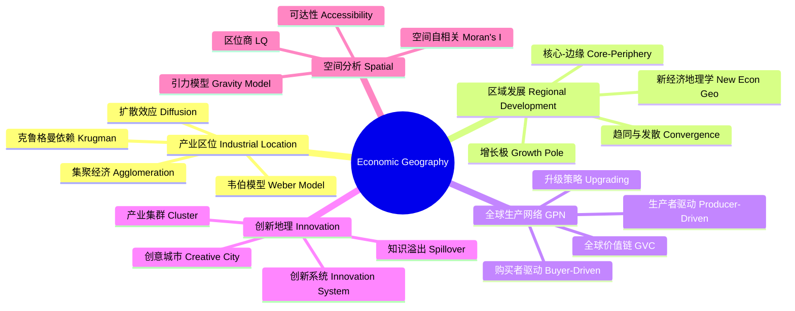

# EconomicGeography

## 概述 (Overview)

经济地理学 (Economic Geography) 研究经济活动在空间上分布及其演变规律的学科。它探讨产业集聚 (Agglomeration)、区域发展不平衡、全球生产网络、创新地理和城市经济的空间机制。经济地理学与区域科学 (Regional Science)、空间经济学 (Spatial Economics) 和城市经济学紧密联系。

## 经济地理学框架

## 产业区位理论 (Industrial Location Theory)

### 韦伯模型 (Weber Model)

韦伯最小化运输成本和劳动力成本选择最优区位。运输成本最小化问题：

$$\min TC = \sum_i w_i d_i + \sum_j w_j d_j$$

其中 $w_i$ 是原材料运量，$d_i$ 是到原材料地的距离，$w_j$ 是产品运量，$d_j$ 是到市场的距离。

### 中心地理论 (Central Place Theory)

克里斯泰勒 (Christaller) 的中心地理论解释了城市规模和分布的规律。中心地的六边形市场区最优覆盖。中心地等级体系遵循 $K = 3$ (市场原则)、$K = 4$ (交通原则) 或 $K = 7$ (行政原则)。

### 增长极理论 (Growth Pole Theory)

佩鲁 (Perroux) 的增长极理论认为经济增长首先出现在某些增长极上，然后通过极化 (Polarization) 和涓滴 (Trickle-down) 效应扩散到周边地区。双向乘数效应：

$$\text{backward: } X_{in,i} \propto Y_j$$
$$\text{forward: } X_{out,j} \propto Y_i$$

## 新经济地理学 (New Economic Geography)

### 核心-外围模型 (Core-Periphery Model)

克鲁格曼 (Krugman) 的 D-S 模型解释了经济活动集聚的自增强机制。工资方程：

$$\frac{w_i}{w_j} = \left(\frac{\mu_i}{\mu_j}\right)^{\frac{1}{\sigma-1}} \cdot \left(\frac{\phi_{ij}}{\phi_{jj}}\right)^{\frac{1}{\sigma-1}}$$

其中 $\mu$ 是支出份额，$\sigma$ 是替代弹性，$\phi$ 是贸易自由度。

### 集聚力与分散力

集聚力 (Agglomeration Forces)：

1. 前向关联：接近大市场降低运输成本
2. 后向关联：生产集中降低投入品成本
3. 知识溢出：人才集中促进创新

分散力 (Dispersion Forces)：

1. 拥堵效应 (Congestion)
2. 要素竞争推高工资
3. 土地租金上升
4. 环境承载力限制

$$\text{Net Agglomeration} = \sum F_{\text{centripetal}} - \sum F_{\text{centrifugal}}$$

### 贸易自由度分析

贸易自由度 $\phi \in [0,1]$ 是影响空间均衡的关键参数。临界点分析：

$$\phi_{\text{sustain}} > \phi_{\text{break}} \;:\; \text{对称均衡稳定}$$

降低贸易成本 $\phi\uparrow$ 在某个阈值触发突发性集聚。

## 全球生产网络 (Global Production Networks)

### 全球价值链 (Global Value Chains)

全球价值链的理论框架包括治理结构、升级路径和价值分配。Gereffi 的五种治理模式：市场型、模块型、关系型、俘获型和层级型。

### 升级策略 (Upgrading)

产业升级的四个层次：

1. **流程升级** (Process)：提高生产效率
2. **产品升级** (Product)：提升产品质量
3. **功能升级** (Functional)：向高附加值环节移动
4. **链升级** (Chain)：转向新的价值链

### 增加值贸易 (Value-Added Trade)

显性比较优势 (RCA) 和增加值出口的测算：

$$RCA_{i,k} = \frac{X_{i,k}/X_i}{W_k/W}$$

增加值出口 (VAX) 比率：

$$VAX_{i,k} = \frac{DVA_{i,k}}{E_{i,k}}$$

## 产业集群 (Industrial Clusters)

### 集群识别

区位商 (Location Quotient) 衡量本地产业的专门化程度：

$$LQ_{i,j} = \frac{E_{i,j}/E_j}{E_i/E_{\text{total}}}$$

$LQ > 1$ 表明该产业在区域 $j$ 具有专门化优势。

### 集群优势

波特钻石模型 (Porter's Diamond) 解释集群竞争优势的四个要素：

1. **要素条件** (Factor Conditions)
2. **需求条件** (Demand Conditions)
3. **相关支持产业** (Related & Supporting Industries)
4. **企业战略与竞争** (Firm Strategy & Rivalry)

### 知识溢出 (Knowledge Spillover)

马歇尔 (Marshall) 的知识溢出三种渠道：劳动力流动、非正式交流和企业衍生。知识溢出随距离衰减：

$$S_{ij} = S_0 e^{-\beta d_{ij}}$$

其中 $\beta$ 是距离衰减参数。

## 空间分析与测度 (Spatial Analysis)

### 空间自相关

莫兰指数 (Moran's I) 衡量空间自相关程度：

$$I = \frac{n}{W_0} \frac{\sum_i\sum_j w_{ij}(x_i - \bar{x})(x_j - \bar{x})}{\sum_i (x_i - \bar{x})^2}$$

其中 $w_{ij}$ 是空间权重矩阵元素，$W_0 = \sum_i\sum_j w_{ij}$。

### 引力模型 (Gravity Model)

双边经济流量的引力模型：

$$F_{ij} = G \frac{M_i^{\alpha} M_j^{\beta}}{D_{ij}^{\gamma}}$$

取对数后的线性化形式：

$$\ln F_{ij} = \ln G + \alpha \ln M_i + \beta \ln M_j - \gamma \ln D_{ij}$$

## 区域收敛与发散 (Regional Convergence & Divergence)

### β收敛 (Beta Convergence)

经济增长的 β 收敛检验：

$$\frac{1}{T}\ln\left(\frac{y_{i,t+T}}{y_{i,t}}\right) = \alpha + \beta\ln(y_{i,t}) + \epsilon_i$$

$\beta < 0$ 表示欠发达地区增长更快，存在收敛趋势。

### 空间收敛

空间溢出效应影响收敛速度。空间 Durbin 模型：

$$\Delta \ln y_i = \rho W \Delta \ln y + \beta \ln y_{i,0} + \theta W \ln y_0 + \epsilon$$

## 城市与区域经济 (Urban & Regional Economics)

### 城市规模分布

齐普夫定律 (Zipf's Law)：城市规模与排名遵循幂律分布：

$$\ln \text{Rank} = \ln C - \alpha \ln \text{Size}$$

其中 $\alpha \approx 1$ 是典型值。

### 城市形成模型

蒙特-克鲁格曼城市形成模型：规模经济与运输成本的权衡决定最优城市规模：

$$\max_{N} \left[AN^{\alpha} - wN - rN^{\delta}\right]$$

### 新旧对比

| 理论 | 核心概念 | 代表人物 |
|------|----------|----------|
| 古典区位论 | 运输成本最小化 | Weber, von Thünen |
| 中心地理论 | 六边形市场区 | Christaller, Lösch |
| 新经济地理学 | 规模经济、贸易成本 | Krugman, Fujita |
| 演化经济地理 | 路径依赖、锁定 | Boschma, Martin |

## 演化经济地理学 (Evolutionary Economic Geography)

### 路径依赖

区域技术发展具有路径依赖特征。锁定 (Lock-in) 的三级：功能锁定、认知锁定和政治锁定。突破锁定的条件包括外部冲击、衍生企业家和制度创新。

### 相关多样化 (Related Variety)

Frenken 的相关多样化理论：技术相关 (Cognitive Relatedness) 程度影响区域创新。相关多样性促进就业增长，非相关多样性提供发展选项。

$$\text{Related Variety} = \sum_g \text{Entropy}_g$$

## 全球化与区域重塑 (Globalization & Regional Restructuring)

### 世界城市网络

全球城市 (Global Cities) 通过金融服务和生产性服务业连接。跨国公司总部选址、全球创新网络和人才流动重塑世界经济地理。

### 韧性 (Resilience)

区域经济韧性包括抵抗性 (Resistance)、恢复性 (Recovery)、重新定位 (Reorientation) 和更新性 (Renewal)。产业结构多样性提高区域经济韧性。

## 主要期刊 (Major Journals)

《Journal of Economic Geography》、《Economic Geography》、《Regional Studies》、《Environment and Planning A》、《Papers in Regional Science》、《Cambridge Journal of Regions, Economy and Society》、《Annals of the Association of American Geographers》。

## 相关条目

- [[../../INDEX|当前目录索引]]
