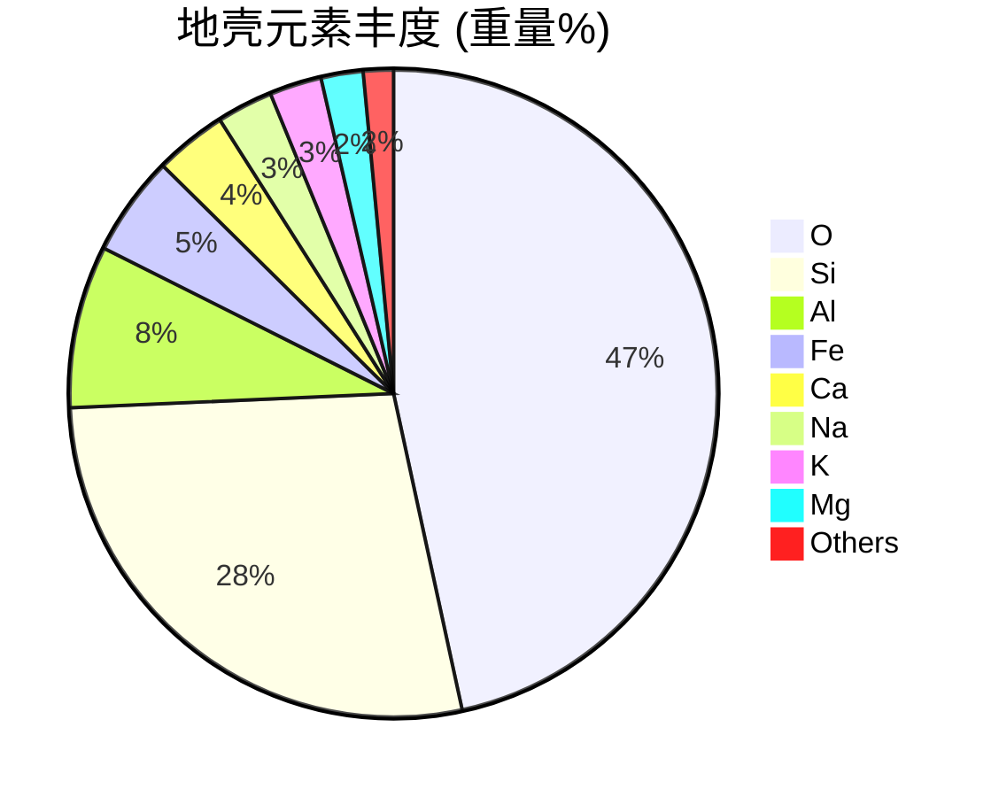
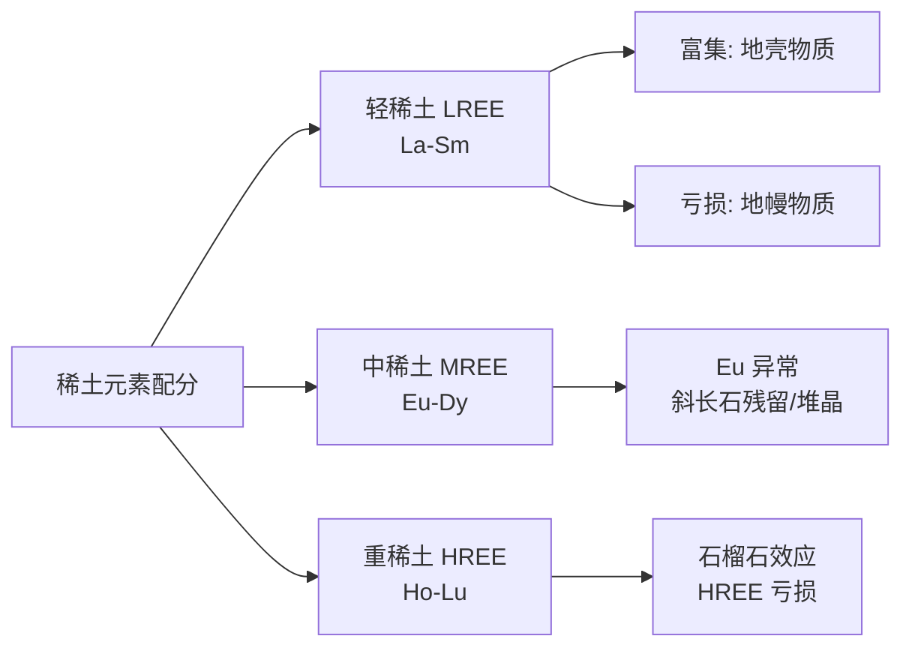

# 地球化学 (Geochemistry)

## 一、地球化学基础 (Fundamentals)

### 1.1 地球化学定义与研究内容

地球化学是研究地球及其子系统（大气圈、水圈、生物圈、岩石圈）的化学组成、化学作用和化学演化的学科。主要研究内容包括：

- 元素的分布、分配和迁移规律
- 同位素地球化学
- 地球化学循环
- 矿床地球化学
- 环境地球化学

### 1.2 元素丰度 (Element Abundance)

地球主要元素的平均丰度（质量百分比）：

| 元素 | 符号 | 地壳丰度(%) | 地球丰度(%) |
|------|------|------------|------------|
| 氧 | O | 46.6 | 29.5 |
| 硅 | Si | 27.7 | 15.2 |
| 铝 | Al | 8.1 | 1.5 |
| 铁 | Fe | 5.0 | 32.0 |
| 钙 | Ca | 3.6 | 1.7 |
| 钠 | Na | 2.8 | 0.2 |
| 钾 | K | 2.6 | 0.1 |
| 镁 | Mg | 2.1 | 14.0 |

### 1.3 戈尔德施密特分类 (Goldschmidt Classification)

根据元素在自然界中的亲合性，戈尔德施密特将元素分为四类：

| 类别 | 亲合性 | 典型元素 | 赋存状态 |
|------|--------|---------|---------|
| 亲石元素 | 氧亲合 | Si, Al, Na, K, Ca | 硅酸盐矿物 |
| 亲铁元素 | 铁亲合 | Fe, Ni, Co, Pt | 金属相、硫化物 |
| 亲铜元素 | 硫亲合 | Cu, Zn, Pb, Ag | 硫化物矿物 |
| 亲气元素 | 大气/挥发 | H, C, N, O, 惰性气体 | 大气、水圈 |

### 1.4 克拉克值 (Clarke Value)

元素在地壳中的平均含量称为克拉克值。地壳中含量最高的元素依次为：O > Si > Al > Fe > Ca > Na > K > Mg。

## 二、同位素地球化学 (Isotope Geochemistry)

### 2.1 稳定同位素 (Stable Isotopes)

稳定同位素比值常用于示踪物质来源和判别地质过程：

**δ 表示法**：

$$ \delta = \left(\frac{R_{\text{样品}}}{R_{\text{标准}}} - 1\right) \times 1000 $$

其中 $R$ 为同位素比值（如 $^{18}\text{O}/^{16}\text{O}$）。

**常用稳定同位素体系**：

| 同位素对 | 标准物质 | 应用领域 |
|---------|---------|---------|
| δ¹⁸O | VSMOW | 古气候、成岩作用 |
| δD | VSMOW | 水循环、流体来源 |
| δ¹³C | VPDB | 碳循环、有机质来源 |
| δ³⁴S | VCDT | 硫循环、矿床成因 |
| δ¹⁵N | 大气 N₂ | 氮循环、生物过程 |

**分馏系数 α 与 δ 值的关系**：

$$ \alpha_{A-B} = \frac{R_A}{R_B} $$

其中 $\alpha_{A-B}$ 是 A、B 两相间的分馏系数。

$$ \delta_A - \delta_B \approx 1000 \ln \alpha_{A-B} $$

### 2.2 放射性同位素定年 (Radiometric Dating)

**铷-锶法 (Rb-Sr)**：

$$ ^{87}\text{Sr} = {}^{87}\text{Sr}_0 + {}^{87}\text{Rb}(e^{\lambda t} - 1) $$

等时线方程：

$$ \frac{^{87}\text{Sr}}{^{86}\text{Sr}} = \left(\frac{^{87}\text{Sr}}{^{86}\text{Sr}}\right)_0 + \frac{^{87}\text{Rb}}{^{86}\text{Sr}}(e^{\lambda t} - 1) $$

其中 $\lambda_{\text{Rb}} = 1.42 \times 10^{-11} \, \text{yr}^{-1}$。

**钐-钕法 (Sm-Nd)**：

$$ \frac{^{143}\text{Nd}}{^{144}\text{Nd}} = \left(\frac{^{143}\text{Nd}}{^{144}\text{Nd}}\right)_0 + \frac{^{147}\text{Sm}}{^{144}\text{Nd}}(e^{\lambda t} - 1) $$

其中 $\lambda_{\text{Sm}} = 6.54 \times 10^{-12} \, \text{yr}^{-1}$。

### 2.3 常用放射性定年体系对比

| 体系 | 母体 | 子体 | 半衰期 (Ga) | 适用范围 | 适用对象 |
|------|------|------|------------|---------|---------|
| Rb-Sr | ⁸⁷Rb | ⁸⁷Sr | 48.8 | > 10 Ma | 硅酸盐岩 |
| Sm-Nd | ¹⁴⁷Sm | ¹⁴³Nd | 106 | > 100 Ma | 基性/超基性岩 |
| U-Pb | ²³⁸U | ²⁰⁶Pb | 4.47 | > 1 Ma | 锆石 |
| K-Ar | ⁴⁰K | ⁴⁰Ar | 1.25 | > 0.1 Ma | 火山岩 |
| ¹⁴C | ¹⁴C | ¹⁴N | 0.00573 | < 50 ka | 有机质 |

## 三、地球化学循环 (Geochemical Cycles)

### 3.1 碳循环 (Carbon Cycle)

碳在岩石圈、大气圈、水圈和生物圈之间的循环：
- 主要储库：沉积碳酸盐岩、有机碳（干酪根等）、海洋、大气
- 关键过程：火山去气、硅酸盐风化、光合作用

### 3.2 微量元素地球化学 (Trace Element Geochemistry)

**分配系数**描述微量元素在两相之间的分配关系：

$$ K_D = \frac{C_i^\alpha}{C_i^\beta} $$

**球粒陨石标准化配分模式**：

$$ \text{标准化值} = \frac{C_{i,\text{样品}}}{C_{i,\text{球粒陨石}}} $$

稀土元素 (REE) 配分模式是岩石成因的重要示踪工具：

### 3.3 地球化学热力学 (Geochemical Thermodynamics)

化学反应的吉布斯自由能：

$$ \Delta G = \Delta H - T\Delta S $$

平衡常数与吉布斯自由能的关系：

$$ \Delta G^\circ = -RT \ln K $$

### 3.4 环境地球化学 (Environmental Geochemistry)

**酸性矿山排水**：硫化物矿物氧化产生酸性水：

$$ \text{FeS}_2 + \frac{15}{4}\text{O}_2 + \frac{7}{2}\text{H}_2\text{O} \rightarrow \text{Fe(OH)}_3 + 2\text{H}_2\text{SO}_4 $$

## 四、分析方法 (Analytical Methods)

| 方法类型 | 原理 | 应用 |
|---------|------|------|
| ICP-MS | 电感耦合等离子体质谱 | 微量元素分析 |
| XRF | X 射线荧光光谱 | 主量元素分析 |
| EPMA | 电子探针 | 微区化学成分分析 |
| TIMS | 热电离质谱 | 高精度同位素比值 |
| LA-ICP-MS | 激光剥蚀 ICP-MS | 原位微量元素分析 |
| GC-MS | 气相色谱-质谱 | 有机地球化学 |

## 五、矿床地球化学 (Ore Deposit Geochemistry)

### 5.1 成矿元素富集机制

- 岩浆分异：不混溶、结晶分异
- 热液作用：流体-岩石反应、温度/压力骤降
- 表生富集：风化淋积、次生富集带
- 沉积成因：化学沉淀、生物成矿

### 5.2 地球化学找矿 (Geochemical Prospecting)

- 土壤地球化学测量：次生晕异常
- 水系沉积物测量：区域地球化学扫面
- 岩石地球化学测量：原生晕异常
- 生物地球化学：植物指示元素

## 参考资料

1. Faure, G. (1998). *Principles and Applications of Geochemistry* (2nd ed.). Prentice Hall.
2. White, W. M. (2013). *Geochemistry*. Wiley-Blackwell.
3. 韩吟文、马振东 (2003). 《地球化学》. 地质出版社.

## 相关条目

[[02_NaturalSciences/EarthSciences/Geology/INDEX|Geology]], [[02_NaturalSciences/Chemistry/EnvironmentalChemistry/INDEX|EnvironmentalChemistry]], Petrology
