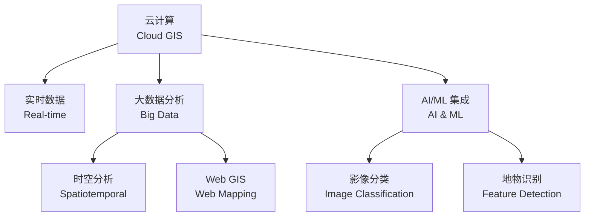
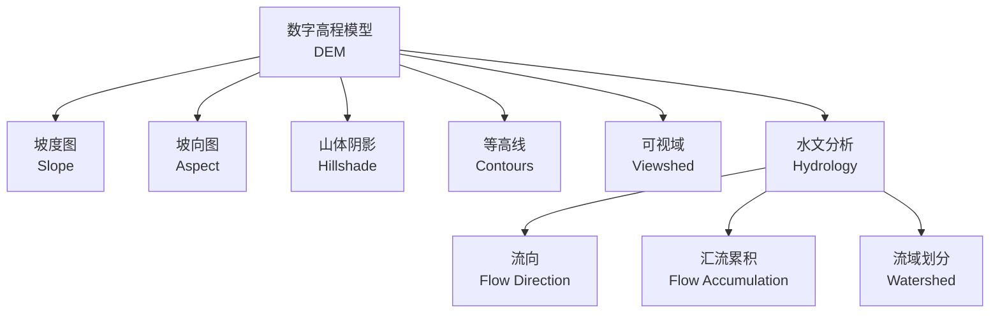

---
aliases:
  - GIS
  - 地理信息系统
  - Geographic Information Science
tags:
  - earth-sciences
  - geospatial
  - spatial-analysis
  - cartography
  - geodatabase
created: 2024-01-15
updated: 2024-06-20
---

# 地理信息系统

**地理信息系统（Geographic Information System, GIS）** 是一种用于捕获、存储、查询、分析和显示地理空间数据的计算机系统。GIS 技术整合了空间数据与非空间属性数据，为地理科学、城市规划、环境管理等领域提供了强大的分析平台。

## 空间数据模型

GIS 中的空间数据模型分为两种主要类型：

### 矢量模型

矢量数据（vector data）使用点、线和多边形来表示地理要素：

- **点（point）**：表示离散位置，如井位、气象站
- **线（line/polyline）**：表示线性特征，如河流、道路
- **多边形（polygon）**：表示面状区域，如湖泊、行政区

矢量数据的拓扑关系存储了相邻、连接和包含关系，支持网络分析（network analysis）和邻近分析（proximity analysis）。

### 栅格模型

栅格数据（raster data）由规则的像元（cell/pixel）矩阵构成，每个像元存储一个数值：

$$
\text{Resolution} = \frac{\text{地面距离}}{\text{像元数量}}
$$

栅格模型适用于连续表面数据，如高程模型（DEM）、遥感影像（satellite imagery）和气温分布。

### 矢量与栅格的比较

| 特征 | 矢量模型 | 栅格模型 |
|------|----------|----------|
| 数据精度 | 高，边界精确 | 受分辨率限制 |
| 数据结构 | 紧凑，存储量小 | 随分辨率增大 |
| 空间分析 | 拓扑分析强 | 叠加分析简便 |
| 适合场景 | 离散要素 | 连续表面 |

## 地图图层

GIS 的核心组织方式是通过图层（layer）来管理地理数据。每一层代表一个特定主题的数据集：

图层的叠加（overlay）是 GIS 分析的基础操作，通过将不同图层叠置在一起来发现空间关系。

## 坐标参考系统

### 地理坐标系

地理坐标系（Geographic Coordinate System, GCS）使用经度（longitude）和纬度（latitude）来定位，最常用的是 WGS84：

$$
P(\lambda, \phi) \quad \text{其中} \; \lambda \in [-180^\circ, 180^\circ], \; \phi \in [-90^\circ, 90^\circ]
$$

### 投影坐标系

投影坐标系（Projected Coordinate System, PCS）将三维地球表面映射到二维平面，常见的投影包括：

- **墨卡托投影（Mercator）**：保角投影，适合航海
- **横轴墨卡托投影（UTM）**：分带投影，精度高
- **阿尔伯斯投影（Albers Equal Area）**：等面积投影，适合面积测算
- **兰勃特投影（Lambert Conformal）**：保角投影，适合中纬度地区

## 地理数据库

地理数据库（geodatabase）是用于存储和管理 GIS 数据的容器，支持以下特性：

1. **拓扑规则（topology rules）**：确保数据完整性
2. **关系类（relationship classes）**：定义要素间的关联
3. **几何网络（geometric networks）**：建模流体的连通性
4. **栅格目录（raster catalog）**：管理大规模影像数据

### 地理数据库类型

| 类型 | 存储方式 | 容量限制 | 多用户支持 |
|------|----------|----------|------------|
| File Geodatabase | 文件夹 | 每表 1 TB | 单用户 |
| Personal Geodatabase | Access 文件 | 每文件 2 GB | 单用户 |
| Enterprise Geodatabase | RDBMS | 无限制 | 多用户并发 |

## 空间分析

### 缓冲区分析

缓冲区分析（buffer analysis）在要素周围创建指定距离的区域：

$$
B_i = \{ x \;|\; d(x, F_i) \leq r \}
$$

其中 $F_i$ 为目标要素，$r$ 为缓冲半径，$d$ 为距离函数。

### 叠加分析

叠加分析（overlay analysis）包括：

- **相交（intersect）**：保留输入图层的公共区域
- **联合（union）**：合并所有输入图层的范围
- **擦除（erase）**：移除与擦除图层重叠的部分
- **标识（identity）**：将一个图层的属性赋给另一个图层

### 表面分析

表面分析（surface analysis）用于处理连续表面数据：

$$
\text{Slope} = \arctan \sqrt{ \left( \frac{\partial z}{\partial x} \right)^2 + \left( \frac{\partial z}{\partial y} \right)^2 }
$$

- **坡度分析（slope analysis）**：计算地形倾斜角度
- **坡向分析（aspect analysis）**：确定地形朝向
- **山体阴影（hillshade）**：模拟光照下的地貌表现

## 插值方法

GIS 中常用的空间插值方法包括：

| 方法 | 原理 | 适用场景 |
|------|------|----------|
| IDW | 距离加权平均 | 均匀分布的点数据 |
| Kriging | 地统计最优估计 | 具有空间自相关性的数据 |
| Spline | 最小曲率曲面 | 平滑表面生成 |
| TIN | 不规则三角网 | 高精度地形建模 |

## 地理信息系统应用

### 城市规划

GIS 在城市规划（urban planning）中用于土地利用分析、基础设施规划和人口分布研究：

$$
\text{Urban Density} = \frac{\text{Population}}{\text{Land Area}}
$$

### 环境管理

环境管理（environmental management）中，GIS 支持：

- 环境影响评价（EIA）
- 生态系统建模
- 污染扩散模拟
- 灾害风险评估

### 交通运输

交通运输领域使用 GIS 进行：

- 最优路径分析（shortest path analysis）
- 可达性研究（accessibility study）
- 交通流量模拟

### 资源管理

自然资源管理（natural resource management）中：

- 森林资源调查与监测
- 水资源评价与管理
- 矿产资源勘探定位
- 农业适宜性分析

## 空间数据基础设施

空间数据基础设施（Spatial Data Infrastructure, SDI）包括政策、标准、技术和数据，以促进地理信息的共享和互操作。

### 重要标准

- **OGC 标准**：开放地理空间联盟制定的 Web 地图服务（WMS）、Web 要素服务（WFS）等
- **ISO 19100 系列**：地理信息国际标准
- **元数据标准（metadata standard）**：描述数据的数据，包括 FGDC、ISO 19115

## 现代 GIS 技术趋势

- **Web GIS**：基于浏览器的地理信息发布与交互，如 Leaflet、OpenLayers、Mapbox
- **移动 GIS（Mobile GIS）**：现场数据采集与实时定位
- **三维 GIS（3D GIS）**：CityGML、3D Tiles 支持城市三维建模
- **室内 GIS（Indoor GIS）**：室内导航与空间管理

## GIS 与相关学科的关系

GIS 处于多个学科的交汇点：

- **遥感（Remote Sensing）**：提供数据源，GIS 提供分析框架
- **大地测量学（Geodesy）**：提供精确的坐标参考
- **计算机科学（Computer Science）**：数据结构、算法、可视化
- **统计学（Statistics）**：空间统计与不确定性分析
- **地理学（Geography）**：空间思维与地学规律

## GIS 与遥感集成

遥感（Remote Sensing）为 GIS 提供重要的数据源，两者的集成包括：

### 影像处理

遥感影像处理（image processing）流程包括：

- **辐射校正（radiometric correction）**：消除传感器和大气影响
- **几何校正（geometric correction）**：将影像配准到地理坐标
- **影像增强（image enhancement）**：改善影像的视觉效果
- **分类（classification）**：将像元分为不同土地覆盖类型

### 分类方法

监督分类（supervised classification）与非监督分类（unsupervised classification）：

$$
\text{Maximum Likelihood: } P(\omega_i | \mathbf{x}) = \frac{P(\mathbf{x} | \omega_i) P(\omega_i)}{\sum_{j=1}^m P(\mathbf{x} | \omega_j) P(\omega_j)}
$$

- **最大似然分类（Maximum Likelihood Classification）**：基于贝叶斯决策理论
- **支持向量机（Support Vector Machine, SVM）**：寻找最优分类超平面
- **随机森林（Random Forest）**：集成决策树分类器
- **深度学习分类**：卷积神经网络（CNN）实现像素级分类

### 植被指数

归一化植被指数（Normalized Difference Vegetation Index, NDVI）：

$$
\text{NDVI} = \frac{\text{NIR} - \text{RED}}{\text{NIR} + \text{RED}}
$$

NDVI 值范围在 $[-1, 1]$，高值表示茂密植被覆盖。

其他常用指数：

| 指数 | 公式 | 应用 |
|------|------|------|
| EVI | $2.5 \times \frac{\text{NIR} - \text{RED}}{\text{NIR} + 6\text{RED} - 7.5\text{BLUE} + 1}$ | 高植被覆盖区 |
| NDWI | $\frac{\text{GREEN} - \text{NIR}}{\text{GREEN} + \text{NIR}}$ | 水体提取 |
| NDBI | $\frac{\text{SWIR} - \text{NIR}}{\text{SWIR} + \text{NIR}}$ | 建筑用地提取 |

## 网络分析

网络分析（network analysis）基于图论处理线状网络数据：

### 最短路径

Dijkstra 算法求解单源最短路径：

$$
\text{dist}[v] = \min(\text{dist}[v], \text{dist}[u] + w(u, v))
$$

### 服务区分析

服务区分析（service area analysis）确定从某点出发在给定时间或距离内可达的范围。

### 设施选址

设施选址（facility location）通过位置分配模型（location-allocation model）优化设施布局，常见问题包括：

- **最小阻抗问题（P-Median）**：需求点到设施的总加权距离最小
- **最大覆盖问题（Maximum Coverage）**：在预算内覆盖最大需求
- **最小设施问题（Set Covering）**：以最少设施覆盖所有需求

## 数字高程模型

数字高程模型（Digital Elevation Model, DEM）用栅格形式表示地形表面：

### DEM 衍生产品

### 地形参数

地形参数提取包括：

- **坡度（slope）**：$\theta = \arctan\sqrt{p^2 + q^2}$，其中 $p = \partial z/\partial x$，$q = \partial z/\partial y$
- **坡向（aspect）**：$\alpha = \arctan(q/p)$
- **曲率（curvature）**：坡面凹凸程度的度量
- **地形湿润指数（TWI）**：$\text{TWI} = \ln(\frac{\alpha}{\tan\beta})$

## GIS 发展趋势

### 云计算 GIS

云 GIS（Cloud GIS）将 GIS 部署在云端，提供弹性的计算和存储资源：

- **基础设施即服务（IaaS）**：提供虚拟化服务器
- **平台即服务（PaaS）**：提供 GIS 开发平台
- **软件即服务（SaaS）**：提供在线 GIS 应用

### 大数据 GIS

大数据 GIS（Big Data GIS）处理海量空间数据：

- **分布式存储**：HDFS、MongoDB 存储空间数据
- **并行计算**：Spark、Hadoop 加速空间分析
- **流处理**：实时处理传感器数据流

### 人工智能 GIS

AI 与 GIS 的融合（GeoAI）推动了空间分析的智能化：

- **深度学习影像分类**：自动识别地物类型
- **自然语言处理**：从文本中提取空间信息
- **强化学习**：优化路径规划和资源配置

### 三维 GIS

三维 GIS（3D GIS）突破传统二维表达，提供更真实的场景：

- **倾斜摄影测量**：从多角度照片生成三维模型
- **激光雷达（LiDAR）**：高精度三维点云数据
- **城市信息模型（CIM）**：城市级别的三维数字孪生

## 开源 GIS 软件

主要的开源 GIS 软件包括：

| 软件 | 类型 | 特点 |
|------|------|------|
| QGIS | 桌面 GIS | 功能完善，插件丰富 |
| GRASS GIS | 桌面 GIS | 强大的分析能力 |
| GDAL/OGR | 数据处理库 | 格式转换标准工具 |
| PostGIS | 空间数据库 | PostgreSQL 空间扩展 |
| Leaflet | Web 地图库 | 轻量级交互地图 |
| OpenLayers | Web 地图库 | 功能全面的地图框架 |
| GeoServer | 地图服务器 | 标准的 OGC 服务 |

## 总结

地理信息系统作为空间数据管理与分析的核心平台，已经深入到自然资源管理、城市规划、环境保护、应急响应、交通物流等各个领域。随着云计算、人工智能和物联网的不断融合，GIS 技术正朝着实时化、智能化、三维化和大众化的方向发展，为解决复杂的空间问题提供了更加有力的工具支持。开源 GIS 生态的繁荣也促进了地理信息技术的普及和创新。
