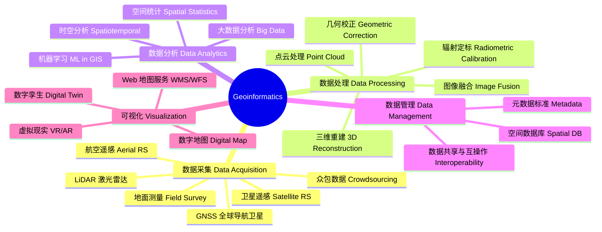
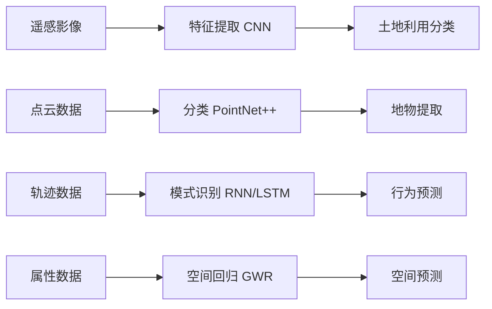

---
aliases: [Geoinformatics]
tags: ['EarthSciences/Geoinformatics', 'SpatialScience', 'Geomatics']
---

# Geoinformatics

## 概述 (Overview)

地理信息学 (Geoinformatics) 是研究空间数据的采集、处理、分析、管理和可视化的跨学科领域。它整合了地理信息系统 (GIS)、遥感 (Remote Sensing)、全球导航卫星系统 (GNSS)、摄影测量 (Photogrammetry) 和计算机科学的技术方法，为地理空间信息的全生命周期管理提供技术支持。

## 地理信息学技术体系

## 数据采集技术 (Data Acquisition)

### 遥感 (Remote Sensing)

遥感是不接触目标物体而获取其信息的技术。电磁波谱中的不同波段提供了不同的信息：

- 可见光 (VIS)：0.4-0.7 μm，地物真彩色
- 近红外 (NIR)：0.7-1.3 μm，植被分析
- 短波红外 (SWIR)：1.3-3 μm，矿物识别
- 热红外 (TIR)：8-14 μm，地表温度
- 微波 (Radar)：1 mm-1 m，全天候成像

反射率 (Reflectance) 是遥感的基础物理量：

$$\rho(\lambda) = \frac{I_{\text{反射}}(\lambda)}{I_{\text{入射}}(\lambda)}$$

### 激光雷达 (LiDAR)

LiDAR 通过发射激光脉冲并测量回波时间获取高精度三维点云数据：

$$d = \frac{c \cdot \Delta t}{2}$$

### 全球导航卫星系统 (GNSS)

GNSS 包括 GPS (美国)、北斗 BDS (中国)、GLONASS (俄罗斯) 和 Galileo (欧洲)。定位原理基于三角测量：

$$P_i = \sqrt{(x - x_i)^2 + (y - y_i)^2 + (z - z_i)^2} + c \cdot \Delta t$$

## 空间数据基础设施 (Spatial Data Infrastructure, SDI)

SDI 是促进地理空间数据共享和互操作的政策、标准、技术和数据的框架。

### 开放地理空间联盟 (OGC) 标准

| 标准 | 全称 | 用途 |
|------|------|------|
| WMS | Web Map Service | 地图图像服务 |
| WFS | Web Feature Service | 矢量要素服务 |
| WCS | Web Coverage Service | 栅格覆盖服务 |
| WMTS | Web Map Tile Service | 瓦片地图服务 |
| CSW | Catalogue Service | 数据目录服务 |
| GML | Geography Markup Language | 地理数据编码 |

## 数据融合 (Data Fusion)

多源数据融合提高数据的精度、完整性和可靠性。融合层次：

- **像素级融合 (Pixel-Level)**：直接融合原始影像
- **特征级融合 (Feature-Level)**：提取特征后进行融合
- **决策级融合 (Decision-Level)**：独立分析后综合判断

### 图像融合算法

IHS 变换融合、主成分分析 (PCA) 融合和小波融合是常用的像素级融合方法。

## 时空数据分析 (Spatiotemporal Analysis)

### 时空立方体 (Space-Time Cube)

将时间和空间整合为三维结构 $(x, y, t)$，用于分析时空模式。

### 时空克里金 (Spatiotemporal Kriging)

利用时空变异函数 (Spatiotemporal Variogram) 建模时空相关性：

$$\gamma(h_s, h_t) = \frac{1}{2}E\left[Z(s + h_s, t + h_t) - Z(s, t)\right]^2$$

### 时空聚类

识别在空间和时间上同时聚集的事件或模式，如疾病爆发、犯罪热点等。

## 地理空间大数据 (Geospatial Big Data)

### 5V 特征

- 容量 (Volume)：TB 到 PB 级别
- 速度 (Velocity)：实时数据流
- 多样性 (Variety)：多源异构数据
- 真实性 (Veracity)：数据质量不一
- 价值 (Value)：隐含规律和知识

### 数据来源

- 社交媒体签到 (Twitter, 微信)
- 移动手机信令数据
- 出租车 GPS 轨迹
- 车辆导航数据
- 卫星遥感和航空影像
- IoT 传感器网络

## 机器学习在地理信息学中的应用

## 三维地理信息 (3D Geoinformatics)

### 数字孪生 (Digital Twin)

数字孪生是物理世界的虚拟镜像，通过实时数据同步实现模拟和预测。城市数字孪生集成了 BIM (建筑信息模型)、CIM (城市信息模型) 和 IoT 数据。

### 倾斜摄影测量 (Oblique Photogrammetry)

通过多角度摄影获取建筑物侧面纹理，生成实景三维模型。

## 职业与产业

| 领域 | 职业方向 |
|------|----------|
| 政府 | 测绘局、规划局、环保局 |
| 企业 | GIS 软件开发、地理数据分析 |
| 研究 | 遥感科学、地理信息科学 |
| 交叉 | 智慧城市、精准农业、防灾减灾 |

## 主要软件平台

商业：ArcGIS, ENVI, ERDAS Imagine, Pix4D
开源：QGIS, GRASS GIS, GDAL, OpenCV, WhiteboxTools
编程：Python (geopandas, rasterio, shapely), R (sf, raster), JavaScript (Cesium, Mapbox GL)

## 地理信息学中的大数据处理 (Big Data Processing)

地理空间大数据的处理需要分布式计算架构。Apache Hadoop 和 Spark 提供大数据处理框架。分布式文件系统 (HDFS) 存储海量遥感影像。矢量数据的分布式处理使用 GeoSpark 和 Spatial Hadoop。遥感大数据的深度学习框架使用 GPU 集群加速模型训练。云平台如 Google Earth Engine、Amazon AWS (S3 + EC2) 和阿里云提供按需计算资源。Tile 地图服务使用金字塔模型实现海量影像的快速可视化。

## 地理信息学的职业方向 (Careers)

GIS 分析师：空间数据采集、处理和可视化。遥感科学家：卫星和航空影像的分析与应用。测绘工程师：控制测量、摄影测量和工程测量。地理数据库管理员：空间数据库的设计与运维。Web GIS 开发者：Web 地图应用的前后端开发。地理大数据工程师：时空大数据分析平台的建设。

## 地理信息学的标准化组织 (Standardization Bodies)

ISO/TC 211 (地理信息/地球信息) 制定国际地理信息标准。OGC (Open Geospatial Consortium) 制定 Web 地理服务标准。FGDC (美国联邦地理数据委员会) 制定美国空间数据标准和元数据标准。中国国家测绘地理信息局负责中国测绘地理信息标准化。国家标准化管理委员会发布 GB/T 地理信息系列标准。

## 地理信息学中的遥感图像处理 (Remote Sensing Image Processing)

遥感图像预处理包括辐射定标 (Radiometric Calibration)、大气校正 (Atmospheric Correction) 和几何校正 (Geometric Correction)。图像融合 (Pansharpening) 将高空间分辨率的全色波段与多光谱波段融合。分类方法包括最大似然法 (MLC)、支持向量机 (SVM) 和深度学习 (CNN, U-Net)。变化检测 (Change Detection) 比较时相图像识别地物变化。面向对象图像分析 (OBIA) 将图像分割为对象后分类。InSAR 测量地表形变达到毫米精度。

## 地理信息学中的三维建模 (3D Modeling)

LiDAR (激光雷达) 点云数据处理包括滤波、分类和插值。数字高程模型 (DEM) 和数字表面模型 (DSM) 的区别在于前者表示裸地地形。摄影测量 (Photogrammetry) 使用立体像对重建三维信息。倾斜摄影 (Oblique Photography) 获取建筑物侧面纹理。城市三维模型 (CityGML) 的分级 LOD0-LOD4 表示不同细节层次。BIM+GIS 集成实现建筑和基础设施的全生命周期管理。

## 地理信息学中的位置服务 (Location Based Services)

GNSS (GPS, GLONASS, Galileo, BeiDou) 提供全球定位。室内定位使用 Wi-Fi 指纹、蓝牙信标和超宽带 (UWB)。Wi-Fi 指纹定位的 KNN 算法实现米级精度。地理围栏 (Geofencing) 定义虚拟边界触发位置事件。LBS 隐私保护包括位置模糊化和差分隐私。移动 GIS (Mobile GIS) 在现场数据采集和导航中应用广泛。实时定位系统 (RTLS) 在物流和资产管理中提高效率。

## 相关条目 (See Also)

与本条目相关的其他知识库条目：

- [[Cartography|地图学]]：地图设计与制作的理论与技术
- [[GeographicInformationSystems|地理信息系统]]：空间数据的存储与分析平台
- [[RemoteSensing|遥感科学]]：对地观测的技术与方法
- [[Surveying|测绘学]]：地球表面测量的基础学科

## 扩展阅读与参考资料 (Further Reading)

学习地理信息学需要系统掌握测绘科学、计算机科学和地理学等多学科知识。以下是推荐的学习资源：

1. 经典教材：地理信息系统原理 (龚健雅)、遥感影像处理 (李德仁)
2. 学术期刊：International Journal of Geographical Information Science, Remote Sensing of Environment
3. 开发资源：GDAL 文档、QGIS 开发者指南、Google Earth Engine API
4. 在线课程：Coursera GIS 专项课程、edX 遥感分析
5. 数据平台：USGS EarthExplorer、ESA Copernicus Open Access Hub

## 主要研究前沿 (Research Frontiers)

当前地理信息学的前沿方向包括：人工智能驱动的遥感解译 (AI for RS)、实时 GIS 与动态数据同化、三维实景中国建设、卫星物联网与星载边缘计算、数字孪生地球与气候模拟、地理知识图谱与空间语义推理。这些方向正在推动地理信息科学从数据获取向智能决策的范式转变。

## 基础地理信息框架 (Fundamental Geoinformation Framework)

基础地理信息包括大地测量控制网、数字线划图 (DLG)、数字正射影像 (DOM)、数字高程模型 (DEM) 和数字栅格图 (DRG)。国家基础地理信息数据库以多尺度覆盖全国：1:100万、1:25万、1:5万和1:1万。地理国情普查与监测是定期获取地表覆盖变化信息的重要手段。时空信息云平台为政府决策和公众服务提供在线地理信息服务。

## 参考文献索引 (Reference Index)

- [[../../INDEX|返回知识库首页]]
