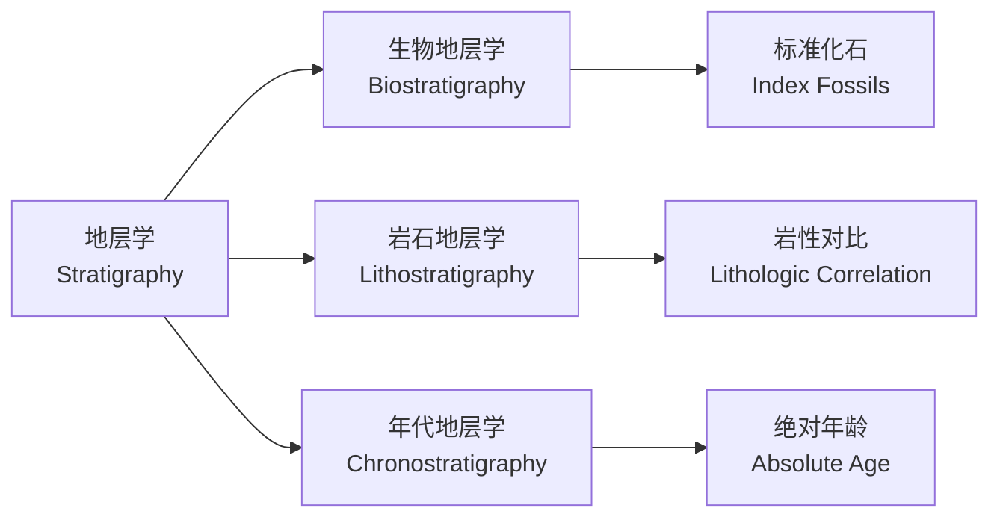
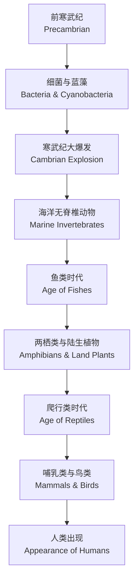
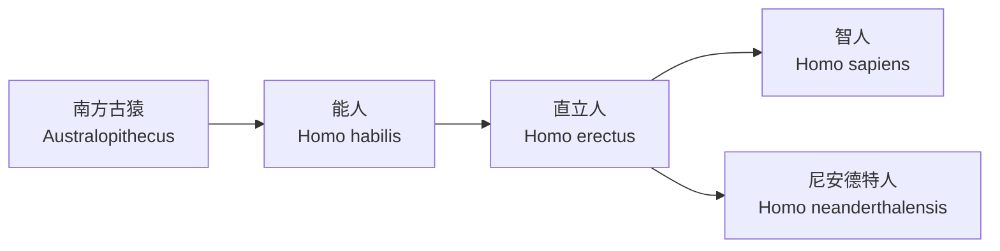

---
aliases:
  - 地史学
  - 古生物学
  - Historical Geology
  - Paleontology
  - 地层学
tags:
  - earth-sciences
  - geology
  - paleontology
  - stratigraphy
  - fossils
  - earth-history
created: 2024-02-10
updated: 2024-09-15
---

# 地史与古生物学

**地史学（Historical Geology）** 研究地球的形成与演化历史，**古生物学（Paleontology）** 则研究地质历史时期的生物及其演化规律。两者紧密结合，通过对地层和化石的研究，重建地球的生命与环境演化画卷。

## 地层学基础

### 地层层序律

地层层序律（Law of Superposition）由 Steno 于 1669 年提出：在未受扰动的沉积岩序列中，下伏地层比上覆地层更古老。

### 原始水平律

原始水平律（Law of Original Horizontality）指出沉积岩层最初是在接近水平的条件下沉积的。

### 横向连续律

横向连续律（Law of Lateral Continuity）认为岩层在侧向上延伸至尖灭或被切割为止。

## 地质年代

### 相对年代

相对年代（relative age）通过地层层序律和化石来确定地层的先后顺序：

### 绝对年代

绝对年代（absolute age）通过放射性同位素测年（radiometric dating）确定岩石或化石的精确年龄：

$$
t = \frac{1}{\lambda} \ln\left(1 + \frac{D}{P}\right)
$$

其中 $t$ 为样品年龄，$\lambda$ 为衰变常数，$D$ 为子体同位素数量，$P$ 为母体同位素数量。

### 常用测年方法

| 方法 | 母体 | 子体 | 半衰期（年） | 适用对象 |
|------|------|------|--------------|----------|
| 铀-铅法 | $^{238}U$ | $^{206}Pb$ | $4.47 \times 10^9$ | 锆石 |
| 钾-氩法 | $^{40}K$ | $^{40}Ar$ | $1.25 \times 10^9$ | 火山岩 |
| 碳-14法 | $^{14}C$ | $^{14}N$ | $5.73 \times 10^3$ | 有机质 |
| 铷-锶法 | $^{87}Rb$ | $^{87}Sr$ | $4.88 \times 10^{10}$ | 花岗岩 |

### 地质年代表

| 宙（Eon） | 代（Era） | 纪（Period） | 开始时间（Ma） | 主要事件 |
|-----------|-----------|--------------|----------------|----------|
| 显生宙 | 新生代 | 第四纪 | 2.58 | 人类出现、冰期 |
| 显生宙 | 新生代 | 新近纪 | 23.03 | 草原扩张 |
| 显生宙 | 新生代 | 古近纪 | 66.0 | 哺乳动物繁盛 |
| 显生宙 | 中生代 | 白垩纪 | 145.0 | 恐龙极盛至灭绝 |
| 显生宙 | 中生代 | 侏罗纪 | 201.3 | 恐龙繁盛、鸟类出现 |
| 显生宙 | 中生代 | 三叠纪 | 251.9 | 恐龙出现、末期中灭绝 |
| 显生宙 | 古生代 | 二叠纪 | 298.9 | 盘古大陆形成、最大灭绝 |
| 显生宙 | 古生代 | 石炭纪 | 358.9 | 森林繁盛、煤层形成 |
| 显生宙 | 古生代 | 泥盆纪 | 419.2 | 鱼类时代、陆生维管植物 |
| 显生宙 | 古生代 | 志留纪 | 443.8 | 陆生植物出现 |
| 显生宙 | 古生代 | 奥陶纪 | 485.4 | 海洋无脊椎动物繁盛 |
| 显生宙 | 古生代 | 寒武纪 | 541.0 | 生命大爆发 |
| 隐生宙 | 元古宙 | 震旦纪 | 1000 | 多细胞生物出现 |
| 隐生宙 | 太古宙 | — | 4000 | 最早生命证据 |
| 隐生宙 | 冥古宙 | — | 4600 | 地球形成 |

## 化石与古生物学

### 化石的形成

化石（fossil）是保存在岩石中的古生物遗骸或遗迹。化石形成的条件包括：

- **快速埋藏（rapid burial）**：防止分解和破坏
- **坚硬部分（hard parts）**：骨骼、贝壳、木质部等易保存
- **缺氧环境（anoxic environment）**：抑制微生物分解
- **后期矿化（mineralization）**：孔隙被矿物填充

### 化石类型

| 类型 | 描述 | 实例 |
|------|------|------|
| 实体化石 | 生物遗骸本身 | 恐龙骨骼 |
| 模铸化石 | 生物外形的印模 | 贝壳印模 |
| 遗迹化石 | 生物活动痕迹 | 足迹、粪化石 |
| 化学化石 | 有机分子残留 | 生物标记化合物 |

### 标准化石

标准化石（index fossil）用于确定地层地质年代，需满足：

- 生存时间短（短时限种）
- 分布范围广（地理广布种）
- 数量丰富
- 易于识别

重要标准化石包括：

$$
\text{三叶虫（Trilobita）} \rightarrow \text{古生代}
$$
$$
\text{菊石（Ammonoidea）} \rightarrow \text{中生代}
$$
$$
\text{笔石（Graptolithina）} \rightarrow \text{奥陶纪-志留纪}
$$

### 化石记录与演化

化石记录揭示了生命的演化历程：

## 古生态学

古生态学（paleoecology）研究古代生物与环境的关系，利用化石组合重建古环境：

$$
\text{Paleoenvironment} = f(\text{taxonomic composition}, \text{sedimentology}, \text{geochemistry})
$$

### 古气候重建

通过以下指标重建古气候：

- **氧同位素**：$\delta^{18}O$ 反映冰量和温度
- **花粉分析（palynology）**：植被类型指示气候
- **树木年轮（dendrochronology）**：年轮宽度反映生长条件

$$
\delta^{18}O = \left( \frac{(^{18}O/^{16}O)_{sample}}{(^{18}O/^{16}O)_{standard}} - 1 \right) \times 1000\%
$$

### 生物相

生物相（biofacies）是特定环境条件下的化石组合特征：

| 环境 | 生物相特征 | 典型化石 |
|------|------------|----------|
| 深海 | 硅质微体化石 | 放射虫、硅藻 |
| 浅海 | 钙质壳生物 | 腕足类、珊瑚 |
| 滨海 | 破碎壳、遗迹化石 | 双壳类、蠕虫管 |
| 陆相 | 植物碎片、淡水贝类 | 孢粉、叶化石 |

## 生物灭绝事件

地质历史上发生过多次大规模生物灭绝（mass extinction）：

### 二叠纪-三叠纪灭绝事件

二叠纪-三叠纪灭绝事件（Permian-Triassic extinction, P-T 事件）发生在 252 Ma，是最大规模的灭绝事件：

- 约 96% 的海洋物种灭绝
- 约 70% 的陆生脊椎动物灭绝
- 可能由西伯利亚暗色岩喷发导致

### 白垩纪-古近纪灭绝事件

白垩纪-古近纪灭绝事件（Cretaceous-Paleogene extinction, K-Pg 事件）发生在 66 Ma：

- 非鸟恐龙全部灭绝
- 约 75% 的物种灭绝
- 由希克苏鲁伯陨石撞击导致

灭绝事件的主要假说包括：

| 假说 | 机制 | 证据 |
|------|------|------|
| 陨石撞击 | 全球火灾、遮蔽阳光 | 铱异常、冲击石英 |
| 火山喷发 | 气候变化、酸化 | 德干玄武岩 |
| 气候剧变 | 温度骤变 | 同位素记录 |
| 海平面变化 | 栖息地丧失 | 地层记录 |

## 板块构造与生物地理

板块构造（plate tectonics）驱动大陆漂移，影响生物分布与演化：

- **联合古陆（Pangaea）**：约 300 Ma 形成，250 Ma 开始解体
- **隔离演化（vicariance）**：大陆分裂导致种群隔离，形成新种
- **扩散（dispersal）**：生物通过陆桥或洋流扩散至新地区

## 地史中的关键事件

### 大氧化事件

大氧化事件（Great Oxidation Event, GOE）发生在约 2.4 Ga，大气中氧气浓度首次显著上升：

$$
2H_2O + CO_2 \xrightarrow{h\nu, \text{cyanobacteria}} CH_2O + O_2 + H_2O
$$

### 雪球地球

雪球地球（Snowball Earth）假说认为新元古代（约 720-635 Ma）地球被完全冰封，随后火山活动释放 $CO_2$ 导致全球快速升温。

### 寒武纪生命大爆发

寒武纪生命大爆发（Cambrian explosion）发生在约 541 Ma，几乎所有主要动物门类在短短数千万年内出现：

- 澄江化石库（Chengjiang fauna）— 中国云南
- 伯吉斯页岩（Burgess Shale）— 加拿大

## 层序地层学

层序地层学（sequence stratigraphy）是研究以不整合面或与其相当的整合面为边界的地层单元的科学：

### 关键界面

- **层序边界（sequence boundary, SB）**：不整合面
- **最大海泛面（maximum flooding surface, MFS）**：海平面最高时的沉积面
- **海进面（transgressive surface, TS）**：海侵开始的沉积面

### 体系域

一个完整的层序由以下体系域（systems tract）组成：

## 构造地质学与地史

### 造山运动

主要的造山运动（orogeny）事件：

| 造山事件 | 时间 | 区域 | 结果 |
|----------|------|------|------|
| 加里东运动 | 早古生代 | 西北欧 | Caledonides 山脉 |
| 海西运动 | 晚古生代 | 欧洲、北美 | 阿巴拉契亚山脉 |
| 阿尔卑斯运动 | 新生代 | 欧亚 | 喜马拉雅山脉、阿尔卑斯山脉 |
| 燕山运动 | 中生代 | 东亚 | 中国东部山脉 |

### 盆地类型

沉积盆地（sedimentary basin）按成因分类：

- **裂谷盆地（rift basin）**：板块张裂形成的伸展盆地
- **前陆盆地（foreland basin）**：造山带前缘的挠曲盆地
- **弧后盆地（back-arc basin）**：俯冲带后缘的伸展盆地
- **克拉通盆地（cratonic basin）**：稳定大陆内部的大型沉积盆地

## 重要化石群

### 埃迪卡拉生物群

埃迪卡拉生物群（Ediacaran biota）存在于约 575-541 Ma，是最早的复杂多细胞生物，以软躯体印痕化石保存。

### 澄江动物群

澄江动物群（Chengjiang fauna）位于中国云南寒武纪地层（约 518 Ma），保存了精美的软躯体化石，包括：

- 奇虾（Anomalocaris）
- 微网虫（Microdictyon）
- 昆明鱼（Myllokunmingia）— 最早的脊椎动物之一

### 热河生物群

热河生物群（Jehol Biota）位于中国辽西白垩纪地层，以保存精美的鸟类和恐龙化石闻名：

- 中华龙鸟（Sinosauropteryx）— 带羽毛的恐龙
- 孔子鸟（Confuciusornis）— 早期鸟类
- 辽宁古果（Archaefructus）— 早期被子植物

## 人类演化

人类演化（human evolution）是古人类学研究的主要内容：

人类演化的关键特征包括：

- 脑容量增大（从 400 cc 到 1400 cc）
- 直立行走与工具使用
- 语言与社会复杂化

## 地史研究方法

### 野外调查方法

- **剖面测量（section measurement）**：逐层记录地层信息
- **路线地质调查（traverse mapping）**：沿路线观察和记录
- **井下测井（well logging）**：钻孔岩心的测井曲线分析

### 实验室分析

- **岩矿鉴定（petrographic analysis）**：偏光显微镜观察薄片
- **地球化学分析（geochemical analysis）**：元素和同位素测试
- **古地磁学（paleomagnetism）**：确定古纬度和地层年龄

### 数字地史

现代地史学研究中的数字化方法：

- **GIS 地层数据库**：管理地层和化石数据
- **三维地质建模（3D geological modeling）**：可视化地下地质结构
- **大数据分析**：挖掘地层和化石数据的时空模式

## 总结

地史与古生物学通过地层记录和化石证据重建了地球 46 亿年的演化历程。从隐生宙的原始生命到显生宙的生物繁盛与灭绝，从板块运动到气候变化，从雪球地球到温室地球，地球始终处于动态变化之中。地质年代系统为理解地球历史提供了时间框架，而化石则为揭示生命演化与环境变迁提供了关键证据。现代地史学研究方法融合了野外调查、实验室分析和数字化技术，不断深化着对地球历史的认识。
