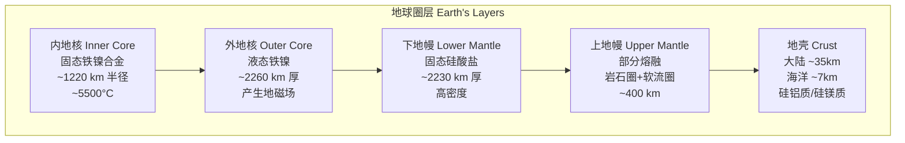
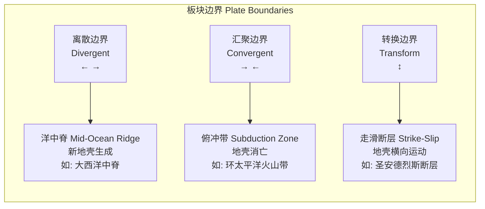
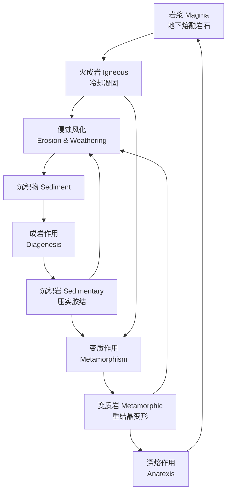
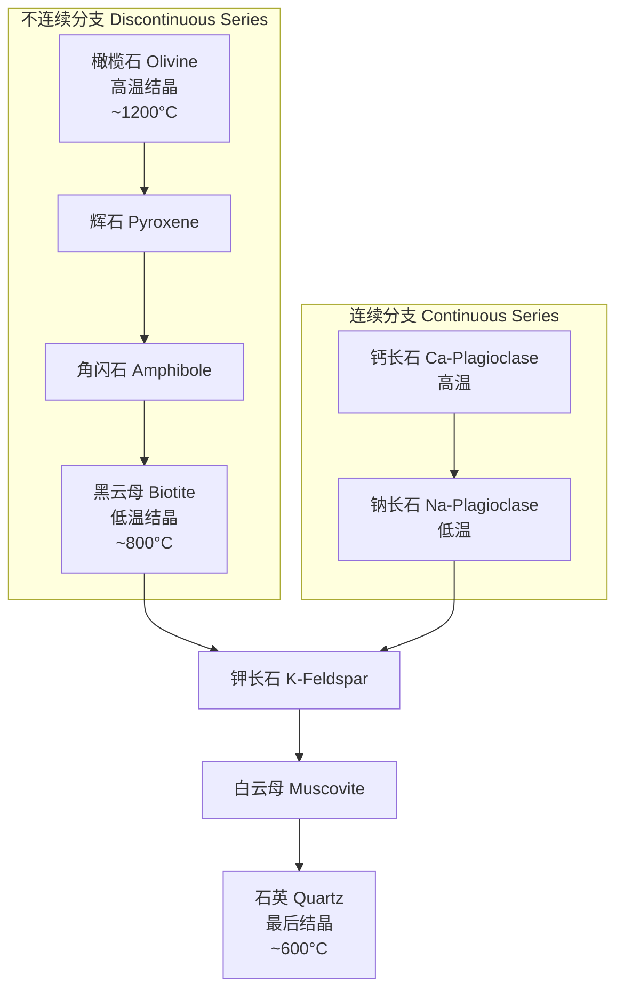

---
aliases:
  - Geology
  - EarthScience
  - Geoscience
  - PhysicalGeology
tags:
  - 02_NaturalSciences
  - EarthSciences
  - GeologyOverview
  - PlateTectonics
  - Mineralogy
created: 2024-01-10
updated: 2026-05-17
---

# 地质学概论

> 地质学 (Geology) 是研究地球的物质组成、内部结构和演化历史的自然科学，探索地球 46 亿年的历史，理解塑造地球表面的各种地质过程。

## 地球的结构 (Earth's Structure)

### 地球的圈层结构

地球从内到外可分为多个圈层，每个圈层具有独特的物理和化学性质：

| 圈层 | 深度范围 (km) | 成分 | 温度 (°C) | 密度 (g/cm³) |
| :--- | :--- | :--- | :--- | :--- |
| 大陆地壳 | 0-35 (平均) | 花岗岩质 (硅铝质) | 地表-1000 | 2.7 |
| 海洋地壳 | 0-7 (平均) | 玄武岩质 (硅镁质) | 0-700 | 3.0 |
| 上地幔 | 35-670 | 橄榄岩 (橄榄石+辉石) | 1000-1500 | 3.3-4.0 |
| 下地幔 | 670-2900 | 钙钛矿结构硅酸盐 | 1500-3700 | 4.0-5.6 |
| 外地核 | 2900-5150 | 液态铁 + 镍 + 轻元素 | 3700-4500 | 9.9-12.2 |
| 内地核 | 5150-6371 | 固态铁镍合金 | ~5500 | ~13.0 |

### 莫霍面与古登堡面

- **莫霍洛维奇不连续面 (Moho)**：地壳与地幔的分界面，地震 P 波速度从 ~7 km/s 突增至 ~8 km/s
- **古登堡不连续面**：地幔与地核的分界面，S 波无法通过 (证明外核为液态)

## 板块构造理论 (Plate Tectonics)

### 核心原理

板块构造理论是现代地质学的基石，描述了岩石圈 (Lithosphere) 被分割成若干板块，在软流圈 (Asthenosphere) 上运动。

$$ \text{板块运动速度} \approx 1\text{–}15 \text{ cm/年} $$

### 板块边界类型

| 边界类型 | 相对运动 | 地质特征 | 实例 |
| :--- | :--- | :--- | :--- |
| **离散边界 (Divergent)** | 板块分离 | 洋中脊、裂谷、浅源地震、火山喷发 | 大西洋中脊、东非大裂谷 |
| **汇聚边界 (Convergent)** | 板块碰撞 | 俯冲带、山链、深源地震、火山弧 | 喜马拉雅山脉、安第斯山脉 |
| **转换边界 (Transform)** | 水平滑移 | 浅源地震、断层 | 圣安德烈斯断层 |
| **碰撞边界 (Collision)** | 大陆对大陆 | 造山运动、高原隆升 | 青藏高原 |

## 岩石循环 (Rock Cycle)

### 三大岩类

| 岩类 | 形成方式 | 典型岩石 | 特征 |
| :--- | :--- | :--- | :--- |
| **火成岩 (Igneous)** | 岩浆冷却结晶 | 花岗岩 (侵入)、玄武岩 (喷出) | 块状、晶体结构 |
| **沉积岩 (Sedimentary)** | 沉积物压实胶结 | 砂岩、石灰岩、页岩 | 层理、化石、碎屑结构 |
| **变质岩 (Metamorphic)** | 高温高压下改造 | 片麻岩、大理石、板岩 | 片理、重结晶、矿物定向排列 |

### 重要矿物

| 矿物 | 化学式 | 莫氏硬度 | 用途 |
| :--- | :--- | :--- | :--- |
| 石英 (Quartz) | SiO₂ | 7 | 玻璃、电子元件 |
| 长石 (Feldspar) | KAlSi₃O₈ | 6-6.5 | 陶瓷原料 |
| 方解石 (Calcite) | CaCO₃ | 3 | 水泥原料 |
| 赤铁矿 (Hematite) | Fe₂O₃ | 5.5-6.5 | 铁矿石 |
| 黄铜矿 (Chalcopyrite) | CuFeS₂ | 3.5-4 | 铜矿石 |

## 地质时间尺度 (Geologic Time Scale)

### 地球历史的关键时期

地球年龄约 46 亿年，地质年代表将其划分为不同的级别：

$$ \text{宙 (Eon)} \rightarrow \text{代 (Era)} \rightarrow \text{纪 (Period)} \rightarrow \text{世 (Epoch)} $$

| 宙 | 代 | 开始时间 (Ma) | 重大事件 |
| :--- | :--- | :--- | :--- |
| 冥古宙 (Hadean) | — | ~4600 | 地球形成、月球撞击起源 |
| 太古宙 (Archean) | — | ~4000 | 最早生命、板块构造启动 |
| 元古宙 (Proterozoic) | — | ~2500 | 氧气的积累、真核生物出现 |
| **显生宙 (Phanerozoic)** | 古生代 (Paleozoic) | ~541 | 寒武纪生命大爆发、鱼类/两栖类/爬行类出现 |
| | 中生代 (Mesozoic) | ~252 | 恐龙时代、联合古陆解体 |
| | 新生代 (Cenozoic) | ~66 | 哺乳类崛起、人类出现 |

## 地质资源与灾害

### 矿产资源

- **金属矿产**：铁、铜、铝、金、稀土元素 (REE)
- **非金属矿产**：石灰石 (水泥)、石英 (玻璃)、黏土 (陶瓷)
- **能源矿产**：石油、天然气、煤炭、铀、地热
- **形成条件**：成矿流体、合适的地质构造、物理化学条件

$$ \text{矿床品位} = \frac{\text{有用组分的质量}}{\text{矿石总质量}} \times 100\% $$

### 地质灾害

| 灾害类型 | 成因 | 预测方法 | 减灾措施 |
| :--- | :--- | :--- | :--- |
| **地震 (Earthquake)** | 断层突然错动释放应力 | 地震监测网、前兆观测 | 抗震建筑、预警系统 |
| **火山喷发 (Volcanic Eruption)** | 岩浆上升至地表 | 气体监测、地形变形测量 | 疏散计划、危险区划 |
| **滑坡 (Landslide)** | 坡体失稳 (水/地震/人为) | 稳定性分析、降雨阈值 | 排水工程、加固支护 |
| **地面沉降** | 地下水超采或采矿 | InSAR 监测 | 限采回灌 |
| **海啸 (Tsunami)** | 海底地震/火山/滑坡 | 深海浮标网络 | 早期预警、沿海规划 |

### 地震震级与烈度

$$ M_w = \frac{2}{3} \log_{10}(M_0) - 10.7 $$

(矩震级 $M_w$, $M_0$ 为地震矩)

| 震级 | 能量释放 | 每年发生次数 | 烈度影响 |
| :--- | :--- | :--- | :--- |
| < 3.0 | 非常小 | ~100,000+ | 通常无感 |
| 3.0-4.9 | 小-中等 | ~50,000 | 有感但少破坏 |
| 5.0-6.9 | 中-强 | ~1,500 | 可能造成建筑物破坏 |
| 7.0-7.9 | 大地震 | ~15-20 | 严重破坏 |
| 8.0+ | 特大地震 | ~1-2 | 毁灭性破坏 |

## 环境地质学

### 人类活动的地质影响

- **地下水开采**：引起地面沉降、水质恶化
- **采矿**：酸性矿山排水、地貌改变
- **碳排放**：气候变化对冰川、冻土、海平面的影响
- **核废料处置**：地质储存库选址 (如芬兰 Onkalo)
- **碳封存 (Carbon Sequestration)**：将 CO₂ 注入深部盐水层

## 地质学分支学科一览

| 分支学科 | 研究对象 | 实际应用 |
| :--- | :--- | :--- |
| **矿物学 (Mineralogy)** | 矿物的化学成分、晶体结构、物理性质 | 宝石鉴定、资源勘探 |
| **岩石学 (Petrology)** | 三大类岩石的成因与演化 | 工程地质、建筑材料 |
| **构造地质学 (Structural Geology)** | 岩石变形、断层、褶皱 | 地质灾害评估、矿产定位 |
| **地层学 (Stratigraphy)** | 岩层序列及其时间关系 | 油气勘探、古环境重建 |
| **古生物学 (Paleontology)** | 化石记录与生命演化史 | 生物地层对比、进化研究 |
| **地球化学 (Geochemistry)** | 元素和同位素在地球中的分布与迁移 | 矿产勘查、环境监测 |
| **地球物理学 (Geophysics)** | 地球的物理场 (重力、地磁、地震) | 资源探测、地球深部结构 |
| **水文地质学 (Hydrogeology)** | 地下水的分布、运动和水质 | 供水工程、污染修复 |
| **工程地质学 (Engineering Geology)** | 地质条件对工程的影响 | 隧道、大坝、边坡稳定性 |
| **环境地质学 (Environmental Geology)** | 人类活动与地质环境的相互作用 | 污染治理、土地使用规划 |

## 造岩矿物 (Rock-Forming Minerals)

### 硅酸盐矿物

硅酸盐矿物占地壳质量的 90% 以上，以硅氧四面体 (SiO₄⁴⁻) 为基本结构单元：

$$ \text{硅氧四面体: } [SiO_4]^{4-} $$

| 矿物 | 化学简式 | 硅氧结构 | 莫氏硬度 | 常见颜色 |
| :--- | :--- | :--- | :--- | :--- |
| 橄榄石 (Olivine) | (Mg,Fe)₂SiO₄ | 岛状 | 6.5-7 | 橄榄绿色 |
| 辉石 (Pyroxene) | (Mg,Fe)CaSi₂O₆ | 单链状 | 5-6 | 深绿至黑色 |
| 角闪石 (Amphibole) | 复杂含 OH⁻ 硅酸盐 | 双链状 | 5-6 | 深绿色 |
| 黑云母 (Biotite) | K(Mg,Fe)₃AlSi₃O₁₀(OH)₂ | 层状 | 2.5-3 | 黑色 |
| 白云母 (Muscovite) | KAl₂(AlSi₃O₁₀)(OH)₂ | 层状 | 2-2.5 | 无色/白色 |
| 长石 (Feldspar) | (K,Na,Ca)AlSi₃O₈ | 架状 | 6-6.5 | 多样 |
| 石英 (Quartz) | SiO₂ | 架状 | 7 | 无色/乳白色 |

### 鲍温反应系列 (Bowen's Reaction Series)

鲍温反应系列描述了岩浆冷却过程中矿物的结晶顺序，是理解火成岩分类的重要理论基础：

## 沉积岩与沉积环境

### 碎屑岩分类 (Clastic Rocks)

| 碎屑粒径 | 岩石名称 | 沉积环境示例 |
| :--- | :--- | :--- |
| > 256 mm | 砾岩/角砾岩 (Conglomerate/Breccia) | 山麓冲积扇、河流底部 |
| 64-256 mm | 粗砾岩 | 河流峡谷、冰川沉积 |
| 2-64 mm | 砾岩 (Pebble Conglomerate) | 河床、海滩 |
| 0.0625-2 mm | 砂岩 (Sandstone) | 沙漠、海滩、河流 |
| 0.004-0.0625 mm | 粉砂岩 (Siltstone) | 泛滥平原、深湖 |
| < 0.004 mm | 页岩 (Shale) | 深海、湖泊静水区 |

### 碳酸盐岩与化石

石灰岩 (Limestone) 主要由方解石 (CaCO₃) 组成，多为生物成因。珊瑚礁、贝壳碎屑和微生物席都是重要的碳酸盐来源。白云岩 (Dolomite) CaMg(CO₃)₂ 则通过方解石与镁离子的交代作用形成。

## 地质构造 (Geological Structures)

### 褶皱 (Folds)

| 类型 | 描述 | 形成应力 | 识别特征 |
| :--- | :--- | :--- | :--- |
| 背斜 (Anticline) | 岩层向上弯曲 | 挤压应力 | 核部为老地层，两翼为新地层 |
| 向斜 (Syncline) | 岩层向下弯曲 | 挤压应力 | 核部为新地层，两翼为老地层 |
| 单斜 (Monocline) | 岩层一侧倾斜 | 区域隆升 | 局部倾角增大 |
| 倒转褶皱 (Overturned Fold) | 一翼角度 > 90° | 强烈挤压 | 地层序列倒转 |

### 断层 (Faults)

| 断层类型 | 运动方向 | 形成应力 | 地表特征 |
| :--- | :--- | :--- | :--- |
| 正断层 (Normal Fault) | 上盘下移 | 张应力 (拉伸) | 陡崖、地堑 |
| 逆断层 (Reverse Fault) | 上盘上移 | 压应力 (挤压) | 叠瓦构造、地壳增厚 |
| 走滑断层 (Strike-Slip Fault) | 水平滑移 | 剪切应力 | 河流偏移、错断山脊 |
| 转换断层 (Transform Fault) | 板块边界水平滑移 | 剪切应力 | 洋中脊错断 |

## 相关条目

- [[Geophysics|地球物理学]]
- [[Mineralogy|矿物学]]
- [[Paleontology|古生物学]]
- [[Volcanology|火山学]]
- [[Seismology|地震学]]
- [[07_InterdisciplinarySciences/EnvironmentalScience/EnvironmentalScience|环境科学]]
- [[StructuralGeology|构造地质学]]
- [[Sedimentology|沉积学]]
- [[02_NaturalSciences/EarthSciences/Geochemistry/Geochemistry|地球化学]]
- [[Hydrogeology|水文地质学]]
- [[PlanetaryGeology|行星地质学]]

