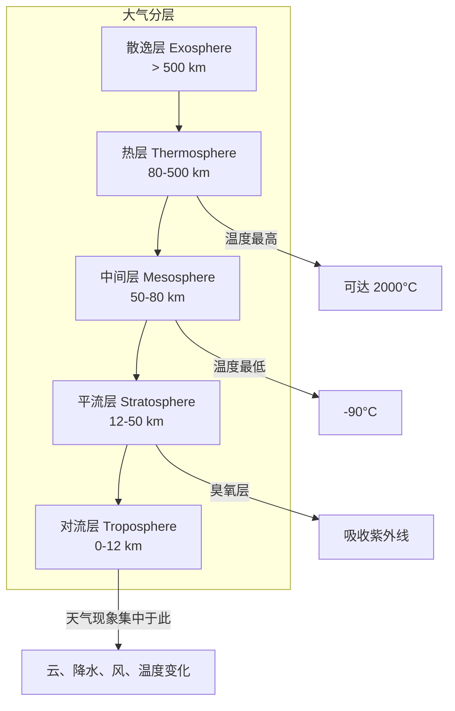
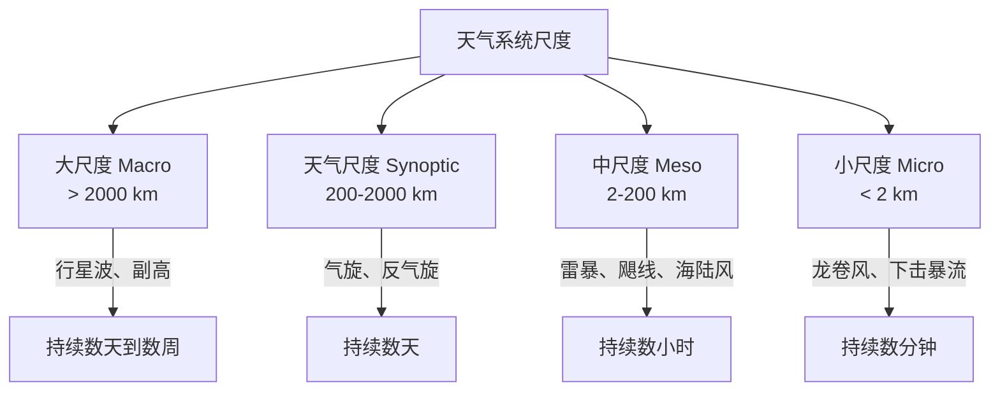
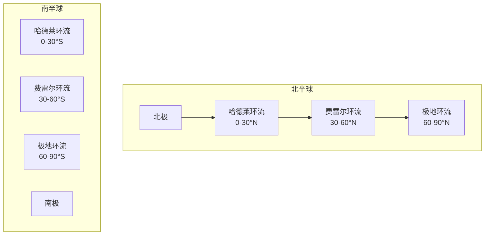

---
aliases: [Meteorology, 气象学]
tags: ['02_NaturalSciences', 'EarthSciences', 'Meteorology']
created: 2026-05-17
updated: 2026-05-17
---

# 气象学

气象学是研究大气现象和过程的科学，涵盖天气、气候、大气物理和大气化学等分支。它与大气科学密切相关，是地球科学的重要分支。

## 大气的垂直结构



### 各层特性

| 层 | 高度范围 | 温度变化 | 压力 | 主要特征 |
|:--:|:--------:|:--------:|:----:|:--------|
| 对流层 | 0–12 km | 递减（-6.5°C/km） | 1013–226 hPa | 天气现象、水汽集中（80%） |
| 平流层 | 12–50 km | 递增（臭氧吸热） | 226–1 hPa | 臭氧层、飞机巡航层 |
| 中间层 | 50–80 km | 递减至 -90°C | 1–0.01 hPa | 流星燃烧、夜光云 |
| 热层 | 80–500 km | 递增至 2000°C | 0.01–10⁻⁷ hPa | 极光、ISS 轨道 |

## 大气动力学

### 控制方程

大气运动可以用 Navier-Stokes 方程在旋转球坐标下的形式描述：
$$
\frac{D\mathbf{V}}{Dt} = - \frac{1}{\rho}\nabla p - 2\mathbf{\Omega} \times \mathbf{V} + \mathbf{g} + \mathbf{F}
$$

| 项 | 含义 | 物理 |
|:--:|:----|:----|
| $\frac{D\mathbf{V}}{Dt}$ | 全加速度 | 速度的局部变化 + 平流 |
| $-\frac{1}{\rho}\nabla p$ | 气压梯度力 | 高压指向低压 |
| $-2\mathbf{\Omega} \times \mathbf{V}$ | 科里奥利力 | 运动物体在旋转参考系中的偏转 |
| $\mathbf{g}$ | 重力 | 指向地心 |
| $\mathbf{F}$ | 摩擦力 | 地面摩擦、湍流耗散 |

### 风场与气压场的关系

| 风型 | 受力平衡 | 描述 | 应用 |
|:---:|:--------|:----|:----|
| 地转风 | PGF = Coriolis | 高空长直等压线附近的近似风 | 高空天气图分析 |
| 梯度风 | PGF + Coriolis + Centrifugal | 弯曲等压线上 | 气旋和反气旋 |
| 热成风 | 等压面间的厚度梯度 | 上下层地转风之差 | 冷暖平流判断 |
| 地面摩擦风 | PGF + Coriolis + Friction | 风向偏向低压约 30° | 地面天气图 |

## 天气系统

### 尺度分类



### 温带气旋

温带气旋（中纬度气旋）是影响中纬度地区主要天气的系统：

**挪威气旋模型**：

| 阶段 | 特征 | 天气 |
|:---:|:----|:----|
| 初生 | 冷锋和暖锋形成 | 云量增加 |
| 发展 | 锋面波动加深，中心气压下降 | 暖锋前连续降水 |
| 成熟 | 冷锋追上暖锋形成锢囚 | 暖区窄、降水增强 |
| 消亡 | 锢囚完成，系统填塞 | 降水减弱、天气转好 |

### 热带气旋

| 名称 | 区域 | 风速标准 |
|:---:|:----|:--------|
| 热带低压 | 全球 | < 17 m/s (34 kn) |
| 热带风暴 | 全球 | 17–32 m/s (34–63 kn) |
| 台风 | 西北太平洋 | ≥ 33 m/s (64 kn) |
| 飓风 | 大西洋/东北太平洋 | ≥ 33 m/s |
| 气旋 | 印度洋/南太平洋 | ≥ 33 m/s |

**萨菲尔-辛普森飓风等级**：

| 等级 | 风速 | 风暴潮 | 破坏 |
|:---:|:----:|:------:|:----:|
| 1级 | 33–42 m/s | 1.2–1.5 m | 轻微 |
| 2级 | 43–49 m/s | 1.8–2.4 m | 中度 |
| 3级 | 50–58 m/s | 2.7–3.7 m | 广泛 |
| 4级 | 59–69 m/s | 4.0–5.5 m | 极端 |
| 5级 | ≥ 70 m/s | > 5.5 m | 灾难性 |

## 降水过程

### 降水类型

| 类型 | 形成机制 | 云种 | 典型特征 |
|:---:|:--------|:----|:--------|
| 层状降水 | 大范围缓慢上升运动 | Nimbostratus | 雨强小、持续时间长、范围广 |
| 对流性降水 | 强烈上升运动 | Cumulonimbus | 雨强大、历时短、局地性 |
| 地形降水 | 气流被迫沿坡上升 | Orographic clouds | 迎风坡多雨、背风坡雨影 |
| 锋面降水 | 冷暖空气交汇 | 锋面云系 | 沿锋面带状分布 |

### Bergeron 过程与碰并过程

冰晶效应（Bergeron-Findeisen 过程）是冷云降水的主要机制：

```text
温度 < 0°C 的混合云（过冷水滴 + 冰晶）
    → 冰晶表面的饱和水汽压 < 水滴表面的饱和水汽压
    → 水汽从水滴向冰晶转移（Wegener-Bergeron-Findeisen 过程）
    → 冰晶增长 → 降落 → 融化 → 雨滴
```

暖云降水（温度 > 0°C）主要通过碰并（Collision-Coalescence）过程：

$$
\text{增长速率} \propto E \cdot \pi(R_r + R_c)^2 \cdot (V_r - V_c) \cdot LWC
$$

其中 $E$ 是碰并效率，$R$ 是半径，$V$ 是下落速度，$LWC$ 是云液态水含量。

## 大气环流

### 三圈环流



| 环流 | 纬度 | 方向 | 地面风 | 天气特征 |
|:---:|:----:|:----:|:------:|:--------|
| 哈德莱环流 | 0–30° | 正环流 | 信风（东风） | ITCZ 多雨，副热带干旱 |
| 费雷尔环流 | 30–60° | 反环流 | 西风带 | 中纬度气旋和锋面 |
| 极地环流 | 60–90° | 正环流 | 极地东风 | 极地寒冷干燥 |

## 气象观测与预报

### 观测手段

| 观测平台 | 测量要素 | 时空分辨率 | 优势 |
|:-------:|:--------|:----------|:----|
| 地面气象站 | 温、压、湿、风、降水 | 1 分钟 / 站点 | 长期连续观测 |
| 探空气球 | 温、压、湿、风的垂直廓线 | 12 小时 / 站点 | 高空资料 |
| 气象雷达 | 降水强度、风场（多普勒） | 5–10 分钟 / ~1 km | 实时降水监测 |
| 气象卫星 | 云图、温度廓线、水汽 | 15–30 分钟 / 数 km | 全球覆盖 |
| 飞机报告 | 高空温度、风、湍流 | 沿航线 | 航空气象 |
| 风廓线雷达 | 高空风场垂直分布 | 30 分钟 / 250 m | 连续风廓线 |

### 数值天气预报

NWP（数值天气预报）使用计算机求解大气控制方程组：

```text
观测资料 → 资料同化（3D-Var / 4D-Var / EnKF）
    → 初始条件 + 边界条件
    → 数值模式求解（谱方法 / 有限差分）
    → 后处理 + 统计订正（MOS）
    → 预报产品
```

**全球主要 NWP 模式**：

| 模式 | 运行机构 | 分辨率 | 预报时效 | 特点 |
|:---:|:--------|:------:|:--------:|:----|
| ECMWF（IFS） | 欧洲中期天气预报中心 | ~9 km | 15 天 | 公认全球最佳 |
| GFS | 美国 NCEP | ~13 km | 16 天 | 免费、全球 |
| UK Met Office | 英国气象局 | ~10 km | 10 天 | 强对流预报好 |
| ICON | 德国 DWD | ~13 km | 7 天 | 新算法 |
| GRAPES | 中国气象局 | ~12 km | 10 天 | 自主开发 |

## 气候变化基础

### 温室效应

$$
\text{地球有效温度} = \left(\frac{S(1-\alpha)}{4\sigma}\right)^{1/4} \approx 255\text{K} (-18\text{°C})
$$

$$
\text{实际地表温度} \approx 288\text{K} (15\text{°C})
$$

其中 $S$ 是太阳常数（1361 W/m²），$\alpha$ 是反照率（≈0.3），$\sigma$ 是 Stefan-Boltzmann 常数。33°C 的温差来自自然温室效应。

### 主要温室气体

| 气体 | 浓度（2023） | 增温潜势（100 年） | 主要来源 |
|:---:|:-----------:|:-----------------:|:--------|
| CO₂ | 420 ppm | 1 | 化石燃料燃烧 |
| CH₄ | 1900 ppb | 28 | 农业、天然气泄漏 |
| N₂O | 335 ppb | 265 | 农业施肥 |
| SF₆ | 10 ppt | 23500 | 电力绝缘 |
| CFCs | ppb 级 | 数千–上万 | 制冷剂（已控制） |

---

## 相关条目

- [[气象气候学]]
- [[水文地理学]]
- [[地貌学]]
- [[02_NaturalSciences/EarthSciences/PhysicalGeography/INDEX|自然地理索引]]

