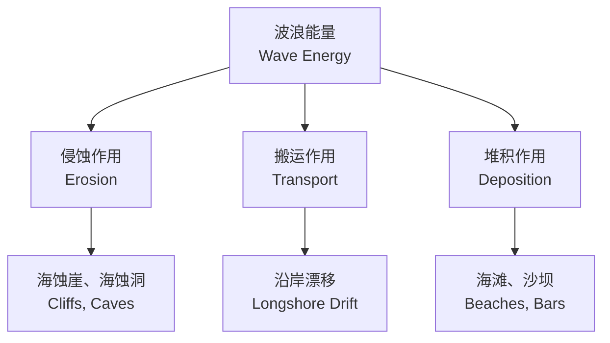

---
aliases:
  - 海洋地质学
  - 海底地质
  - Marine Geology
  - Submarine Geology
tags:
  - earth-sciences
  - oceanography
  - marine-geology
  - seafloor
  - sediments
  - coastal
created: 2024-02-15
updated: 2024-08-20
---

# 海洋地质学

**海洋地质学（Marine Geology）** 是研究海底地形、结构、沉积物和地质过程的学科。它综合运用地质学、地球物理学和海洋学的方法，探索地球表面被海水覆盖的部分。海洋地质学在资源勘探、地质灾害评估和全球变化研究中具有重要意义。

## 海底地形

### 大陆边缘

大陆边缘（continental margin）是大陆与深海盆地之间的过渡带，包括：

- **大陆架（continental shelf）**：坡度平缓（$< 0.1^\circ$），水深 $< 200\ \text{m}$
- **大陆坡（continental slope）**：坡度较陡（$3^\circ-6^\circ$），水深 $200-3000\ \text{m}$
- **大陆基（continental rise）**：坡度缓和，由沉积物堆积形成

大陆架是海洋中最具经济价值的区域，蕴藏着丰富的石油、天然气和渔业资源。

### 深海盆地

深海盆地（deep ocean basin）是海洋中面积最大的地貌单元：

| 地貌单元 | 特征 | 深度范围 |
|----------|------|----------|
| 深海平原 | 最平坦的地球表面 | $3000-5000\ \text{m}$ |
| 海山 | 火山成因的孤立山峰 | 高出海底 $> 1000\ \text{m}$ |
| 平顶海山 | 顶部被侵蚀削平的海山 | 顶部平坦 |
| 海底峡谷 | V 形谷，浊流侵蚀形成 | 切割大陆坡 |

### 大洋中脊

大洋中脊（mid-ocean ridge）是地球上最长的山脉系统，总长约 65000 km，是板块分裂和洋壳生成的场所。大洋中脊的扩张速率：

- **快速扩张**（东太平洋海隆）：$> 100\ \text{mm/yr}$，地形平缓
- **慢速扩张**（大西洋中脊）：$20-40\ \text{mm/yr}$，地形崎岖

$$
v_{spread} = \frac{d}{t} \quad \text{其中 } d = \text{扩张距离}, t = \text{时间}
$$

## 海底扩张与板块构造

### 海底扩张学说

海底扩张（seafloor spreading）由 Harry Hess 于 1962 年提出：

海底扩张的证据包括：

- **地磁条带（magnetic striping）**：洋壳磁异常对称排列
- **年龄结构**：洋壳年龄从中脊向两侧逐渐增大
- **热流分布**：中脊处热流值最高
- **沉积物厚度**：中脊处最薄，向两侧增厚

### 俯冲带

俯冲带（subduction zone）是洋壳向地幔下沉的区域，特征包括：

- **海沟（trench）**：海沟是地球表面最深的地方
- **火山弧（volcanic arc）**：俯冲板块脱水导致地幔熔融
- **地震带（Benioff zone）**：倾斜分布的地震震源

$$
\text{Slab Pull Force} \propto \Delta\rho \cdot g \cdot V_{slab}
$$

## 海洋沉积物

### 沉积物来源

| 类型 | 来源 | 主要成分 | 分布区域 |
|------|------|----------|----------|
| 陆源碎屑 | 陆地侵蚀 | 石英、粘土矿物 | 大陆边缘 |
| 生物源 | 生物壳体 | 碳酸钙、蛋白石 | 深海平原 |
| 自生源 | 海水化学沉淀 | 锰结核、磷酸盐 | 深海盆地 |
| 火山源 | 火山活动 | 火山玻璃、矿物碎屑 | 中脊、火山岛附近 |
| 宇宙源 | 宇宙尘埃 | 铁镍微球粒 | 极少量分布 |

### 碳酸盐补偿深度

碳酸盐补偿深度（Carbonate Compensation Depth, CCD）是深海溶解作用超过沉积作用的临界深度：

$$
CaCO_3 + CO_2 + H_2O \rightleftharpoons Ca^{2+} + 2HCO_3^-
$$

在 CCD 以下，碳酸盐沉积物会被完全溶解，形成以硅质软泥为主的沉积层。CCD 一般位于 $4000-5000\ \text{m}$ 深度，但在不同海域有所差异。

### 沉积速率

不同环境下的沉积速率差异巨大：

| 环境 | 沉积速率 | 沉积物类型 |
|------|----------|------------|
| 三角洲 | $100-1000\ \text{cm/kyr}$ | 砂、泥 |
| 大陆架 | $10-100\ \text{cm/kyr}$ | 陆源碎屑 |
| 深海平原 | $0.1-1\ \text{cm/kyr}$ | 远洋软泥 |
| 锰结核区 | $< 0.1\ \text{cm/kyr}$ | 自生沉积 |

## 海岸过程

### 波浪

波浪（wave）是海岸动力中最活跃的因素。深水波的波速：

$$
c = \sqrt{\frac{g\lambda}{2\pi}} \quad \text{或} \quad c = \frac{gT}{2\pi}
$$

其中 $c$ 为波速，$\lambda$ 为波长，$T$ 为周期，$g$ 为重力加速度。

当波浪进入浅水区（$d < \lambda/2$）时，波速减小，波长缩短，波高增大直至破碎。

### 潮汐

潮汐（tide）由月球和太阳引力引起，其平衡潮理论预测：

$$
h(\phi) = \frac{3}{2} \cdot \frac{M}{E} \cdot \frac{R^4}{r^3} \left( \cos^2\phi - \frac{1}{3} \right)
$$

其中 $M$ 为天体质量，$E$ 为地球质量，$R$ 为地球半径，$r$ 为天体距地距离，$\phi$ 为天顶角。

### 海岸侵蚀与堆积

海岸地貌演化遵循动力平衡原理：

- **沿岸漂移（longshore drift）**：波浪斜向入射造成的泥沙沿岸搬运
- **海滩剖面（beach profile）**：由海滩坡度、沉积物粒度和波浪能量共同决定

## 海洋地质资源

### 石油天然气

海洋石油与天然气（offshore oil & gas）储存在大陆架的沉积盆地中，以构造圈闭和地层圈闭为主：

$$
\text{Source Rock} \rightarrow \text{Migration} \rightarrow \text{Reservoir} \rightarrow \text{Trap}
$$

### 天然气水合物

天然气水合物（gas hydrate）是甲烷分子被困在水分子笼状结构中的冰状固体，主要分布在大陆坡和永久冻土区。1 体积水合物可释放约 164 体积甲烷。

### 锰结核

锰结核（manganese nodule）又称多金属结核，富含 Mn、Fe、Ni、Cu、Co 等金属元素。结核生长速率极慢，约 $1-10\ \text{mm/Ma}$。

## 海洋地质灾害

### 海底滑坡

海底滑坡（submarine landslide）发生在大陆坡上，可能引发海啸：

$$
F_{driving} = (\rho_{sed} - \rho_w) g \sin\theta \cdot V
$$
$$
F_{resisting} = c + (\rho_{sed} - \rho_w) g \cos\theta \cdot \tan\phi
$$

其中 $c$ 为内聚力，$\phi$ 为内摩擦角。

### 浊流

浊流（turbidity current）是富含悬浮沉积物的密度流，是深海沉积物输送的主要机制，流速可达 $20-30\ \text{m/s}$。

## 古海洋学

古海洋学（paleoceanography）通过海洋沉积物记录研究过去的海洋环境：

### 氧同位素地层学

氧同位素比值 $\delta^{18}O$ 反映全球冰量和温度变化：

$$
\delta^{18}O = \left( \frac{(^{18}O/^{16}O)_{sample}}{(^{18}O/^{16}O)_{standard}} - 1 \right) \times 1000\%
$$

冰期时轻同位素优先保存在冰盖中，海水的 $\delta^{18}O$ 升高。

### 海洋微体化石

海洋微体化石（micropaleontology）用于重建古海洋环境：

| 化石类型 | 保存成分 | 环境指示 |
|----------|----------|----------|
| 有孔虫 | 碳酸钙 | 温度、盐度 |
| 放射虫 | 蛋白石 | 营养盐、生产力 |
| 硅藻 | 蛋白石 | 表层水条件 |
| 颗石藻 | 碳酸钙 | 温度、CO2 |

## 海洋沉积物分类

### 沉积物粒度

温特沃斯粒度分级（Wentworth scale）：

| 粒度名称 | 直径范围 | Phi 值（$\phi$） |
|----------|----------|-----------------|
| 砾石 | $> 2\ \text{mm}$ | $< -1$ |
| 极粗砂 | $1-2\ \text{mm}$ | $0 \text{ to } -1$ |
| 粗砂 | $0.5-1\ \text{mm}$ | $1-0$ |
| 中砂 | $0.25-0.5\ \text{mm}$ | $2-1$ |
| 细砂 | $0.125-0.25\ \text{mm}$ | $3-2$ |
| 极细砂 | $0.0625-0.125\ \text{mm}$ | $4-3$ |
| 粉砂 | $0.0039-0.0625\ \text{mm}$ | $8-4$ |
| 粘土 | $< 0.0039\ \text{mm}$ | $> 8$ |

其中 $\phi = -\log_2(d)$，$d$ 为以 mm 为单位的粒径。

### 沉积物结构

沉积物结构（sedimentary structure）记录沉积环境信息：

- **层理（bedding）**：水平层理、交错层理、递变层理
- **波痕（ripple marks）**：反映水流方向和强度
- **生物扰动（bioturbation）**：动物活动遗迹
- **脱水构造（dewatering structure）**：沉积物快速堆积后的水分排出

## 海岸地貌

### 侵蚀型海岸

侵蚀海岸（erosional coast）的特征地貌：

- 海蚀崖（sea cliff）：波浪侵蚀形成的陡崖
- 海蚀洞（sea cave）：崖底软岩层被掏蚀形成洞穴
- 海蚀柱（sea stack）：崖体崩塌后残留的孤立岩柱
- 海蚀拱（sea arch）：海蚀洞两侧贯通形成拱桥

### 堆积型海岸

堆积海岸（depositional coast）的特征地貌：

- 海滩（beach）：波浪搬运的砂砾堆积体
- 沙嘴（spit）：从海岸伸入水中的沙质堆积体
- 障壁岛（barrier island）：平行于海岸的狭长沙岛
- 潟湖（lagoon）：障壁岛与海岸之间的浅水域
- 三角洲（delta）：河流入海处的泥沙堆积

### 海岸平衡剖面

海滩剖面（beach profile）在波浪作用下趋向达到动态平衡：

$$
\tan\beta = \frac{\rho_s - \rho}{\rho_s} \cdot \frac{H}{L}
$$

其中 $\beta$ 为滩面坡度，$\rho_s$ 为沉积物密度，$\rho$ 为水密度，$H$ 和 $L$ 为波高和波长。

## 珊瑚礁地质

### 珊瑚礁发育条件

珊瑚礁发育需要的环境条件：

- 水温 $> 18^\circ\text{C}$（最适 $23-28^\circ\text{C}$）
- 水深 $< 50\ \text{m}$（透光层内）
- 盐度 $32-42\%$
- 清澈海水（低浊度、低营养盐）
- 坚实基底

### 珊瑚礁演化

达尔文提出的珊瑚礁演化模式：

1. 火山岛周围形成岸礁
2. 火山岛下沉，岸礁发展为堡礁
3. 火山岛完全沉没，堡礁演变为环礁

### 海平面变化与珊瑚礁

第四纪冰期-间冰期旋回导致海平面升降，控制珊瑚礁的垂向生长：

珊瑚礁生长速率需要与海平面上升速率匹配才能维持：

$$
\text{Keep-up: } v_{reef} > v_{sea\_level}
$$
$$
\text{Give-up: } v_{reef} < v_{sea\_level}
$$

## 海洋矿产资源

### 海底多金属硫化物

海底多金属硫化物（Seafloor Massive Sulfide, SMS）形成于热液喷口附近：

主要化学成分：Cu、Zn、Pb、Au、Ag

### 磷钙土

磷钙土（phosphorite）富含磷元素，是制造化肥的重要原料，分布在大陆架和大陆坡上。

### 稀土元素

深海粘土和锰结核中含有稀土元素（Rare Earth Elements, REE），具有重要的战略价值。

## 深海探测技术

### 采样设备

| 设备 | 采样类型 | 最大深度 |
|------|----------|----------|
| 重力取样管 | 柱状沉积物 | 可达 30 m 柱长 |
| 箱式取样器 | 原状表层沉积物 | 约 0.5 m² 面积 |
| 抓斗 | 表层沉积物/岩石 | 视需要 |
| 海底钻探 | 深部岩心 | 可达数百米 |

### 观测平台

- **ROV（Remote Operated Vehicle）**：遥控水下机器人
- **AUV（Autonomous Underwater Vehicle）**：自主水下航行器
- **HOV（Human Occupied Vehicle）**：载人潜水器，如蛟龙号
- **海底观测网（seafloor observatory）**：长期连续监测

## 总结

海洋地质学揭示了海底地形的多样性与海洋地质过程的复杂性。从大陆架到深海平原，从洋中脊扩张到俯冲带消亡，海洋地质过程持续塑造着地球表面。海洋沉积物记录了地球环境变迁的历史，而海底资源、海洋地质灾害的研究则具有重要的社会经济意义。深海探测技术的发展为人类认识深海、利用深海和保护深海提供了强大的技术手段。
