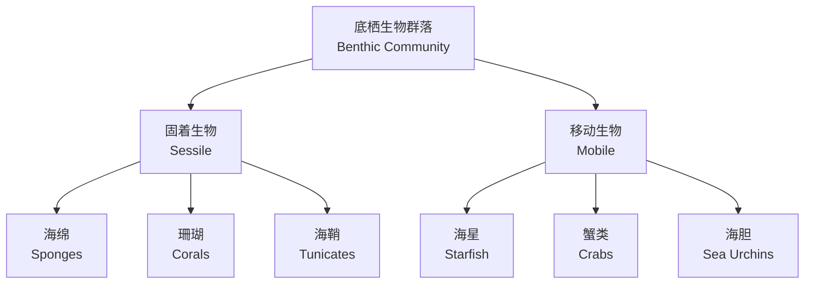
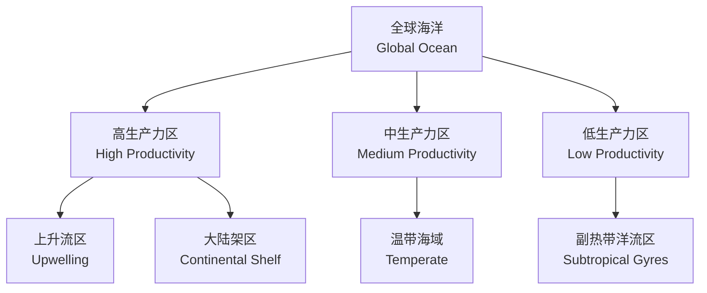

---
aliases:
  - 海洋生物学
  - Marine Biology
  - 海洋生态学
  - Marine Ecology
tags:
  - earth-sciences
  - oceanography
  - marine-biology
  - ecology
  - ecosystems
created: 2024-02-15
updated: 2024-09-01
---

# 海洋生物学

**海洋生物学（Marine Biology）** 是研究海洋中生命现象、生物多样性及其与环境相互关系的学科。海洋覆盖了地球表面的 71%，拥有从浅海到深海、从热带到极地的多样化生态系统，是地球上最大的生命栖息地。

## 海洋环境分区

### 按光照条件

| 区域 | 深度范围 | 光照条件 | 主要生物特征 |
|------|----------|----------|--------------|
| 透光带 | $0-200\ \text{m}$ | 充足光照 | 光合作用为主 |
| 弱光带 | $200-1000\ \text{m}$ | 微弱光照 | 部分生物可发光 |
| 无光带 | $> 1000\ \text{m}$ | 完全黑暗 | 化能合成、捕食 |

### 按水层与海底

- **浮游区（pelagic zone）**：水体中的生活空间
- **海底区（benthic zone）**：海底表面及沉积物中的生活空间

## 浮游生物

浮游生物（plankton）是悬浮在水体中、随水流漂移的微小生物，包括：

### 浮游植物

浮游植物（phytoplankton）是海洋的初级生产者，通过光合作用将无机碳转化为有机碳：

$$
6CO_2 + 6H_2O \xrightarrow{h\nu} C_6H_{12}O_6 + 6O_2
$$

主要类群包括：

| 类群 | 特征 | 生态意义 |
|------|------|----------|
| 硅藻（Diatom） | 硅质壳、体积大 | 近海初级生产力的主力 |
| 甲藻（Dinoflagellate） | 双鞭毛、可形成赤潮 | 有毒藻华的主要类群 |
| 颗石藻（Coccolithophore） | 碳酸钙壳 | 参与碳循环、形成白垩 |

### 浮游动物

浮游动物（zooplankton）以浮游植物或其他浮游动物为食，包括：

- **桡足类（Copepoda）**：海洋中最丰富的浮游动物
- **磷虾（Krill）**：南极生态系统中的关键物种
- **毛颚动物（Chaetognatha）**：重要的浮游捕食者
- **浮游幼体（meroplankton）**：底栖生物的幼虫阶段

## 游泳生物

游泳生物（nekton）是能够主动游泳的海洋生物，包括鱼类、头足类、海洋爬行类和海洋哺乳类。

### 鱼类

鱼类是游泳生物中种类和数量最多的类群，适应了从浅海到深海的多样化环境：

$$
\text{Buoyancy} = \rho_{fish} \cdot g \cdot V - \rho_{water} \cdot g \cdot V_{displaced}
$$

硬骨鱼类通过鳔（swim bladder）调节浮力，软骨鱼类则依靠肝脏中的鲨烯保持中性浮力。

### 海洋哺乳类

海洋哺乳类（marine mammals）包括：

| 类群 | 代表物种 | 特点 |
|------|----------|------|
| 鲸目 | 蓝鲸、抹香鲸 | 最大的动物、回声定位 |
| 鳍足类 | 海豹、海狮 | 海陆两栖生活 |
| 海牛目 | 儒艮、海牛 | 草食性海洋哺乳类 |
| 海獭 | 海獭 | 使用工具开贝类 |

## 底栖生物

底栖生物（benthos）栖息在海底表面或沉积物中，根据大小可分为：

- **大型底栖生物（macrobenthos）**：$> 1\ \text{mm}$，如海星、贝类
- **小型底栖生物（meiobenthos）**：$0.063-1\ \text{mm}$，如线虫
- **微型底栖生物（microbenthos）**：$< 0.063\ \text{mm}$，如底栖硅藻

### 底栖生物群落

## 珊瑚礁生态系统

### 造礁珊瑚

造礁珊瑚（hermatypic coral）与虫黄藻（zooxanthellae）共生：

$$
\text{Coral: } Ca^{2+} + 2HCO_3^- \rightarrow CaCO_3 + CO_2 + H_2O
$$
$$
\text{Zooxanthellae: } CO_2 + H_2O \xrightarrow{h\nu} CH_2O + O_2
$$

### 珊瑚礁类型

| 类型 | 特征 | 实例 |
|------|------|------|
| 岸礁 | 紧邻海岸 | 夏威夷 |
| 堡礁 | 与海岸分离，有潟湖 | 大堡礁 |
| 环礁 | 环状礁环绕潟湖 | 马尔代夫 |
| 台礁 | 平顶状珊瑚礁 | 太平洋岛礁 |

### 珊瑚白化

珊瑚白化（coral bleaching）是由于海水温度升高导致虫黄藻排出，珊瑚失去颜色：

$$
\text{Bleaching Threshold} = T_{summer\_max} + 1^\circ\text{C}
$$

长期白化会导致珊瑚死亡，对全球珊瑚礁生态系统构成严重威胁。

## 深海生态系统

### 热液喷口

热液喷口（hydrothermal vent）是深海中的化能合成生态系统：

$$
H_2S + O_2 \rightarrow H_2SO_4 + Energy
$$

化能合成细菌利用硫化氢氧化产生的能量固定 $CO_2$，形成食物链的基础。特殊生物包括：

- **管虫（Riftia pachyptila）**：体内共生化能细菌
- **盲虾（Rimicaris exoculata）**：适应高温的深海虾
- **巨型蛤（Calyptogena magnifica）**：与硫氧化菌共生

### 冷泉

冷泉（cold seep）是甲烷和硫化氢渗漏形成的化能合成生态系统，分布在大陆坡和海沟附近。

### 深海生物适应

深海生物对极端环境的适应包括：

| 环境因素 | 适应策略 |
|----------|----------|
| 高压 | 不饱和脂肪酸维持膜流动性 |
| 黑暗 | 生物发光（bioluminescence） | 
| 低温 | 抗冻蛋白、聚集甘油 |
| 食物稀少 | 巨型化捕食、低代谢率 |

## 海洋食物网

### 经典食物链

$$
\text{Phytoplankton} \rightarrow \text{Zooplankton} \rightarrow \text{Small Fish} \rightarrow \text{Large Fish} \rightarrow \text{Apex Predators}
$$

### 微生物环

微生物环（microbial loop）是浮游细菌将溶解有机物（DOM）重新纳入食物网的途径：

$$
\text{DOM} \rightarrow \text{Bacteria} \rightarrow \text{Flagellates} \rightarrow \text{Ciliates} \rightarrow \text{Zooplankton}
$$

### 营养级效率

营养级传递的平均效率约为 10%：

$$
E = \frac{P_{t+1}}{P_t} \times 100\% \approx 10\%
$$

其中 $P_t$ 为第 $t$ 营养级的生物量。

## 海洋渔业

### 主要渔业资源

| 类型 | 代表性物种 | 捕捞方式 |
|------|------------|----------|
| 中上层鱼类 | 金枪鱼、鲭鱼 | 围网、延绳钓 |
| 底层鱼类 | 鳕鱼、鲽鱼 | 拖网 |
| 甲壳类 | 虾、蟹 | 底层拖网 |
| 软体动物 | 鱿鱼、贝类 | 钓捕、养殖 |

### 渔业管理

可持续渔业管理考虑最大可持续产量（Maximum Sustainable Yield, MSY）：

$$
MSY = \frac{rK}{4}
$$

其中 $r$ 为种群内禀增长率，$K$ 为环境容纳量。

## 海洋保护

### 主要威胁

- **过度捕捞（overfishing）**：种群崩溃
- **海洋酸化（ocean acidification）**：$CO_2$ 溶解使 pH 下降
- **海洋污染（marine pollution）**：塑料垃圾、富营养化
- **栖息地破坏（habitat destruction）**：海岸开发、拖网破坏

### 保护措施

- **海洋保护区（Marine Protected Areas, MPAs）**：划区禁渔
- **渔业配额（fishing quotas）**：限额捕捞制度
- **环境修复（environmental restoration）**：珊瑚移植、海草种植

## 海洋初级生产力

### 新生产力与再生生产力

海洋中的氮循环将初级生产力分为：

- **新生产力（new production）**：利用外部输入的硝酸盐
- **再生生产力（regenerated production）**：利用再生的氨盐

$$
f\text{-ratio} = \frac{\text{New Production}}{\text{Total Production}}
$$

### 限制因子

利比希最小因子定律（Liebig's Law of the Minimum）在海洋中：

- **开阔大洋**：氮是最常见的限制因子
- **部分海域**：磷限制或铁限制
- **沿岸上升流区**：光照可能是限制因子

### 全球海洋生产力分布

## 海洋食物网动态

### 经典食物链 vs 微生物环

海湾系统中的两种能量途径：

- **经典食物链**：从浮游植物到大型鱼类
- **微生物环（microbial loop）**：从 DOM 到细菌再到原生动物

### 营养级耦合

中上层与底栖生态系统的耦合（benthic-pelagic coupling）：

$$
\Phi_{sed} = C_{export} \times (1 - d_{remin})
$$

其中 $\Phi_{sed}$ 为海底有机碳通量，$C_{export}$ 为输出生产力，$d_{remin}$ 为矿化比例。

## 海洋生态系统的服务功能

### 供给服务

- **渔业资源**：全球约 17% 的动物蛋白来自海洋
- **海洋药物**：抗癌、抗菌活性物质
- **遗传资源**：极端酶、荧光蛋白

### 调节服务

- **气候调节**：海洋吸收约 30% 的 $CO_2$
- **氧气供应**：海洋浮游植物贡献约 50% 的大气氧气
- **水质净化**：湿地和贝类滤食净化海水

### 文化服务

- **休闲旅游**：海滨度假、潜水观光
- **科学研究**：生物多样性研究模式系统
- **教育美学**：海洋自然教育

## 全球变化与海洋生物学

### 海洋酸化

海洋酸化（ocean acidification）是 $CO_2$ 溶解导致海水 pH 降低的过程：

$$
CO_2 + H_2O \rightleftharpoons H_2CO_3 \rightleftharpoons HCO_3^- + H^+ \rightleftharpoons CO_3^{2-} + 2H^+
$$

海水 pH 自工业革命以来已下降约 0.1 单位，相当于 H⁺ 浓度增加约 26%。

酸化对有壳生物的影响：

$$
\Omega = \frac{[Ca^{2+}][CO_3^{2-}]}{K_{sp}}
$$

当 $\Omega < 1$ 时，碳酸钙壳体会发生溶解。

### 海洋暖化

海洋暖化（ocean warming）导致：

- 珊瑚白化加剧
- 物种分布向极地迁移
- 浮游植物群落结构变化
- 鱼类个体小型化

### 脱氧

海洋脱氧（deoxygenation）造成缺氧区（oxygen minimum zones, OMZs）扩张，影响需氧生物的生存空间。

## 保护生物学策略

### 海洋保护区网络

有效的海洋保护区设计需考虑：

- **代表性（representativity）**：涵盖各类生态系统
- **连通性（connectivity）**：利于种群扩散和交流
- **恢复力（resilience）**：应对气候变化的能力

### 濒危物种保护

濒危海洋物种的保护策略：

| 物种 | 主要威胁 | 保护措施 |
|------|----------|----------|
| 海龟 | 误捕、栖息地破坏 | 保护产卵场、改良渔具 |
| 鲸类 | 船舶碰撞、声污染 | 航道调整、噪声管控 |
| 鲨鱼 | 过度捕捞、鳍翅贸易 | 禁捕令、贸易管制 |
| 珊瑚礁 | 暖化、酸化 | 减少碳排放、修复移植 |

### 可持续渔业

基于生态系统的渔业管理（Ecosystem-Based Fishery Management, EBFM）：

- 考虑种间关系和环境变化
- 控制兼捕和栖息地影响
- 实施捕捞限额和禁渔期

## 总结

海洋生物学展现了从浮游生物到巨型鲸类的生命多样性，从热液喷口到珊瑚礁的生态系统多样性。海洋生物在物质循环和能量流动中扮演着关键角色，维持着地球的生命支持系统。面对气候变化和人类活动的双重压力，海洋生态系统的保护与可持续管理已成为全球关注的重要议题。未来海洋生物学的发展将聚焦于深海探索、全球变化响应和生物资源可持续利用。
