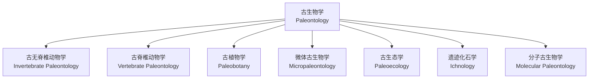
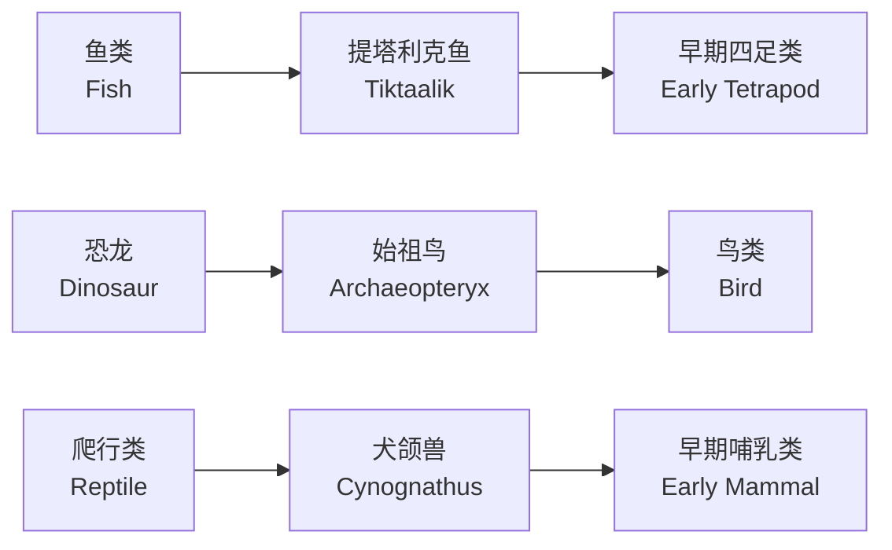
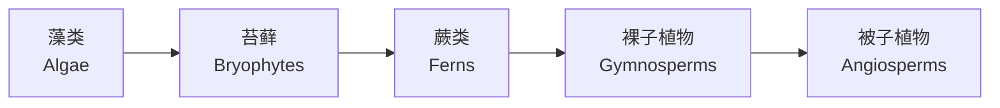

---
aliases:
  - 古生物学
  - 化石学
  - Paleontology
  - Fossil Science
tags:
  - earth-sciences
  - paleontology
  - fossils
  - evolution
  - paleoecology
created: 2024-02-10
updated: 2024-09-20
---

# 古生物学

**古生物学（Paleontology）** 是研究地质历史时期生物的科学。它利用化石证据重建古代生物的外形、分类、演化、生活方式以及生态环境，为理解生命起源与演化提供直接证据。古生物学与地质学、生物学和考古学密切相关。

## 古生物学分支



### 古无脊椎动物学

古无脊椎动物学（Invertebrate Paleontology）研究化石无脊椎动物，包括：

| 门类 | 地质分布 | 特征 |
|------|----------|------|
| 三叶虫 | 寒武纪-二叠纪 | 古生代标准化石 |
| 腕足类 | 寒武纪-现代 | 双壳、肉茎固着 |
| 珊瑚 | 奥陶纪-现代 | 造礁、四射/六射 |
| 菊石 | 泥盆纪-白垩纪 | 旋卷壳、缝合线复杂 |
| 双壳类 | 寒武纪-现代 | 两瓣对称 |

### 古脊椎动物学

古脊椎动物学（Vertebrate Paleontology）研究脊椎动物的化石记录，重点关注关键演化转折：

- **鱼类到四足类的过渡（Tetrapod transition）**
- **爬行类的辐射（Reptile radiation）**
- **恐龙的演化与灭绝（Dinosaur evolution）**
- **鸟类的起源（Origin of birds）**
- **哺乳类的演化（Mammal evolution）**
- **人类的起源（Human origins）**

## 化石的形成与保存

### 化石化过程

化石化过程（fossilization）包括几个关键步骤：

1. **死亡（death）**：生物体死亡
2. **埋藏（burial）**：被沉积物迅速覆盖
3. **分解（decay）**：软组织分解，硬组织保留
4. **矿化（mineralization）**：孔隙被地下水中的矿物填充
5. **成岩（diagenesis）**：沉积物固结成岩，化石得以保存

### 化石保存类型

| 保存类型 | 描述 | 实例 |
|----------|------|------|
| 矿化化石 | 硬组织被矿物替代 | 硅化木 |
| 印痕化石 | 生物形状在岩石上的印痕 | 叶片印痕 |
| 模铸化石 | 生物溶解后留下空腔 | 贝壳外模 |
| 遗迹化石 | 生物活动的痕迹 | 足迹、洞穴 |
| 琥珀化石 | 生物被树脂包裹 | 昆虫琥珀 |
| 冰冻化石 | 在冷冻环境中保存 | 猛犸象 |

### 特殊埋藏环境

某些特殊环境条件可以保存生物的精细结构甚至软组织：

$$
\text{Lagerstätte} = \text{特殊埋藏化石库}
$$

重要化石库包括：

- 澄江化石库（中国云南，寒武纪）
- 伯吉斯页岩（加拿大，寒武纪）
- 索尔霍芬灰岩（德国，侏罗纪）
- 山旺化石库（中国山东，中新世）

## 古生物学原理

### 均变论

均变论（uniformitarianism）由莱尔（Charles Lyell）提出，认为现在的自然过程与地质历史时期相同：

$$
\text{The present is the key to the past}
$$

该原理建立了利用现代生物和环境特征推断古代条件的理论基础。

### 化石序列律

化石序列律（Law of Faunal Succession）由史密森（William Smith）提出：不同地层中含有特征性的化石组合，且化石在垂向地层层序中的出现具有可预测的先后顺序。

### 谱系演化

谱系演化（phyletic evolution）描述了生物种群在时间尺度上的渐进变化：

$$
\frac{d\bar{x}}{dt} = h^2 \cdot S
$$

其中 $\bar{x}$ 为种群性状均值，$h^2$ 为遗传力，$S$ 为选择差。

## 化石分类与鉴定

### 分类体系

生物分类遵循林奈分类系统（Linnaean taxonomy）：

```
界（Kingdom） → 门（Phylum） → 纲（Class） → 目（Order）
→ 科（Family） → 属（Genus） → 种（Species）
```

### 分类方法

| 方法 | 原理 | 适用场景 |
|------|------|----------|
| 形态学分类 | 基于形态特征比较 | 常规化石鉴定 |
| 数值分类学 | 量化性状的数学分析 | 大样本分类 |
| 支序分类学 | 基于共同衍征 | 重建演化关系 |
| 分子古生物学 | DNA/蛋白质残基分析 | 更新世及较新化石 |

## 演化与古生物学证据

### 化石记录的演化趋势

- **前进演化（anagenesis）**：种内线性演化
- **分支演化（cladogenesis）**：种的分化与分支
- **适应辐射（adaptive radiation）**：快速分化占据多样生态位
- **趋同演化（convergent evolution）**：不相关类群产生相似形态

### 重要过渡化石

关键过渡化石（transitional fossils）提供了演化的直接证据：



### 演化速率

演化速率（evolutionary rate）用单位时间内的形态变化表示：

$$
\frac{dM}{dt} = \frac{M_2 - M_1}{t_2 - t_1}
$$

其中 $M$ 为形态特征测量值，$t$ 为时间。

## 古生态学

古生态学（paleoecology）利用化石组合和沉积环境重建古代生态系统：

### 生态位重建

通过功能形态学（functional morphology）推断古代生物的生态位：

- 牙齿形态 → 食性（草食/肉食/杂食）
- 四肢结构 → 运动方式（奔跑/攀爬/游泳）
- 感官器官 → 感知能力（视觉/嗅觉/听觉）

### 古代食物网

古代食物网（ancient food web）通过以下证据重建：

| 证据类型 | 提供信息 |
|----------|----------|
| 胃内容物 | 直接捕食关系 |
| 粪化石 | 排泄物中的食物残渣 |
| 咬痕 | 捕食者-猎物相互作用 |
| 同位素分析 | 营养级位置 |

$$
\delta^{15}N \propto \text{Trophic Level}
$$

## 古环境重建

### 氧同位素古温度计

氧同位素古温度计（oxygen isotope paleothermometer）基于碳酸盐沉积物中的 $\delta^{18}O$：

$$
T(^\circ C) = 16.9 - 4.38(\delta^{18}O_{calcite} - \delta^{18}O_{water}) + 0.10(\delta^{18}O_{calcite} - \delta^{18}O_{water})^2
$$

### 古生物地理

古生物地理（paleobiogeography）研究古代生物的地理分布，揭示板块运动对生物分布的影响。

## 生物灭绝

地质历史上五次大规模灭绝事件：

| 事件 | 时间（Ma） | 灭绝量 | 可能原因 |
|------|------------|--------|----------|
| 奥陶纪末 | 443 | 85% 物种 | 冰期 |
| 泥盆纪末 | 359 | 82% 物种 | 缺氧事件 |
| 二叠纪末 | 252 | 96% 物种 | 火山活动 |
| 三叠纪末 | 201 | 76% 物种 | 气候变迁 |
| 白垩纪末 | 66 | 75% 物种 | 小行星撞击 |

## 古生物学研究方法

### 传统方法

- **野外采样（field collection）**：系统采集化石标本
- **室内制备（preparation）**：清理、修复化石
- **显微镜观察（microscopy）**：微体化石和细微结构研究

### 现代技术

- **CT 扫描（CT scanning）**：三维重建内部结构
- **扫描电镜（SEM）**：超微形态观察
- **稳定同位素分析**：环境指标重建
- **DNA 分析**：古 DNA 提取与测序

## 古生物学的应用

- **生物地层学（biostratigraphy）**：利用化石划分对比地层
- **盆地分析（basin analysis）**：沉积盆地的时空演化
- **古气候研究（paleoclimatology）**：重建过去全球变化
- **资源勘探**：化石有机质与油气生成
- **地质旅游**：化石产地科普与旅游

## 古植物学

古植物学（paleobotany）研究地质历史时期的植物化石。

### 植物演化简史



### 重要植物化石群

- **莱尼燧石（Rhynie Chert）**：苏格兰早泥盆世（约 407 Ma），保存了最早期陆生植物的精细结构
- **煤炭纪森林（Coal Measure forests）**：石炭纪的巨型蕨类和石松类，形成了大量煤炭资源
- **热河植物群（Jehol Flora）**：中国辽西早白垩世，早期被子植物化石

### 孢粉学

孢粉学（palynology）研究孢子和花粉化石，在以下方面有重要应用：

- 生物地层对比
- 古气候重建
- 古植被恢复
- 石油勘探中的地层划分

## 化石的定量分析

### 多样性分析

多样性指数（diversity index）用于评价化石群落的结构：

**香农-维纳指数（Shannon-Wiener index）：**

$$
H' = -\sum_{i=1}^S p_i \ln p_i
$$

**辛普森指数（Simpson index）：**

$$
D = 1 - \sum_{i=1}^S p_i^2
$$

其中 $S$ 为物种数，$p_i$ 为第 $i$ 种的比例。

### 生存分析

化石记录的生存分析（survival analysis）利用生命表方法：

| 年龄段 | 起始数量 | 死亡数量 | 存活率 |
|--------|----------|----------|--------|
| 0-1 | 1000 | 500 | 0.5 |
| 1-2 | 500 | 200 | 0.3 |
| 2-3 | 300 | 150 | 0.15 |
| 3-4 | 150 | 100 | 0.05 |

### 形态测量学

几何形态测量学（geometric morphometrics）通过标记点的坐标分析形态变异：

$$
\text{Procrustes distance} = \sqrt{\sum_{i=1}^k \|y_i - x_i\|^2}
$$

其中 $x_i$ 和 $y_i$ 为叠合后的对应标记点坐标。

## 古生态学方法

### 群落重建

基于化石组合（fossil assemblage）重建古群落需要区分：

- **原生组合（biocoenosis）**：生活时的生物群落
- **埋藏组合（thanatocoenosis）**：死亡堆积后的化石组合
- **化石组合（taphocoenosis）**：最终保存下来的化石组合

### 生态位度量

生态位（ecological niche）通过多维度来定义：

- 食性（trophic position）
- 栖息地（habitat preference）
- 运动方式（locomotory mode）
- 体型（body size）

## 古生物学与地球系统

### 生物地球化学循环

古生物在碳、氧、磷循环中扮演关键角色：

**碳循环：**

$$
CO_2 \xrightarrow{\text{光合作用}} \text{有机碳} \xrightarrow{\text{埋藏}} \text{化石燃料}
$$

**氧循环：**

$$
O_2 \text{积累} \propto \text{有机碳埋藏} - \text{还原物质氧化}
$$

### 生物的全球影响

- **大氧化事件**：蓝细菌光合作用改变大气成分
- **珊瑚礁建造**：碳酸钙沉积影响碳循环
- **陆地植被**：影响风化和气候

## 化石保护与法律法规

### 化石保护重要性

化石是不可再生的自然遗产，具有重要的科学价值和教育价值。

### 相关法律

中国与化石保护相关的法律法规包括：

- **古生物化石保护条例**：规范化石发掘、收藏和出境
- **文物保护法**：涉及重要化石遗址的保护
- **自然保护区条例**：保护化石产地

## 总结

古生物学通过化石记录揭示了生命从简单到复杂、从海洋到陆地的演化历程。它不仅提供了演化论的最直接证据，还为地质年代划分、古环境重建和板块构造研究提供了关键工具。随着新技术的发展，古生物学正从传统形态描述向多学科交叉的定量化、分子化和信息化方向深入发展。化石是不可再生的自然遗产，古生物学研究对理解生命演化历史和地球系统运行机制具有不可替代的作用。
