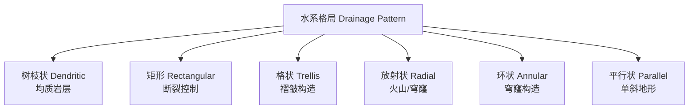

# 地貌学

## 一、概述

地貌学（Geomorphology）研究地表形态及其形成过程，是自然地理学的核心分支。地表形态是**内力作用（endogenic processes）**与**外力作用（exogenic processes）**共同作用的结果，二者在时间尺度上相互制衡，塑造了地球表面丰富多样的地貌景观。

---

## 二、内力作用

### 2.1 板块构造

岩石圈被划分为若干板块，其运动驱动着全球尺度地貌格局。

| 板块边界类型 | 运动方式 | 典型地貌 |
|:----------:|:--------|:--------|
| 离散型（Divergent） | 板块分离 | 洋中脊、裂谷（如东非大裂谷） |
| 汇聚型（Convergent） | 板块碰撞/俯冲 | 海沟、岛弧、褶皱山脉（如喜马拉雅山） |
| 转换型（Transform） | 水平错动 | 断层谷（如圣安德烈斯断层） |

板块构造理论的核心机制是**地幔对流**——地幔物质受热上升、冷却下沉，驱动上覆板块运动。威尔逊旋回（Wilson Cycle）描述了板块从裂谷→大洋→俯冲→碰撞→缝合的完整演化周期。

### 2.2 火山作用

- **中心式喷发**：岩浆沿管道集中喷出，形成锥状火山（如富士山、维苏威火山）
- **裂隙式喷发**：岩浆沿地壳裂隙大面积溢出，形成熔岩高原（如印度德干高原、冰岛）
- **火山类型**：盾状火山（夏威夷）、层状火山（圣海伦斯）、火山穹丘

### 2.3 地震

地震是地壳应力突然释放产生的振动。震源深度分为浅源（< 70 km）、中源（70–300 km）和深源（> 300 km）。地震波包括**纵波（P 波）**、**横波（S 波）**和**面波（L 波）**。

---

## 三、外力作用与风化

### 3.1 物理风化

- **剥离作用（Exfoliation）**：岩石因卸荷膨胀产生层状剥落
- **冰劈作用（Frost wedging）**：水在岩石裂隙中反复冻融，体积膨胀约 9%
- **热力风化**：昼夜温差导致矿物颗粒膨胀收缩不协调

### 3.2 化学风化

| 类型 | 反应过程 | 典型产物 |
|:---:|:--------|:--------|
| 水解（Hydrolysis） | 矿物与 H⁺/OH⁻ 反应 | 粘土矿物 |
| 氧化（Oxidation） | 含铁矿物与 O₂ 反应 | 赤铁矿（红壤） |
| 碳酸化（Carbonation） | CaCO₃ + H₂CO₃ → Ca(HCO₃)₂ | 喀斯特地貌 |
| 溶解（Dissolution） | 矿物直接溶于水 | 岩溶地貌 |

### 3.3 生物风化

植物根系生长向岩石裂隙施加压力（根劈作用），地衣分泌有机酸加速矿物分解。

---

## 四、流水地貌

### 4.1 河流侵蚀地貌

V 形谷是河流下蚀作用的典型产物。河流纵剖面呈均衡剖面（graded profile），其演化受侵蚀基准面控制。

**河流功率**：
$$
\Omega = \rho g Q S \quad \text{（总功率）}
$$

其中 $\rho$ 为水密度，$g$ 为重力加速度，$Q$ 为流量，$S$ 为坡降。

**河流侵蚀方式**：

| 侵蚀类型 | 机制 | 地貌特征 |
|:-------:|:----|:--------|
| **下蚀** | 水流向下切割河床 | V 形谷、峡谷、瀑布 |
| **侧蚀** | 水流侵蚀河岸两侧 | 曲流、河漫滩、谷坡后退 |
| **溯源侵蚀** | 侵蚀向源头方向推进 | 瀑布后退、河流袭夺 |

### 4.2 河流堆积地貌

| 地貌类型 | 形成环境 | 特征 |
|:-------:|:--------|:----|
| 冲积扇 | 山麓出口 | 扇形堆积体 |
| 三角洲 | 河流入海口 | 分流河道发育 |
| 河漫滩 | 河谷底部 | 洪水期淹没 |
| 曲流 | 中下游平原 | 凹岸侵蚀、凸岸堆积 |
| 阶地 | 河谷两侧 | 地壳抬升产物 |

### 4.3 水系格局

---

## 五、冰川地貌

### 5.1 侵蚀地貌

- **U 形谷**：冰川改造河谷为宽阔平底的 U 形断面
- **冰斗（Cirque）**：山体高处的凹地，冰川源头
- **刃脊（Arête）**：相邻冰斗向后侵蚀形成的刀刃状山脊
- **角峰（Horn）**：多方向冰斗侵蚀形成的金字塔形尖峰（如马特洪峰）
- **峡湾（Fjord）**：冰川 U 形谷被海平面淹没

### 5.2 堆积地貌

| 冰碛类型 | 位置 | 特征 |
|:-------:|:----|:----|
| 终碛 | 冰川末端 | 弧形垄岗 |
| 侧碛 | 冰川两侧 | 线状堆积 |
| 底碛 | 冰床底部 | 冰碛平原 |
| 鼓丘 | 冰盖底部 | 流线型丘岗 |

### 5.3 冰期与间冰期

第四纪以来经历了多次冰期（Glacial Period）和间冰期（Interglacial Period）交替：

| 时期 | 时间（万年 BP） | 特征 |
|:---:|:--------------:|:----|
| 末次冰盛期（LGM） | 2.6–1.8 | 全球冰盖最大范围，海平面下降约 120 m |
| 末次冰消期 | 1.8–1.1 | 冰盖退缩，海平面上升 |
| 全新世（间冰期） | 1.1–至今 | 相对温暖稳定，人类文明发展 |

---

## 六、风成地貌

### 6.1 风蚀地貌

- **雅丹（Yardang）**：平行排列的垄槽
- **风蚀蘑菇**：上大下小的蘑菇状岩石
- **风蚀柱**：垂直节理发育的孤峰状地貌

### 6.2 风积地貌

| 沙丘类型 | 风向 | 形态 |
|:-------:|:----:|:----|
| 新月形沙丘 | 单一风向 | 新月形，两翼顺风 |
| 横向沙丘 | 单一风向 | 脊线垂直风向 |
| 纵向沙丘 | 双风向 | 脊线平行合成风向 |
| 星状沙丘 | 多风向 | 金字塔形 |

---

## 七、喀斯特地貌

### 7.1 地表喀斯特

- 溶沟/溶槽、石芽、天坑、峰林/峰丛、溶蚀洼地

### 7.2 地下喀斯特

| 形态 | 形成过程 |
|:---:|:--------|
| 溶洞 | 地下水沿裂隙溶蚀扩大 |
| 钟乳石 | CaCO₃ 下垂沉淀 |
| 石笋 | CaCO₃ 向上堆积 |
| 地下河 | 地下水汇集成河 |

### 7.3 喀斯特发育条件

- **可溶性岩石**：石灰岩、白云岩为主
- **充足降水**：提供溶蚀介质
- **裂隙发育**：提供水流通道
- **适宜气候**：温暖湿润加速溶蚀

---

## 八、海岸地貌

### 8.1 侵蚀海岸

| 地貌 | 形成过程 |
|:---:|:--------|
| 海蚀崖 | 波浪侵蚀基岩形成陡崖 |
| 海蚀台 | 海蚀崖后退形成的平坦岩面 |
| 海蚀洞 | 波浪沿软弱面掏蚀形成洞穴 |
| 海蚀拱桥 | 两侧海蚀洞贯通 |
| 海蚀柱 | 拱桥顶部坍塌残留柱状岩体 |

### 8.2 堆积海岸

- **海滩（Beach）**：波浪搬运的砂砾堆积
- **沙嘴（Spit）**：沿岸流搬运形成的砂质半岛
- **障壁岛（Barrier Island）**：平行海岸的狭长沙岛
- **泻湖（Lagoon）**：障壁岛与海岸间的浅水区

---

## 九、地貌演化的时间尺度

| 时间尺度 | 范围 | 主导过程 | 实例 |
|:-------:|:----|:--------|:----|
| **瞬时** | 秒–天 | 地震、滑坡、火山喷发 | 2008 汶川地震 |
| **短期** | 年–百年 | 洪水、风蚀、海岸变迁 | 黄河口变迁 |
| **中期** | 千年–万年 | 河流下蚀、冰川进退 | U 形谷发育 |
| **长期** | 万年–百万年 | 造山运动、板块漂移 | 喜马拉雅隆起 |

**戴维斯侵蚀循环（Davis Cycle of Erosion）**：
- **幼年期**：河谷狭窄，V 形谷发育，水系稀疏
- **壮年期**：河流侧蚀加强，河谷展宽，曲流发育
- **老年期**：地势低平，准平原化，残丘孤立

---

> **参见**：[INDEX.md](./INDEX.md) | [水文地理学](./水文地理学.md) | [气象气候学](./气象气候学.md)

## 相关条目

- [[水文地理学]]
- [[气象气候学]]
- [[02_NaturalSciences/EarthSciences/Geology/INDEX|地质学索引]]
- [[02_NaturalSciences/EarthSciences/PhysicalGeography/INDEX|自然地理索引]]
