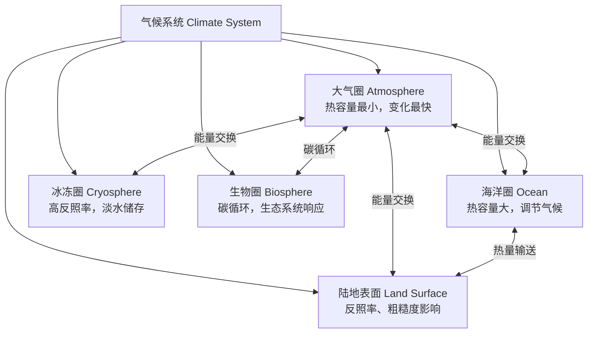

---
aliases: [Meteorology and Climatology, 气象气候学]
tags: ['02_NaturalSciences', 'EarthSciences', 'PhysicalGeography']
---

# 气象气候学

## 一、概述

气象气候学（Meteorology and Climatology）研究大气的物理过程和长期气候特征。气象学关注短期的天气现象，气候学关注长期的统计规律。两者共同构成了理解地球大气系统的基础。

### 气象学 vs 气候学

| 维度 | 气象学 | 气候学 |
|:---:|:------|:------|
| **时间尺度** | 分钟–数周 | 数年–数万年 |
| **研究对象** | 瞬时天气状态 | 长期统计特征 |
| **核心变量** | 温度、气压、风、降水 | 平均态、变率、极端事件频率 |
| **方法** | 数值预报、观测分析 | 统计分析、气候模式 |
| **经典问题** | "明天会不会下雨？" | "这个地区属于什么气候类型？" |

---

## 二、气候系统

### 2.1 气候系统的组成



### 2.2 辐射平衡

**太阳辐射输入**：
$$
S_{\text{in}} = \frac{S_0}{4} (1 - \alpha) \approx 239 \, \text{W/m}^2
$$

其中 $S_0 = 1361 \, \text{W/m}^2$ 为太阳常数，$\alpha \approx 0.3$ 为行星反照率。

**地球辐射输出**：
$$
E_{\text{out}} = \sigma T_e^4 \approx 239 \, \text{W/m}^2
$$

辐射平衡时：$S_{\text{in}} = E_{\text{out}}$，由此得到地球有效温度 $T_e \approx 255 \, \text{K}$。

---

## 三、气候分类

### 3.1 柯本气候分类（Köppen Climate Classification）

柯本分类基于气温和降水的季节特征，将全球气候分为五个主要组：

| 组别 | 名称 | 特征 | 代表区域 |
|:---:|:----|:----|:--------|
| **A** | 热带气候 | 月均温 > 18°C | 亚马逊、刚果盆地、东南亚 |
| **B** | 干旱气候 | 降水远小于蒸发 | 撒哈拉、阿拉伯半岛、中亚 |
| **C** | 温带气候 | 最冷月 -3°C–18°C | 西欧、东亚、美国东部 |
| **D** | 大陆性气候 | 最冷月 < -3°C, 最暖月 > 10°C | 西伯利亚、加拿大 |
| **E** | 极地气候 | 最暖月 < 10°C | 格陵兰、南极、北极 |

每种气候组下进一步细分为子类，如：

| 子类 | 含义 | 标准 |
|:---:|:----|:----|
| **Af** | 热带雨林气候 | 全年降水 ≥ 60 mm/月 |
| **Aw** | 热带草原气候 | 冬季干旱，夏季多雨 |
| **BS** | 草原气候（半干旱） | 降水略高于沙漠 |
| **BW** | 沙漠气候（干旱） | 极端少雨 |
| **Cfa** | 亚热带湿润气候 | 最热月 > 22°C，全年降水均匀 |
| **Csa** | 地中海气候 | 夏季干燥，冬季多雨 |
| **Dfc** | 亚寒带气候 | 短夏、长冬、永久冻土 |
| **EF** | 冰盖气候 | 最暖月 < 0°C |

### 3.2 影响气候的因素

| 因素 | 作用机制 | 影响 |
|:---:|:--------|:----|
| **纬度** | 太阳高度角决定辐射输入 | 温度从赤道向极地递减 |
| **海陆分布** | 海洋热容大，陆地热容小 | 大陆性 vs 海洋性气候 |
| **洋流** | 暖流增温增湿，寒流降温减湿 | 北大西洋暖流使西欧温和 |
| **地形** | 迎风坡抬升降水，背风坡雨影 | 安第斯山脉东西侧差异巨大 |
| **大气环流** | 全球三圈环流输送热量和水汽 | 副热带高压带形成沙漠 |
| **海拔** | 气温随海拔递减（-6.5°C/km） | 赤道高山也有冰川 |

---

## 四、大气环流与气候带

### 4.1 全球气压带和风带

```
极地高压 (90°) ──── 极地东风带
          │
    副极地低压 (60°)
          │  ──── 西风带
    副热带高压 (30°)
          │  ──── 信风带（东北/东南信风）
    赤道低压带 (0°) ──── ITCZ
```

### 4.2 主要气候带特征

| 气候带 | 纬度范围 | 气压系统 | 降水特征 | 典型植被 |
|:-----:|:--------:|:--------:|:--------|:--------|
| **赤道带** | 10°N–10°S | 赤道低压 | 年降水 > 2000 mm，全年多雨 | 热带雨林 |
| **热带** | 10°–25° | 信风带 | 干湿季分明 | 热带草原/季雨林 |
| **副热带** | 25°–35° | 副热带高压 | 干旱少雨（< 250 mm/年） | 荒漠 |
| **温带** | 35°–55° | 西风带 | 年降水 500–1000 mm | 温带森林 |
| **亚寒带** | 55°–65° | 西风带/极地东风 | 降水少，蒸发弱 | 针叶林（泰加林） |
| **极地带** | 65°–90° | 极地高压 | 降水极少（< 200 mm） | 苔原/冰盖 |

---

## 五、气候变化

### 5.1 气候变化的时间尺度

| 时间尺度 | 周期 | 驱动因素 | 温度变化幅度 |
|:-------:|:----:|:--------|:-----------:|
| **地质尺度** | 百万年 | 板块运动、大气成分变化 | 5–10°C |
| **轨道尺度** | 万–十万年 | 米兰科维奇轨道参数 | 4–7°C |
| **千年尺度** | 千年 | 太阳活动、火山活动、洋流变化 | 1–3°C |
| **百年尺度** | 百年 | 温室气体、太阳活动、火山 | 0.5–1.5°C |
| **年际尺度** | 年–十年 | ENSO、火山喷发、PDO | 0.1–0.5°C |

### 5.2 米兰科维奇理论（Milankovitch Theory）

地球轨道参数的变化导致太阳辐射分布变化，驱动冰期-间冰期循环：

| 参数 | 周期（万年） | 对气候的影响 |
|:---:|:-----------:|:-----------|
| **偏心率（Eccentricity）** | 10 和 41 | 改变总辐射量，约 0.1% 变化 |
| **黄赤交角（Obliquity）** | 4.1 | 改变季节差异，高纬敏感 |
| **岁差（Precession）** | 2.3 和 1.9 | 改变季节的日地距离 |

### 5.3 现代气候变化

**观测到的变化**：
- 全球平均温度自 1880 年以来上升约 1.2°C
- 海平面上升约 20 cm（1900–2020）
- 北极海冰面积以每十年 12–13% 的速度减少
- 极端天气事件频率和强度增加

**气温变化的归因**：

$$
\Delta T = \lambda \cdot \Delta F
$$

其中 $\Delta F$ 为辐射强迫（Radiative Forcing），$\lambda$ 为气候敏感度参数。

**主要辐射强迫因子**：

| 因子 | 辐射强迫（W/m²） | 不确定性 |
|:---:|:----------------:|:--------:|
| CO₂ 增加 | +2.1 | 低 |
| 其他温室气体（CH₄, N₂O, CFCs） | +1.0 | 低 |
| 臭氧（平流层/对流层） | +0.3 | 中 |
| 气溶胶直接效应 | -0.5 | 中 |
| 气溶胶间接效应（云调制） | -0.5 | 高 |
| 土地利用变化（反照率） | -0.2 | 中 |
| 太阳辐照度变化 | +0.05 | 低 |

---

## 六、气候模式

### 6.1 全球气候模式（GCM）

全球气候模式（Global Climate Model）基于大气、海洋、陆面和海冰的物理方程：

```text
大气方程（N-S 方程 + 热力学 + 水汽）
    │
    ├── 海洋模式（OGCM）
    ├── 陆面模式（LSM）
    ├── 海冰模式
    └── 碳循环 / 气溶胶 / 化学模块
```

### 6.2 CMIP 与 IPCC

**CMIP（Coupled Model Intercomparison Project）**：耦合模式比较计划，协调全球气候模式的实验设计。

**IPCC（IPCC, Intergovernmental Panel on Climate Change）**：政府间气候变化专门委员会，定期评估气候变化科学。

**共享社会经济路径（SSP, Shared Socioeconomic Pathways）**：

| 情景 | 描述 | 2100 年升温（相对 1850–1900） |
|:---:|:----|:----------------------------:|
| SSP1-1.9 | 非常低排放，实现 1.5°C 目标 | ~1.4°C |
| SSP1-2.6 | 低排放，严格气候政策 | ~1.8°C |
| SSP2-4.5 | 中等排放，延续当前趋势 | ~2.7°C |
| SSP3-7.0 | 高排放，区域竞争 | ~3.6°C |
| SSP5-8.5 | 极高排放，化石燃料密集型 | ~4.4°C |

---

## 七、极端气候事件

### 7.1 极端事件类型

| 类型 | 定义 | 与气候变化的关系 |
|:---:|:----|:--------------|
| **热浪** | 连续数日极端高温 | 频率和强度显著增加 |
| **暴雨/洪涝** | 短时强降水或持续多雨 | 大气持水能力增加（Clausius-Clapeyron） |
| **干旱** | 持续降水偏少 | 部分区域频率增加 |
| **热带气旋** | 强热带风暴 | 强度增加，快速增强事件增多 |
| **寒潮** | 极端低温事件 | 频率减少，但强度偶有异常 |

### 7.2 Clausius-Clapeyron 关系

饱和水汽压随温度呈指数增长：

$$
e_s(T) = e_s(T_0) \cdot \exp\left[\frac{L_v}{R_v}\left(\frac{1}{T_0} - \frac{1}{T}\right)\right]
$$

温度每升高 1°C，大气持水能力增加约 7%，这导致强降水事件的强度相应增加。

---

## 相关条目

- [[02_NaturalSciences/EarthSciences/Meteorology|Meteorology]]
- [[水文地理学]]
- [[地貌学]]
- [[02_NaturalSciences/EarthSciences/PhysicalGeography/INDEX|自然地理索引]]

