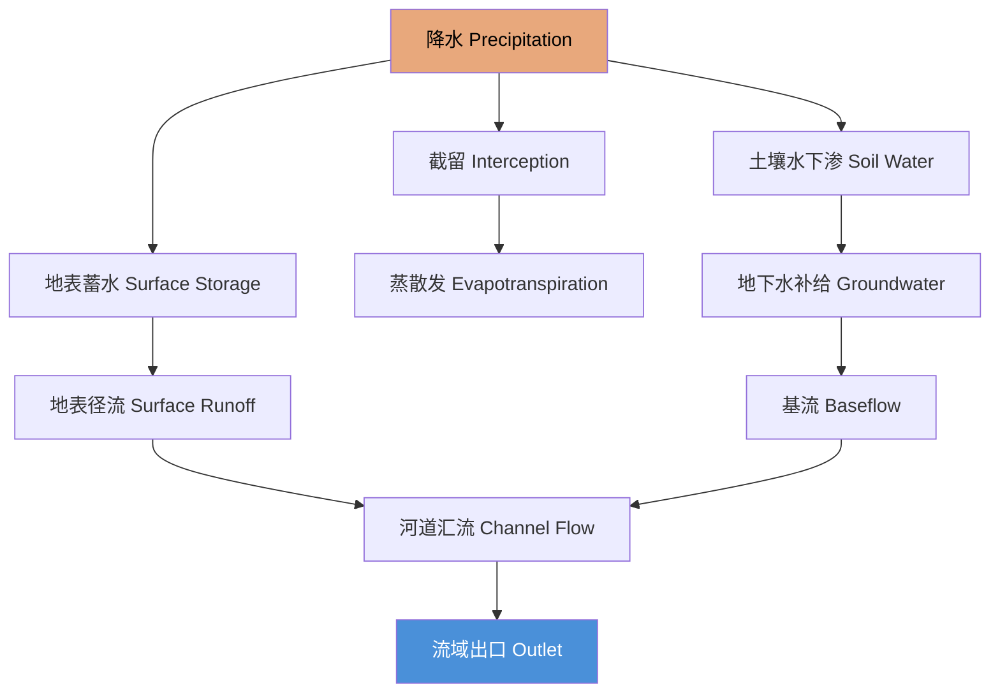

# 水文地理学

## 一、概述

水文地理学（Hydrogeography）研究地球表面水体的分布、运动、循环及其与环境的相互作用。水是人类生存和生态系统运转的基础资源，理解水文过程对水资源管理、灾害防治和可持续发展至关重要。

---

## 二、水循环

### 2.1 全球水循环

水循环（Hydrologic Cycle）是水在**大气圈、水圈、岩石圈、生物圈**之间持续运动的动力过程，由太阳辐射和重力驱动。

水循环的四大基本环节：

| 环节 | 过程 | 驱动因素 |
|:---:|:----|:--------|
| 蒸发蒸腾 | 地表水/土壤水 → 水汽 | 太阳辐射 |
| 凝结 | 水汽 → 云/水滴 | 降温/凝结核 |
| 降水 | 水滴 → 雨/雪 | 重力 |
| 径流 | 地表/地下 → 河/海洋 | 重力+地形 |

### 2.2 水量平衡方程

流域水量平衡的基本方程：

$$
P = ET + R + \Delta S
$$

其中 $P$ 为降水量，$ET$ 为蒸散发量，$R$ 为径流量，$\Delta S$ 为流域蓄水量变化。在多年平均尺度上，$\Delta S \approx 0$，则：
$$
P = ET + R
$$

地球表面年降水量约为 577,000 km³，其中约 72% 通过蒸发蒸腾返回大气，约 28% 形成径流。

---

## 三、流域与河道

### 3.1 流域系统

流域（Drainage basin / Watershed）是降水的汇集区域，由分水岭（Divide）界定。

流域等级结构可用 Strahler 河流分级描述：
- **一级河流（1st order）**：最上游的源头河道，无支流汇入
- **二级河流（2nd order）**：两条一级河流汇合形成
- **三级及以上**：类推，两条 $n$ 级河流汇合形成 $n+1$ 级河流

Strahler 分级建立了河网结构与流域面积、径流量之间的经验关系。Horton 定律指出，不同级别河流的数量和长度存在幂律关系：

$$
N_u = R_b^{k-u}
$$

$$
L_u = L_1 R_l^{u-1}
$$

其中 $N_u$ 为 $u$ 级河流数量，$R_b$ 为分叉比，$L_u$ 为平均河长，$R_l$ 为河长比。

### 3.2 径流测量

流量（Discharge, $Q$）指单位时间内通过断面的水体体积：

$$
Q = A \cdot v
$$

其中 $A$ 为过水断面面积（m²），$v$ 为断面平均流速（m/s）。

水位-流量关系曲线（Rating curve）将水位 $H$ 与流量 $Q$ 建立经验关系：
$$
Q = a(H - H_0)^b
$$

其中 $a$、$b$ 为经验系数，$H_0$ 为流量为零时的水位。

### 3.3 河流泥沙

河流输沙分为**悬移质（suspended load）**和**推移质（bed load）**。悬移质浓度的经验关系为：
$$
C = \alpha Q^\beta
$$

泥沙输运能力与流速的高次方成正比（$Q_s \propto v^n$，$n \approx 3\text{–}6$），解释了为何洪水期泥沙输运量骤增。

---

## 四、洪水频率分析

### 4.1 年最大流量序列

收集某站历年最大瞬时流量，按降序排列，计算每种流量的重现期（Return period）：

$$
T = \frac{n+1}{m}
$$

其中 $n$ 为记录年数，$m$ 为秩次（最大为 1）。重现期 $T$ 年的洪水，其年超越概率为：
$$
P = \frac{1}{T}
$$

### 4.2 极值分布拟合

常用 Gumbel 分布（极值 I 型分布）拟合年最大流量序列：

$$
F(Q) = e^{-e^{-(Q-\mu)/\sigma}}
$$

其中 $\mu$ 为位置参数，$\sigma$ 为尺度参数。$T$ 年一遇流量 $Q_T$ 由下式计算：

$$
Q_T = \mu - \sigma \ln\left[-\ln\left(1 - \frac{1}{T}\right)\right]
$$

| 重现期（年） | 超越概率 | 工程意义 |
|:----------:|:--------:|:--------|
| 2 | 50% | 河道维持流量 |
| 10 | 10% | 一般防洪标准 |
| 50 | 2% | 城镇防洪标准 |
| 100 | 1% | 重要工程防洪标准 |
| 1000 | 0.1% | 核电站等关键设施 |

---

## 五、地下水

### 5.1 地下水赋存

- **含水层（Aquifer）**：能够储存和传导地下水的透水岩层
- **隔水层（Aquitard / Aquiclude）**：透水性差的岩层
- **承压含水层（Confined Aquifer）**：上下被隔水层限制，具承压性
- **潜水含水层（Unconfined Aquifer）**：无上覆隔水层，具自由水面

### 5.2 达西定律（Darcy's Law）

$$
Q = -KA \frac{dh}{dl}
$$

其中 $Q$ 为流量，$K$ 为渗透系数，$A$ 为过水断面，$\frac{dh}{dl}$ 为水力梯度。

**渗透系数**与介质特性相关：

| 介质类型 | 渗透系数 $K$（m/s） |
|:--------:|:------------------:|
| 砾石 | $10^{-2} \text{–} 10^{0}$ |
| 粗砂 | $10^{-4} \text{–} 10^{-2}$ |
| 细砂 | $10^{-6} \text{–} 10^{-4}$ |
| 粉砂 | $10^{-8} \text{–} 10^{-6}$ |
| 粘土 | $< 10^{-9}$ |

### 5.3 地下水运动方程

三维非稳定地下水运动的偏微分方程：

$$
\frac{\partial}{\partial x}\left(K_x \frac{\partial h}{\partial x}\right) + \frac{\partial}{\partial y}\left(K_y \frac{\partial h}{\partial y}\right) + \frac{\partial}{\partial z}\left(K_z \frac{\partial h}{\partial z}\right) = S_s \frac{\partial h}{\partial t} \pm W
$$

其中 $S_s$ 为储水率，$W$ 为源汇项。

---

## 六、水资源管理

### 6.1 水资源供需

全球淡水资源的分布极不均匀：

| 区域 | 水资源占比 | 人口占比 | 人均水资源（m³/年） |
|:---:|:---------:|:--------:|:-----------------:|
| 亚洲 | 36% | 60% | 4,500 |
| 南美洲 | 26% | 6% | 28,000 |
| 北美洲 | 15% | 8% | 12,000 |
| 非洲 | 9% | 15% | 3,900 |
| 欧洲 | 7% | 11% | 4,600 |
| 大洋洲 | 5% | 1% | 31,000 |

### 6.2 水灾害

| 灾害类型 | 成因 | 影响 |
|:-------:|:----|:----|
| **洪水** | 暴雨、台风、融雪、溃坝 | 生命财产损失、基础设施破坏 |
| **干旱** | 降水持续偏少、高温蒸发 | 农业减产、生态退化、供水不足 |
| **水污染** | 工业废水、农业径流、生活污水 | 生态破坏、健康风险 |
| **地面沉降** | 地下水超采 | 建筑物损坏、海水入侵 |

---

## 相关条目

- [[气象气候学]]
- [[地貌学]]
- [[Meteorology]]
- [[02_NaturalSciences/EarthSciences/PhysicalGeography/INDEX|自然地理索引]]
