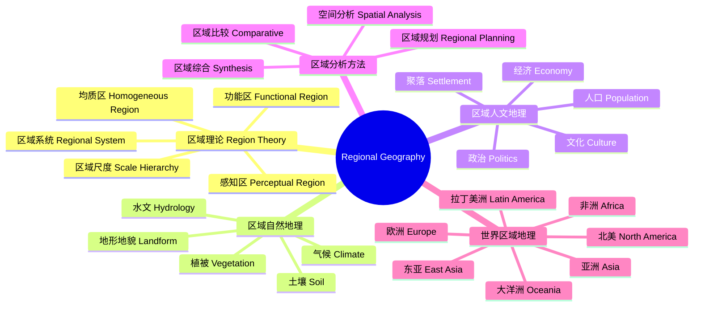
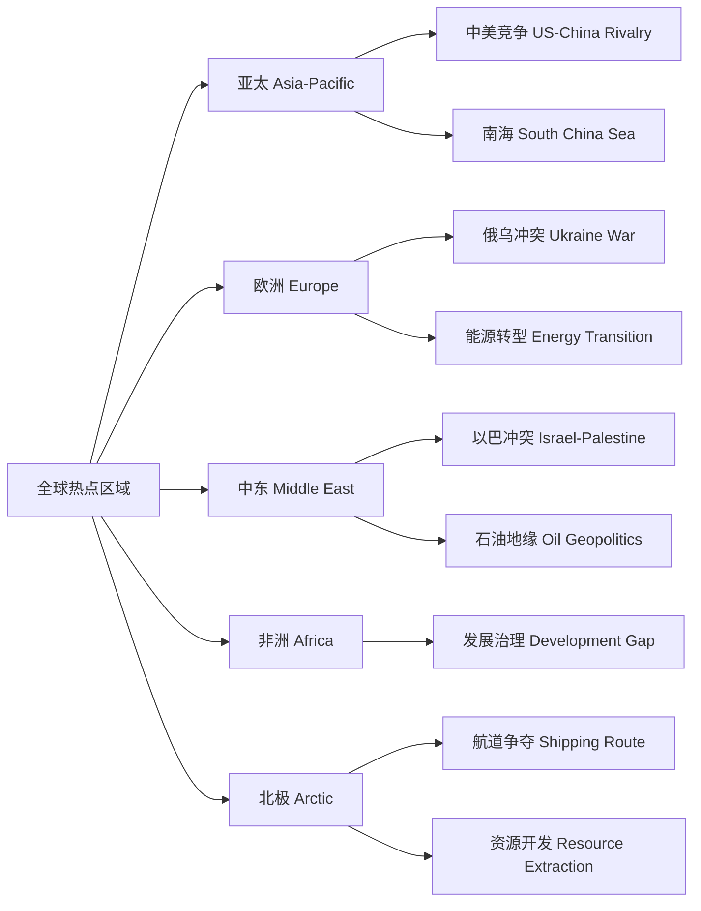

---
aliases: [RegionalGeography]
tags: ['EarthSciences/RegionalGeography', 'HumanGeography']
---

# RegionalGeography

## 概述 (Overview)

区域地理学 (Regional Geography) 是研究地球表面特定区域综合特征及其空间分异规律的学科。与系统地理学从专题角度研究不同，区域地理学采用综合性视角，将自然地理和人文地理要素整合在特定空间单元中进行分析。区域地理学是地理学的核心传统之一，在认识地方特性和解决区域发展问题中具有不可替代的作用。

## 区域地理学体系

## 区域的概念 (Concept of Region)

### 区域的类型

| 区域类型 | 定义 | 示例 |
|----------|------|------|
| 均质区 Homogeneous | 内部具有一致的某种特征 | 热带雨林气候区 |
| 功能区 Functional | 以核心-腹地关系组织 | 都市通勤区 |
| 规划区 Planning | 为管理目的划分 | 国家级新区 |
| 感知区 Perceptual | 基于人们的主观认知 | "南方"、"中部" |

### 区域边界 (Regional Boundaries)

区域边界可能是：
- 自然边界（山脉、河流、海岸线）
- 行政边界（省界、国界）
- 文化边界（语言区、宗教区）
- 渐变过渡带（生态过渡带 Ecotone）

## 区域分异规律 (Regional Differentiation)

### 纬度地带性 (Latitudinal Zonality)

太阳辐射的纬度分布导致气候、植被和土壤的带状分布：

$$R_n = S_0(1 - \alpha)\cos\phi$$

其中 $R_n$ 是净辐射，$S_0$ 是太阳常数，$\alpha$ 是反照率，$\phi$ 是纬度。

### 经度地带性 (Longitudinal Zonality)

距海远近导致的干湿分异。从沿海到内陆形成森林到草原再到荒漠的景观序列。

### 垂直地带性 (Vertical Zonality)

山地海拔升高引起的水热组合变化。垂直自然带谱的结构受基带和山体高度影响。

## 区域研究的方法论 (Regional Methodology)

### 区域调查 (Regional Survey)

传统区域地理学的核心方法，包括野外考察、地图阅读和文献档案分析。

### 区域比较法 (Comparative Method)

通过对比不同区域识别共性和特殊性的研究范式。

$$S(A,B) = \frac{|A \cap B|}{|A \cup B|} \quad\text{(Jaccard 相似系数)}$$

### 区域综合法 (Regional Synthesis)

将自然要素（地质、地貌、气候、水文、土壤、生物）和人文要素（人口、经济、文化、政治）整合分析的综合范式。

## 区域经济发展 (Regional Economic Development)

### 区域差异指标

$$G = \frac{2\sum_{i=1}^n i y_i}{n\sum_{i=1}^n y_i} - \frac{n+1}{n} \quad\text{(基尼系数 Gini Coefficient)}$$

泰尔指数 (Theil Index)：

$$T = \sum_i p_i \log\frac{p_i}{q_i}$$

### 中国区域经济格局

- 东部沿海率先发展区
- 中部崛起战略区
- 西部大开发区
- 东北老工业基地振兴区

### 城市群 (Urban Agglomerations)

长三角、珠三角、京津冀、成渝等城市群是区域经济增长极。

## 区域文化与认同 (Regional Culture & Identity)

### 文化区域 (Cultural Regions)

文化区域由语言、宗教、习俗、建筑、饮食等文化要素的空间分布界定。
- **汉语方言区**：官话、粤语、闽语、吴语、客家话
- **宗教文化区**：基督教世界、伊斯兰世界、佛教文化圈
- **饮食文化区**：东亚稻米文化圈、欧洲小麦-肉食文化区

### 地方认同 (Place Identity)

地方感 (Sense of Place) 是人们对特定地方的情感依附和认同。区域地理学研究地方认同的形成机制和文化景观表达。

## 全球区域格局 (Global Regional Patterns)

### 主要经济区域

- 亚太经济区：中国、日本、韩国、东盟
- 北美经济区：美国、加拿大、墨西哥 (USMCA)
- 欧洲经济区：欧盟、英国
- 中东产油区：海湾合作委员会 (GCC)

### 世界热点区域

## 区域可持续发展 (Regional Sustainable Development)

### 区域承载力 (Regional Carrying Capacity)

$$RCC = f(\text{水资源},\; \text{土地资源},\; \text{环境容量},\; \text{生态服务})$$

### 国土空间规划

"三区三线"（生态空间、农业空间、城镇空间；生态保护红线、永久基本农田、城镇开发边界）构成了中国空间治理的基础框架。

## 区域地理学的主要研究方法 (Research Methods)

野外考察 (Field Survey) 是区域地理学的传统方法。遥感与 GIS 技术用于区域自然要素和土地利用的空间分析。参与式农村评估 (PRA) 了解地方居民对区域发展的感知。投入-产出模型分析区域经济结构。空间计量模型分析区域差异的影响因素。区域比较法 (Comparative Method) 通过对比不同区域识别共性和特殊性。

## 中国区域地理的特色问题 (Chinese Regional Geography)

胡焕庸线 (Hu Huanyong Line, 1935) 揭示了中国人口分布的东西差异：线东南 36% 的国土面积承载了 96% 的人口。三大自然区（东部季风区、西北干旱区、青藏高寒区）反映了中国自然地理的基本格局。主体功能区规划（优化开发区、重点开发区、限制开发区、禁止开发区）指导区域发展方向。粤港澳大湾区、长三角一体化、京津冀协同发展是中国区域战略的重点。

## 世界区域地理中的地缘政治 (Geopolitics)

地缘政治学 (Geopolitics) 研究地理因素对国家间政治关系的影响。麦金德的心脏地带理论 (Heartland Theory) 认为控制欧亚大陆中部即可控制世界。斯皮克曼的边缘地带理论 (Rimland Theory) 强调欧亚大陆沿海地区的重要性。海上丝绸之路和陆上丝绸之路是当代中国地缘经济战略的核心。

## 区域地理学中的区域创新系统 (Regional Innovation System)

区域创新系统 (RIS) 由企业、大学、研究机构和政府组成。三螺旋模型 (Triple Helix Model) 强调产业-大学-政府的三方互动。区域创新能力的差异由制度质量、人力资本和社会资本决定。创新集群 (Innovation Cluster) 如硅谷、128 号公路和中关村。技术转移办公室 (TTO) 促进大学成果商业化。创新政策包括研发补贴、税收优惠和科技园区。

## 区域地理学中的区域治理 (Regional Governance)

区域治理包括行政区划调整、区域合作组织和跨区域协调机制。都市区治理 (Metropolitan Governance) 协调大城市地区的公共服务和规划。增长管理 (Growth Management) 控制城市蔓延。区域规划 (Regional Planning) 制定土地利用、交通和基础设施的战略框架。区域补偿机制 (Transfer Payments) 缩小区域发展差距。地方分权 (Decentralization) 和财政联邦主义影响区域资源配置。

## 区域地理学中的文化区域 (Cultural Regions)

文化区是共享语言、宗教、习俗和价值观的空间单元。宏观文化区包括东亚、南亚、西欧、伊斯兰世界等。文化扩散 (Cultural Diffusion) 的机制：迁移扩散、扩展扩散和等级扩散。文化景观 (Cultural Landscape) 反映区域的文化特征，包括建筑风格、土地利用格局和聚落形态。文化全球化与文化多样性的冲突与融合。地方感 (Sense of Place) 研究人对特定区域的情感依附。

## 区域地理学中的资源管理 (Resource Management)

自然资源管理涉及水资源、土地资源、矿产资源和森林资源。参与式资源管理 (Participatory Resource Management) 将当地社区纳入决策过程。资源诅咒 (Resource Curse) 现象指资源丰富的地区经济增长缓慢。共同管理 (Co-Management) 在政府和社区间分担责任。可持续资源管理基于承载力 (Carrying Capacity) 和生态系统服务价值评估。

## 区域地理学中的全球化与区域化 (Globalization vs Regionalization)

全球化 (Globalization) 推动资本、商品、信息和劳动力的全球流动。区域化 (Regionalization) 则是区域经济一体化的过程。全球价值链 (Global Value Chain) 重构了区域分工格局。区域经济一体化包括自由贸易区、关税同盟和共同市场等形态。逆全球化 (De-globalization) 趋势下区域合作的重要性更加凸显。一带一路倡议是中国推动区域互联互通的核心战略框架。

## 区域地理学的经典理论 (Classic Theories)

区域增长极理论 (Growth Pole Theory, Perroux) 提出经济增长在某些极点集聚。核心-边缘理论 (Core-Periphery Model, Friedmann) 描述区域发展的不平衡格局。梯度转移理论 (Gradient Transfer Theory) 认为产业从发达地区向欠发达地区梯度转移。累积因果理论 (Cumulative Causation, Myrdal) 揭示区域差距的自强化机制。新区域主义 (New Regionalism) 强调制度、学习和创新在区域发展中的作用。

## 区域地理学的现代技术工具 (Modern Tools)

GIS 空间分析用于区域格局识别。遥感数据提供区域地表覆盖信息。大数据 (手机信令、夜间灯光、POI) 支持高精度区域研究。空间计量经济学 (Spatial Econometrics) 建立区域发展模型。区域投入产出表分析产业关联效应。计算一般均衡模型 (CGE) 模拟区域政策影响。机器学习方法用于区域类型识别和预测。

## 相关条目 (See Also)

与本条目相关的其他知识库条目：

- [[EconomicGeography|经济地理学]]：经济活动的空间组织
- [[UrbanGeography|城市地理学]]：城市系统的空间规律
- [[Geoinformatics|地理信息学]]：空间数据分析技术
- [[../../INDEX|返回知识库首页]]

## 扩展阅读与参考资料 (Further Reading)

区域地理学的经典文献和系统学习资源：

1. 经典教材：区域分析与规划 (崔功豪)、区域经济学 (魏后凯)
2. 学术期刊：Regional Studies, Regional Science, Growth and Change
3. 研究机构：中国科学院地理科学与资源研究所、中国区域经济学会
4. 数据平台：中国统计年鉴、各省统计年鉴、World Bank Open Data
5. 规划文献：全国主体功能区规划、各区域发展规划纲要

## 主要研究前沿 (Research Frontiers)

区域地理学的前沿方向包括：区域韧性 (Regional Resilience) 研究区域应对冲击的适应能力。区域碳排放核算与碳中和路径。收缩城市与区域衰退治理。区域数字经济发展与数字鸿沟。跨境区域合作与地缘经济分析。区域治理中的多层级制度安排。生态系统服务与区域生态补偿机制。基于大数据的区域动态监测与智能决策支持系统。
