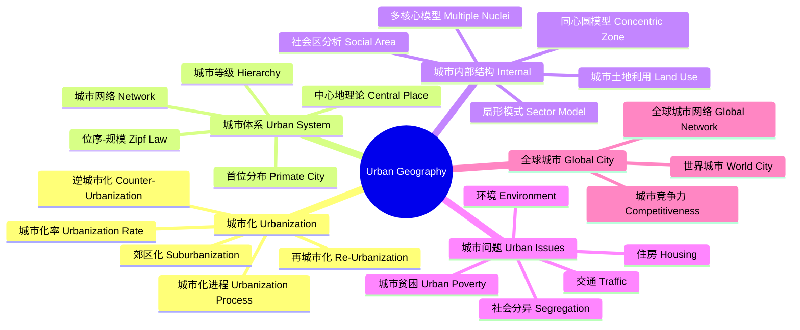
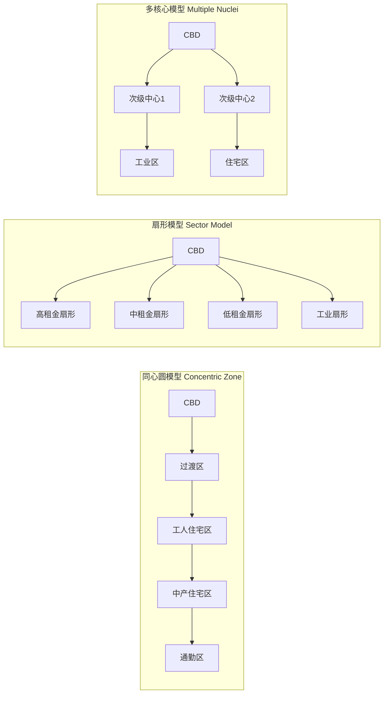

---
aliases: [UrbanGeography]
tags: ['EarthSciences/UrbanGeography', 'HumanGeography', 'UrbanStudies']
---

# UrbanGeography

## 概述 (Overview)

城市地理学 (Urban Geography) 是研究城市空间结构、城市体系、城市化过程以及城市与区域关系的学科。作为人文地理学的重要分支，城市地理学探讨城市如何形成、发展和演化，城市内部的空间组织，以及城市之间相互作用的规律。城市地理学为城市规划、城市管理和城市政策制定提供科学依据。

## 城市地理学体系

## 城市化 (Urbanization)

### 城市化进程

城市化是人口向城市集中的过程，通常用城市化率（城镇人口占总人口的比重）衡量。城市化率随时间变化呈 S 形曲线 (Northam Curve)：

$$U(t) = \frac{U_{\max}}{1 + e^{-k(t - t_0)}}$$

中国的城市化率从 1978 年的 17.9% 上升到 2023 年的 66.2%，经历了人类历史上规模最大的城市化过程。

### 城市化阶段

1. **初期阶段** (城市化率 < 30%)：缓慢增长，农业主导
2. **加速阶段** (30%-70%)：快速城镇化，工业化驱动
3. **成熟阶段** (> 70%)：速度放缓，质量提升

### 郊区化与逆城市化

郊区化 (Suburbanization) 是人口和产业从城市中心向郊区扩散的过程。逆城市化 (Counter-Urbanization) 是人口从大城市向小城镇和乡村地区迁移的现象。

## 城市体系 (Urban System)

### 位序-规模法则 (Rank-Size Rule)

$$P_n = P_1 \cdot n^{-q}$$

其中 $P_n$ 是第 $n$ 位城市的人口，$P_1$ 是首位城市人口，$q$ 是分布参数。当 $q = 1$ 时为理想的 Zipf 分布。

### 城市首位度 (Urban Primacy)

$$P = \frac{P_1}{P_2}$$

首位度 > 2 表示城市体系为典型的首位分布（如巴黎、伦敦）。

### 克里斯塔勒中心地理论 (Christaller's Central Place Theory)

市场原则下的六边形网络是城市体系空间组织的理想模型。不同等级中心地提供不同层次的服务，服务范围遵循嵌套层级。

$$d_n = d_1 \sqrt{n}$$

## 城市内部空间结构

### 经典模型 (Classic Models)

### 土地利用竞租模型 (Bid-Rent Model)

威廉·阿隆索 (William Alonso) 提出了城市土地竞租模型：

$$R(d) = Y - C(d) - T(d)$$

其中 $R$ 是地租，$d$ 是距城市中心的距离，$Y$ 是收入，$C$ 是消费，$T$ 是交通成本。商业用地具有最陡的竞租曲线，位于市中心；工业用地次之；住宅用地最平缓。

## 全球城市 (Global Cities)

### 世界城市网络

萨斯基娅·萨森 (Saskia Sassen) 提出全球城市 (Global City) 概念。全球城市是全球化经济网络中的关键节点，控制着资本流动、信息流通和高端服务。全球城市排名指标 (GaWC 分类)：
- Alpha++：伦敦、纽约
- Alpha+：新加坡、香港、上海、迪拜、巴黎、北京、东京
- Alpha：悉尼、米兰、芝加哥、孟买、多伦多

## 城市社会空间分异 (Socio-Spatial Differentiation)

### 社会区分析 (Social Area Analysis)

城市内部的社会空间分化可由三个因子解释：
1. **社会经济地位** (Socioeconomic Status)：职业、教育、收入
2. **家庭状况** (Family Status)：年龄结构、家庭规模
3. **种族/民族** (Ethnicity)：移民聚居

### 士绅化 (Gentrification)

中产阶级迁入旧城社区，导致原住低收入居民被迫迁出的社会空间过程。

## 城市交通 (Urban Transportation)

### 通勤与城市蔓延

城市蔓延 (Urban Sprawl) 导致通勤距离和交通能耗增加。通勤效率可由以下指标衡量：

$$\text{通勤效率} = \frac{\text{就业可达性}}{\text{平均通勤时间}}$$

### 公共交通导向开发 (TOD)

以公共交通站点为核心进行高密度混合功能开发，是可持续城市发展的重要策略。

## 中国城市地理特有问题

| 议题 | 描述 |
|------|------|
| 户籍制度 Hukou | 城乡二元结构影响城市化质量 |
| 土地财政 Land Finance | 地方政府依赖土地出让收入 |
| 城中村 Urban Village | 快速城市化中的过渡性社区 |
| 鬼城 Ghost City | 过度开发导致新城区空置 |
| 城市群 Urban Agglomeration | 区域协同发展的空间载体 |

## 智慧城市 (Smart City)

利用 ICT、IoT 和 AI 技术提升城市管理和服务水平。智慧城市的技术架构：感知层（传感器、摄像头、IoT 设备）、网络层（5G、光纤、LoRa）、平台层（城市大脑、数据中台）、应用层（智慧交通、智慧环保、智慧政务）。

## 城市地理学中的大数据方法 (Big Data Methods)

手机信令数据 (Mobile Phone Signaling Data) 用于人口流动和通勤分析。社交媒体数据 (Twitter, 微博) 用于城市情感分析和兴趣点识别。公交刷卡数据 (Smart Card Data) 用于公共交通客流分析。出租车 GPS 轨迹数据用于城市交通流和居民出行模式分析。夜间灯光遥感数据评估城市化水平和经济发展。街景图像 (Street View Imagery) 结合深度学习评估街道品质和绿化水平。

## 城市地理学中的技术工具 (Technical Tools)

ArcGIS 和 QGIS 进行城市空间分析。CityEngine 用于三维城市建模和规则驱动的生长模拟。Python 和 R 语言用于城市数据爬取、清洗和分析。Google Earth Engine 用于长时间序列遥感分析。深度学习方法 (CNN, GNN) 用于城市功能区识别和土地利用分类。ABM (Agent-Based Modeling) 模拟城市中个体的行为和交互。

## 城市地理学的未来方向 (Future Directions)

可持续城市 (Sustainable City) 关注低碳、循环经济和韧性基础设施。15 分钟城市 (15-Minute City) 概念强调步行可达的社区服务。城市代谢 (Urban Metabolism) 将城市视为生态系统分析物质和能量流动。城市韧性 (Urban Resilience) 研究城市应对气候变化和灾害的能力。新城市科学 (New Urban Science) 利用大数据和计算模型重新定义城市研究方法。

## 城市地理学中的城市更新 (Urban Renewal)

城市更新包括旧城改造、工业区复兴和滨水区开发。绅士化 (Gentrification) 是中产阶级迁入改善旧城区但导致原居民流离失所的过程。智慧城市 (Smart City) 使用物联网、大数据和 AI 优化城市管理。15 分钟城市 (15-Minute City) 概念规划居民步行 15 分钟内获得所有生活服务。城市韧性 (Urban Resilience) 设计适应气候变化和灾害冲击的城市系统。棕地再开发 (Brownfield Redevelopment) 将污染工业用地转化为新用途。

## 城市地理学中的住房与空间分异 (Housing & Spatial Segregation)

住房市场受位置、可达性和邻里效应的影响。空间分异 (Spatial Segregation) 按收入、种族和职业划分居住空间。隔离指数 (Index of Dissimilarity) 测量群体分布均匀性。可负担住房 (Affordable Housing) 政策包括租金管制、公共住房和包容性区划。邻里效应 (Neighborhood Effects) 研究居住环境对居民社会经济结果的影响。通勤行为 (Commuting) 与城市空间结构密切相关。

## 城市地理学中的城市规划理论 (Urban Planning Theories)

理性规划模型 (Rational Planning Model) 强调目标设定和方案评估。倡导规划 (Advocacy Planning) 代表弱势群体的利益。协作规划 (Collaborative Planning) 通过社区参与实现共识。新城市主义 (New Urbanism) 倡导步行友好的紧凑社区。智能增长 (Smart Growth) 限制城市蔓延并复兴中心城区。土地利用分区 (Zoning) 控制土地使用的密度和类型。

## 城市地理学中的交通地理 (Transport Geography)

交通网络分析使用图论和空间分析方法。可达性 (Accessibility) 衡量到达目的地的便利程度。出行需求模型包括重力模型 (Gravity Model) 和离散选择模型 (Discrete Choice Model)。交通方式选择的影响因素：时间、成本、舒适度和可靠性。公共交通导向开发 (TOD) 围绕公交枢纽进行高密度混合用途开发。交通与土地利用的反馈循环 (Land Use-Transport Feedback Cycle) 是城市动态的核心机制。

## 城市地理学中的基础设施 (Infrastructure Geography)

城市基础设施包括交通、供水、供电、通信和废弃物处理系统。基础设施网络分析使用连通性、冗余性和鲁棒性指标。PPP (Public-Private Partnership) 模式引入私有资本参与基础设施建设。绿色基础设施 (Green Infrastructure) 利用自然系统管理雨水和改善环境质量。关键基础设施保护 (CIP) 确保城市在灾害和攻击中的基本功能。

## 城市空间增长边界与管控 (Urban Growth Boundary)

城市增长边界 (UGB) 是控制城市蔓延的重要政策工具。波特兰的城市增长边界是最成功的案例之一。生态红线划定城市开发的生态安全底线。开发强度管控通过容积率、建筑密度和绿地率等指标实现。城市增长模型包括 SLEUTH 模型和 FLUS 模型用于模拟城市扩张情景。城市形态学 (Urban Morphology) 研究城市物质形态的演变规律。

## 城市地理学中的城市经济 (Urban Economy)

城市经济学研究城市空间中的经济行为。集聚经济 (Agglomeration Economy) 解释企业为何在城市集中。克里斯塔勒模型解释零售和服务业的区位选择。城市土地利用竞租模型 (Bid-Rent) 描述地价随距离衰减的规律。城市 GDP 密度反映经济活动的空间集中程度。城市创新指数衡量城市的知识生产和创新能力。城市间经济联系强度可用引力模型 (Gravity Model) 量化。

## 相关条目 (See Also)

与本条目相关的其他知识库条目：

- [[RegionalGeography|区域地理学]]：区域分析与空间分异
- [[EconomicGeography|经济地理学]]：经济活动的空间组织
- [[Geoinformatics|地理信息学]]：空间数据技术
- [[../../INDEX|返回知识库首页]]

## 扩展阅读与参考资料 (Further Reading)

城市地理学的经典文献和系统学习资源：

1. 经典教材：城市地理学 (周一星)、城市规划原理 (吴志强)
2. 学术期刊：Urban Geography, Urban Studies, Cities, Environment and Planning A
3. 研究机构：中国城市规划设计研究院、中国城市科学规划研究院
4. 数据平台：中国城市统计年鉴、World Urbanization Prospects、全球城市数据库
5. 规划文件：国家新型城镇化规划 (2021-2035)、各城市国土空间总体规划

## 主要研究前沿 (Research Frontiers)

城市地理学的前沿方向包括：城市大数据与计算社会科学。城市碳中和与低碳空间规划。城市热岛效应与气候适应性设计。收缩城市 (Shrinking City) 的治理与再生。数字经济对城市空间的重塑效应。城市社会公平与空间正义。全球城市网络与城市外交。算法城市主义与智慧治理中的伦理问题。城市生态系统服务与基于自然的解决方案 (NbS)。
