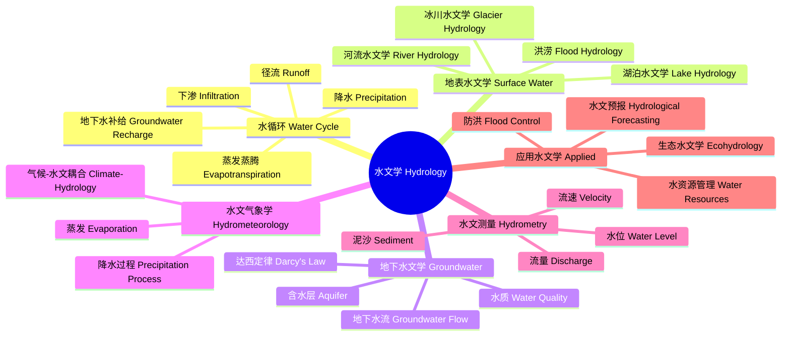

---
aliases: [水文学, Hydrology]
tags: ['EarthSciences/Hydrology', 'WaterScience']
---

# 水文学

## 概述 (Overview)

水文学 (Hydrology) 是研究水在地球表面的分布、循环、物理化学性质及其与环境相互作用的科学。水文学涵盖大气水、地表水、土壤水和地下水的所有方面，是水资源管理、防洪减灾、环境保护和气候研究的基础学科。

## 水文学体系

## 水循环 (Water Cycle, Hydrologic Cycle)

水循环是地球上水在太阳辐射和重力驱动下持续循环的过程。全球水循环的控制方程为水量平衡方程 (Water Balance Equation)：

$$P = E + R + \Delta S$$

其中 $P$ 是降水量 (Precipitation)，$E$ 是蒸散发量 (Evapotranspiration)，$R$ 是径流量 (Runoff)，$\Delta S$ 是蓄水量变化 (Change in Storage)。

### 全球水量分布

| 水体类型 | 水量 (x10^3 km^3) | 占比 |
|----------|-----------------|------|
| 海洋 Oceans | 1,338,000 | 96.5% |
| 冰川与冰盖 Glaciers | 24,064 | 1.74% |
| 地下水 Groundwater | 23,400 | 1.69% |
| 湖泊 Lakes | 176.4 | 0.013% |
| 土壤水 Soil Moisture | 16.5 | 0.0012% |
| 大气水 Atmosphere | 12.9 | 0.0009% |
| 河流 Rivers | 2.12 | 0.00015% |
| 生物水 Biosphere | 1.12 | 0.00008% |

## 降水 (Precipitation)

### 降水形成机制

降水形成需要：水汽供应、上升冷却、凝结成云、水滴增长。

$$e_s(T) = 6.112 \exp\left(\frac{17.67T}{T + 243.5}\right) \quad\text{(饱和水汽压 Magnus 公式)}$$

### 降水类型

- 对流雨 (Convectional)：热力上升，强度大
- 地形雨 (Orographic)：地形抬升，迎风坡多雨
- 锋面雨 (Frontal)：冷暖气团交汇
- 台风雨 (Cyclonic)：热带气旋系统

### 降水统计特征

降水量频率分析：皮尔逊 III 型分布是常用的水文频率曲线。

$$P = \frac{1}{TN}\sum_{i=1}^N P_i$$

## 蒸发与蒸腾 (Evaporation & Transpiration)

### 彭曼公式 (Penman Equation)

联合计算蒸发和蒸腾的经典公式：

$$E = \frac{\Delta R_n + \rho c_p(e_s - e_a)/r_a}{\Delta + \gamma}$$

其中 $\Delta$ 是饱和水汽压-温度曲线斜率，$R_n$ 是净辐射，$e_s - e_a$ 是饱和差，$r_a$ 是空气动力学阻抗，$\gamma$ 是湿度计常数。

### 参考蒸散量 (Reference Evapotranspiration)

FAO Penman-Monteith 公式：

$$ET_0 = \frac{0.408\Delta(R_n - G) + \gamma\frac{900}{T + 273}u_2(e_s - e_a)}{\Delta + \gamma(1 + 0.34u_2)}$$

## 径流 (Runoff)

### 径流形成过程

降雨、截留 (Interception)、洼蓄 (Depression Storage)、下渗 (Infiltration)、地表径流 (Surface Runoff)、壤中流 (Interflow)、基流 (Baseflow)

### 单位线 (Unit Hydrograph)

单位线是在单位时段内均匀分布在流域上单位净雨深形成的直接径流过程线。

$$Q(t) = \sum_{i=1}^m P_i U(t - (i-1)\Delta t)$$

### 径流特征值

年径流深 $R$、径流模数 $M$、径流系数 $\alpha$：

$$\alpha = \frac{R}{P}$$

## 地下水 (Groundwater)

### 达西定律 (Darcy's Law)

地下水在多孔介质中流动的基本方程：

$$Q = -KA\frac{dh}{dl}$$

其中 $K$ 是水力传导系数 (Hydraulic Conductivity)，$A$ 是过水断面面积，$dh/dl$ 是水力梯度。

### 地下水类型

| 含水层类型 | 特征 | 埋藏条件 |
|------------|------|----------|
| 潜水 Unconfined | 自由水面，无承压 | 第一个隔水层之上 |
| 承压水 Confined | 具有压力水头 | 两个隔水层之间 |
| 裂隙水 Fracture | 储存在岩石裂隙中 | 基岩山区 |
| 岩溶水 Karst | 溶蚀空洞中的地下水 | 碳酸盐岩分布区 |

### 地下水流动方程

三维非稳定地下水流动方程：

$$\frac{\partial}{\partial x}\left(K_x\frac{\partial h}{\partial x}\right) + \frac{\partial}{\partial y}\left(K_y\frac{\partial h}{\partial y}\right) + \frac{\partial}{\partial z}\left(K_z\frac{\partial h}{\partial z}\right) = S_s\frac{\partial h}{\partial t}$$

其中 $S_s$ 是储水率 (Specific Storage)。

## 洪水与干旱 (Floods & Droughts)

### 洪水频率分析

设计洪水的重现期 $T$ 与超越概率 $p$ 的关系：

$$T = \frac{1}{p}$$

### 水文模型

| 模型类型 | 代表模型 | 特点 |
|----------|----------|------|
| 概念性模型 | HBV, SACRAMENTO | 物理概念 + 经验参数 |
| 分布式模型 | SWAT, MIKE SHE | 空间变异性描述 |
| 机器学习模型 | LSTM, Random Forest | 数据驱动预测 |

## 水资源管理 (Water Resources Management)

### 水资源可持续利用

$$W_{\text{可持续}} \leq W_{\text{可再生}} + W_{\text{回用}} - W_{\text{生态需水}}$$

### 海绵城市 (Sponge City)

通过透水铺装、绿色屋顶、雨水花园、湿地等低影响开发 (LID) 措施，实现城市雨洪管理。

## 水文学新前沿

- **同位素水文学**：利用 $^2\text{H}$、$^{18}\text{O}$ 等稳定同位素示踪水循环
- **生态水文学**：水与植被相互作用的机制
- **全球水文**：大数据与全球水文模型
- **变化环境下的水文**：气候变化和人类活动对水文过程的影响

## 水文测验技术 (Hydrometry)

流量测量：流速仪法、ADCP (声学多普勒流速剖面仪)、堰槽法、稀释法。水位测量：自记水位计、雷达水位计、压力式水位计。降水测量：翻斗式雨量计、称重式雨量计、雷达降水估计。蒸发测量：蒸发皿、涡度相关法 (Eddy Covariance)。土壤水分测量：时域反射法 (TDR)、频域反射法 (FDR)、中子水分仪。

## 水文统计 (Hydrological Statistics)

水文频率分析用于推算不同重现期的设计洪水。皮尔逊 III 型分布 (P-III) 是中国水文频率分析的标准线型。矩法 (Method of Moments) 和适线法 (Curve Fitting) 用于参数估计。极值理论 (Extreme Value Theory) 使用 Gumbel 分布和广义极值分布 (GEV)。区域频率分析 (Regional Frequency Analysis) 利用多个站点的数据提高估计可靠性。非一致性水文频率分析考虑变化环境下的平稳性假设失效问题。

## 中国水文地理 (Hydrology of China)

中国主要流域：长江流域（年径流量约 9600 亿 m^3）、黄河流域（年径流量约 580 亿 m^3）、珠江流域、松花江流域、淮河流域、海河流域。南水北调工程是世界最大的跨流域调水工程，分为东中西三线。中国水资源总量居世界第四位，但人均水资源量仅为世界平均的 1/4。水资源时空分布不均：南多北少、夏多冬少。

## 水文学中的同位素水文 (Isotope Hydrology)

稳定同位素 ($\delta^{18}O, \delta D$) 和放射性同位素 (3H, 14C, 36Cl) 在研究水循环中起示踪作用。Craig 的大气水线 (GMWL)：$\delta D = 8\delta^{18}O + 10$。同位素分馏 (Isotopic Fractionation) 在蒸发和凝结过程中改变水的同位素组成。氚 (3H) 作为年轻地下水 (小于 50 年) 的年龄标记。14C 测定古地下水的年龄。雨水线斜率变化反映区域水汽来源和二次蒸发效应。同位素技术在地下水补给来源识别、地表水-地下水相互作用和流域水文过程研究中广泛应用。

## 水文学中的生态水文 (Ecohydrology)

生态水文学研究水文过程与生态系统的相互作用。植被水分利用策略包括深根吸水、雾拦截和水分再分配 (Hydraulic Redistribution)。蒸散发 (Evapotranspiration) 的实际测量使用涡旋相关 (Eddy Covariance) 技术。土壤水分-植被反馈机制在半干旱地区尤为显著。河流流量和地下水位的生态阈值决定河流生态系统健康。河流流量管理支持环境流量 (Environmental Flow) 保障生态需水。湿地水文周期控制湿地植被分布和生物地球化学过程。

## 水文学中的水文预报 (Hydrological Forecasting)

洪水预报模型包括集总式和分布式。集总式模型如 Stanford Watershed Model 和 Sacramento 模型。分布式物理模型如 MIKE SHE 和 HEC-HMS 基于物理方程。实时洪水预报使用数据同化 (Data Assimilation) 方法更新模型状态。降雨-径流模型中的单位线法基于线性系统假设。概率水文预报使用集合预报 (Ensemble Forecasting) 量化预报不确定性。洪水早期预警系统 (FEWS) 结合气象预报和水文模型。

## 水文学中的土壤水文学 (Soil Hydrology)

土壤水是连接地表水和地下水的关键环节。土壤水分特征曲线 (Soil Water Retention Curve) 描述基质势与含水量的关系，常用 van Genuchten 模型拟合。

$$\theta(h) = \theta_r + \frac{\theta_s - \theta_r}{[1 + |\alpha h|^n]^m}$$

其中 $\theta_s$ 是饱和含水量，$\theta_r$ 是残余含水量，$\alpha, n, m$ 是经验参数。理查兹方程 (Richards Equation) 描述非饱和土壤水运动。

$$\frac{\partial\theta}{\partial t} = \frac{\partial}{\partial z}\left[K(h)\left(\frac{\partial h}{\partial z} + 1\right)\right]$$

## 水文学中的流域水文模型 (Watershed Hydrological Models)

流域水文模型分为集总式 (Lumped)、半分布式 (Semi-Distributed) 和分布式 (Distributed) 三类。SWAT 模型是应用最广泛的半分布式水文模型，用于模拟径流、泥沙和营养物质输移。HEC-HMS 是美国陆军工程兵团开发的降雨-径流模型。TOPMODEL 基于地形指数 (Topographic Index) 预测饱和源区分布。VIC (Variable Infiltration Capacity) 模型是宏观尺度水文模型。中国的新安江模型是概念性降雨-径流模型的代表。深度学习模型 (LSTM) 在降雨-径流预报中展现出优于传统方法的性能。

## 相关条目 (See Also)

与本条目相关的其他知识库条目：

- [[Meteorology|气象学]]：大气过程与降水形成
- [[PhysicalGeography|自然地理学]]：地球表层自然过程
- [[Water Resources|水资源管理]]：水资源的开发利用与保护
- [[../../INDEX|返回知识库首页]]

## 扩展阅读与参考资料 (Further Reading)

水文学的经典文献和系统学习资源：

1. 经典教材：水文学原理 (芮孝芳)、工程水文学 (詹道江)
2. 学术期刊：Journal of Hydrology, Water Resources Research, Hydrology and Earth System Sciences
3. 研究机构：河海大学水文水资源学院、中国水利水电科学研究院
4. 数据平台：中国水文年鉴、全球径流数据中心 (GRDC)、USGS Water Data
5. 技术标准：SL 标准 (中国水利行业标准)、GB/T 水文系列标准

## 主要研究前沿 (Research Frontiers)

水文学的前沿方向包括：变化环境下非平稳水文频率分析。高分辨率卫星降水反演与同化。人工智能与深度学习水文预报。社会水文学 (Socio-hydrology) 研究人类-水系统的耦合动力学。城市水文学中的绿色基础设施效果评估。同位素水文学与水源识别。全球变化与极端水文事件归因。陆面过程模式中的水文过程参数化改进。地下水超采治理与可持续地下水资源管理。
