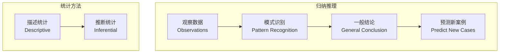
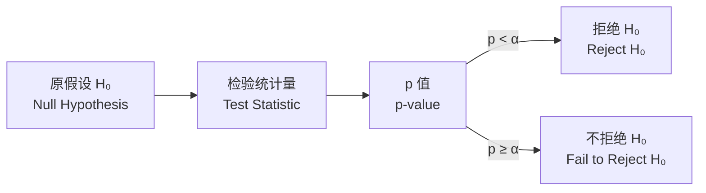

---
aliases:
  - Induction and Statistical Analysis
  - 归纳推理
  - 统计分析
tags:
  - logic
  - induction
  - statistics
  - probability
  - bayesian
  - hypothesis-testing
created: 2025-05-17
---

# 归纳与统计分析 (Induction and Statistical Analysis)

归纳推理是从特殊到一般的推理方式，与统计分析方法紧密关联。

## 归纳推理总览 (Inductive Reasoning Overview)

## 概率论基础 (Fundamentals of Probability)

### 基本公理 (Kolmogorov Axioms)

$$
\begin{aligned}
&P(A) \geq 0 \\
&P(\Omega) = 1 \\
&P\left(\bigcup_{i=1}^{\infty} A_i\right) = \sum_{i=1}^{\infty} P(A_i) \quad (\text{互不相容})
\end{aligned}
$$

### 条件概率与贝叶斯定理 (Conditional Probability & Bayes' Theorem)

条件概率定义：

$$
P(A \mid B) = \frac{P(A \cap B)}{P(B)}, \quad P(B) > 0
$$

贝叶斯定理：

$$
P(H \mid E) = \frac{P(E \mid H) \cdot P(H)}{P(E)}
$$

其中 $P(H)$ 是先验概率 (Prior)，$P(H \mid E)$ 是后验概率 (Posterior)。

### 概率分布对比 (Probability Distribution Comparison)

| 分布 | 类型 | 参数 | 应用场景 |
| :--- | :--- | :--- | :--- |
| 正态分布 (Normal) | 连续 | $\mu, \sigma$ | 自然现象 |
| 二项分布 (Binomial) | 离散 | $n, p$ | 成功次数 |
| 泊松分布 (Poisson) | 离散 | $\lambda$ | 事件计数 |
| 均匀分布 (Uniform) | 连续 | $a, b$ | 等可能 |

## 描述统计 (Descriptive Statistics)

### 集中趋势 (Central Tendency)

| 度量 | 定义 | 适用性 |
| :--- | :--- | :--- |
| 均值 (Mean) | $\bar{x} = \frac{1}{n}\sum x_i$ | 对称数据 |
| 中位数 (Median) | 中间值 | 偏态数据 |
| 众数 (Mode) | 最频繁值 | 分类数据 |

### 离散程度 (Dispersion)

$$
s^2 = \frac{1}{n-1} \sum_{i=1}^{n} (x_i - \bar{x})^2
$$

## 推断统计 (Inferential Statistics)

### 假设检验流程 (Hypothesis Testing Process)

### 常见检验方法 (Common Test Methods)

| 检验 | 用途 | 统计量 |
| :--- | :--- | :--- |
| t 检验 (t-test) | 均值比较 | $t = \frac{\bar{x} - \mu}{s/\sqrt{n}}$ |
| 卡方检验 (Chi-square) | 分类变量独立性 | $\chi^2 = \sum \frac{(O-E)^2}{E}$ |
| F 检验 (F-test) | 方差比较/ANOVA | $F = \frac{MS_{between}}{MS_{within}}$ |

### 两类错误 (Type I and Type II Errors)

| 决策 \ 真相 | $H_0$ 为真 | $H_0$ 为假 |
| :--- | :--- | :--- |
| 拒绝 $H_0$ | I 类错误 (Type I) $\alpha$ | 正确 |
| 不拒绝 $H_0$ | 正确 | II 类错误 (Type II) $\beta$ |

## 归纳与统计的关系 (Induction and Statistics)

密尔五法 (Mill's Methods) 与统计方法的对应：

1. **求同法** — 在正相关中寻找共同因素
2. **求异法** — 对照实验 (Control Experiment)
3. **共变法** — 相关系数 (Correlation Coefficient)
4. **剩余法** — 回归分析中残差分析
5. **求同求异并用法** — 综合实验设计

## 应用案例 (Application Cases)

- A/B 测试：t 检验比较两组转化率
- 贝叶斯垃圾邮件过滤：$P(\text{spam} \mid \text{words})$
- 线性回归预测：$y = \beta_0 + \beta_1 x + \varepsilon$
