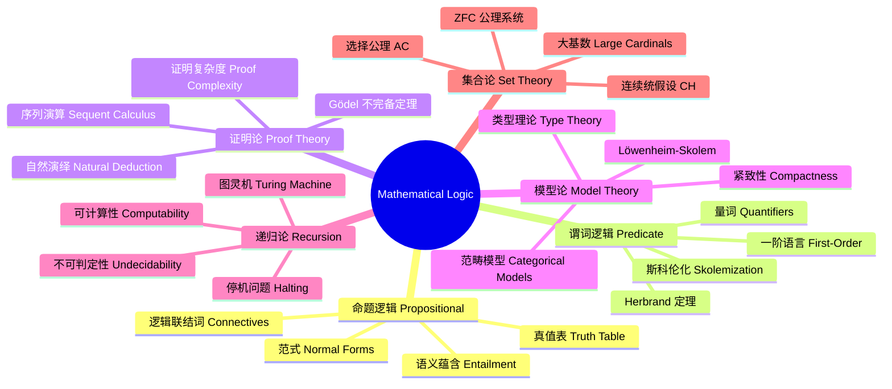

# MathematicalLogic

## 概述 (Overview)

数理逻辑 (Mathematical Logic) 是使用形式化方法研究推理的数学分支。它将逻辑推理转化为符号演算，探讨可证明性、可定义性和可计算性的极限。主要分支包括命题逻辑 (Propositional Logic)、谓词逻辑 (Predicate Logic)、证明论 (Proof Theory)、模型论 (Model Theory)、递归论 (Recursion Theory) 和集合论 (Set Theory)。

## 数理逻辑体系

## 命题逻辑 (Propositional Logic)

### 语法

命题逻辑的公式由原子命题和逻辑联结词构成：

$$\phi \;::=\; p \;|\; \neg\phi \;|\; \phi \land \psi \;|\; \phi \lor \psi \;|\; \phi \rightarrow \psi \;|\; \phi \leftrightarrow \psi$$

### 语义

真值赋值 $v: \text{Atoms} \rightarrow \{\mathbf{T}, \mathbf{F}\}$ 递归扩展到所有公式：

$$v(\neg\phi) = \mathbf{T} \iff v(\phi) = \mathbf{F}$$
$$v(\phi \land \psi) = \mathbf{T} \iff v(\phi) = \mathbf{T} \text{ and } v(\psi) = \mathbf{T}$$
$$v(\phi \lor \psi) = \mathbf{T} \iff v(\phi) = \mathbf{T} \text{ or } v(\psi) = \mathbf{T}$$
$$v(\phi \rightarrow \psi) = \mathbf{T} \iff v(\phi) = \mathbf{F} \text{ or } v(\psi) = \mathbf{T}$$

### 范式

合取范式 (CNF) 和析取范式 (DNF)：

$$\text{CNF: } \bigwedge_i \bigvee_j L_{ij}, \quad \text{DNF: } \bigvee_i \bigwedge_j L_{ij}$$

### 演绎定理

$$\Gamma, \phi \vdash \psi \iff \Gamma \vdash \phi \rightarrow \psi$$

## 谓词逻辑 (Predicate Logic)

### 一阶语言

一阶逻辑的语言包括个体常元、函数符号、谓词符号和量词。公式：

$$\phi(x) \equiv \forall x (P(x) \rightarrow \exists y R(x,y))$$

### 斯科伦化 (Skolemization)

消去存在量词 $\exists x$ 并代之以斯科伦函数 $f(\bar{y})$：

$$\forall x\exists y P(x,y) \rightarrow \forall x P(x,f(x))$$

### Herbrand 定理

公式 $\phi$ 不可满足当且仅当其 Herbrand 展开的有限子集不可满足。

## 证明论 (Proof Theory)

### 自然演绎 (Natural Deduction)

Gentzen 的自然演绎系统以引入和消去规则为特征。$\rightarrow$ 引入规则：

$$\frac{\Gamma, A \vdash B}{\Gamma \vdash A \rightarrow B}(\rightarrow I)$$

$\rightarrow$ 消去规则 (Modus Ponens)：

$$\frac{\Gamma \vdash A \rightarrow B \quad \Gamma \vdash A}{\Gamma \vdash B}(\rightarrow E)$$

### 希尔伯特系统 (Hilbert System)

希尔伯特风格的公理系统使用少数公理和分离规则。标准公理：

$$(\phi \rightarrow (\psi \rightarrow \phi))$$
$$((\phi \rightarrow (\psi \rightarrow \chi)) \rightarrow ((\phi \rightarrow \psi) \rightarrow (\phi \rightarrow \chi)))$$
$$((\neg\phi \rightarrow \neg\psi) \rightarrow (\psi \rightarrow \phi))$$

### 哥德尔不完备定理 (Gödel's Incompleteness Theorems)

第一不完备定理：任何包含初等算术的一致递归公理系统 $\mathcal{S}$ 都存在一个不可判定的语句 $G$——$\mathcal{S}$ 既不能证明 $G$ 也不能证明 $\neg G$。

第二不完备定理：如果 $\mathcal{S}$ 一致，则 $\mathcal{S}$ 不能证明自身的一致性。

$$\text{Con}(\mathcal{S}) \not\vdash_{\mathcal{S}} \text{Con}(\mathcal{S})$$

## 模型论 (Model Theory)

### 紧致性定理 (Compactness Theorem)

如果理论 $T$ 的每个有限子集都有模型，则 $T$ 有模型：

$$\forall \Delta \subseteq_{\text{finite}} T,\; \Delta \models \exists \mathcal{M} \;\Rightarrow\; T \models \exists \mathcal{M}$$

### Löwenheim-Skolem 定理

如果一阶理论 $T$ 有无限模型，则对任意无穷基数 $\kappa \geq |L|$，$T$ 有基数为 $\kappa$ 的模型。

### 超积 (Ultraproduct)

超积 $\prod_{i\in I} \mathcal{M}_i / \mathcal{U}$ 使用超滤子 $\mathcal{U}$ 模去等价关系。Los 定理断言超积中公式满足当且仅当多数稠密集满足。

## 递归论与可计算性 (Recursion Theory)

### 图灵机 (Turing Machine)

图灵机的形式化定义：七元组 $(Q, \Sigma, \Gamma, \delta, q_0, q_{\text{accept}}, q_{\text{reject}})$。转移函数：

$$\delta: Q \times \Gamma \rightarrow Q \times \Gamma \times \{L, R\}$$

### 停机问题 (Halting Problem)

停机问题是递归不可判定的。证明使用对角线论证：假设存在判定停机问题的图灵机 $H$，构造 $D$ 使得：

$$D(P) = \begin{cases} \text{循环}, & \text{if } H(P,P) \text{ 输出停机} \\ \text{停机}, & \text{if } H(P,P) \text{ 输出循环} \end{cases}$$

导致矛盾，故 $H$ 不存在。

### 可计算性层级

- 递归集 (Decidable)：特征函数可计算
- 递归可枚举集 (RE)：存在枚举算法
- 算术层级 (Arithmetic Hierarchy)：$\Sigma_n^0, \Pi_n^0$
- 图灵度 (Turing Degree)：不可解度

## 集合论 (Set Theory)

### ZFC 公理

Zermelo-Fraenkel 集合论加选择公理 (AC)：

1. **外延公理**：$\forall x\forall y(\forall z(z\in x \leftrightarrow z\in y) \rightarrow x = y)$
2. **空集公理**：$\exists x\forall y(\neg y\in x)$
3. **配对公理**：$\forall x\forall y\exists z(x\in z \land y\in z)$
4. **并集公理**：$\forall\mathcal{F}\exists A\forall Y\forall x(x\in Y\land Y\in\mathcal{F} \rightarrow x\in A)$
5. **幂集公理**：$\forall x\exists y\forall z(z\subseteq x \rightarrow z\in y)$
6. **无穷公理**：$\exists x(\varnothing \in x \land \forall y(y\in x \rightarrow y\cup\{y\} \in x))$
7. **替换公理模式**：$\forall x\exists!y\phi(x,y) \rightarrow \forall A\exists B\forall y(y\in B \leftrightarrow \exists x\in A\;\phi(x,y))$
8. **选择公理 (AC)**：$\forall X(\varnothing\notin X \rightarrow \exists f:X\rightarrow\bigcup X,\forall A\in X(f(A)\in A))$

### 连续统假设 (Continuum Hypothesis)

CH 断言：$\aleph_1 = 2^{\aleph_0}$。Gödel 证明 CH 与 ZFC 一致，Cohen 证明 $\neg$CH 与 ZFC 一致——因此 CH 独立于 ZFC。

### 大基数 (Large Cardinals)

- 不可达基数 (Inaccessible Cardinal)
- 可测基数 (Measurable Cardinal)
- 紧致基数 (Compact Cardinal)
- Woodin 基数
- 超级紧致基数 (Supercompact Cardinal)

## 类型论 (Type Theory)

### 简单类型

Church 的简单类型 $\lambda$ 演算：

$$\tau \;::=\; o \;|\; \iota \;|\; \tau \rightarrow \tau$$

### 依值类型

Martin-Löf 类型论引入依值类型。Curry-Howard 同构：命题即类型，证明即程序。

$$\frac{\Gamma \vdash M: A \quad \Gamma \vdash N: B}{\Gamma \vdash (M,N): A \times B}$$

$$\frac{\Gamma \vdash M: A \times B}{\Gamma \vdash \pi_1 M: A}$$

## 数理逻辑的应用 (Applications)

### 计算机科学

类型系统验证程序正确性。模型检测 (Model Checking) 使用时序逻辑验证系统行为。SAT 求解器基于 DPLL 和 CDCL 算法。SMT 求解器处理一阶逻辑理论。

### 数学基础

范畴论提供逻辑的替代基础。多值逻辑 (Fuzzy Logic, Paraconsistent Logic)。模态逻辑 (Modal Logic) 和时序逻辑 (Temporal Logic)。二阶逻辑和更高阶逻辑。

## 主要期刊 (Major Journals)

《Journal of Symbolic Logic》、《Annals of Pure and Applied Logic》、《Notre Dame Journal of Formal Logic》、《Transactions of the American Mathematical Society》、《Bulletin of Symbolic Logic》、《Logical Methods in Computer Science》。

## 相关条目

- [[../../INDEX|当前目录索引]]
