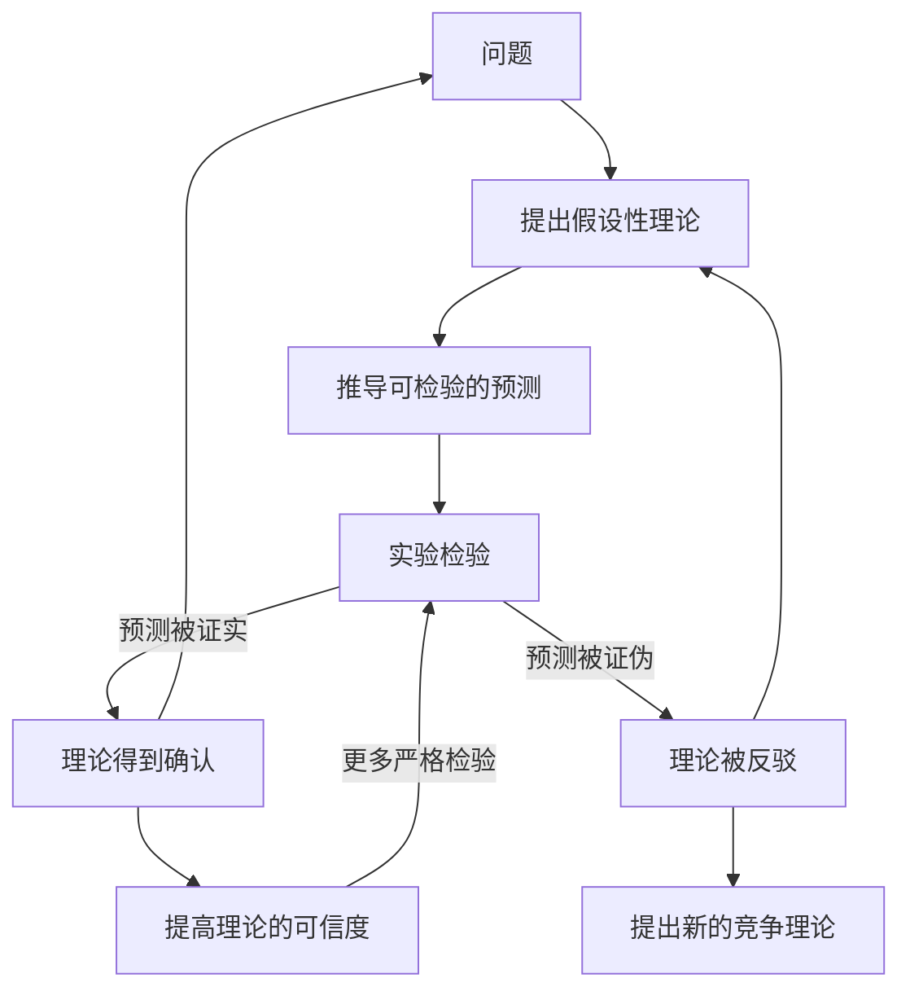
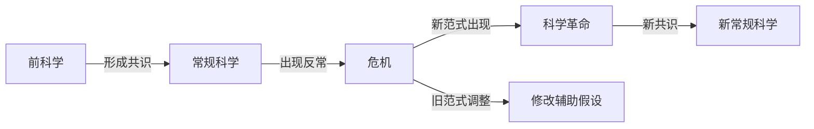

---
aliases:
  - 科学哲学
  - 研究方法论
  - 科学推理
tags:
  - logic
  - methodology
  - philosophy-of-science
  - scientific-method
  - research-design
---

# 科学方法论 (Scientific Methodology)

## 1 概述 (Overview)

科学方法论是研究科学实践中使用的程序、方法和逻辑原则的系统性学科。它探讨什么使一个理论成为"科学的"，科学知识如何增长，以及如何设计可靠的研究。

## 2 科学推理 (Scientific Reasoning)

### 2.1 归纳法 (Induction)

从特殊到一般的推理。休谟问题 (Hume's Problem of Induction) 质疑归纳推理的合理性——我们无法证明未来会与过去相似。

$$
\frac{\text{观察到 } N \text{ 只天鹅为白色}}{\therefore \text{所有天鹅均为白色}}
$$

归纳的合理性问题是科学哲学的经典问题。波普尔通过证伪主义 (Falsificationism) 提供了替代方案。

### 2.2 演绎法 (Deduction)

从一般到特殊的推理。三段论 (Syllogism)：

$$
\begin{aligned}
&\text{所有 } A \text{ 都是 } B \\\\
&\text{所有 } B \text{ 都是 } C \\\\
&\therefore \text{所有 } A \text{ 都是 } C
\end{aligned}
$$

### 2.3 溯因法 (Abduction)

皮尔士 (C. S. Peirce) 提出的第三种推理形式——从观察到的事实推断最佳解释：

$$
\begin{aligned}
&\text{观察到现象 } P \\\\
&\text{如果 } H \text{ 为真，则可解释 } P \\\\
&\therefore H \text{ 可能是真的}
\end{aligned}
$$

## 3 证伪主义 (Falsificationism)

### 3.1 波普尔的划界标准 (Popper's Demarcation)

一个理论是科学的，当且仅当它在原则上可以被证伪。可证伪性 (Falsifiability) 而非可证实性 (Verifiability) 是科学与非科学的划界标准。

$$
\text{科学理论} \xrightarrow{\text{大胆猜想}} \text{可证伪预测} \xrightarrow{\text{严格检验}} \begin{cases}
\text{未被证伪} \to \text{暂时接受} \\\\
\text{被证伪} \to \text{抛弃}
\end{cases}
$$

### 3.2 库恩的范式理论 (Kuhn's Paradigm Theory)

科学革命的结构 (The Structure of Scientific Revolutions) 提出科学发展并非线性累积，而是通过范式转换 (Paradigm Shift) 实现的革命。

## 4 研究设计 (Research Design)

### 4.1 研究类型 (Research Types)

| 类型 | 特征 | 目的 | 举例 |
|------|------|------|------|
| 探索性研究 | 开放、灵活 | 发现新问题 | 田野观察 |
| 描述性研究 | 系统记录 | 描述现象特征 | 人口普查 |
| 解释性研究 | 控制变量 | 验证因果关系 | 对照实验 |
| 预测性研究 | 模型外推 | 预测未来趋势 | 气候模型 |

### 4.2 实验设计 (Experimental Design)

随机对照试验 (Randomized Controlled Trial, RCT) 是因果推断的金标准。控制组与实验组对比：

$$
\text{因果效应} = E[Y | T=1] - E[Y | T=0]
$$

### 4.3 变量类型 (Variable Types)

- 自变量 (Independent Variable)：被操纵的因素
- 因变量 (Dependent Variable)：被测量的结果
- 控制变量 (Controlled Variable)：保持恒定的因素
- 混淆变量 (Confounding Variable)：影响结果的第三方因素

## 5 假设检验 (Hypothesis Testing)

### 5.1 统计假设 (Statistical Hypotheses)

零假设 (Null Hypothesis, $H_0$) 和备择假设 (Alternative Hypothesis, $H_1$)。p 值 (p-value) 代表在 $H_0$ 为真的条件下观察到当前结果的概率。

### 5.2 两类错误 (Type I & Type II Errors)

| 决策 \ 真实情况 | $H_0$ 为真 | $H_0$ 为假 |
|----------------|-----------|-----------|
| 拒绝 $H_0$ | 第一类错误 ($\alpha$) | 正确 (Power = $1-\beta$) |
| 接受 $H_0$ | 正确 ($1-\alpha$) | 第二类错误 ($\beta$) |

### 5.3 贝叶斯统计 (Bayesian Statistics)

贝叶斯定理将先验概率更新为后验概率：

$$
P(\theta | D) = \frac{P(D | \theta) P(\theta)}{P(D)}
$$

其中 $P(\theta)$ 为先验分布，$P(D|\theta)$ 为似然函数，$P(\theta|D)$ 为后验分布。

## 6 科学解释 (Scientific Explanation)

### 6.1 覆盖率模型 (Covering Law Model)

亨佩尔 (Hempel) 的演绎-律则模型 (Deductive-Nomological Model, D-N Model)：

$$
\begin{aligned}
&\text{普遍定律: } L_1, L_2, ..., L_n \\\\
&\text{初始条件: } C_1, C_2, ..., C_m \\\\
&\therefore \text{待解释现象 } E
\end{aligned}
$$

### 6.2 因果解释 (Causal Explanation)

萨尔蒙 (Wesley Salmon) 的统计相关性理论强调真正的因果机制。因果关系的充分条件：$X$ 引起 $Y$ 当且仅当存在从 $X$ 到 $Y$ 的因果过程。

## 7 科学实在论与反实在论 (Realism vs. Antirealism)

- 科学实在论 (Scientific Realism)：科学理论描述了真实的世界，包括不可观察实体
- 工具主义 (Instrumentalism)：科学理论只是预测工具，不必然描述真实世界
- 建构经验论 (Constructive Empiricism)：科学应当追求经验充分性，而非真实性

## 8 科学实践中的方法论问题 (Methodological Issues)

### 8.1 奥卡姆剃刀 (Occam's Razor)

在同等解释力的理论中，最简单的理论更可取。简单性 (Simplicity) 虽无逻辑必然性，但具有启发价值：

$$
\text{若 } P(E|T_1) = P(E|T_2), \text{ 则选择 } \min(\text{参数数}, \text{假设数})
$$

### 8.2  reproducibility Crisis (可重复性危机)

许多已发表研究结果无法被独立复现。原因包括：p-hacking、样本量不足、发表偏差 (Publication Bias)。解决方案包括预注册 (Pre-registration) 和开放科学 (Open Science) 实践。

## 9 科学的社会维度 (Social Dimensions of Science)

- 默顿规范 (Merton Norms)：普遍主义、公有性、无私利性、有组织的怀疑
- 同行评议 (Peer Review)：科学质量控制的核心机制
- 科学共识 (Scientific Consensus)：科学知识的社会建构过程
