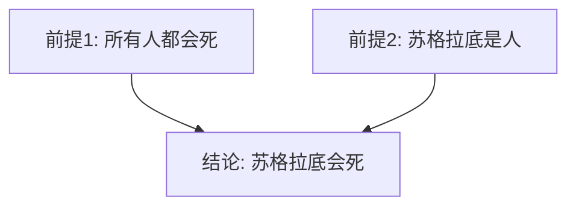
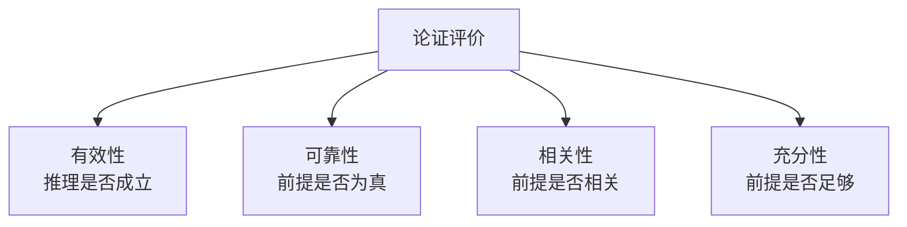

---
aliases:
  - Argumentation and Critical Thinking
  - 论证与批判性思维
tags:
  - Logic
  - Methodology
  - CriticalThinking
---

# 论证与批判性思维 (Argumentation and Critical Thinking)

## 一、论证的基本概念

论证由**前提 (Premise)** 和**结论 (Conclusion)** 构成。批判性思维要求我们对论证进行系统分析、评估和构建。

### 1.1 论证的结构要素

| 要素 | 定义 | 示例 |
|:---:|:---|:---|
| **前提** | 支持结论的陈述 | "所有人都会死" |
| **结论** | 被前提支持的陈述 | "苏格拉底会死" |
| **推理** | 从前提到结论的逻辑关系 | 三段论推理 |
| **隐含前提** | 未明确陈述的假设 | "苏格拉底是人" |

### 1.2 论证的类型

论证可分为**演绎论证 (Deductive Argument)** 和**归纳论证 (Inductive Argument)**：

- **演绎论证**：前提保证结论——若前提真则结论必然真
- **归纳论证**：前提支持结论——若前提真则结论可能真

### 1.3 论证图示 (Argument Mapping)

## 二、演绎逻辑 (Deductive Logic)

### 2.1 三段论 (Syllogism)

亚里士多德创立的三段论是演绎推理的经典形式：

$$
\frac{\text{所有 M 是 P} \quad \text{所有 S 是 M}}{\text{所有 S 是 P}}
$$

| 三段论类型 | 结构 | 示例 |
|-----------|------|------|
| 直言三段论 (Categorical) | 所有 A 是 B，所有 B 是 C | 所有哺乳动物是动物，猫是哺乳动物 |
| 假言三段论 (Hypothetical) | 如果 P 则 Q，如果 Q 则 R | 如果下雨则地湿，如果地湿则路滑 |
| 选言三段论 (Disjunctive) | P 或 Q，非 P | 要么去北京要么去上海，不去北京 |

### 2.2 命题逻辑 (Propositional Logic)

基本逻辑联结词：

| 符号 | 名称 | 含义 | 真值条件 |
|:---:|:---|:---|:---:|
| $\neg$ | 否定 | 非 P | P 假时为真 |
| $\land$ | 合取 | P 且 Q | 两者皆真时为真 |
| $\lor$ | 析取 | P 或 Q | 至少一真时为真 |
| $\to$ | 条件 | 如果 P 则 Q | P 真 Q 假时为假 |
| $\iff$ | 双条件 | P 当且仅当 Q | 同真同假 |

### 2.3 有效推理的基本形式

**肯定前件 (Modus Ponens)**

$$
\frac{P \to Q \quad P}{Q}
$$

**否定后件 (Modus Tollens)**

$$
\frac{P \to Q \quad \neg Q}{\neg P}
$$

**假言三段论 (Hypothetical Syllogism)**

$$
\frac{P \to Q \quad Q \to R}{P \to R}
$$

## 三、归纳逻辑 (Inductive Logic)

### 3.1 归纳推理的类型

| 类型 | 结构 | 示例 |
|------|------|------|
| 枚举归纳 | 观察到的 A 有属性 B → 所有 A 有 B | 观察到的天鹅是白的 → 所有天鹅是白的 |
| 类比论证 | A 和 B 有相似属性 → 其他属性也相似 | 地球与火星都靠近太阳、有大气层 |
| 统计归纳 | 样本中 x% 有特征 → 总体中 x% 有特征 | 抽样调查显示 60% 支持新政策 |
| 因果推理 | 观察到相关性 → 推断因果关系 | 吸烟与肺癌的统计相关性 |

### 3.2 穆勒五法 (Mill's Methods)

- **求同法 (Method of Agreement)** — 发现共同因素
- **求异法 (Method of Difference)** — 发现差异因素
- **共变法 (Method of Concomitant Variation)** — 发现关联变化
- **剩余法 (Method of Residues)** — 排除已知原因后剩余的原因
- **求同求异并用法 (Joint Method)** — 结合求同与求异

## 四、逻辑谬误 (Logical Fallacies)

### 4.1 形式谬误

| 谬误 | 定义 | 示例 |
|------|------|------|
| 肯定后件 (Affirming the Consequent) | 从 Q 推断 P | 如果下雨地会湿，地湿了 → 下雨了 |
| 否定前件 (Denying the Antecedent) | 从 非 P 推断 非 Q | 如果下雨地会湿，没下雨 → 地不会湿 |

### 4.2 非形式谬误

| 谬误 | 说明 |
|------|------|
| 人身攻击 (Ad Hominem) | 攻击提出观点的人而非反驳观点 |
| 稻草人 (Straw Man) | 歪曲对方的观点再加以攻击 |
| 诉诸权威 (Appeal to Authority) | 不当引用权威人士支持观点 |
| 诉诸情感 (Appeal to Emotion) | 以情感代替理性论证 |
| 滑坡谬误 (Slippery Slope) | 声称一个小变化会导致灾难性连锁反应 |
| 循环论证 (Begging the Question) | 结论包含在前提之中 |
| 假两难 (False Dilemma) | 只提供两种选择，忽略其他可能 |

## 五、批判性思维框架

### 5.1 论证分析步骤

1. **识别论点** — 找出结论和前提
2. **补充隐含前提** — 明确未说明的假设
3. **评估前提的可接受性** — 前提是否为真或合理
4. **评估推理的有效性** — 推理是否合乎逻辑
5. **考虑不同意见** — 是否存在反论证
6. **做出综合判断** — 权衡所有证据后得出结论

### 5.2 论证评价标准

### 5.3 苏格拉底式提问 (Socratic Questioning)

- **澄清式提问** — "你说的 X 具体指什么？"
- **假设性质疑** — "这个观点基于什么假设？"
- **证据性质疑** — "支持这个观点的证据是什么？"
- **对立视角** — "反对这个观点的人会怎么说？"
- **后果审视** — "如果这个观点成立，会有什么影响？"

## 六、论证的构建

### 6.1 图尔敏论证模型 (Toulmin Model)

| 要素 | 说明 | 示例 |
|------|------|------|
| 主张 (Claim) | 要证明的结论 | "应该禁止一次性塑料" |
| 依据 (Grounds) | 支持主张的事实 | "塑料需要450年才能降解" |
| 理据 (Warrant) | 连接依据与主张的理由 | "不可降解的材料应该被禁止" |
| 支持 (Backing) | 对理据的进一步支撑 | 相关法律与环保数据 |
| 限定 (Qualifier) | 主张的范围与程度 | "在大多数情况下" |
| 反驳 (Rebut) | 可能例外的情形 | "除非有完善的回收系统" |

---
*思维的品质决定行动的质量。掌握论证的艺术，是做独立判断者的基本能力。*
