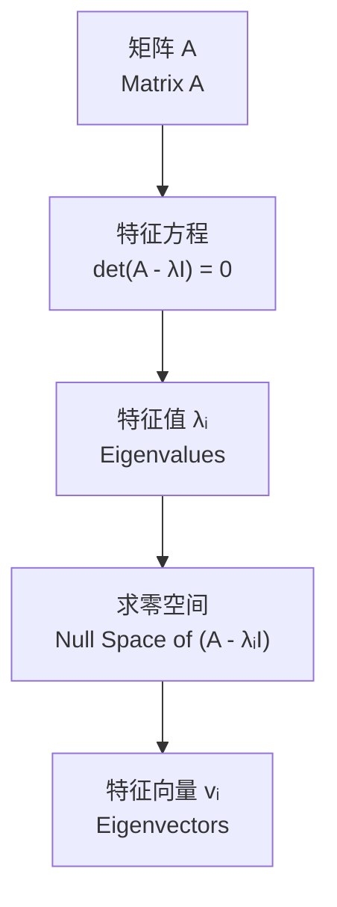

---
aliases:
  - Eigenvalues and Eigenvectors
  - 特征值
  - 特征向量
  - Eigen Decomposition
  - 谱分解
tags:
  - mathematics
  - linear-algebra
  - eigenvalues
  - eigenvectors
  - diagonalization
  - spectral-theorem
  - matrix-theory
created: 2025-05-17
---

# 特征值与特征向量 (Eigenvalues and Eigenvectors)

特征值和特征向量是线性代数核心概念，揭示了线性变换的本质结构。

## 定义 (Definition)

设 $A$ 为 $n \times n$ 矩阵，若存在非零向量 $\mathbf{v}$ 和标量 $\lambda$ 满足：

$$
A \mathbf{v} = \lambda \mathbf{v}
$$

则 $\lambda$ 称为 $A$ 的**特征值** (eigenvalue)，$\mathbf{v}$ 称为对应的**特征向量** (eigenvector)。

几何意义：特征向量在 $A$ 的作用下方向不变，仅在长度上缩放 $\lambda$ 倍。

## 求解方法 (Solution Methods)

### 特征方程 (Characteristic Equation)

$$
\det(A - \lambda I) = 0
$$

展开后得到关于 $\lambda$ 的 $n$ 次多项式，称为**特征多项式** (Characteristic Polynomial)。

### 求解流程 (Solution Flow)

## 性质 (Properties)

### 重要定理 (Important Theorems)

迹与行列式：

$$
\begin{aligned}
&\text{tr}(A) = \sum_{i=1}^{n} \lambda_i \\
&\det(A) = \prod_{i=1}^{n} \lambda_i
\end{aligned}
$$

| 性质 | 描述 |
| :--- | :--- |
| 相似变换 | $P^{-1}AP$ 的特征值不变 |
| 转置 | $A^T$ 与 $A$ 特征值相同 |
| 逆矩阵 | $A^{-1}$ 的特征值为 $1/\lambda$ |
| 幂 | $A^k$ 的特征值为 $\lambda^k$ |
| 多项式 | $p(A)$ 的特征值为 $p(\lambda)$ |

## 对角化 (Diagonalization)

若 $A$ 有 $n$ 个线性无关的特征向量，则 $A$ 可对角化：

$$
P^{-1} A P = \Lambda = \begin{pmatrix}
\lambda_1 & 0 & \cdots & 0 \\
0 & \lambda_2 & \cdots & 0 \\
\vdots & \vdots & \ddots & \vdots \\
0 & 0 & \cdots & \lambda_n
\end{pmatrix}
$$

### 对角化的充要条件 (Conditions for Diagonalization)

$$
\dim(\text{eigenspace of } \lambda_i) = \text{algebraic multiplicity of } \lambda_i
$$

## 谱定理 (Spectral Theorem)

对于实对称矩阵 $A$ (即 $A = A^T$)，谱定理保证：

$$
A = Q \Lambda Q^T
$$

其中 $Q$ 是正交矩阵 (Orthogonal Matrix)，即 $Q^T = Q^{-1}$ 且 $Q^T Q = I$。

特征值的重数 (Multiplicities)：

| 重数类型 | 定义 |
| :--- | :--- |
| 代数重数 (Algebraic) | 特征多项式中 $(\lambda - \lambda_i)$ 的次数 |
| 几何重数 (Geometric) | $\dim(\text{Null}(A - \lambda_i I))$ |

## 计算方法 (Computation Methods)

| 方法 | 适用场景 | 特点 |
| :--- | :--- | :--- |
| 幂法 (Power Iteration) | 最大特征值 | 简单迭代收敛 |
| QR 算法 | 全部特征值 | 稳定高效 |
| Jacobi 方法 | 实对称矩阵 | 并行友好 |
| 分治法 (Divide & Conquer) | 三对角矩阵 | 快速高精度 |

幂法迭代公式：

$$
\mathbf{x}_{k+1} = \frac{A \mathbf{x}_k}{\|A \mathbf{x}_k\|}
$$

## 应用 (Applications)

### 主成分分析 (PCA)

协方差矩阵 $C$ 的特征向量指向数据方差最大的方向。

### 图论 (Graph Theory)

图拉普拉斯矩阵 (Graph Laplacian) $L = D - A$ 的第二小特征值对应图的**代数连通度** (Algebraic Connectivity)。

### 量子力学 (Quantum Mechanics)

$$
H |\psi\rangle = E |\psi\rangle
$$

哈密顿量 $H$ 的特征值 $E$ 对应系统的能级。

### 搜索引擎 (Search Engines)

Google PageRank 算法的核心是求解网页链接矩阵的主特征向量。

## 相关分解 (Related Decompositions)

| 分解 | 适用矩阵 | 公式 |
| :--- | :--- | :--- |
| 特征分解 (EVD) | 可对角化方阵 | $A = P\Lambda P^{-1}$ |
| 奇异值分解 (SVD) | 任意矩阵 | $A = U\Sigma V^T$ |
| Schur 分解 | 任意方阵 | $A = Q T Q^*$ |
| Jordan 标准型 | 不可对角化方阵 | $A = P J P^{-1}$ |
