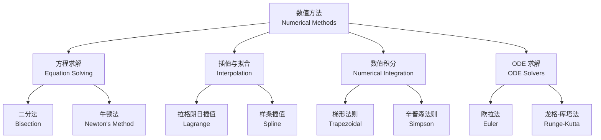

---
aliases:
  - 应用数学
  - Applied Mathematics
  - 数学建模
  - 数值分析
  - 优化理论
tags:
  - mathematics
  - applied-mathematics
  - modeling
  - optimization
  - numerical-methods
  - differential-equations
created: 2024-01-10
updated: 2024-08-15
---

# 应用数学

**应用数学（Applied Mathematics）** 是运用数学理论和方法解决科学、工程、经济和社会等领域实际问题的学科。它介于纯粹数学与具体应用领域之间，既是数学理论的延伸，也是解决实际问题的工具。

## 数学建模

### 建模过程

数学建模（mathematical modeling）是将实际问题转化为数学问题的过程：

### 建模方法

| 方法类型 | 描述 | 适用领域 |
|----------|------|----------|
| 机理建模 | 基于物理/化学定律 | 工程、物理 |
| 统计建模 | 基于数据驱动 | 经济、生物 |
| 仿真建模 | 通过计算机模拟 | 复杂系统 |
| 灰色建模 | 小样本、不确定性 | 预测、决策 |
| 智能建模 | 神经网络/机器学习 | 模式识别 |

### 建模实例：种群增长

Logistic 增长模型（Logistic growth model）：

$$
\frac{dN}{dt} = rN\left(1 - \frac{N}{K}\right)
$$

其中 $N$ 为种群数量，$r$ 为内禀增长率，$K$ 为环境容纳量。该模型的解为：

$$
N(t) = \frac{K}{1 + \left(\frac{K}{N_0} - 1\right)e^{-rt}}
$$

## 微分方程

微分方程（differential equations）描述变量随时间和空间的变化规律。

### 常微分方程

常微分方程（Ordinary Differential Equations, ODE）因变量只依赖于一个自变量：

$$
\frac{dy}{dx} = f(x, y)
$$

### 偏微分方程

偏微分方程（Partial Differential Equations, PDE）涉及多个自变量：

$$
\frac{\partial u}{\partial t} = \alpha \frac{\partial^2 u}{\partial x^2} \quad (\text{热传导方程})
$$

### 重要 PDE 类型

| 方程类型 | 标准形式 | 应用 |
|----------|----------|------|
| 拉普拉斯方程 | $\nabla^2 u = 0$ | 稳态热传导、电势 |
| 泊松方程 | $\nabla^2 u = f$ | 引力场、静电场 |
| 热传导方程 | $u_t = \alpha \nabla^2 u$ | 热扩散 |
| 波动方程 | $u_{tt} = c^2 \nabla^2 u$ | 声波、地震波 |
| 对流扩散方程 | $u_t + \mathbf{v} \cdot \nabla u = D \nabla^2 u$ | 污染物扩散 |

## 数值方法

数值方法（numerical methods）提供微分方程和优化问题的近似解。

### 有限差分法

有限差分法（Finite Difference Method, FDM）将微分算子用差分近似替代：

$$
\frac{du}{dx} \approx \frac{u_{i+1} - u_{i-1}}{2h} + O(h^2)
$$

### 有限元法

有限元法（Finite Element Method, FEM）将连续区域离散为有限个单元，通过变分原理求解：

$$
\mathbf{K}\mathbf{u} = \mathbf{f}
$$

其中 $\mathbf{K}$ 为刚度矩阵，$\mathbf{u}$ 为位移向量，$\mathbf{f}$ 为力向量。

### 常用数值算法

### 数值误差

数值计算中的主要误差类型：

| 误差类型 | 来源 | 控制方法 |
|----------|------|----------|
| 截断误差 | 近似方法本身 | 减少步长、提高阶数 |
| 舍入误差 | 浮点数精度限制 | 选择稳定算法 |
| 离散化误差 | 连续问题离散化 | 细化网格 |

## 优化理论

优化理论（optimization theory）在给定的约束条件下寻找使得目标函数取极值的决策变量。

### 线性规划

线性规划（Linear Programming, LP）的标准形式：

$$
\min \quad \mathbf{c}^T \mathbf{x}
$$
$$
\text{s.t.} \quad \mathbf{A} \mathbf{x} \leq \mathbf{b}
$$
$$
\quad \mathbf{x} \geq \mathbf{0}
$$

#### 单纯形法

单纯形法（Simplex method）在可行域的多面体顶点中搜索最优解。

#### 对偶理论

LP 的对偶问题（dual problem）提供了原问题的另一个视角：

$$
\max \quad \mathbf{b}^T \mathbf{y}
$$
$$
\text{s.t.} \quad \mathbf{A}^T \mathbf{y} \geq \mathbf{c}
$$
$$
\quad \mathbf{y} \geq \mathbf{0}
$$

### 非线性优化

非线性优化（Nonlinear Programming, NLP）处理目标函数或约束为非线性：

$$
\min \quad f(\mathbf{x})
$$
$$
\text{s.t.} \quad g_i(\mathbf{x}) \leq 0, \quad i = 1, \ldots, m
$$
$$
\quad h_j(\mathbf{x}) = 0, \quad j = 1, \ldots, p
$$

#### KKT 条件

Karush-Kuhn-Tucker（KKT）条件是一阶最优性的必要条件：

$$
\nabla f(\mathbf{x}^*) + \sum_{i=1}^m \mu_i \nabla g_i(\mathbf{x}^*) + \sum_{j=1}^p \lambda_j \nabla h_j(\mathbf{x}^*) = \mathbf{0}
$$
$$
\mu_i \geq 0, \quad \mu_i g_i(\mathbf{x}^*) = 0
$$

### 整数规划

整数规划（Integer Programming, IP）要求部分或全部变量为整数：

| 类型 | 描述 | 解法 |
|------|------|------|
| 纯整数规划 | 所有变量为整数 | 分支定界法 |
| 混合整数规划 | 部分变量整数 | 分支切割法 |
| 0-1 规划 | 变量取 0 或 1 | 隐枚举法 |

### 元启发式算法

对于大规模或非凸优化问题，使用元启发式算法（metaheuristics）：

- **遗传算法（Genetic Algorithm, GA）**：模仿自然选择和遗传机制
- **模拟退火（Simulated Annealing, SA）**：模拟物理退火过程
- **粒子群优化（Particle Swarm Optimization, PSO）**：基于群体智能
- **蚁群算法（Ant Colony Optimization, ACO）**：模拟蚂蚁觅食路径

## 概率统计方法

### 假设检验

假设检验（hypothesis testing）用于基于样本数据对总体参数做出推断：

$$
H_0: \mu = \mu_0 \quad \text{vs} \quad H_1: \mu \neq \mu_0
$$

检验统计量：

$$
t = \frac{\bar{x} - \mu_0}{s / \sqrt{n}}
$$

### 回归分析

线性回归模型（linear regression）：

$$
y = \beta_0 + \beta_1 x_1 + \cdots + \beta_p x_p + \varepsilon
$$

参数 $\boldsymbol{\beta}$ 的最小二乘估计（OLS）：

$$
\hat{\boldsymbol{\beta}} = (\mathbf{X}^T \mathbf{X})^{-1} \mathbf{X}^T \mathbf{y}
$$

### 时间序列分析

时间序列（time series）分析中的基本模型：

| 模型 | 方程 | 适用场景 |
|------|------|----------|
| AR(p) | $y_t = c + \sum_{i=1}^p \phi_i y_{t-i} + \varepsilon_t$ | 自相关数据 |
| MA(q) | $y_t = \mu + \sum_{j=1}^q \theta_j \varepsilon_{t-j} + \varepsilon_t$ | 移动平均 |
| ARIMA(p,d,q) | 整合 AR + MA | 非平稳序列 |

## 计算数学

### 快速傅里叶变换

快速傅里叶变换（Fast Fourier Transform, FFT）将信号在时域和频域之间转换：

$$
X_k = \sum_{n=0}^{N-1} x_n e^{-2\pi i k n / N}
$$

FFT 的计算复杂度为 $O(N \log N)$，远优于直接 DFT 的 $O(N^2)$。

### 矩阵计算

特征值问题（eigenvalue problem）：

$$
\mathbf{A} \mathbf{v} = \lambda \mathbf{v}
$$

### 蒙特卡洛方法

蒙特卡洛（Monte Carlo）方法通过随机抽样估计数值解：

$$
\int_a^b f(x)\,dx \approx \frac{b-a}{N} \sum_{i=1}^N f(x_i)
$$

其中 $x_i$ 在 $[a, b]$ 上均匀分布。

## 图论与网络科学

图论（graph theory）在应用数学中具有重要地位，用于建模网络结构。

### 图的基本概念

一个图定义为顶点和边的集合：

$$
G = (V, E)
$$

其中 $V$ 为顶点集，$E$ 为边集。

### 最短路径问题

Dijkstra 算法求解单源最短路径：

$$
\text{dist}[v] = \min_{u \in \text{visited}} (\text{dist}[u] + w(u, v))
$$

### 网络流

最大流问题（maximum flow problem）求解从源点到汇点的最大流量：

$$
\max \sum_{v \in V} f(s, v)
$$
$$
\text{s.t.} \quad 0 \leq f(u, v) \leq c(u, v)
$$
$$
\sum_{u} f(u, v) = \sum_{w} f(v, w) \quad \forall v \neq s, t
$$

#### 最小割定理

最大流等于最小割（Max-Flow Min-Cut Theorem）：

$$
\max \text{Flow} = \min \text{Capacity}(S, T)
$$

## 应用领域

| 领域 | 常用数学工具 | 典型问题 |
|------|--------------|----------|
| 物理学 | PDE、变分法、群论 | 场方程求解 |
| 工程学 | FEM、优化、控制论 | 结构设计 |
| 生物学 | ODE、随机过程 | 种群建模 |
| 经济学 | 优化、博弈论 | 资源配置 |
| 数据科学 | 统计、矩阵计算 | 机器学习 |
| 金融数学 | 随机分析、PDE | 期权定价 |

## 总结

应用数学是连接数学理论与现实世界的桥梁。数学建模将实际问题抽象为数学结构，微分方程描述了动态系统的演化规律，数值方法提供了求解复杂方程的计算途径，优化理论帮助寻找最优决策。现代科学技术的发展离不开应用数学的支撑，而新应用需求又不断推动着应用数学的向前发展。
