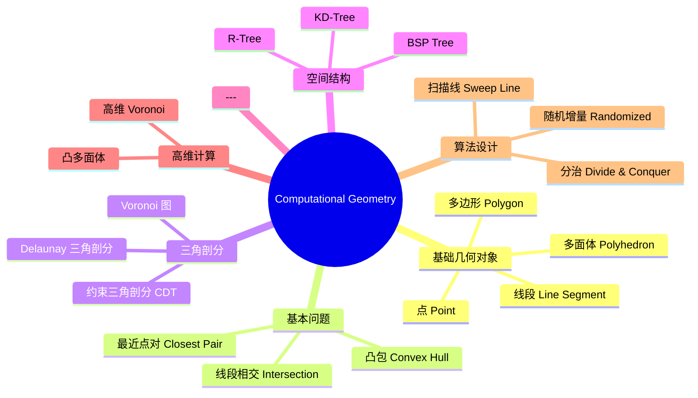
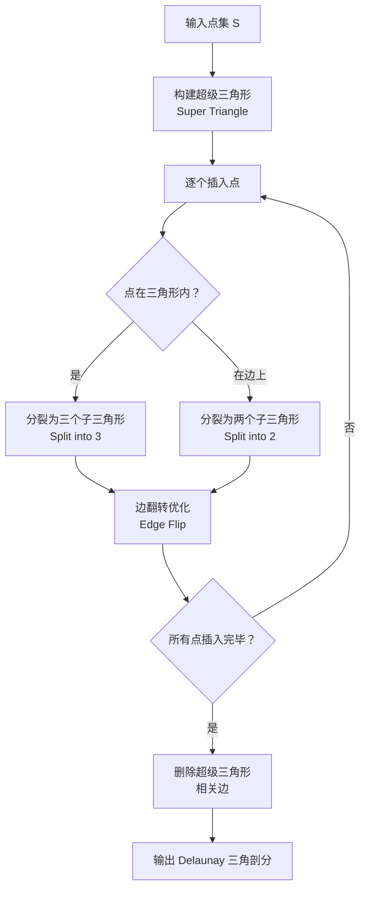

---
aliases: [ComputationalGeometry]
tags: ['Mathematics/ComputationalGeometry', 'ComputerScience']
---

# ComputationalGeometry

## 概述 (Overview)

计算几何 (Computational Geometry) 是研究使用计算机高效地表示、分析和操作几何对象的学科。它综合了数学几何理论与计算机算法设计，在计算机图形学、机器人学、地理信息系统、CAD/CAM 和科学计算中有广泛的应用。核心问题包括凸包计算、三角剖分、空间搜索和碰撞检测。

## 计算几何体系

## 凸包 (Convex Hull)

点集 $S = \{p_1, p_2, \dots, p_n\}$ 的凸包是包含所有点的最小凸集 (Convex Set)。形式化定义：

$$\text{CH}(S) = \left\{ \sum_{i=1}^n \lambda_i p_i \;\middle|\; \lambda_i \geq 0,\; \sum_{i=1}^n \lambda_i = 1 \right\}$$

### 经典算法

| 算法 | 时间复杂度 | 空间复杂度 | 特点 |
|------|-----------|-----------|------|
| Graham Scan | $O(n \log n)$ | $O(n)$ | 基于极角排序 |
| Jarvis March | $O(nh)$ | $O(n)$ | 输出敏感，$h$ 为凸包顶点数 |
| Quickhull | $O(n \log n)$ 平均 | $O(n)$ | 分治策略，类似快排 |
| 分治法 | $O(n \log n)$ | $O(n \log n)$ | 归并两个子凸包 |
| Chan 算法 | $O(n \log h)$ | $O(n)$ | 最优输出敏感 |

Graham Scan 的核心步骤：找到最低点 $p_0$，按极角排序后通过叉积 (Cross Product) 判断转向：

$$\text{cross}(p_{i-1}, p_i, p_{i+1}) = (p_i - p_{i-1}) \times (p_{i+1} - p_i) = \begin{vmatrix} x_i - x_{i-1} & y_i - y_{i-1} \\ x_{i+1} - x_i & y_{i+1} - y_i \end{vmatrix}$$

当叉积为正时逆时针左转，为负时顺时针右转。凸包维护只保留左转的顶点序列。

## Voronoi 图 (Voronoi Diagram)

给定平面上的 $n$ 个站点 $S = \{s_1, s_2, \dots, s_n\}$，Voronoi 图将平面划分成 $n$ 个区域，每个区域 $V(s_i)$ 包含所有距离 $s_i$ 最近的点的集合：

$$V(s_i) = \left\{ p \in \mathbb{R}^2 \;\middle|\; d(p, s_i) \leq d(p, s_j),\; \forall j \neq i \right\}$$

其中 $d(p, q)$ 为欧氏距离 (Euclidean Distance)：

$$d(p, q) = \sqrt{(x_p - x_q)^2 + (y_p - y_q)^2}$$

Voronoi 图的性质：
- 每个 Voronoi 单元是凸多边形 (Convex Polygon)
- 相邻单元的公共边是两站点连线的中垂线 (Perpendicular Bisector)
- 一个 $n$ 站点的 Voronoi 图最多有 $2n - 5$ 个顶点和 $3n - 6$ 条边
- 每个顶点是三条边的交点，对应三个站点的外心 (Circumcenter)

### 构造方法

| 方法 | 复杂度 | 说明 |
|------|-------|------|
| 增量法 | $O(n^2)$ | 逐个插入站点更新图 |
| 分治法 | $O(n \log n)$ | 递归合并子图 |
| Fortune 扫描线 | $O(n \log n)$ | 使用海滩线 (Beach Line) 扫描 |
| 通过 Delaunay 对偶 | $O(n \log n)$ | 先构造 Delaunay 再求对偶 |

## Delaunay 三角剖分 (Delaunay Triangulation)

对于点集 $S$，Delaunay 三角剖分是 Voronoi 图的对偶图 (Dual Graph)。它具有空外接圆性质 (Empty Circumcircle Property)：每个三角形的外接圆内不包含其他任何点。

$$T \in \text{DT}(S) \iff \forall t \in T,\; \text{circumcircle}(t) \cap (S \setminus \text{vertices}(t)) = \emptyset$$

### 算法流程

Delaunay 三角剖分的重要性质：
- 最大化最小角 (Max-min Angle)：在所有三角剖分中最大化最小内角
- 唯一性：当没有四点共圆时剖分唯一
- 凸包边界：Delaunay 三角剖分的边界是点集的凸包

## 空间数据结构 (Spatial Data Structures)

### KD-Tree
KD-Tree 是一种将 $k$ 维空间递归分割的二叉树结构。每个节点对应一个 $k$ 维超矩形区域，在某一维度上用超平面分割：

$$ \text{median} = \text{select}(S, \text{dim}, \lfloor n/2 \rfloor) $$

构建复杂度 $O(n \log n)$，最近邻搜索平均 $O(\log n)$，最坏 $O(n)$。

### 层次包围盒 (Bounding Volume Hierarchy, BVH)

上层节点用包围盒 (Bounding Box) 包围下层几何体：

$$ \text{AABB} = \{ (x, y) \mid x_{\min} \leq x \leq x_{\max},\; y_{\min} \leq y \leq y_{\max} \} $$

## 几何算法核心技术

**扫描线算法 (Sweep Line)**：用一条扫描线从左到右扫过平面，维护事件队列和状态结构。经典应用包括线段相交检测和 Fortune 的 Voronoi 构造。

**随机增量算法 (Randomized Incremental)**：随机打乱输入顺序逐步插入，通过冲突图 (Conflict Graph) 维护数据结构。期望时间复杂度常为 $O(n \log n)$。

**双重离散对数法 (Duality Transform)**：将点 $p = (a, b)$ 映射为直线 $y = ax - b$，将几何问题转化为对偶空间中的问题：

$$ p = (a, b) \;\mapsto\; \ell_p: y = ax - b $$
$$ \ell: y = mx + c \;\mapsto\; p_\ell = (m, -c) $$

## 高维推广 (Higher Dimensions)

$d$ 维空间中，Voronoi 图的每个单元是一个 $d$ 维凸多面体 (Convex Polytope)。Delaunay 三角剖分在每个 $d+1$ 个点的单纯形 (Simplex) 的外接球内不包含其他点：

$$ \text{DT}_d(S) \rightarrow \text{Convex Hull in } \mathbb{R}^{d+1} $$

该关系通过抛物面映射 (Paraboloid Map) 建立：

$$ p = (x_1, x_2, \dots, x_d) \;\mapsto\; p' = (x_1, x_2, \dots, x_d, x_1^2 + x_2^2 + \dots + x_d^2) $$

## 多边形三角剖分 (Polygon Triangulation)

简单多边形 (Simple Polygon) 的三角剖分将多边形分解为若干不相交的三角形。每个简单 $n$ 边形的三角剖分恰好包含 $n-2$ 个三角形和 $n-3$ 条对角线。

### 耳切法 (Ear Clipping)

一个耳尖 (Ear Tip) 是由多边形连续三个顶点 $v_{i-1}, v_i, v_{i+1}$ 构成的三角形，且该三角形完全位于多边形内部。耳切法重复切掉耳尖：

$$ \text{Area}(v_{i-1}, v_i, v_{i+1}) = \frac{1}{2} \begin{vmatrix} x_{i-1} & y_{i-1} & 1 \\ x_i & y_i & 1 \\ x_{i+1} & y_{i+1} & 1 \end{vmatrix} $$

当面积为正时三角形方向为逆时针，可用于判断顶点凸凹性。

### 单调多边形三角剖分

先将多边形分解为 $y$-单调多边形 (Monotone Polygon)，再以 $O(n)$ 时间三角化每个单调多边形。整体复杂度 $O(n \log n)$。

## 几何查询 (Geometric Queries)

### 点定位 (Point Location)

在平面 subdivision 中确定查询点 $q$ 所在的面。常用方法：

| 方法 | 预处理时间 | 查询时间 | 空间 |
|------|-----------|---------|------|
| 梯形图法 | $O(n \log n)$ | $O(\log n)$ | $O(n)$ |
| Kirkpatrick 层次 | $O(n)$ | $O(\log n)$ | $O(n)$ |
| 持久化树 | $O(n \log n)$ | $O(\log n)$ | $O(n \log n)$ |
| 链法 | $O(n \log n)$ | $O(\log^2 n)$ | $O(n)$ |

### 范围搜索 (Range Search)

在 $k$ 维空间中查询所有位于查询区域内的点。正交范围计数：

$$ \text{Count}(R) = |\{ p \in S \mid a_1 \leq p_1 \leq b_1, \dots, a_k \leq p_k \leq b_k \}| $$

KD-Tree 的正交范围查询复杂度为 $O(n^{1-1/k} + m)$，其中 $m$ 为输出点数。

## 几何对偶与变换

### 点线对偶 (Point-Line Duality)

点 $p = (a, b)$ 与直线 $\ell: y = ax - b$ 一一对应。原始空间中的点共线等价于对偶空间中的线共点。

该变换可将凸包问题转化为对偶空间的交点问题：原始 $n$ 个点的凸包下包络 (Lower Envelope) 转化为对偶直线排列 (Line Arrangement) 中最小值的点。

### 排列与包络 (Arrangements and Envelopes)

$n$ 条直线在平面中最多将平面划分为 $n(n+1)/2 + 1$ 个面。直线排列 (Line Arrangement) 的对偶是点集。

下包络 (Lower Envelope) 是排列中所有直线的最小值：

$$ E(x) = \min_{i=1,\dots,n} \ell_i(x) $$

## 运动规划 (Motion Planning)

构型空间 (Configuration Space) 是机器人所有可能位置的集合。障碍物在构型空间中扩张 (C-Space Obstacle)：

$$ \mathcal{C}_{\text{obs}} = \{ q \in \mathcal{C} \mid R(q) \cap \mathcal{O} \neq \emptyset \} $$

其中 $R(q)$ 为机器人在构型 $q$ 下占据的空间，$\mathcal{O}$ 为障碍物。自由空间 $\mathcal{C}_{\text{free}} = \mathcal{C} \setminus \mathcal{C}_{\text{obs}}$。

### 可见性图 (Visibility Graph)

对于多边形障碍物中的最短路径问题，可见性图在所有障碍物顶点之间连接可见边。最短路径是可见性图中的一条路径，可在 $O(n^2 \log n)$ 时间内计算。

## 随机化几何算法 (Randomized Algorithms)

随机增量法通过随机插入顺序实现期望时间复杂度 $O(n \log n)$。其核心是冲突图 (Conflict Graph) 的精简和重建。使用 Clarkson-Shor 分析法可得随机算法的期望复杂度边界。

## 坐标压缩 (Coordinate Compression)

将稀疏分布的大坐标映射到连续小整数区间：

$$ \text{rank}(x) = |\{ x_i \mid x_i < x \}| $$

压缩后可在 Fenwick 树或线段树中进行基于排序的几何操作。

## 相关主题

- [[Polynomial]] 中的隐式曲面表示
- [[NumericalComputation]] 中的数值稳定性
- [[ComputationalMathematics]] 中的算法复杂性分析
