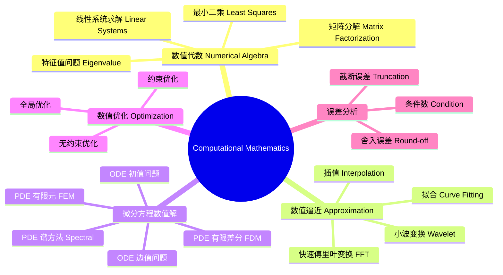

---
aliases: [ComputationalMathematics]
tags: ['Mathematics/ComputationalMathematics', 'ScientificComputing']
---

# ComputationalMathematics

## 概述 (Overview)

计算数学 (Computational Mathematics) 是研究数值算法及其理论基础的学科。它涉及设计、分析和实现用于求解数学问题的计算方法。计算数学桥接了纯数学的严格理论与实际计算机应用，在科学计算和工程仿真中起着核心作用。核心关注点包括算法的收敛性、稳定性和计算复杂度。

## 计算数学领域

## 数值代数 (Numerical Algebra)

### 线性方程组求解

对于线性系统 $A x = b$，其中 $A \in \mathbb{R}^{n \times n}$，求解方法分为直接法和迭代法。

直接法基于矩阵分解 (Matrix Factorization)：

**LU 分解**：$A = LU$，其中 $L$ 为下三角矩阵，$U$ 为上三角矩阵。
$$A = \begin{pmatrix} 1 & 0 & 0 \\ l_{21} & 1 & 0 \\ l_{31} & l_{32} & 1 \end{pmatrix} \begin{pmatrix} u_{11} & u_{12} & u_{13} \\ 0 & u_{22} & u_{23} \\ 0 & 0 & u_{33} \end{pmatrix}$$

**Cholesky 分解**：对对称正定矩阵有 $A = L L^T$，其中 $L$ 为下三角矩阵。

**QR 分解**：$A = QR$，$Q$ 为正交矩阵，$R$ 为上三角矩阵。

迭代法构造逼近序列 $\{x_k\}$：

**Jacobi 迭代**：
$$x_i^{(k+1)} = \frac{1}{a_{ii}} \left( b_i - \sum_{j \neq i} a_{ij} x_j^{(k)} \right)$$

**Gauss-Seidel 迭代**：
$$x_i^{(k+1)} = \frac{1}{a_{ii}} \left( b_i - \sum_{j < i} a_{ij} x_j^{(k+1)} - \sum_{j > i} a_{ij} x_j^{(k)} \right)$$

**共轭梯度法 (Conjugate Gradient)**：对对称正定矩阵的最优 Krylov 子空间方法：

$$r_{k+1} = r_k - \alpha_k A p_k$$
$$x_{k+1} = x_k + \alpha_k p_k$$

其中 $\alpha_k = (r_k^T r_k) / (p_k^T A p_k)$，搜索方向 $p_k$ 互相 $A$-共轭。

### 特征值问题

求解 $A x = \lambda x$ 的特征值和特征向量。

| 方法 | 目标 | 复杂度 | 特点 |
|------|------|-------|------|
| 幂法 | 最大特征值 | $O(n^2)$ 每步 | 简单迭代 |
| QR 算法 | 全部特征值 | $O(n^3)$ | 稳定可靠 |
| Lanczos 方法 | 稀疏矩阵 | $O(nnz)$ 每步 | Krylov 子空间 |
| 分治算法 | 对称三对角 | $O(n^3)$ | 并行友好 |

## 数值逼近 (Approximation Theory)

### 多项式插值

给定 $n+1$ 个点 $(x_i, y_i)$，存在唯一的 $n$ 次插值多项式。

**Lagrange 形式**：
$$L_n(x) = \sum_{i=0}^n y_i \cdot \ell_i(x), \quad \ell_i(x) = \prod_{j \neq i} \frac{x - x_j}{x_i - x_j}$$

**Newton 形式**（使用差商 Divided Difference）：
$$N_n(x) = f[x_0] + f[x_0, x_1](x - x_0) + \cdots + f[x_0, \dots, x_n](x - x_0)\cdots(x - x_{n-1})$$

差商递归定义：
$$f[x_i, x_{i+1}] = \frac{f(x_{i+1}) - f(x_i)}{x_{i+1} - x_i}$$
$$f[x_i, \dots, x_{i+k}] = \frac{f[x_{i+1}, \dots, x_{i+k}] - f[x_i, \dots, x_{i+k-1}]}{x_{i+k} - x_i}$$

### 最佳逼近 (Best Approximation)

在 $L^p$ 范数下的逼近误差度量：

$$\|f - p\|_p = \left( \int_a^b |f(x) - p(x)|^p dx \right)^{1/p}$$

Chebyshev 最佳逼近定理：存在唯一的最佳一致逼近多项式，其误差函数在 $n+2$ 个点上交错达到极值。

## 误差分析 (Error Analysis)

### 误差来源

| 误差类型 | 来源 | 性质 |
|---------|------|------|
| 模型误差 | 物理简化 | 不可控 |
| 截断误差 | 无限过程截断 | 可分析 |
| 舍入误差 | 有限精度 | 累积效应 |
| 测量误差 | 输入数据 | 敏感性 |

### 条件数与稳定性

条件数 (Condition Number) 衡量问题对输入扰动的敏感性：

$$\kappa(f, x) = \lim_{\epsilon \to 0} \sup_{\|\delta x\| \leq \epsilon} \frac{\|f(x + \delta x) - f(x)\|}{\|f(x)\|} / \frac{\|\delta x\|}{\|x\|}$$

对于矩阵 $A$，条件数定义为 $\kappa(A) = \|A\| \cdot \|A^{-1}\|$。

相对误差满足：
$$\frac{\|\delta x\|}{\|x\|} \leq \kappa(A) \cdot \frac{\|\delta b\|}{\|b\|}$$

## 微分方程数值解

### ODE 初值问题

对于 $y' = f(t, y),\; y(t_0) = y_0$，常用方法：

**Euler 方法**：
$$y_{n+1} = y_n + h f(t_n, y_n),\quad \text{局部截断误差 } O(h^2)$$

**Runge-Kutta 方法**（经典四阶 RK4）：
$$y_{n+1} = y_n + \frac{h}{6}(k_1 + 2k_2 + 2k_3 + k_4)$$
$$k_1 = f(t_n, y_n),\; k_2 = f(t_n + h/2,\; y_n + h k_1/2)$$
$$k_3 = f(t_n + h/2,\; y_n + h k_2/2),\; k_4 = f(t_n + h,\; y_n + h k_3)$$

### PDE 有限差分法

以热方程 (Heat Equation) $u_t = \alpha u_{xx}$ 为例：

显式差分格式 (FTCS)：
$$\frac{u_j^{n+1} - u_j^n}{\Delta t} = \alpha \frac{u_{j+1}^n - 2u_j^n + u_{j-1}^n}{(\Delta x)^2}$$
$$u_j^{n+1} = u_j^n + r (u_{j+1}^n - 2u_j^n + u_{j-1}^n), \quad r = \frac{\alpha \Delta t}{(\Delta x)^2}$$

稳定性条件 (CFL Condition)：$r \leq \frac{1}{2}$。

## 快速傅里叶变换 (FFT)

离散傅里叶变换 (DFT)：
$$X_k = \sum_{n=0}^{N-1} x_n \cdot e^{-2\pi i k n / N},\quad k = 0, 1, \dots, N-1$$

Cooley-Tukey FFT 算法通过分治将复杂度从 $O(N^2)$ 降至 $O(N \log N)$：

$$X_k = \sum_{m=0}^{N/2-1} x_{2m} \omega_N^{2mk} + \omega_N^k \sum_{m=0}^{N/2-1} x_{2m+1} \omega_N^{2mk}$$
$$= E_k + \omega_N^k O_k$$

其中 $\omega_N = e^{-2\pi i / N}$ 为旋转因子 (Twiddle Factor)。

### 小波变换 (Wavelet Transform)

连续小波变换 (CWT)：
$$ W_f(a, b) = \frac{1}{\sqrt{|a|}} \int_{-\infty}^{\infty} f(t) \,\psi^*\!\left(\frac{t-b}{a}\right) dt $$

离散小波变换 (DWT) 使用多分辨率分析 (MRA)，将信号分解为近似系数和细节系数：

$$ f(t) = \sum_k c_{J,k} \phi_{J,k}(t) + \sum_{j=1}^J \sum_k d_{j,k} \psi_{j,k}(t) $$

## 有限元方法 (Finite Element Method)

FEM 将 PDE 的弱形式 (Weak Form) 离散化。对于 Poisson 方程 $-\nabla^2 u = f$，加权残差法给出：

$$ \int_\Omega \nabla u \cdot \nabla v \, d\Omega = \int_\Omega f v \, d\Omega, \quad \forall v \in V_h $$

在有限维子空间 $V_h = \text{span}\{\phi_1, \dots, \phi_N\}$ 上展开 $u_h = \sum_{j=1}^N u_j \phi_j$，得到线性系统：

$$ K \mathbf{u} = \mathbf{f}, \quad K_{ij} = \int_\Omega \nabla \phi_i \cdot \nabla \phi_j \, d\Omega $$

其中 $K$ 为刚度矩阵 (Stiffness Matrix)，是对称正定稀疏矩阵。

### 一维有限元示例

对于 $-\frac{d^2 u}{dx^2} = f(x)$ 在 $[0,1]$ 上，使用线性单元 $h = 1/N$：

$$ K = \frac{1}{h} \begin{pmatrix}
2 & -1 & 0 & \cdots & 0 \\
-1 & 2 & -1 & \cdots & 0 \\
0 & -1 & 2 & \cdots & 0 \\
\vdots & \vdots & \vdots & \ddots & \vdots \\
0 & 0 & 0 & \cdots & 2
\end{pmatrix} $$

## 多重网格法 (Multigrid Methods)

多重网格法通过在粗细网格间 V-cycle 或 W-cycle 循环加速迭代收敛。粗网格校正 (Coarse Grid Correction) 利用低频误差在粗网格上更易消除的特性。

两网格方法由光滑 (Smoothing)、限制 (Restriction)、粗网格求解和插值 (Interpolation) 组成：

$$ x^{\text{new}} = x + I_h^H (A_H)^{-1} R_H^h (b - A x) $$

其中 $R_H^h$ 为限制算子，$I_h^H$ 为插值算子，$A_H = R_H^h A I_h^H$。

## 随机算法与蒙特卡洛方法 (Monte Carlo Methods)

蒙特卡洛积分使用随机采样近似高维积分：

$$ I(f) = \int_\Omega f(x) \, dx \approx \frac{|\Omega|}{N} \sum_{i=1}^N f(x_i), \quad x_i \sim \text{Uniform}(\Omega) $$

收敛速度为 $O(1/\sqrt{N})$，与维数无关，特别适合高维问题。

### Markov Chain Monte Carlo (MCMC)

Metropolis-Hastings 算法通过构造 Markov Chain 从目标分布 $\pi(x)$ 采样：

$$ \alpha(x, y) = \min\left(1, \frac{\pi(y) q(x \mid y)}{\pi(x) q(y \mid x)}\right) $$

接受概率 $\alpha$ 保证链的平稳分布为 $\pi(x)$。

## 数值软件与库

现代计算数学的实践依赖于高质量数值软件。LAPACK 提供线性代数核心例程，PETSc 支持大规模 PDE 求解，FFTW 提供快速傅里叶变换，SUNDIALS 处理 ODE/DAE 问题。这些库的算法设计均基于计算数学的理论成果。

## 相关主题

- [[NumericalComputation]] 中的具体数值方法
- [[Polynomial]] 中的多项式逼近理论
- [[AppliedMathematics]] 中的数学模型与仿真
