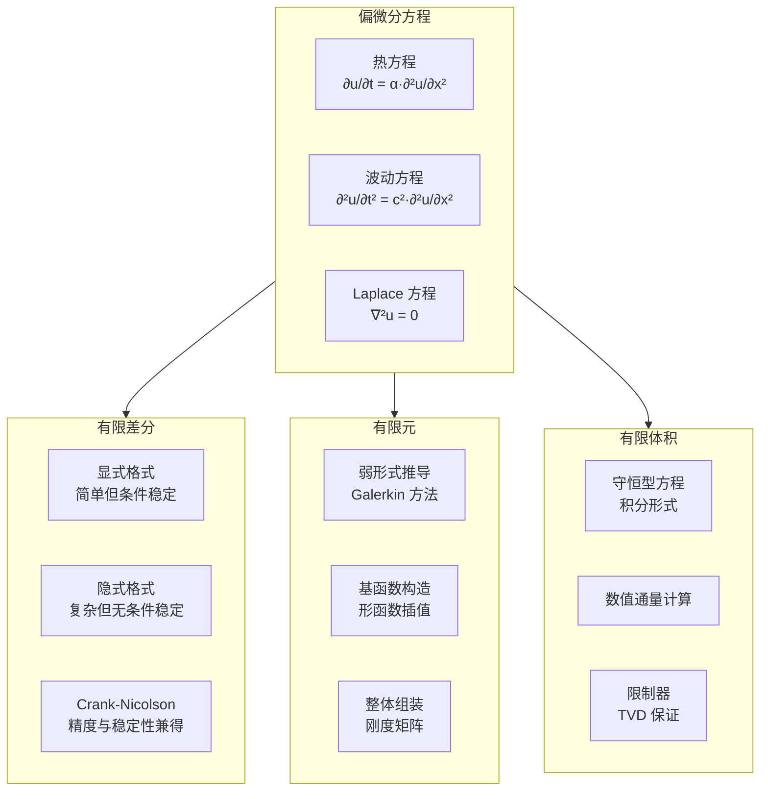

---
aliases:
  - Numerical ODE
  - 微分方程数值解
  - Finite Difference Methods
tags:
  - mathematics
  - numerical_methods
  - differential_equations
  - computational_mathematics
---

# 微分方程数值解

## 概述

微分方程数值解 (Numerical Solutions of Differential Equations) 研究如何用计算机近似求解常微分方程 (ODE) 和偏微分方程 (PDE)。绝大多数实际问题中的微分方程无法获得解析解，因此数值方法是科学计算的核心工具。

## 常微分方程初值问题

标准形式：

$$
\frac{dy}{dt} = f(t, y), \quad y(t_0) = y_0
$$

### Euler 方法

#### 向前 Euler 法 (Forward Euler)

$$ y_{n+1} = y_n + h f(t_n, y_n) $$

局部截断误差 $O(h^2)$，全局误差 $O(h)$。

#### 向后 Euler 法 (Backward Euler)

$$ y_{n+1} = y_n + h f(t_{n+1}, y_{n+1}) $$

隐式方法，需要每步求解方程，但具有更好的稳定性。

### Runge-Kutta 方法

#### 二阶 Runge-Kutta (RK2 / 中点法)

$$
\begin{aligned}
k_1 &= f(t_n, y_n) \\
k_2 &= f\left(t_n + \frac{h}{2}, y_n + \frac{h}{2}k_1\right) \\
y_{n+1} &= y_n + h k_2
\end{aligned}
$$

#### 经典四阶 Runge-Kutta (RK4)

$$
\begin{aligned}
k_1 &= f(t_n, y_n) \\
k_2 &= f\left(t_n + \frac{h}{2}, y_n + \frac{h}{2}k_1\right) \\
k_3 &= f\left(t_n + \frac{h}{2}, y_n + \frac{h}{2}k_2\right) \\
k_4 &= f(t_n + h, y_n + h k_3) \\
y_{n+1} &= y_n + \frac{h}{6}(k_1 + 2k_2 + 2k_3 + k_4)
\end{aligned}
$$

局部截断误差 $O(h^5)$，全局误差 $O(h^4)$。

## 稳定性分析

### A-稳定性 (A-Stability)

方法应用于测试方程 $y' = \lambda y$（$\lambda \in \mathbb{C}$，$\text{Re}(\lambda) < 0$）时，若数值解满足 $\lim_{n\to\infty} y_n = 0$，则称该方法为 A-稳定的。

| 方法 | 稳定性条件 | A-稳定 |
|------|-----------|--------|
| 向前 Euler | \|1 + hλ\| < 1 | 否 |
| 向后 Euler | \|1 − hλ\|⁻¹ < 1 | 是 |
| RK4 | 有限区域 | 否 |

### 刚性方程 (Stiff Equations)

当 $\text{Re}(\lambda)$ 的数量级差异很大时，方程是刚性的。对刚性方程需使用隐式方法或专门方法。

## 偏微分方程数值解

### 有限差分法 (Finite Difference Method)

以一维热方程为例：

$$ \frac{\partial u}{\partial t} = \alpha \frac{\partial^2 u}{\partial x^2} $$

#### 显式格式 (FTCS)

$$ u_j^{n+1} = u_j^n + r(u_{j-1}^n - 2u_j^n + u_{j+1}^n), \quad r = \frac{\alpha \Delta t}{(\Delta x)^2} $$

稳定性条件：$r \leq \frac{1}{2}$

#### Crank-Nicolson 格式

$$ \frac{u_j^{n+1} - u_j^n}{\Delta t} = \frac{\alpha}{2} \left[ \frac{u_{j-1}^{n+1} - 2u_j^{n+1} + u_{j+1}^{n+1}}{(\Delta x)^2} + \frac{u_{j-1}^n - 2u_j^n + u_{j+1}^n}{(\Delta x)^2} \right] $$

无条件稳定，二阶精度。

## 误差分析

### 截断误差 (Truncation Error)

对微分算子进行 Taylor 展开得到的离散化误差。

### 收敛性 (Convergence)

数值解在 $h \to 0$ 时趋近于精确解的性质。Lax 等价定理：对适定的线性初值问题，相容性等价于收敛性。

### 数值耗散与色散 (Dissipation and Dispersion)

- 耗散：振幅的数值衰减
- 色散：不同频率成分的传播速度差异

## 高阶方法

### Adams-Bashforth 多步法

$$ y_{n+1} = y_n + h \sum_{i=0}^{s-1} \beta_i f(t_{n-i}, y_{n-i}) $$

### 迎风格式 (Upwind Scheme)

对双曲型方程使用迎风差分：

$$
\frac{\partial u}{\partial t} + a \frac{\partial u}{\partial x} = 0
$$

当 $a > 0$ 时使用向后差分，$a < 0$ 时使用向前差分。

## 应用领域

- **计算流体力学 (CFD)**：Navier-Stokes 方程数值求解
- **计算电磁学**：Maxwell 方程的 FDTD 方法
- **量子力学**：Schrödinger 方程的数值模拟
- **金融数学**：Black-Scholes 方程有限差分法
- **气象预报**：大气动力学方程数值积分

## 参考文献

1. Hairer, E., Nørsett, S. P., & Wanner, G. *Solving Ordinary Differential Equations I*. Springer.
2. LeVeque, R. J. *Finite Difference Methods for Ordinary and Partial Differential Equations*. SIAM.
3. Butcher, J. C. *Numerical Methods for Ordinary Differential Equations*. Wiley.
