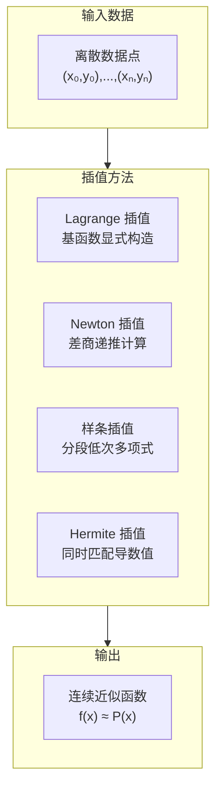

---
aliases:
  - Interpolation
  - Numerical Integration
  - 插值与数值积分
  - Quadrature
tags:
  - mathematics
  - numerical_methods
  - interpolation
  - quadrature
  - computational_mathematics
---

# 插值与数值积分

## 概述

插值 (Interpolation) 是用已知数据点构造连续函数以估计未知点的方法。数值积分 (Numerical Integration / Quadrature) 是在仅知道被积函数在某些点上的值时计算定积分的近似值。两者在科学计算中密不可分。

## 插值方法

### Lagrange 插值

给定 $n+1$ 个点 $(x_i, y_i)$，Lagrange 插值多项式为：

$$ L_n(x) = \sum_{i=0}^{n} y_i \ell_i(x) $$

其中 Lagrange 基函数：

$$ \ell_i(x) = \prod_{\substack{j=0 \\ j \neq i}}^{n} \frac{x - x_j}{x_i - x_j} $$

### Newton 插值

利用差商 (Divided Differences) 递推计算：

一阶差商：

$$ f[x_i, x_j] = \frac{f(x_j) - f(x_i)}{x_j - x_i} $$

二阶差商：

$$ f[x_i, x_j, x_k] = \frac{f[x_j, x_k] - f[x_i, x_j]}{x_k - x_i} $$

Newton 插值多项式：

$$ N_n(x) = f[x_0] + \sum_{k=1}^{n} f[x_0, x_1, \ldots, x_k] \prod_{i=0}^{k-1} (x - x_i) $$

### 样条插值 (Spline Interpolation)

#### 三次样条

在区间 $[x_i, x_{i+1}]$ 上为三次多项式，且满足：
- $S(x_i) = y_i$（插值条件）
- $S'(x_i^-) = S'(x_i^+)$（一阶导数连续）
- $S''(x_i^-) = S''(x_i^+)$（二阶导数连续）

边界条件：
- 自然样条：$S''(x_0) = S''(x_n) = 0$
- 固定样条：$S'(x_0) = y'_0, S'(x_n) = y'_n$

### Runge 现象

高次多项式插值在等距节点上会出现端点振荡。解决方案：使用 Chebyshev 节点或分段低次插值。

## 数值积分 (Quadrature)

### Newton-Cotes 公式

将积分区间等分，用 Lagrange 插值多项式近似被积函数。

#### 梯形法则 (Trapezoidal Rule)

$$ \int_a^b f(x) dx \approx \frac{b-a}{2} [f(a) + f(b)] $$

误差：$-\frac{(b-a)^3}{12} f''(\xi)$

#### Simpson 法则

$$ \int_a^b f(x) dx \approx \frac{b-a}{6} \left[f(a) + 4f\left(\frac{a+b}{2}\right) + f(b)\right] $$

误差：$-\frac{(b-a)^5}{2880} f^{(4)}(\xi)$

### 复合求积公式 (Composite Quadrature)

| 方法 | 公式 | 阶数 |
|------|------|------|
| 复合梯形 | $T_n = h\left[\frac{1}{2}f(a) + \sum_{i=1}^{n-1} f(x_i) + \frac{1}{2}f(b)\right]$ | $O(h^2)$ |
| 复合 Simpson | $S_n = \frac{h}{3}\left[f(a) + 4\sum_{i=1}^{n/2} f(x_{2i-1}) + 2\sum_{i=1}^{n/2-1} f(x_{2i}) + f(b)\right]$ | $O(h^4)$ |

### Romberg 积分

基于 Richardson 外推法加速梯形法则收敛：

$$ T_m^{(k)} = \frac{4^k T_{m}^{(k-1)} - T_{m-1}^{(k-1)}}{4^k - 1} $$

### Gauss 型求积公式

选择节点和权重使代数精度达到 $2n+1$。节点为 Legendre 正交多项式的根。

Gauss-Legendre 公式：

$$ \int_{-1}^1 f(x) dx \approx \sum_{i=1}^n w_i f(x_i) $$

### 自适应积分 (Adaptive Quadrature)

递归细分积分区间，根据局部误差估计自动调整步长。

### 多重积分 (Multiple Integrals)

- 迭代积分：将多重积分转化为嵌套的单重积分
- Monte Carlo 方法：适用于高维积分
- 稀疏网格 (Sparse Grids)：缓解维度灾难

## 误差分析

### 代数精度 (Degree of Precision)

若求积公式对所有次数 $\leq m$ 的多项式精确成立，但对 $m+1$ 次多项式不精确，则称其代数精度为 $m$。

### Peano 核定理

对线性泛函 $L(f)$，有：

$$ L(f) = \int_a^b f^{(k)}(t) K(t) dt $$

其中 $K(t)$ 为 Peano 核。

## 应用领域

- **计算机图形学**：曲线曲面插值与渲染
- **图像处理**：图像缩放中的像素插值
- **物理模拟**：运动方程数值积分
- **金融工程**：期权定价中的数值积分
- **机器学习**：高斯过程回归中的核插值

## 参考文献

1. Stoer, J. & Bulirsch, R. *Introduction to Numerical Analysis*. Springer.
2. Davis, P. J. & Rabinowitz, P. *Methods of Numerical Integration*. Dover.
3. Trefethen, L. N. *Approximation Theory and Approximation Practice*. SIAM.
