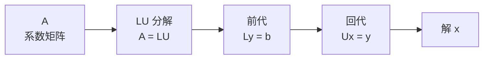
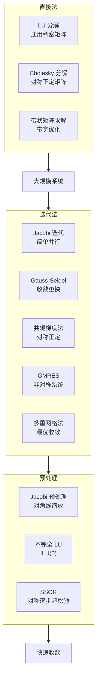
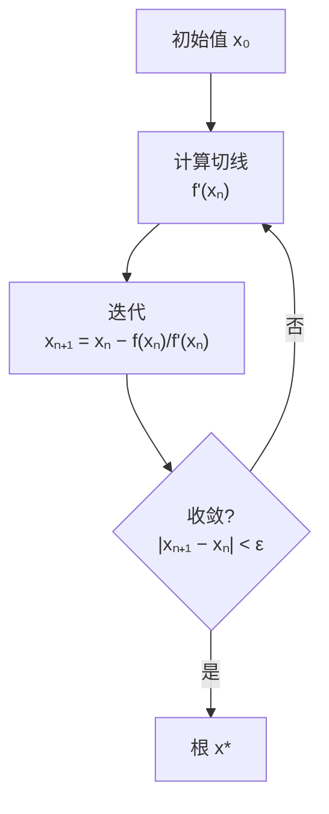

---
aliases:
  - Numerical Linear Algebra
  - 线性代数与非线性方程数值解
  - Nonlinear Equations
  - Matrix Computations
tags:
  - mathematics
  - numerical_methods
  - linear_algebra
  - nonlinear_equations
  - computational_mathematics
---

# 线性代数与非线性方程数值解

## 概述

数值线性代数 (Numerical Linear Algebra) 研究矩阵运算的数值算法，包括线性方程组求解、特征值计算和奇异值分解。非线性方程数值解研究寻求 $f(x) = 0$ 的近似根的方法。两者是科学计算引擎的核心驱动力。

## 线性方程组直接解法

### Gauss 消去法与 LU 分解

将矩阵 $A$ 分解为下三角矩阵 $L$ 和上三角矩阵 $U$ 的乘积：

$$ A = LU $$

求解 $Ax = b$ 转化为：
1. 前代：解 $Ly = b$
2. 回代：解 $Ux = y$

### 选主元策略 (Pivoting)

- 部分选主元：选择列中绝对值最大的元素
- 完全选主元：选择整个剩余子矩阵中绝对值最大的元素
- 阈值选主元：平衡精度与稀疏性

### Cholesky 分解

对对称正定矩阵 $A$：

$$ A = LL^T $$

其中 $L$ 为下三角矩阵，计算量约为 LU 分解的一半。

### 带状矩阵与稀疏矩阵

- 带状矩阵：非零元素集中在主对角线附近
- 稀疏矩阵：利用压缩存储格式 (CSR, CSC)
- 填元 (Fill-in)：消去过程中零元素变为非零

## 迭代解法

### 经典迭代法

#### Jacobi 迭代

$$ x_i^{(k+1)} = \frac{1}{a_{ii}} \left( b_i - \sum_{j \neq i} a_{ij} x_j^{(k)} \right) $$

#### Gauss-Seidel 迭代

$$ x_i^{(k+1)} = \frac{1}{a_{ii}} \left( b_i - \sum_{j < i} a_{ij} x_j^{(k+1)} - \sum_{j > i} a_{ij} x_j^{(k)} \right) $$

### Krylov 子空间方法

Krylov 子空间：

$$ \mathcal{K}_m(A, v) = \text{span}\{v, Av, A^2v, \ldots, A^{m-1}v\} $$

#### 共轭梯度法 (CG)

适用于对称正定矩阵。每次迭代只需一次矩阵-向量乘法。

#### GMRES

适用于非对称矩阵。需要存储所有正交基向量。

### 预处理技术 (Preconditioning)

寻找矩阵 $M$ 使 $M^{-1}A$ 的条件数更小：

- 对角预处理：$M = \text{diag}(A)$
- 不完全 Cholesky 分解 (IC)
- 不完全 LU 分解 (ILU)

## 非线性方程求根

### 二分法 (Bisection Method)

在区间 $[a, b]$ 上，若 $f(a) \cdot f(b) < 0$，则不断对分区间，保证收敛线性。

### Newton-Raphson 方法

$$ x_{n+1} = x_n - \frac{f(x_n)}{f'(x_n)} $$

收敛阶数为 2（平方收敛）。

### 割线法 (Secant Method)

$$ x_{n+1} = x_n - f(x_n) \frac{x_n - x_{n-1}}{f(x_n) - f(x_{n-1})} $$

无需计算导数，收敛阶数约为 1.618。

### Newton 法求解非线性方程组

对于 $F: \mathbb{R}^n \to \mathbb{R}^n$：

$$ x^{(k+1)} = x^{(k)} - J(x^{(k)})^{-1} F(x^{(k)}) $$

其中 $J$ 为 Jacobi 矩阵。

### 拟 Newton 方法 (Quasi-Newton)

- Broyden 方法：近似更新 Jacobi 矩阵
- BFGS 方法：用于优化问题

## 特征值问题

### 幂法 (Power Method)

迭代计算最大特征值：

$$ v^{(k+1)} = \frac{A v^{(k)}}{\|A v^{(k)}\|} $$

### QR 算法

迭代地将矩阵分解为 $A_k = Q_k R_k$，然后 $A_{k+1} = R_k Q_k$，收敛到上三角矩阵（Schur 形式）。

## 数值稳定性

### 条件数 (Condition Number)

$$ \kappa(A) = \|A\| \cdot \|A^{-1}\| $$

条件数大表示矩阵病态 (Ill-conditioned)。

### 向后误差分析 (Backward Error Analysis)

计算解 $\tilde{x}$ 是某个扰动系统 $(A+\Delta A)\tilde{x} = b + \Delta b$ 的精确解，其中 $\|\Delta A\|$ 和 $\|\Delta b\|$ 很小。

## 应用领域

- **工程有限元分析**：大规模稀疏线性系统
- **机器学习**：矩阵分解与特征值计算
- **计算流体力学**：非线性 Navier-Stokes 方程
- **数据科学**：SVD 用于降维和推荐系统
- **量子化学**：Hartree-Fock 方程的自洽迭代

## 参考文献

1. Golub, G. H. & Van Loan, C. F. *Matrix Computations*. Johns Hopkins.
2. Saad, Y. *Iterative Methods for Sparse Linear Systems*. SIAM.
3. Kelley, C. T. *Solving Nonlinear Equations with Newton's Method*. SIAM.
